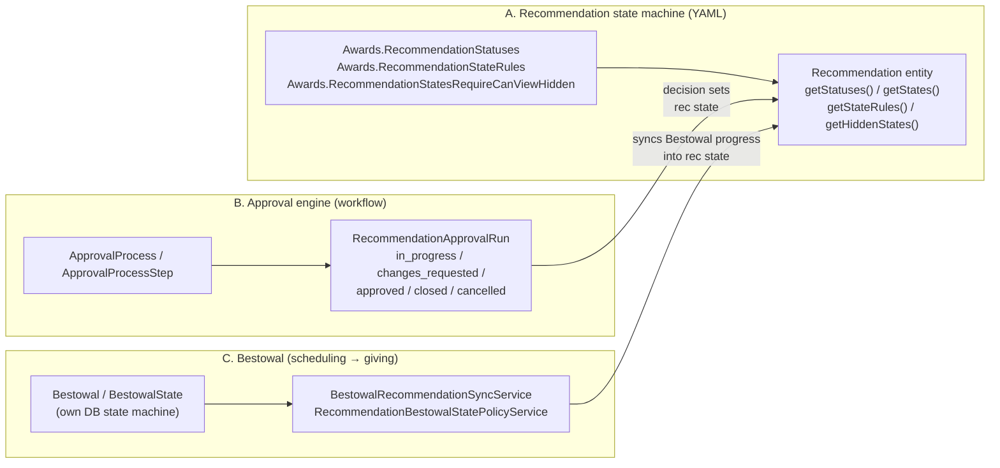
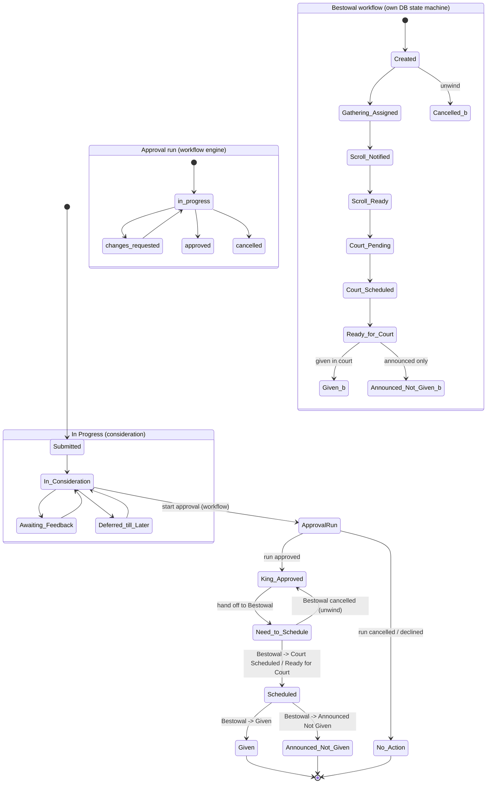
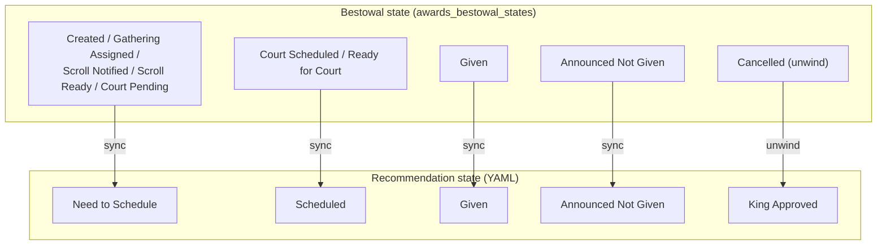

# Awards Recommendation lifecycle in the Workflow + Approvals paradigm

> Status: design / redesign note for the `feature/workflow-engine` branch.
>
> Audience: maintainers reasoning about how an award **Recommendation** moves through its
> lifecycle now that we have a workflow-engine **Approval** system and a dedicated **Bestowal**
> object/workflow.

## Why this document exists

Earlier on this branch we briefly moved the Recommendation **state machine** (its statuses,
states, field rules, and transitions) out of YAML app-settings and into database tables
(`awards_recommendation_statuses`, `awards_recommendation_states`,
`awards_recommendation_state_field_rules`, `awards_recommendation_state_transitions`).

Since then we built two things that change the picture:

1. A **workflow-engine Approval system** — `ApprovalProcess` / `ApprovalProcessStep` definitions
   plus `RecommendationApprovalRun` instances. This now owns the **approval decision** that used to
   be expressed as a handful of recommendation states.
2. A dedicated **Bestowal** object and workflow (`Bestowal`, `BestowalState`, its own DB state
   machine, sync + policy services). This now owns the **scheduling → giving** half of the old
   lifecycle.

Because nothing has shipped, we are taking the clean path: **delete the DB state-machine tables**
and go back to **YAML-defined recommendation states** (as on `main`), while keeping the new
Approval engine and Bestowal subsystem. This doc re-visualizes how a Recommendation *should*
optimally flow in that combined model.

> Out of scope here: migrating existing recommendation **data** into the new model. That is a
> separate future plan. Legacy `awards_recommendations` columns are intentionally retained.

## The three subsystems and who owns what

- **A — Recommendation state machine (YAML):** the source of truth for *which* lifecycle state a
  recommendation is displayed/filtered in. Strings, not DB rows. Field-level edit rules and hidden
  states are also YAML.
- **B — Approval engine:** owns the *approval decision*. Progress through approval lives in the
  `RecommendationApprovalRun` status, **not** in recommendation states. When an approval run reaches
  a terminal decision it sets the recommendation's YAML state (e.g. `King Approved`).
- **C — Bestowal:** owns *scheduling and giving*. It has its **own** DB state machine
  (`awards_bestowal_states`) and projects its progress back onto the recommendation's YAML state via
  the sync service.

> The audit log (`awards_recommendations_states_logs` / `RecommendationStateLogService`) is the
> **state-change history**, not the state-machine definition. It pre-exists on `main` and stays.

## Recommendation states (YAML, restored)

Status → states map seeded by `AwardsPlugin::bootstrap()`:

| Status (`Awards.RecommendationStatuses`) | States |
| --- | --- |
| **In Progress** | Submitted, In Consideration, Awaiting Feedback, Deferred till Later, King Approved, Queen Approved, **Linked** |
| **Scheduling** | Need to Schedule |
| **To Give** | Scheduled, Announced Not Given |
| **Closed** | Given, No Action, **Linked - Closed** |

`Linked` / `Linked - Closed` are the grouping states consumed by `RecommendationGroupingService`
(`LINKED_STATES`). They are seeded `is_hidden = true` (require `canViewHidden`) and their field rules
disable all fields.

Approval progress states that briefly existed on-branch (`In Approval`, `Changes Requested`) are
**not** part of YAML — that progress now lives in `RecommendationApprovalRun.status`.

## Optimal lifecycle (end to end)

Reading the diagram:

1. **Consideration (YAML, manual).** A recommendation is `Submitted`, worked through
   `In Consideration` / `Awaiting Feedback` / `Deferred till Later`. These are plain YAML states with
   field rules; no workflow run is required yet.
2. **Approval (workflow engine).** When it is ready for a decision, a `RecommendationApprovalRun` is
   started against an `ApprovalProcess`. The run progresses `in_progress ↔ changes_requested` and
   ends `approved` / `cancelled`. **This progress is not a recommendation state.** On `approved` the
   recommendation's YAML state becomes `King Approved` (or `Queen Approved`); a declined/cancelled run
   resolves to `No Action`.
3. **Hand-off to Bestowal.** An approved recommendation that needs to be conferred moves to the
   handoff state `Need to Schedule` (`RecommendationBestowalStatePolicyService::HANDOFF_STATE`) and a
   `Bestowal` takes ownership of scheduling/giving.
4. **Bestowal owns scheduling → giving.** Bestowal runs its **own** DB state machine. Its progress is
   projected back onto the recommendation's YAML state by `BestowalRecommendationSyncService`.
5. **Closed.** Terminal YAML states are `Given`, `Announced Not Given`, or `No Action` (plus
   `Linked - Closed` for grouped recommendations).

## Bestowal state → Recommendation state sync map

`BestowalRecommendationSyncService` keeps the recommendation's YAML state in step with Bestowal
progress. After the DB-state-machine removal these mappings are stored on `awards_bestowal_states`
as **YAML state-name strings** (`sync_recommendation_state`, `unwind_recommendation_state`) rather
than integer FKs into a deleted table.

| Bestowal state | Recommendation state (sync) |
| --- | --- |
| Created, Gathering Assigned, Scroll Notified, Scroll Ready, Court Pending | Need to Schedule *(handoff)* |
| Court Scheduled, Ready for Court | Scheduled |
| Given | Given |
| Announced Not Given | Announced Not Given |
| Cancelled *(unwind)* | King Approved |

These are the contract validated by
`RecommendationBestowalStatePolicyService::assertBestowalSyncMappingsConfigured()`
(`EXPECTED_SYNC_MAPPINGS` / `EXPECTED_UNWIND_MAPPINGS`). The strings on both sides must remain valid
members of `Recommendation::getStates()`.

## Design principles going forward

- **One owner per concern.** Approval *decisions* live in approval runs; *scheduling/giving* lives
  in Bestowal; the recommendation's YAML state is the **displayed projection** of those, plus the
  manual consideration phase.
- **Recommendation states stay in YAML.** They are presentation/filter states with field rules — a
  small, stable, admin-editable vocabulary. We do not re-introduce a DB state-machine for them.
- **Bestowal keeps its own DB state machine.** It is genuinely richer (per-state field rules,
  transitions, gathering support) and is the right home for the conferral process.
- **Sync is one-directional and explicit.** Bestowal → Recommendation only, via the sync service,
  using state-name strings. The recommendation never drives Bestowal.
- **Grouping is orthogonal.** `Linked` / `Linked - Closed` describe how recommendations are grouped,
  independent of approval/bestowal progress.

## What was removed vs kept (summary)

| Removed (DB state machine) | Kept |
| --- | --- |
| `awards_recommendation_statuses` / `_states` / `_state_field_rules` / `_state_transitions` tables + entities/tables | YAML app-settings + `Recommendation` entity state API |
| `RecommendationStates` / `RecommendationStatuses` controllers, policies, grids, templates, nav links | `RecommendationStateLogService` + `awards_recommendations_states_logs` audit log |
| State-machine seed migrations (`CreateRecommendationStatesTables`, `AddLinkedClosedState`, `AddRecommendationApprovalStates`, `RemoveApprovalRecommendationStates`) | Approval engine (`ApprovalProcess`, `RecommendationApprovalRun`, workflow actions/conditions) |
| Integer FK `sync/unwind_recommendation_state_id` on `awards_bestowal_states` | Bestowal subsystem with string `sync/unwind_recommendation_state` mappings |
