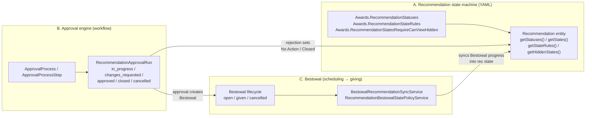
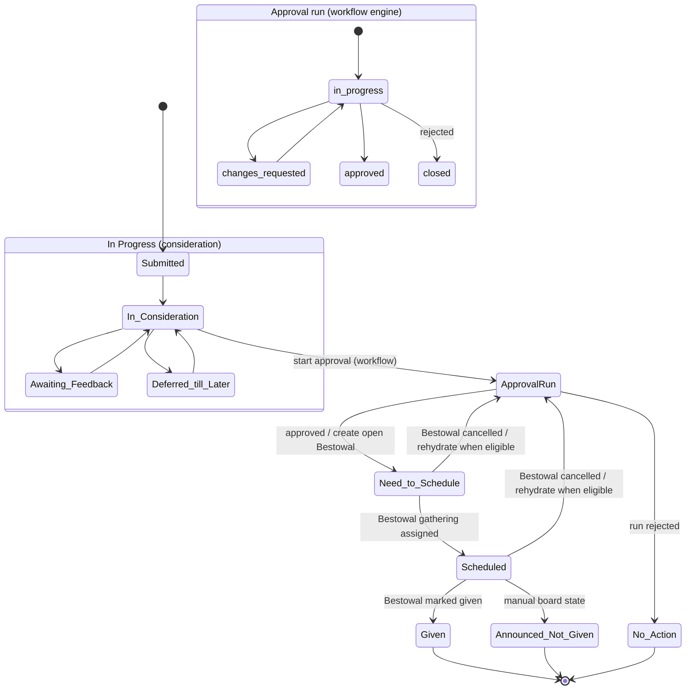
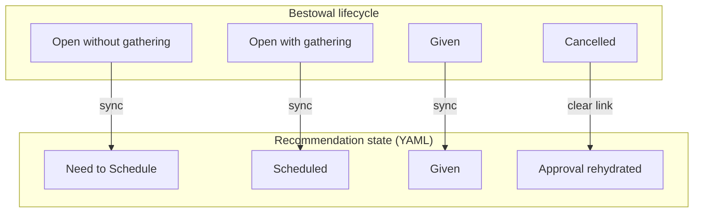

# Awards Recommendation lifecycle in the Workflow + Approvals paradigm

> Status: design / redesign note for the `feature/workflow-engine` branch.
>
> Audience: maintainers reasoning about how an award **Recommendation** moves through its
> lifecycle now that we have a workflow-engine **Approval** system and a dedicated **Bestowal**
> object/workflow.

## Why this document exists

Earlier on this branch we briefly moved the Recommendation **state machine** (its statuses,
states, field rules, and transitions) out of YAML app-settings and into database tables
(`awards_recommendation_statuses`, `awards_recommendation_states`,
`awards_recommendation_state_field_rules`, `awards_recommendation_state_transitions`).

Since then we built two things that change the picture:

1. A **workflow-engine Approval system** — `ApprovalProcess` / `ApprovalProcessStep` definitions
   plus `RecommendationApprovalRun` instances. This now owns the **approval decision** that used to
   be expressed as a handful of recommendation states.
2. A dedicated **Bestowal** object and workflow (`Bestowal`, `BestowalState`, its own DB state
   machine, sync + policy services). This now owns the **scheduling → giving** half of the old
   lifecycle.

Because nothing has shipped, we are taking the clean path: **delete the DB state-machine tables**
and go back to **YAML-defined recommendation states** (as on `main`), while keeping the new
Approval engine and Bestowal subsystem. This doc re-visualizes how a Recommendation *should*
optimally flow in that combined model.

> Migration scope: broad migration of existing recommendation **data** into a new model remains
> out of scope, and legacy `awards_recommendations` columns are intentionally retained. This
> release includes only the limited rejected-recommendation backfill described below; it excludes
> recommendations with newer runs, grouped children, and recommendations currently owned by a
> Bestowal.

## The three subsystems and who owns what

```mermaid
flowchart LR
    subgraph A["A. Recommendation state machine (YAML)"]
        A1["Awards.RecommendationStatuses<br/>Awards.RecommendationStateRules<br/>Awards.RecommendationStatesRequireCanViewHidden"]
        A2["Recommendation entity<br/>getStatuses() / getStates()<br/>getStateRules() / getHiddenStates()"]
        A1 --> A2
    end

    subgraph B["B. Approval engine (workflow)"]
        B1["ApprovalProcess / ApprovalProcessStep"]
        B2["RecommendationApprovalRun<br/>in_progress / changes_requested /<br/>approved / closed / cancelled"]
        B1 --> B2
    end

    subgraph C["C. Bestowal (scheduling → giving)"]
        C1["Bestowal lifecycle<br/>open / given / cancelled"]
        C2["BestowalRecommendationSyncService<br/>RecommendationBestowalStatePolicyService"]
        C1 --> C2
    end

    B2 -- "rejection sets<br/>No Action / Closed" --> A2
    B2 -- "approval creates<br/>Bestowal" --> C1
    C2 -- "syncs Bestowal progress<br/>into rec state" --> A2
```

- **A — Recommendation state machine (YAML):** the source of truth for *which* lifecycle state a
  recommendation is displayed/filtered in. Strings, not DB rows. Field-level edit rules and hidden
  states are also YAML.
- **B — Approval engine:** owns the *approval decision*. Progress through approval lives in the
  `RecommendationApprovalRun` status, **not** in recommendation states. Rejection projects the
  recommendation to `No Action / Closed`; approval creates a Bestowal without an intermediate
  `King Approved` or `Queen Approved` recommendation state.
- **C — Bestowal:** owns *scheduling and giving*. Its lifecycle projects progress back onto the
  recommendation's YAML state through the sync service.

### Restarting active approval runs when process policy changes

Approval processes are mutable configuration, while a pending workflow approval stores a snapshot of the process that
started it. Administrators with `Can Synchronize Award Workflows` synchronize from one Award Approval Process detail
page. The control is enabled only when an eligible open recommendation currently assigned to that process uses an older
process snapshot or published workflow version. Recommendations assigned to other processes and already-current runs
are not considered.

Synchronization does not map progress. It audit-cancels each eligible recommendation's active approval runs, workflow
instances, and pending gates, then starts exactly one replacement workflow at the first step of current configuration.
Recorded responses remain attached to cancelled gates for history, but the replacement has zero responses and no
completed-step credit. Cancellation and replacement are one transaction per recommendation: a replacement failure
rolls back the cancellation, while other recommendations continue. Closed, approved, deleted, bestowal-owned,
grouped-child, and otherwise ineligible recommendations are skipped. The action cannot approve a recommendation or
create a bestowal. A successfully replaced run records the current process signature and workflow version, so the
control becomes disabled until that process changes again.

> The audit log (`awards_recommendations_states_logs` / `RecommendationStateLogService`) is the
> **state-change history**, not the state-machine definition. It pre-exists on `main` and stays.

## Recommendation states (YAML, restored)

Status → states map seeded by `AwardsPlugin::bootstrap()`:

| Status (`Awards.RecommendationStatuses`) | States |
| --- | --- |
| **In Progress** | Submitted, In Consideration, Awaiting Feedback, Deferred till Later, King Approved, Queen Approved, **Linked** |
| **Scheduling** | Need to Schedule |
| **To Give** | Scheduled, Announced Not Given |
| **Closed** | Given, No Action, **Linked - Closed** |

`Linked` / `Linked - Closed` are the grouping states consumed by `RecommendationGroupingService`
(`LINKED_STATES`). They are seeded `is_hidden = true` (require `canViewHidden`) and their field rules
disable all fields.

`King Approved` and `Queen Approved` remain in the configured vocabulary for legacy data and
migration compatibility, but they are filtered from new transition targets and active approval
workflows do not transition recommendations into them.

Approval progress states that briefly existed on-branch (`In Approval`, `Changes Requested`) are
**not** part of YAML — that progress now lives in `RecommendationApprovalRun.status`.

## Optimal lifecycle (end to end)

```mermaid
stateDiagram-v2
    [*] --> Submitted

    state "In Progress (consideration)" as Consider {
        Submitted --> In_Consideration
        In_Consideration --> Awaiting_Feedback
        Awaiting_Feedback --> In_Consideration
        In_Consideration --> Deferred_till_Later
        Deferred_till_Later --> In_Consideration
    }

    In_Consideration --> ApprovalRun : start approval (workflow)

    state "Approval run (workflow engine)" as Approval {
        [*] --> in_progress
        in_progress --> changes_requested
        changes_requested --> in_progress
        in_progress --> approved
        in_progress --> closed : rejected
    }

    ApprovalRun --> Need_to_Schedule : approved / create open Bestowal
    ApprovalRun --> No_Action : run rejected

    Need_to_Schedule --> Scheduled : Bestowal gathering assigned
    Need_to_Schedule --> ApprovalRun : Bestowal cancelled / rehydrate when eligible
    Scheduled --> ApprovalRun : Bestowal cancelled / rehydrate when eligible
    Scheduled --> Given : Bestowal marked given
    Scheduled --> Announced_Not_Given : manual board state

    Given --> [*]
    Announced_Not_Given --> [*]
    No_Action --> [*]
```

Reading the diagram:

1. **Consideration (YAML, manual).** A recommendation is `Submitted`, worked through
   `In Consideration` / `Awaiting Feedback` / `Deferred till Later`. These are plain YAML states with
   field rules; no workflow run is required yet.
2. **Approval (workflow engine).** When it is ready for a decision, a `RecommendationApprovalRun` is
   started against an `ApprovalProcess`. The run progresses `in_progress ↔ changes_requested` and
   ends `approved` / `closed`. **This progress is not a recommendation state.** A rejection transitions
   the recommendation to `No Action / Closed`. Approval skips the retired `King Approved` and
   `Queen Approved` states and creates a `Bestowal` directly.
3. **Hand-off to Bestowal.** Bestowal creation projects an approved recommendation to `Need to Schedule`
   or `Scheduled`, depending on whether a gathering is already assigned, and takes ownership of
   scheduling/giving.
4. **Bestowal owns scheduling → giving.** Bestowal has a minimal `open / given / cancelled`
   lifecycle; its gathering and lifecycle are projected back onto the recommendation's YAML state by
   `BestowalRecommendationSyncService`.
5. **Closed.** Terminal YAML states are `Given`, `Announced Not Given`, or `No Action` (plus
   `Linked - Closed` for grouped recommendations).

Deployment migration `BackfillRejectedRecommendationStates` applies the same `No Action / Closed`
projection to historical recommendations whose latest assigned approval run was rejected. It skips
records that were rehydrated into a newer run, are grouped children, or are currently owned by a
Bestowal.

## Bestowal state → Recommendation state sync map

`BestowalRecommendationSyncService` keeps the recommendation's YAML state in step with the current
Bestowal lifecycle and gathering assignment.

```mermaid
flowchart TD
    subgraph BestowalStates["Bestowal lifecycle"]
        bs1["Open without gathering"]
        bs2["Open with gathering"]
        bs3["Given"]
        bs4["Cancelled"]
    end

    subgraph RecStates["Recommendation state (YAML)"]
        rs1["Need to Schedule"]
        rs2["Scheduled"]
        rs3["Given"]
        rs4["Approval rehydrated"]
    end

    bs1 -- sync --> rs1
    bs2 -- sync --> rs2
    bs3 -- sync --> rs3
    bs4 -- clear link --> rs4
```

| Bestowal state | Recommendation state (sync) |
| --- | --- |
| Open without a gathering | Need to Schedule |
| Open with a gathering | Scheduled |
| Given | Given / Closed |
| Cancelled | Clear the Bestowal link and rehydrate approval when eligible; no King/Queen-approved state |

## Design principles going forward

- **One owner per concern.** Approval *decisions* live in approval runs; *scheduling/giving* lives
  in Bestowal; the recommendation's YAML state is the **displayed projection** of those, plus the
  manual consideration phase.
- **Recommendation states stay in YAML.** They are presentation/filter states with field rules — a
  small, stable, admin-editable vocabulary. We do not re-introduce a DB state-machine for them.
- **Bestowal keeps a minimal lifecycle.** `open / given / cancelled` owns the conferral lifecycle;
  preparation progress lives in its parallel Action Item checklist.
- **Sync is one-directional and explicit.** Bestowal → Recommendation only, via the sync service,
  using state-name strings. The recommendation never drives Bestowal.
- **Grouping is orthogonal.** `Linked` / `Linked - Closed` describe how recommendations are grouped,
  independent of approval/bestowal progress. Grouping keeps the head's approval active and cancels each child's
  approval as superseded. A child may be removed or ungrouped while the head is still in flight; it restores its
  pre-group state and starts at step one of the approval process currently assigned to its award. No cancelled child
  responses carry into that new run. Once approval creates a bestowal, the linked recommendations remain locked.

## What was removed vs kept (summary)

| Removed (DB state machine) | Kept |
| --- | --- |
| `awards_recommendation_statuses` / `_states` / `_state_field_rules` / `_state_transitions` tables + entities/tables | YAML app-settings + `Recommendation` entity state API |
| `RecommendationStates` / `RecommendationStatuses` controllers, policies, grids, templates, nav links | `RecommendationStateLogService` + `awards_recommendations_states_logs` audit log |
| State-machine seed migrations (`CreateRecommendationStatesTables`, `AddLinkedClosedState`, `AddRecommendationApprovalStates`, `RemoveApprovalRecommendationStates`) | Approval engine (`ApprovalProcess`, `RecommendationApprovalRun`, workflow actions/conditions) |
| Legacy `awards_bestowal_states` status/state machine and recommendation sync mappings | Bestowal `lifecycle_status`, gathering assignment, and Action Item checklist |
