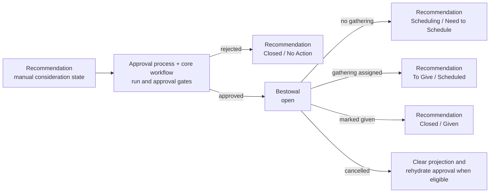

# Awards recommendation, approval, and bestowal architecture

**Status:** implemented architecture decision.

Awards deliberately separates three concerns. Do not collapse them into a second state
machine or make a recommendation state stand in for workflow progress.

## Ownership model

| Concern | Source of truth | Responsibility |
| --- | --- | --- |
| Recommendation presentation | `Awards.RecommendationStatuses`, `Awards.RecommendationStateRules`, and hidden-state app settings | Human-facing status/state, field rules, filtering, and state-change history |
| Approval decision | `awards_approval_processes`, `awards_recommendation_approval_runs`, and core workflow instance/approval rows | Configured approver steps, responses, active progress, restart provenance, and terminal decision |
| Scheduling and conferral | `awards_bestowals`, recommendation joins, To-Do Action Items, and court/gathering services | Gathering assignment, preparation, given/cancelled lifecycle, and projection back to linked recommendations |

All three live in the resolved tenant database. Platform jobs that operate on them must enter
the tenant context before resolving tables or services.

```mermaid
flowchart LR
    R["Recommendation\nmanual consideration state"] --> A["Approval process + core workflow\nrun and approval gates"]
    A -- rejected --> N["Recommendation\nClosed / No Action"]
    A -- approved --> B["Bestowal\nopen"]
    B -- no gathering --> S1["Recommendation\nScheduling / Need to Schedule"]
    B -- gathering assigned --> S2["Recommendation\nTo Give / Scheduled"]
    B -- marked given --> G["Recommendation\nClosed / Given"]
    B -- cancelled --> H["Clear projection and\nrehydrate approval when eligible"]
```

## Recommendation vocabulary

`AwardsPlugin::bootstrap()` establishes the default app-setting vocabulary:

| Status | States |
| --- | --- |
| In Progress | Submitted, In Consideration, Awaiting Feedback, Deferred till Later, King Approved, Queen Approved, Linked |
| Scheduling | Need to Schedule |
| To Give | Scheduled, Announced Not Given |
| Closed | Given, No Action, Linked - Closed |

`No Action`, `Linked`, and `Linked - Closed` require hidden-state visibility by default.
`King Approved` and `Queen Approved` remain for historical data but are retired as new user
transition targets. Approval progress such as `in_progress` and `changes_requested` belongs to
the approval run, not this vocabulary. The recommendation state log records changes; it does
not define the state machine.

## Approval run lifecycle

`RecommendationApprovalRun` uses:

- active: `in_progress`, `changes_requested`;
- successful handoff: `approved`, then `consumed` when a bestowal owns the result;
- other terminal outcomes: `closed`, `cancelled`, with a recorded terminal reason.

A new or existing recommendation dispatches its seeded workflow trigger. The Awards workflow
provider starts the configured approval process and core workflow gates. Only the current
eligible approver set may act; previous responders retain read visibility only when process
configuration says so. Rejection projects `Closed / No Action`. Final approval creates a
bestowal directly—there is no new King/Queen-approved intermediate state.

Approval-process synchronization is explicit and permission protected. For each eligible open
recommendation assigned to the selected process, it cancels outdated active runs, instances,
and pending gates and starts one replacement from the first current step. Old responses remain
cancelled-run history but never count in the replacement. Each recommendation is atomic;
failures are isolated. Closed, deleted, grouped-child, bestowal-owned, unrelated, and already
current records are skipped. Synchronization cannot approve work or create a bestowal.

## Bestowal projection

A bestowal has the minimal lifecycle `open`, `given`, or `cancelled`.
`BestowalRecommendationSyncService` is the one-way owner of recommendation projections:

| Bestowal condition | Recommendation projection |
| --- | --- |
| Open, no gathering | Scheduling / Need to Schedule |
| Open, gathering assigned | To Give / Scheduled |
| Given | Closed / Given, with normalized given date |
| Cancelled | Cancel open To-Dos, reset to In Progress / Submitted, and start a clean approval cycle |

Open-bestowal synchronization does not overwrite an already closed recommendation or the
manual `To Give / Announced Not Given` board state. User-facing code cannot transition
directly into bestowal-managed states; it must invoke the workflow/service boundary.

Bestowal To-Dos are parallel operational readiness checks. They do not add lifecycle states.
Finalization locks the owner, rechecks its stored terminal/gating rules, records `given`, and synchronizes
recommendations. Terminal bestowals cannot regain open To-Dos.
Cancellation also locks the owner, requires a reason, and audit-cancels every open To-Do while
preserving completed history. It clears the bestowal-owned recommendation fields, resets one
standalone recommendation or group head to `In Progress / Submitted`, and requests exactly one
fresh approval cycle per approval scope; grouped children return to `Linked`.

## Linking and grouping

- A recommendation cannot be linked to multiple active bestowals, and member/recipient
  compatibility is enforced.
- Linking supersedes active approval work with provenance; unlinking keeps at least one linked
  recommendation on a bestowal, repairs the projection, and may rehydrate approval.
- `Linked` and `Linked - Closed` represent grouping, not approval progress.
- A grouped child has its active run superseded. If removed while the head is still eligible,
  it restores its pre-group state and starts a clean run under the current process; responses
  do not carry forward.
- Once a bestowal owns the result, linked/grouped records are locked against incompatible
  regrouping.

Use `RecommendationApprovalWorkflowLifecycleService`, `BestowalRecommendationLinkService`,
`RecommendationGroupingService`, and `BestowalCancellationService`; do not reproduce their
multi-row cleanup in controllers.

## Canonical artifacts and tests

- `plugins/Awards/src/AwardsPlugin.php`
- `plugins/Awards/src/Model/Entity/RecommendationApprovalRun.php`
- `plugins/Awards/src/Services/RecommendationApprovalProcessService.php`
- `plugins/Awards/src/Services/RecommendationApprovalWorkflowLifecycleService.php`
- `plugins/Awards/src/Services/BestowalHandoffService.php`
- `plugins/Awards/src/Services/BestowalRecommendationSyncService.php`
- `plugins/Awards/src/Services/RecommendationGroupingService.php`
- `config/Seeds/WorkflowDefinitions/awards-*.json`
- `plugins/Awards/tests/TestCase/Services/*Approval*Test.php`
- `plugins/Awards/tests/TestCase/Services/Bestowal*Test.php`
- `plugins/Awards/tests/TestCase/Services/RecommendationGroupingServiceTest.php`

## Terminal Bestowal To-Dos and scheduling reversal

Template items and materialized ActionItems carry `is_terminal` (default false). At most one non-deleted template item may be terminal. Built-in `given` items are configured during migration; existing open bestowals retain their snapshots until explicit template synchronization. The signature includes terminal configuration. Synchronization preserves completed history and never finalizes a bestowal, even if its newly terminal task was completed previously.

A terminal task is always manually completed. Its own field requirements apply, but it overrides unfinished sibling requirements. The confirmation lists the unfinished work. The registered completion provider implements `ActionItemLifecycleProviderInterface`; its callback runs inside the core owner/item transaction. Completion, sibling audit cancellations as not applicable, Given state, and recommendation projection commit together or roll back together. Ordinary completion cannot finalize an owner with a terminal snapshot. Templates without a terminal retain all-required-task finalization. Explicit Mark Given also supports already-completed terminal snapshots without rewriting their history.

Finalized owners expose read-only checklists. Reopening a field-backed task on an open bestowal undoes its assignment: gathering removal also clears court assignment, while court removal retains the gathering. Agenda placement, recommendation fields, and dependent tasks reconcile atomically. Gathering and scheduled activity records are preserved. A terminal action may still explicitly finalize unscheduled work.

## Background recommendation synchronization

The process-specific POST enqueues an `Awards.ApprovalSync` tenant job and returns immediately. `ApprovalSyncRuns` and `ApprovalSyncItems` persist status and result provenance independently of queue retention. A coordinator discovers at most 100 recommendation IDs per delivery, then individual jobs restart each outdated candidate using its expected active run IDs. Each restart and its result commit together. Duplicate clicks reuse an active run; duplicate deliveries skip committed results.

Workers recheck the requesting member's synchronization policy and the process/published-workflow fingerprint. A change stops remaining work with an explanation. Individual failures preserve the previous approval and do not undo successful recommendations. Exhausted queue retries are visible as an interruption; starting synchronization again discovers remaining outdated work. The authorized status endpoint is read-only, uncached, and returns counts plus at most 100 affected recommendation IDs with safe failure categories. The process page polls while active and supports manual refresh. No email or external notification is sent by this progress feature.

Local release regression: after the documented seeded reset, run `node tests/ui/support/release-validation-browser-check.cjs` from `app/`. It uses a tenant-bound browser session to test scheduling reversal, terminal override, preserved finalized history, keyboard confirmation/focus, and the actual tenant queue/status page. It creates synthetic bestowal work and cleans it up. `PLAYWRIGHT_BASE_URL` may point at a configured local alias; the fixture guard rejects remote databases. Registered completion providers resolve table-owning services after tenant binding, so nested transitions share the owner's connection and transaction.
