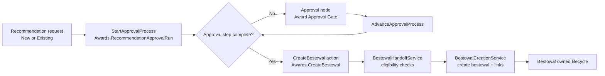
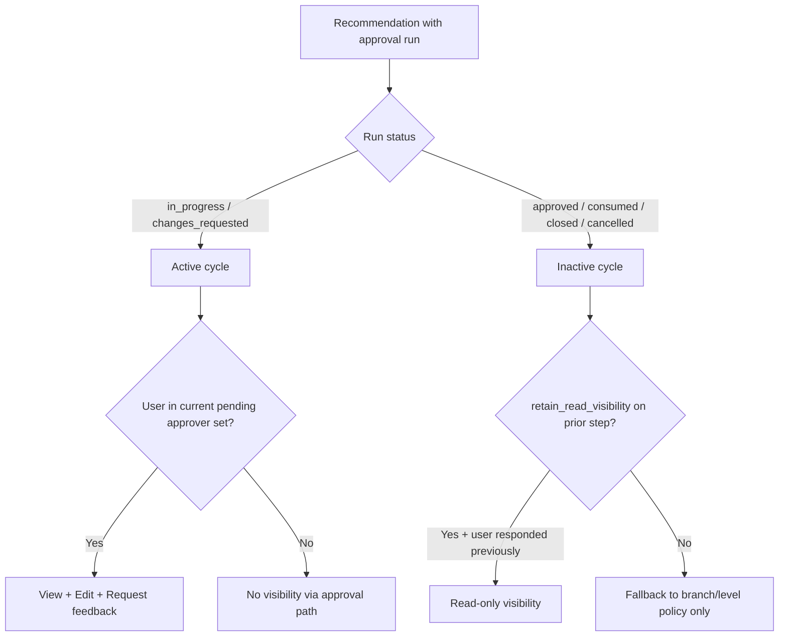
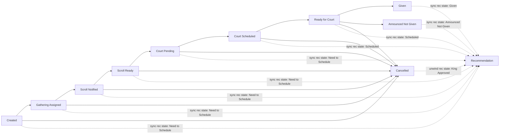
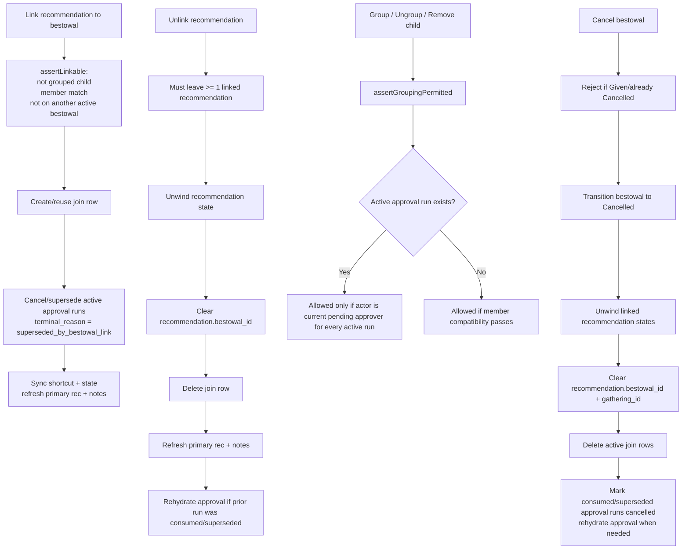
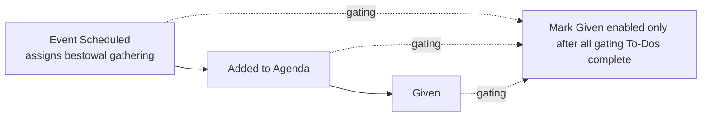
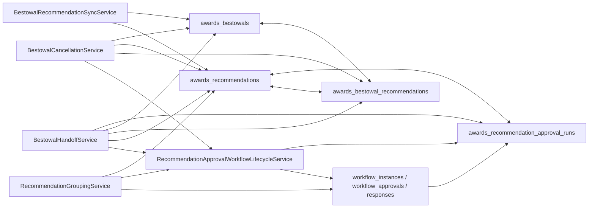

# Awards recommendation + bestowal workflow diagrams

This document summarizes the current **implemented** workflow behavior for Awards recommendations and bestowals, based on the seeded workflow definitions and the current Awards services/policies.

## 1) End-to-end recommendation processing

## 2) Approval ownership and visibility model

## 3) Bestowal state machine and recommendation projection

## 4) Linking, unlinking, grouping, and cancellation interactions

## 5) Bestowal preparation To-Dos

The default bestowal checklist requires **Event Scheduled**, **Added to Agenda**, and **Given** before a bestowal can be marked given. **Added to Agenda** is blocked until **Event Scheduled** is complete because the court agenda imports bestowals from the assigned gathering.

Required-field To-Dos can opt into system auto-close with `auto_complete_when_satisfied`. The built-in **Event Scheduled** and **Added to Agenda** items use this flag: once the bestowal has an assigned gathering, or a valid court/roaming assignment respectively, the ActionItem service records a system completion note and closes the satisfied To-Do. If a required field is later cleared, the same synchronization reopens the completed To-Do with a system audit note.

Ad-hoc bestowals may be linked to an existing member account or recorded with only the recipient SCA name, matching recommendation submission for recipients who are not registered in KMP.

## 6) Data interaction map

## 7) Workflow definitions currently in play

| Definition file | Trigger event | Key actions in flow |
| --- | --- | --- |
| `awards-recommendation-submitted.json` | `Awards.RecommendationCreateRequested` | `CreateRecommendation` -> `StartApprovalProcess` -> approval loop -> `CreateBestowal` |
| `awards-existing-recommendation-approval.json` | `Awards.ExistingRecommendationApprovalRequested` | `StartApprovalProcess` -> approval loop -> `CreateBestowal` |
| `awards-bestowal-transition.json` | `Awards.BestowalTransitionRequested` | `TransitionBestowal` -> `SyncRecommendationsFromBestowal` |
| `awards-bestowal-update.json` | `Awards.BestowalUpdateRequested` | `UpdateBestowal` (link/unlink + transition + sync) |
| `awards-bestowal-bulk-transition.json` | `Awards.BestowalBulkTransitionRequested` | `BulkTransitionBestowals` |
| `awards-bestowal-cancel.json` | `Awards.BestowalCancelRequested` | `CancelBestowal` (transition + unwind + unlink cleanup) |
| `awards-bestowal-cancelled.json` | `Awards.BestowalCancelled` | notification flow |
| `awards-recommendations-group.json` | `Awards.RecommendationsGroupRequested` | `GroupRecommendations` |
| `awards-recommendations-ungroup.json` | `Awards.RecommendationsUngroupRequested` | `UngroupRecommendations` |
| `awards-recommendation-remove-from-group.json` | `Awards.RecommendationRemoveFromGroupRequested` | `RemoveRecommendationFromGroup` |

## 8) Team test checklist by flow

| Flow | Primary actor | Expected owner of next action | Must verify |
| --- | --- | --- | --- |
| Submit recommendation | Requester | Current pending approver set | Approval run created, only current approvers see active item |
| Active approval edit/feedback | Current approver | Current approver | Can edit + request feedback; non-current cannot |
| Multi-step approval advance | Current approver | Next configured approver set | Pending set rotates, previous step visibility retained only when configured |
| Approval complete -> bestowal create | Final approver/workflow action | Bestowal workflow owner(s) | Only the final approval step selects the bestowal gathering; handoff blocks active runs, bestowal created with source approval provenance, approved run marked consumed |
| Link recommendation to existing bestowal | Noble/admin path | Bestowal workflow owner(s) | Active approval run cancelled/superseded, member match enforced, grouped child blocked |
| Unlink recommendation | Noble/admin path | Recommendation workflow owner(s) | Unwind state applied, shortcut cleared, join row removed, primary recomputed, approval rehydrated when prior run was consumed/superseded |
| Group/ungroup during approval | Current approver or admin override | Same active approver set | Grouping denied for non-current approver; origin snapshot restore works |
| Bestowal transition to court states | Bestowal owner(s) | Bestowal owner(s) | Recommendation projection state sync follows mapping |
| Bestowal cancellation | Bestowal owner(s) | Recommendation workflow owner(s) | Cancel denied for Given, unwind state applied, links and shortcuts cleared, consumed/superseded approval runs cancelled and rehydrated when needed |
| Turnover/reassignment events | System + admins | New eligible approvers | Pending approver set reflects new eligibility without leaking old active queue access |

## 9) High-risk regression points

1. Approval lifecycle must be driven by `Awards.RecommendationApprovalRuns` plus workflow runtime rows, not recommendation state/status.
2. Active approval visibility scoping must stay limited to current pending approvers for active cycles.
3. Link integrity between `recommendation.bestowal_id` and `awards_bestowal_recommendations`.
4. Group-child guardrails preventing direct child linking/handoff, including active runs on group heads.
5. Cancellation/unlink unwind consistency: recommendation projection, shortcut clear, join-row delete, approval-run terminal reason, and rehydration must stay together.
