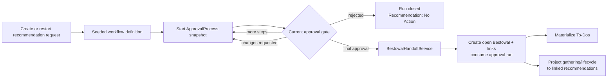
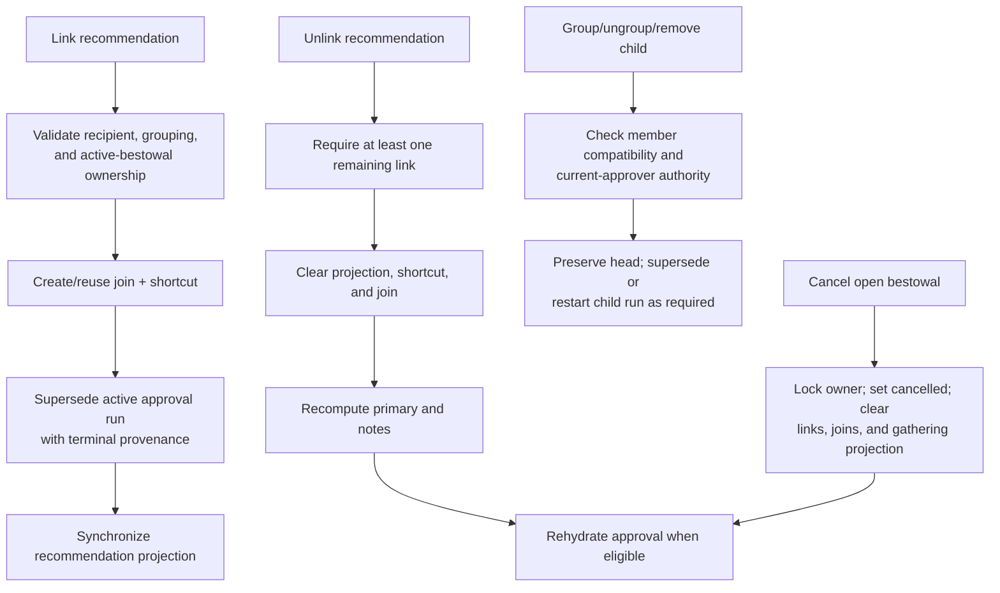
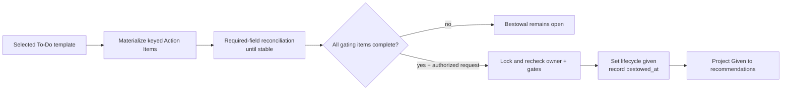
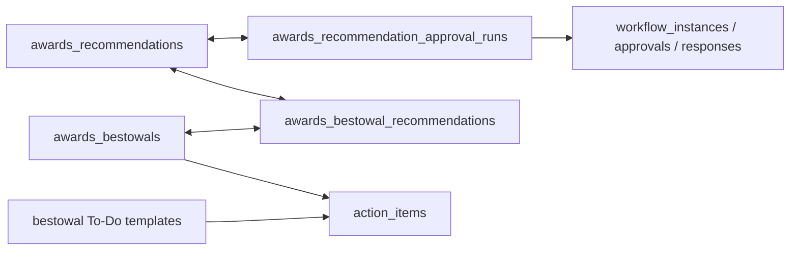

# Awards workflow interaction diagrams

These diagrams complement
[`awards-recommendation-approvals-redesign.md`](./awards-recommendation-approvals-redesign.md).
They summarize implemented interactions; the seeded JSON definitions, services, policies, and
tests remain authoritative.

## Approval to bestowal

```mermaid
flowchart LR
    Q["Create or restart recommendation request"] --> W["Seeded workflow definition"]
    W --> P["Start ApprovalProcess snapshot"]
    P --> A{"Current approval gate"}
    A -- more steps --> P
    A -- changes requested --> P
    A -- rejected --> R["Run closed\nRecommendation: No Action"]
    A -- final approval --> H["BestowalHandoffService"]
    H --> B["Create open Bestowal + links\nconsume approval run"]
    B --> T["Materialize To-Dos"]
    B --> S["Project gathering/lifecycle\nto linked recommendations"]
```

The final step chooses any required gathering through the approval response contract. The
handoff service rechecks eligibility and active-run state inside the transaction. Controllers
must dispatch triggers or call the owning service, never manufacture workflow rows or bestowal
links directly.

## Linking, grouping, and cancellation

```mermaid
flowchart TD
    L["Link recommendation"] --> V["Validate recipient, grouping,\nand active-bestowal ownership"]
    V --> J["Create/reuse join + shortcut"]
    J --> X["Supersede active approval run\nwith terminal provenance"]
    X --> S["Synchronize recommendation projection"]

    U["Unlink recommendation"] --> K["Require at least one remaining link"]
    K --> C["Clear projection, shortcut, and join"]
    C --> PR["Recompute primary and notes"]
    PR --> RH["Rehydrate approval when eligible"]

    G["Group/ungroup/remove child"] --> E["Check member compatibility and\ncurrent-approver authority"]
    E --> GL["Preserve head; supersede or\nrestart child run as required"]

    CB["Cancel open bestowal"] --> CL["Lock owner; set cancelled; clear\nlinks, joins, and gathering projection"]
    CL --> RH
```

These operations span multiple tables and workflow records. Keep them within their existing
service transaction and lock order. A `given` bestowal cannot be cancelled; a grouped child
cannot be independently handed off; an active recommendation cannot silently retain two
owners.

## To-Do materialization and finalization

```mermaid
flowchart LR
    D["Selected To-Do template"] --> M["Materialize keyed Action Items"]
    M --> F["Required-field reconciliation\nuntil stable"]
    F --> G{"All gating items complete?"}
    G -- no --> O["Bestowal remains open"]
    G -- yes + authorized request --> L["Lock and recheck owner + gates"]
    L --> V["Set lifecycle given\nrecord bestowed_at"]
    V --> S["Project Given to recommendations"]
```

Required-field items may auto-complete when their authoritative field becomes satisfied and
reopen when it stops being satisfied. Completion events are deferred until the reconciliation
batch is stable. Auto-completion or definition synchronization never independently marks the
bestowal given.

Template synchronization is scoped to one template and only open bestowals assigned to it
whose stored signature is absent or stale:

- matching item keys retain status, completion data, and log history while mutable snapshots
  are refreshed;
- new keys create open items;
- removed keys become cancelled history;
- a returned key reopens only when its latest cancellation came from synchronization;
- an assigned template with zero items intentionally retires all prior active items;
- terminal, unrelated, already-current, or unresolvable records are skipped and reported;
- bounded reconciliation passes make prerequisite chains independent of template sort order.

Materialization, synchronization, item transitions, cancellation, and finalization share the
persisted-owner-before-item lock order. Once the bestowal is `given` or `cancelled`, queued item
changes and direct synchronization are rejected.

## Runtime data map

```mermaid
flowchart LR
    R["awards_recommendations"] <--> AR["awards_recommendation_approval_runs"]
    AR --> W["workflow_instances / approvals / responses"]
    R <--> J["awards_bestowal_recommendations"]
    B["awards_bestowals"] <--> J
    B --> AI["action_items"]
    T["bestowal To-Do templates"] --> AI
```

All rows shown are tenant-local. IDs are meaningful only inside the resolved tenant database.

## Seeded workflow families

| Definitions | Responsibility |
| --- | --- |
| `awards-recommendation-submitted.json`, `awards-existing-recommendation-approval.json` | Start or restart approval and hand off an approved result |
| `awards-recommendation-updated.json`, `awards-recommendation-deleted.json` | Keep workflow lifecycle consistent with recommendation changes |
| `awards-recommendations-group.json`, `awards-recommendations-ungroup.json`, `awards-recommendation-remove-from-group.json` | Group mutation and approval cleanup/rehydration |
| `awards-bestowal-created.json`, `awards-bestowal-transition.json`, `awards-bestowal-update.json`, `awards-bestowal-bulk-transition.json` | Bestowal creation/update/transition and projection |
| `awards-bestowal-cancel.json`, `awards-bestowal-cancelled.json` | Transactional cancellation and notification |
| `awards-bestowal-ad-hoc.json` | Controlled bestowal creation outside a recommendation handoff |

Files live under `config/Seeds/WorkflowDefinitions/` and node implementations are registered by
`plugins/Awards/src/Services/AwardsWorkflowProvider.php`.

## High-risk verification

For a touched flow, test both authorization and state integrity:

1. current versus non-current approver visibility and response eligibility;
2. multi-step advance, feedback, rejection, approval, consumption, and terminal provenance;
3. outdated-process restart without carrying response credit or touching unrelated work;
4. link/unlink/group/cancel atomicity, primary-link repair, and approval rehydration;
5. bestowal projection for no gathering, scheduled, announced-not-given, given, and cancelled;
6. To-Do template synchronization, required-field reopen, gating, and concurrent finalization;
7. award-branch scope for bestowal/court/To-Do access; and
8. the same identifiers in a second tenant remaining invisible and unchanged.
