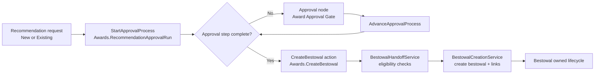
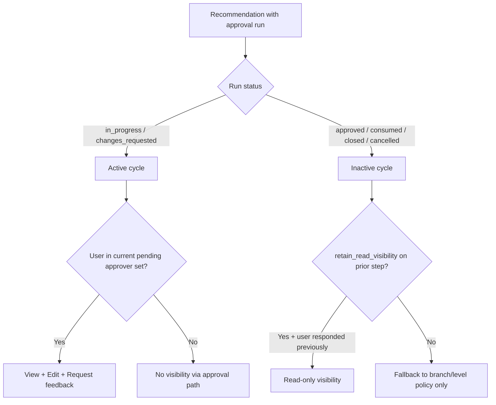
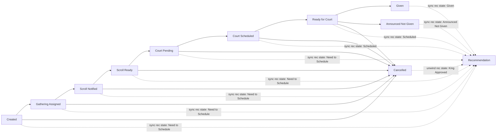
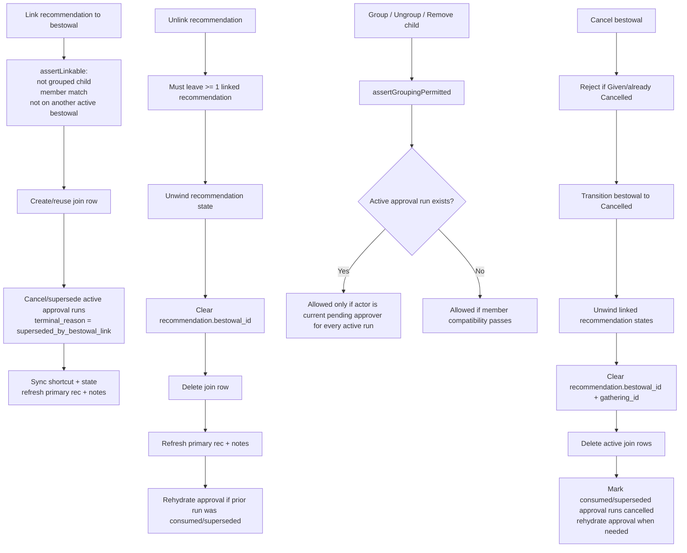
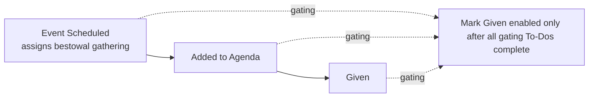
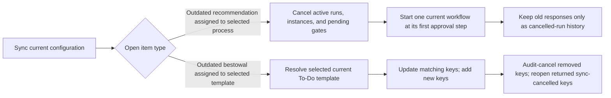
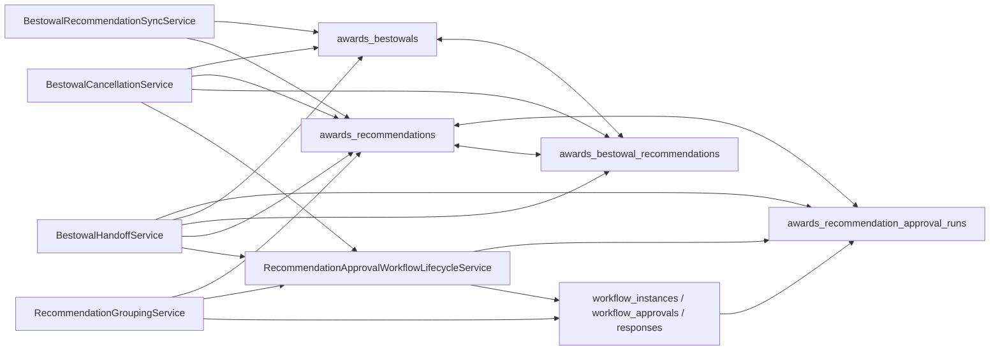

# Awards recommendation + bestowal workflow diagrams

This document summarizes the current **implemented** workflow behavior for Awards recommendations and bestowals, based on the seeded workflow definitions and the current Awards services/policies.

## 1) End-to-end recommendation processing

```mermaid
flowchart LR
    A["Recommendation request<br/>New or Existing"] --> B["StartApprovalProcess<br/>Awards.RecommendationApprovalRun"]
    B --> C{"Approval step complete?"}
    C -- "No" --> D["Approval node<br/>Award Approval Gate"]
    D --> E["AdvanceApprovalProcess"]
    E --> C
    C -- "Yes" --> F["CreateBestowal action<br/>Awards.CreateBestowal"]
    F --> G["BestowalHandoffService<br/>eligibility checks"]
    G --> H["BestowalCreationService<br/>create bestowal + links"]
    H --> I["Bestowal owned lifecycle"]
```

## 2) Approval ownership and visibility model

```mermaid
flowchart TD
    A["Recommendation with approval run"] --> B{"Run status"}
    B -- "in_progress / changes_requested" --> C["Active cycle"]
    B -- "approved / consumed / closed / cancelled" --> D["Inactive cycle"]

    C --> E{"User in current pending approver set?"}
    E -- "Yes" --> F["View + Edit + Request feedback"]
    E -- "No" --> G["No visibility via approval path"]

    D --> H{"retain_read_visibility on prior step?"}
    H -- "Yes + user responded previously" --> I["Read-only visibility"]
    H -- "No" --> J["Fallback to branch/level policy only"]
```

## 3) Bestowal state machine and recommendation projection

```mermaid
flowchart LR
    A["Created"] --> B["Gathering Assigned"]
    B --> C["Scroll Notified"]
    C --> D["Scroll Ready"]
    D --> E["Court Pending"]
    E --> F["Court Scheduled"]
    F --> G["Ready for Court"]
    G --> H["Given"]
    G --> I["Announced Not Given"]
    A --> X["Cancelled"]
    B --> X
    C --> X
    D --> X
    E --> X
    F --> X
    G --> X

    A -. "sync rec state: Need to Schedule" .-> R1["Recommendation"]
    B -. "sync rec state: Need to Schedule" .-> R1
    C -. "sync rec state: Need to Schedule" .-> R1
    D -. "sync rec state: Need to Schedule" .-> R1
    E -. "sync rec state: Need to Schedule" .-> R1
    F -. "sync rec state: Scheduled" .-> R1
    G -. "sync rec state: Scheduled" .-> R1
    H -. "sync rec state: Given" .-> R1
    I -. "sync rec state: Announced Not Given" .-> R1
    X -. "unwind rec state: King Approved" .-> R1
```

## 4) Linking, unlinking, grouping, and cancellation interactions

```mermaid
flowchart TD
    L1["Link recommendation to bestowal"] --> L2["assertLinkable:<br/>not grouped child<br/>member match<br/>not on another active bestowal"]
    L2 --> L3["Create/reuse join row"]
    L3 --> L4["Cancel/supersede active approval runs<br/>terminal_reason = superseded_by_bestowal_link"]
    L4 --> L5["Sync shortcut + state<br/>refresh primary rec + notes"]

    U1["Unlink recommendation"] --> U2["Must leave >= 1 linked recommendation"]
    U2 --> U3["Unwind recommendation state"]
    U3 --> U4["Clear recommendation.bestowal_id"]
    U4 --> U5["Delete join row"]
    U5 --> U6["Refresh primary rec + notes"]
    U6 --> U7["Rehydrate approval if prior run was consumed/superseded"]

    G1["Group / Ungroup / Remove child"] --> G2["assertGroupingPermitted"]
    G2 --> G3{"Active approval run exists?"}
    G3 -- "Yes" --> G4["Allowed only if actor is current pending approver for every active run"]
    G3 -- "No" --> G5["Allowed if member compatibility passes"]

    C1["Cancel bestowal"] --> C2["Reject if Given/already Cancelled"]
    C2 --> C3["Transition bestowal to Cancelled"]
    C3 --> C4["Unwind linked recommendation states"]
    C4 --> C5["Clear recommendation.bestowal_id + gathering_id"]
    C5 --> C6["Delete active join rows"]
    C6 --> C7["Mark consumed/superseded approval runs cancelled<br/>rehydrate approval when needed"]
```

## 5) Bestowal preparation To-Dos

```mermaid
flowchart LR
    A["Event Scheduled<br/>assigns bestowal gathering"] --> B["Added to Agenda"]
    B --> C["Given"]
    A -. "gating" .-> D["Mark Given enabled only after all gating To-Dos complete"]
    B -. "gating" .-> D
    C -. "gating" .-> D
```

The default bestowal checklist requires **Event Scheduled**, **Added to Agenda**, and **Given** before a bestowal can be marked given. **Added to Agenda** is blocked until **Event Scheduled** is complete because the court agenda imports bestowals from the assigned gathering.

Required-field To-Dos can opt into system auto-close with `auto_complete_when_satisfied`. The built-in **Event Scheduled** and **Added to Agenda** items use this flag: once the bestowal has an assigned gathering, or a valid court/roaming assignment respectively, the ActionItem service records a system completion note and closes the satisfied To-Do. If a required field is later cleared, the same synchronization reopens the completed To-Do with a system audit note.

### Synchronizing work already in flight

Each approval process detail page exposes a confirmed POST action only when open recommendations assigned to that
process use an older process snapshot or published workflow version. Each bestowal To-Do template detail page exposes
the same style of action only when open bestowals assigned to that template use an older or missing template signature.
Results include bounded item IDs, expected skip reasons, and fixed failure categories; unexpected exception details
remain in server logs.

```mermaid
flowchart LR
    A["Sync current configuration"] --> B{"Open item type"}
    B -- "Outdated recommendation assigned to selected process" --> C["Cancel active runs, instances, and pending gates"]
    C --> D["Start one current workflow at its first approval step"]
    D --> E["Keep old responses only as cancelled-run history"]
    B -- "Outdated bestowal assigned to selected template" --> I["Resolve selected current To-Do template"]
    I --> J["Update matching keys; add new keys"]
    J --> K["Audit-cancel removed keys; reopen returned sync-cancelled keys"]
```

Recommendation synchronization only considers eligible recommendations assigned to the selected process whose stored
process signature or workflow version is older than current configuration. It audit-cancels all active runs, workflow
instances, and pending gates, then starts exactly one workflow from the selected process at its first step. Existing responses remain
on the cancelled gates for history but are not copied and do not count in the replacement. The reset is atomic per
recommendation and failures are isolated. Closed, approved, deleted, bestowal-owned, grouped-child, and otherwise
ineligible records are not restarted. Synchronization cannot approve a recommendation or create a bestowal. The
replacement is current, so a repeat sync is unavailable until the selected process changes again.

Bestowal synchronization is scoped to one template and scans only lifecycle `open` bestowals assigned to it whose
stored template signature is missing or differs from the current definition. Successful initial materialization and
synchronization store the current signature, so the detail-page count and action clear after synchronization while
terminal, unrelated, and already-current bestowals are never considered. Matching ActionItems keep their status,
completion data, and log history while mutable title, assignment, branch, gating, ordering, and completion-requirement snapshots are refreshed.
New keys create open items. Removed keys are cancelled with a system audit note, and a returned key reopens only when
its latest cancellation was made by this synchronization. Missing assignments/templates are reported as identifiable
safe skips; an existing assigned template with zero items is authoritative and cancels all prior active items. An
explicit Required field `None` is stored as such and does not inherit legacy defaults from a built-in item key.
Cancelled items are retired history and do not appear in active grid counts or gating progress. Required-field reconciliation uses bounded passes until no item changes, so prerequisite
chains converge during the same synchronization regardless of template sort order. Completion events are deferred until
the whole required-field batch is stable, so a gating listener cannot make the owner terminal while later items are still
being reconciled. Definition synchronization does not emit an actor-authorized completion event and therefore cannot
implicitly mark a bestowal Given.
Materialization, synchronization, ActionItem transitions, and finalization use one persisted-owner-before-item lock
order. Cancellation uses that same bestowal mutex. Finalization reacquires the lock and rechecks lifecycle and gating
readiness, preventing a concurrent template sync from adding or reopening a gating item after the readiness check but
before the Given transition. Once the owner is Given or cancelled, queued ActionItem transitions and direct definition
synchronization are rejected, and initial materialization/its backfill command select open lifecycle only, so terminal
bestowals cannot regain open gating work.

Ad-hoc bestowals may be linked to an existing member account or recorded with only the recipient SCA name, matching recommendation submission for recipients who are not registered in KMP.

## 6) Data interaction map

```mermaid
flowchart LR
    R["awards_recommendations"] <--> AR["awards_recommendation_approval_runs"]
    R <--> BR["awards_bestowal_recommendations"]
    B["awards_bestowals"] <--> BR
    W["workflow_instances / workflow_approvals / responses"] --> AR

    H["BestowalHandoffService"] --> AR
    H --> B
    H --> BR
    H --> R
    H --> L["RecommendationApprovalWorkflowLifecycleService"]

    S["BestowalRecommendationSyncService"] --> B
    S --> R

    C["BestowalCancellationService"] --> B
    C --> R
    C --> BR
    C --> L

    G["RecommendationGroupingService"] --> R
    G --> L
    G --> W

    L --> AR
    L --> W
```

## 7) Workflow definitions currently in play

| Definition file | Trigger event | Key actions in flow |
| --- | --- | --- |
| `awards-recommendation-submitted.json` | `Awards.RecommendationCreateRequested` | `CreateRecommendation` -> `StartApprovalProcess` -> approval loop -> `CreateBestowal` |
| `awards-existing-recommendation-approval.json` | `Awards.ExistingRecommendationApprovalRequested` | `StartApprovalProcess` -> approval loop -> `CreateBestowal` |
| `awards-bestowal-transition.json` | `Awards.BestowalTransitionRequested` | `TransitionBestowal` -> `SyncRecommendationsFromBestowal` |
| `awards-bestowal-update.json` | `Awards.BestowalUpdateRequested` | `UpdateBestowal` (link/unlink + transition + sync) |
| `awards-bestowal-bulk-transition.json` | `Awards.BestowalBulkTransitionRequested` | `BulkTransitionBestowals` |
| `awards-bestowal-cancel.json` | `Awards.BestowalCancelRequested` | `CancelBestowal` (transition + unwind + unlink cleanup) |
| `awards-bestowal-cancelled.json` | `Awards.BestowalCancelled` | notification flow |
| `awards-recommendations-group.json` | `Awards.RecommendationsGroupRequested` | `GroupRecommendations` |
| `awards-recommendations-ungroup.json` | `Awards.RecommendationsUngroupRequested` | `UngroupRecommendations` |
| `awards-recommendation-remove-from-group.json` | `Awards.RecommendationRemoveFromGroupRequested` | `RemoveRecommendationFromGroup` |

## 8) Team test checklist by flow

| Flow | Primary actor | Expected owner of next action | Must verify |
| --- | --- | --- | --- |
| Submit recommendation | Requester | Current pending approver set | Approval run created, only current approvers see active item |
| Active approval edit/feedback | Current approver | Current approver | Can edit + request feedback; non-current cannot |
| Multi-step approval advance | Current approver | Next configured approver set | Pending set rotates, previous step visibility retained only when configured |
| Synchronize outdated approvals for one process | Award workflow synchronizer | Current configured approver set | Considers only outdated open work assigned to the selected process; cancels it and starts at the first current step; old responses remain history but do not carry forward; terminal and unrelated work is untouched; synchronization creates no bestowal |
| Approval complete -> bestowal create | Final approver/workflow action | Bestowal workflow owner(s) | Only the final approval step selects the bestowal gathering; handoff blocks active runs, bestowal created with source approval provenance, approved run marked consumed |
| Link recommendation to existing bestowal | Noble/admin path | Bestowal workflow owner(s) | Active approval run cancelled/superseded, member match enforced, grouped child blocked |
| Unlink recommendation | Noble/admin path | Recommendation workflow owner(s) | Unwind state applied, shortcut cleared, join row removed, primary recomputed, approval rehydrated when prior run was consumed/superseded |
| Group/ungroup during approval | Current approver or admin override | Head keeps its active approvers; ungrouped child gets its current configured approvers | Grouping cancels child runs as superseded; in-flight ungroup restores child origin state and starts a clean current-process run; old responses do not carry; bestowal-linked records remain locked |
| Bestowal transition to court states | Bestowal owner(s) | Bestowal owner(s) | Recommendation projection state sync follows mapping |
| Bestowal cancellation | Bestowal owner(s) | Recommendation workflow owner(s) | Cancel denied for Given, unwind state applied, links and shortcuts cleared, consumed/superseded approval runs cancelled and rehydrated when needed |
| Synchronize outdated bestowal To-Dos for one template | Award workflow synchronizer | Current template assignees | Considers only outdated open bestowals assigned to the selected template; matching history preserved; required fields converge independent of template order; synchronization never marks Given |
| Turnover/reassignment events | System + admins | New eligible approvers | Pending approver set reflects new eligibility without leaking old active queue access |

## 9) High-risk regression points

1. Approval lifecycle must be driven by `Awards.RecommendationApprovalRuns` plus workflow runtime rows, not recommendation state/status.
2. Active approval visibility scoping must stay limited to current pending approvers for active cycles.
3. Link integrity between `recommendation.bestowal_id` and `awards_bestowal_recommendations`.
4. Group-child guardrails preventing direct child linking/handoff, including active runs on group heads.
5. Cancellation/unlink unwind consistency: recommendation projection, shortcut clear, join-row delete, approval-run terminal reason, and rehydration must stay together.
