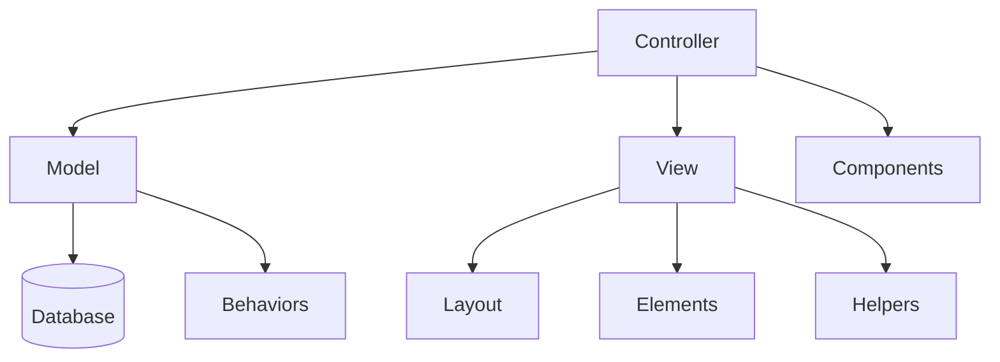
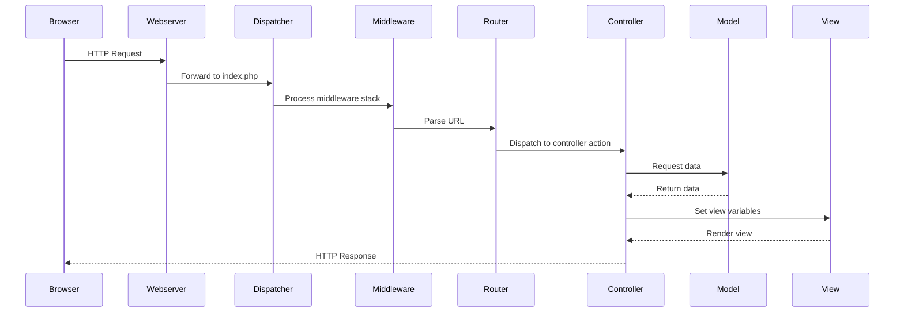

[← Back to Table of Contents](index.md)

# 2. Getting Started

This section guides developers through the process of setting up the Kingdom Management Portal (KMP) for development using Dev Containers.

## 2.1 Installation

KMP uses Dev Containers to provide a consistent, fully-configured development environment. This approach eliminates the need to manually install PHP, MySQL, Node.js, or any other dependencies on your local machine.

### Prerequisites

Before you begin, install the following:

1. **[Docker Desktop](https://www.docker.com/products/docker-desktop/)** - Container runtime
   - Windows/Mac: Install Docker Desktop
   - Linux: Install Docker Engine and Docker Compose

2. **[Visual Studio Code](https://code.visualstudio.com/)** - Code editor

3. **[Dev Containers Extension](https://marketplace.visualstudio.com/items?itemName=ms-vscode-remote.remote-containers)** - VS Code extension for container-based development

> **Tip:** You can install the Dev Containers extension by searching for "Dev Containers" in the VS Code Extensions panel or by pressing `Ctrl+P` and running `ext install ms-vscode-remote.remote-containers`.

### Option 1: Open Directly from GitHub (Recommended)

The fastest way to start developing is to open the repository directly in a Dev Container without cloning first.

#### Step 1: Open Repository in Dev Container

1. Open VS Code
2. Press `F1` (or `Ctrl+Shift+P` / `Cmd+Shift+P`) to open the Command Palette
3. Type and select: **Dev Containers: Clone Repository in Container Volume...**
4. Enter the repository URL: `https://github.com/Ansteorra/KMP`
5. Select the branch you want to work on (e.g., `main`)
6. VS Code will clone the repository into a Docker volume and open it in a Dev Container

**Why use a container volume?** Cloning into a Docker volume provides significantly better file system performance compared to bind-mounting your local file system, especially on Windows and macOS.

#### Step 2: Wait for Container Initialization

The Dev Container will automatically:
- Build the container image with PHP 8.x, MySQL, and Node.js
- Install all PHP dependencies via Composer
- Install all Node.js packages via npm
- Initialize and seed the development database
- Run database migrations

Watch the VS Code terminal for progress. The container is ready when you see the VS Code window fully load with the project files.

### Option 2: Clone First, Then Open in Container

If you prefer to have the repository on your local file system:

#### Step 1: Clone the Repository

```bash
git clone https://github.com/Ansteorra/KMP.git
cd KMP
```

#### Step 2: Open in VS Code

```bash
code .
```

#### Step 3: Reopen in Container

When VS Code opens, you'll see a notification in the bottom-right corner:

> **Folder contains a Dev Container configuration file. Reopen folder to develop in a container.**

Click **"Reopen in Container"** to start the Dev Container.

Alternatively:
1. Press `F1` to open the Command Palette
2. Type and select: **Dev Containers: Reopen in Container**

### Option 3: Open from GitHub.com

You can also start a Dev Container directly from the GitHub website:

1. Navigate to the [KMP GitHub repository](https://github.com/Ansteorra/KMP)
2. Click the green **"Code"** button
3. Select the **"Local"** tab
4. Click **"Open with VS Code"** (requires the [GitHub Repositories extension](https://marketplace.visualstudio.com/items?itemName=GitHub.remotehub))

Or use the direct URL pattern:
```
vscode://ms-vscode-remote.remote-containers/cloneInVolume?url=https://github.com/Ansteorra/KMP
```

### First-Time Setup Verification

After the container initializes, verify everything is working:

1. **Check the terminal** - You should see successful completion messages
2. **Verify the database** - The development database should be seeded with test data
3. **Check forwarded ports** - Look at the "Ports" tab in VS Code (usually port 8080)

If you need to manually reset the development environment:

```bash
# From the repository root
./reset_dev_database.sh
```

This script will:
- Drop and recreate the development database
- Load seed data from `dev_seed_clean.sql`
- Apply all pending migrations
- Reset all member passwords to `TestPassword`

### Accessing the Application

Once the Dev Container is running, the application is available at:

**http://localhost:8080**

VS Code automatically forwards the container's port 8080 to your local machine. You can see all forwarded ports in the **"Ports"** tab at the bottom of VS Code.

### Troubleshooting Container Startup

**Container fails to build:**
- Ensure Docker Desktop is running
- Check available disk space (containers need several GB)
- Try rebuilding: `F1` → **Dev Containers: Rebuild Container**

**Database connection errors:**
- Wait for the MySQL service to fully initialize (can take 30-60 seconds)
- Run `./reset_dev_database.sh` to reinitialize

**Port 8080 already in use:**
- Stop other services using port 8080
- Or modify the port forwarding in `.devcontainer/devcontainer.json`

**Slow file system performance (Windows/macOS):**
- Use Option 1 (Clone Repository in Container Volume) for best performance
- Container volumes are significantly faster than bind mounts on non-Linux systems

## 2.2 Configuration

KMP uses a combination of configuration files and database-stored settings to manage its behavior.

### Configuration Files

The main configuration files are located in the `config` directory:

- **app.php**: Main application configuration
- **app_local.php**: Environment-specific settings (database, email, etc.)
- **bootstrap.php**: Application bootstrap
- **routes.php**: URL routing configuration
- **plugins.php**: Plugin loading and configuration

When using containers, these files are pre-configured for the development environment.

### Database Configuration

The `app_settings` table stores runtime configuration values that can be modified through the application UI. These settings include:

- Site title and branding
- Email notification settings
- System behavior toggles
- Default values for forms and displays

The container environment creates a database with these settings pre-populated.

### Environment Variables

In the Dev Container environment, environment variables are pre-configured in the container definition:

- `DEBUG`: Set to `true` for development environments
- `APP_ENCODING`: Set to `UTF-8`
- `APP_DEFAULT_LOCALE`: Set to `en_US`
- `SECURITY_SALT`: Automatically generated

You can modify these variables by editing the `.devcontainer/devcontainer.json` file or the `config/.env` file within the container.

## 2.3 CakePHP Basics

KMP is built on the CakePHP framework, which follows the MVC (Model-View-Controller) pattern.

### MVC Architecture



### Key CakePHP Concepts

- **Controllers**: Handle requests, interact with models, and set data for views
- **Models**: Represent data tables and contain business logic
- **Views**: Template files that present data to users
- **Entities**: Represent individual database records
- **Tables**: Represent database tables and collections of entities
- **Components**: Reusable controller logic
- **Helpers**: Reusable view logic
- **Behaviors**: Reusable model logic
- **Plugins**: Self-contained code packages that extend the application

### CakePHP Request Flow



### Development Workflow in Containers

When working in containerized environments, you can use the CakePHP CLI tools directly without additional setup:

```bash
# Start the development server (already running in container)
bin/cake server

# Create a migration
bin/cake bake migration CreateNewTable

# Apply migrations
bin/cake migrations migrate

# Generate code (controller, model, etc.)
bin/cake bake controller MyController

# List all routes
bin/cake routes
```

These commands are executed within the container environment, ensuring consistency across all development setups.

### Container-Specific Tools

The development container includes additional scripts to simplify common tasks:

```bash
# Reset development database (drops, reseeds, migrates, resets passwords)
./reset_dev_database.sh

# Update from upstream repository
./merge_from_upstream.sh
```

For more information on CakePHP basics, refer to the [CakePHP Documentation](https://book.cakephp.org/).
