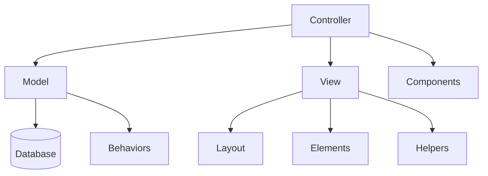
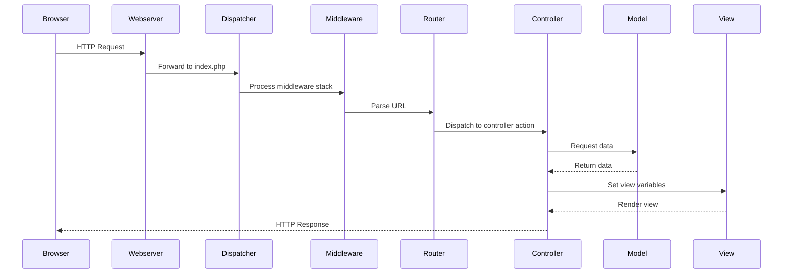

# 2. Getting Started

This section guides developers through the process of setting up the Kingdom Management Portal (KMP) for development using container-based workflows.

## 2.1 Installation

KMP supports development using containerized environments through GitHub Codespaces or local development containers. This approach eliminates the need to manually configure development dependencies on your local machine.

### Using GitHub Codespaces

GitHub Codespaces provides a complete, cloud-hosted development environment that can be accessed from your browser or VS Code.

#### Step 1: Start a Codespace

1. Navigate to the [KMP GitHub repository](https://github.com/Ansteorra/KMP)
2. Click the "Code" button
3. Select the "Codespaces" tab
4. Click "Create codespace on main"


The Codespace will initialize with all required dependencies pre-installed.

#### Step 2: Wait for Container to Initialize

Once the Codespace is created, it will automatically:
- Install all PHP dependencies via Composer
- Install all Node.js packages
- Set up the database
- Run initial migrations

You'll see terminal output as these processes complete. Wait until you see the notification that your Codespace is ready to use.

### Using VS Code Dev Containers

If you prefer to develop locally while still using containerized environments, you can use VS Code's Dev Containers extension.

#### Prerequisites

- [Docker Desktop](https://www.docker.com/products/docker-desktop/)
- [Visual Studio Code](https://code.visualstudio.com/)
- [Dev Containers extension](https://marketplace.visualstudio.com/items?itemName=ms-vscode-remote.remote-containers)

#### Step 1: Clone the Repository

```bash
git clone https://github.com/Ansteorra/KMP.git
cd KMP
```

#### Step 2: Open in Dev Container

1. Open VS Code
2. Click on the green button in the lower-left corner of VS Code
3. Select "Reopen in Container"

VS Code will build the development container based on the configuration in `.devcontainer`. This process includes:
- Setting up the PHP environment
- Installing Composer and Node.js
- Configuring MySQL
- Installing all dependencies

#### Step 3: Wait for Container Setup to Complete

The container setup will automatically:
- Install PHP dependencies (`composer install`)
- Install Node.js packages (`npm install`)
- Set up the database
- Run migrations

Once complete, you'll have a fully functional development environment.

### First-Time Application Setup

After your container environment is ready, the application should be automatically configured. However, if you need to run the setup manually:

```bash
# From the app directory
./reset_dev_database.sh
```

This script will:
- Reset the development database
- Apply all migrations
- Load seed data for testing

### Accessing the Application

When using a dev container or Codespace, the application is automatically available:

- **GitHub Codespaces**: Click on the "Ports" tab and look for the forwarded port 8080
- **Local Dev Container**: The application is available at http://localhost:8080

## 2.2 Configuration

KMP uses a combination of configuration files and database-stored settings to manage its behavior.

### Configuration Files

The main configuration files are located in the `config` directory:

- **app.php**: Main application configuration
- **app_local.php**: Environment-specific settings (database, email, etc.)
- **bootstrap.php**: Application bootstrap
- **routes.php**: URL routing configuration
- **plugins.php**: Plugin loading and configuration

When using containers, these files are pre-configured for the development environment.

### Database Configuration

The `app_settings` table stores runtime configuration values that can be modified through the application UI. These settings include:

- Site title and branding
- Email notification settings
- System behavior toggles
- Default values for forms and displays

The container environment creates a database with these settings pre-populated.

### Environment Variables

In containerized environments, environment variables are pre-configured in the container definition:

- `DEBUG`: Set to `true` for development environments
- `APP_ENCODING`: Set to `UTF-8`
- `APP_DEFAULT_LOCALE`: Set to `en_US`
- `SECURITY_SALT`: Automatically generated

You can modify these variables by editing the `.devcontainer/devcontainer.json` file or through the Codespaces settings.

## 2.3 CakePHP Basics

KMP is built on the CakePHP framework, which follows the MVC (Model-View-Controller) pattern.

### MVC Architecture



### Key CakePHP Concepts

- **Controllers**: Handle requests, interact with models, and set data for views
- **Models**: Represent data tables and contain business logic
- **Views**: Template files that present data to users
- **Entities**: Represent individual database records
- **Tables**: Represent database tables and collections of entities
- **Components**: Reusable controller logic
- **Helpers**: Reusable view logic
- **Behaviors**: Reusable model logic
- **Plugins**: Self-contained code packages that extend the application

### CakePHP Request Flow



### Development Workflow in Containers

When working in containerized environments, you can use the CakePHP CLI tools directly without additional setup:

```bash
# Start the development server (already running in container)
bin/cake server

# Create a migration
bin/cake bake migration CreateNewTable

# Apply migrations
bin/cake migrations migrate

# Generate code (controller, model, etc.)
bin/cake bake controller MyController

# List all routes
bin/cake routes
```

These commands are executed within the container environment, ensuring consistency across all development setups.

### Container-Specific Tools

The development container includes additional scripts to simplify common tasks:

```bash
# Reset development database
./reset_dev_database.sh

# Update from upstream repository
./merge_from_upstream.sh

# Update seed data
./update_seed_data.sh
```

For more information on CakePHP basics, refer to the [CakePHP Documentation](https://book.cakephp.org/).
