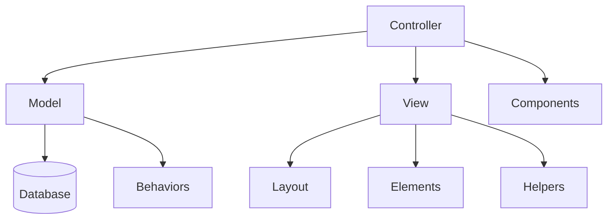
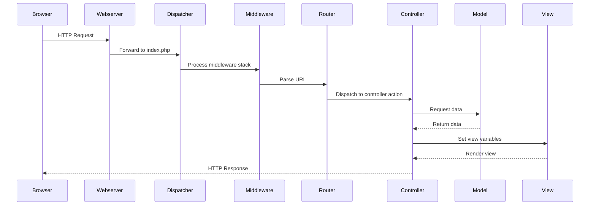

[← Back to Table of Contents](index.md)

# 2. Getting Started

This section guides developers through the process of setting up the Kingdom Management Portal (KMP) for local development using Docker Compose.

## 2.1 Installation

KMP uses Docker Compose as the default local development environment. Your source code stays in the local repository folder, while PHP, Apache, MariaDB, Mailpit, Node, Xdebug, queue workers, and scheduled CakePHP cron jobs run in containers.

### Prerequisites

Before you begin, install the following:

1. **[Docker Desktop](https://www.docker.com/products/docker-desktop/)** - Container runtime
   - Windows/Mac: Install Docker Desktop
   - Linux: Install Docker Engine and Docker Compose

2. **A code editor** - VS Code is supported, but not required

### Step 1: Clone the Repository

```bash
git clone https://github.com/Ansteorra/KMP.git
cd KMP
```

### Step 2: Start the Local Stack

```bash
./dev-up.sh --build
```

If `app/config/.env` does not exist yet, `./dev-up.sh` creates it from `app/config/.env.example`. After the app is healthy, it runs `./dev-reset-db.sh --seed` by default so the database matches the current code and seeded dev users. After the first build, use `./dev-up.sh` for normal startup.

### First-Time Setup Verification

After Docker Compose initializes, verify everything is working:

1. **Check the terminal** - `./dev-up.sh` should print the app, Mailpit, database, and cron log locations.
2. **Verify the app** - Open http://localhost:8080.
3. **Verify services** - Run `docker compose ps`.
4. **Check scheduled jobs** - Run `docker compose exec app tail -f /var/log/cron.log` to inspect queue and cron output.

If you need to manually reset the development environment:

```bash
# From the repository root
./dev-reset-db.sh
```

This script will:
- Drop and recreate the development and test databases
- Run migrations and `updateDatabase`
- Load `dev_seed_clean.sql` when you pass `--seed`
- Reset all member passwords to `TestPassword`
- Print member emails that exist after reset (without `--seed`, usually `admin@test.com`; with `--seed`, includes `admin@amp.ansteorra.org`)

### Accessing the Application

Once Docker Compose is running, the application is available at:

**http://localhost:8080**

Mailpit is available at **http://localhost:8025** and MariaDB is available at **127.0.0.1:3306** by default.

To test multiple local hostnames, add entries to `/etc/hosts`:

```text
127.0.0.1 kmp.localhost kmp2.localhost platform.kmp.localhost
```

Then open http://kmp.localhost:8080, http://kmp2.localhost:8080, or
http://platform.kmp.localhost:8080 when the platform-admin portal is enabled.

### Running Commands

Run Composer, CakePHP, npm, tests, and other tooling inside the app container:

```bash
docker compose exec app composer install
docker compose exec app bin/cake migrations status
docker compose exec app npm run build
docker compose exec app vendor/bin/phpunit
```

### Xdebug

Xdebug is configured for port `9003` with container-to-host callbacks through `host.docker.internal`. The VS Code launch configuration maps `/var/www/html` in the container to `${workspaceFolder}/app` on the host. Start an IDE listener and trigger debugging with an `XDEBUG_TRIGGER` cookie/query parameter or browser extension.

### Scheduled Local Jobs

The Docker worker and scheduler services own background work. With tenancy
enabled they poll `bin/cake platform schedule due`; stored schedules fan out
workflow, maintenance, backup, platform job, and queue processing to active
tenants. In single-database/legacy cron mode, the equivalent commands are:

- `bin/cake queue run -q` every 2 minutes
- `bin/cake workflow_scheduler` every minute
- `bin/cake sync_active_window_statuses` every 15 minutes
- `bin/cake sync_member_warrantable_statuses` daily
- `bin/cake age_up_members` daily

### Troubleshooting Container Startup

**Container fails to build:**
- Ensure Docker Desktop is running
- Check available disk space (containers need several GB)
- Try rebuilding: `./dev-up.sh --build`

**Database connection errors:**
- Wait for MariaDB to fully initialize
- Run `./dev-reset-db.sh` to reinitialize

**Port 8080 already in use:**
- Stop other services using port 8080
- Or set `KMP_APP_PORT` in `app/config/.env`

**Cron jobs are noisy while debugging:**
- Set `KMP_SKIP_CRON=true` in `app/config/.env` and restart with `./dev-up.sh`

### Optional Devcontainer

The `.devcontainer/` configuration remains available as optional legacy tooling. Docker Compose is the default local development path. Avoid running both environments at the same time unless you change ports, because they can compete for host bindings.

## 2.2 Configuration

KMP uses a combination of configuration files and database-stored settings to manage its behavior.

### Configuration Files

The main configuration files are located in the `config` directory:

- **app.php**: Main application configuration
- **app_local.php**: Environment-specific settings (database, email, etc.)
- **bootstrap.php**: Application bootstrap
- **routes.php**: URL routing configuration
- **plugins.php**: Plugin loading and configuration

When using containers, these files are pre-configured for the development environment.

### Database Configuration

The `app_settings` table stores runtime configuration values that can be modified through the application UI. These settings include:

- Site title and branding
- Email notification settings
- System behavior toggles
- Default values for forms and displays

The container environment creates a database with these settings pre-populated.

### Environment Variables

In the Docker Compose environment, variables are configured in `app/config/.env`:

- `KMP_APP_PORT`: App host port, default `8080`
- `KMP_DB_HOST_PORT`: MariaDB host port, default `3306`
- `KMP_MAILPIT_WEB_PORT`: Mailpit UI host port, default `8025`
- `KMP_HOST_ALIASES`: Space-separated local hostnames printed by `./dev-up.sh`
- `XDEBUG_MODE`, `XDEBUG_CLIENT_HOST`, `XDEBUG_CLIENT_PORT`: Xdebug runtime settings
- `KMP_SKIP_CRON`: Set to `true` to disable local cron startup
- `KMP_RESET_DB_ON_UP`: Set to `false` to skip the automatic `dev-reset-db.sh` run after startup
- `KMP_RESET_DB_ON_UP_ARGS`: Arguments passed to `dev-reset-db.sh`, default `--seed`

See [Docker Development](docker-development.md) for the complete local Docker reference.

## 2.3 CakePHP Basics

KMP is built on the CakePHP framework, which follows the MVC (Model-View-Controller) pattern.

### MVC Architecture


```mermaid
graph TD
    C[Controller] --> M[Model]
    C --> V[View]
    M --> D[(Database)]
    V --> L[Layout]
    V --> E[Elements]
    C --> Component[Components]
    V --> Helper[Helpers]
    M --> Behavior[Behaviors]
```

### Key CakePHP Concepts

- **Controllers**: Handle requests, interact with models, and set data for views
- **Models**: Represent data tables and contain business logic
- **Views**: Template files that present data to users
- **Entities**: Represent individual database records
- **Tables**: Represent database tables and collections of entities
- **Components**: Reusable controller logic
- **Helpers**: Reusable view logic
- **Behaviors**: Reusable model logic
- **Plugins**: Self-contained code packages that extend the application

### CakePHP Request Flow


```mermaid
sequenceDiagram
    participant Browser
    participant Webserver
    participant Dispatcher
    participant Middleware
    participant Router
    participant Controller
    participant Model
    participant View
    
    Browser->>Webserver: HTTP Request
    Webserver->>Dispatcher: Forward to index.php
    Dispatcher->>Middleware: Process middleware stack
    Middleware->>Router: Parse URL
    Router->>Controller: Dispatch to controller action
    Controller->>Model: Request data
    Model-->>Controller: Return data
    Controller->>View: Set view variables
    View-->>Controller: Render view
    Controller-->>Browser: HTTP Response
```

### Development Workflow in Containers

When working with the local Docker stack, run CakePHP CLI tools through the app container:

```bash
# Create a migration
docker compose exec app bin/cake bake migration CreateNewTable

# Apply migrations
docker compose exec app bin/cake migrations migrate

# Generate code (controller, model, etc.)
docker compose exec app bin/cake bake controller MyController

# List all routes
docker compose exec app bin/cake routes
```

These commands execute inside the container environment, ensuring consistency without requiring PHP dependencies on the host.

### Container-Specific Tools

The development container includes additional scripts to simplify common tasks:

```bash
# Reset Docker development database
./dev-reset-db.sh

# Update from upstream repository
./merge_from_upstream.sh
```

For more information on CakePHP basics, refer to the [CakePHP Documentation](https://book.cakephp.org/).
