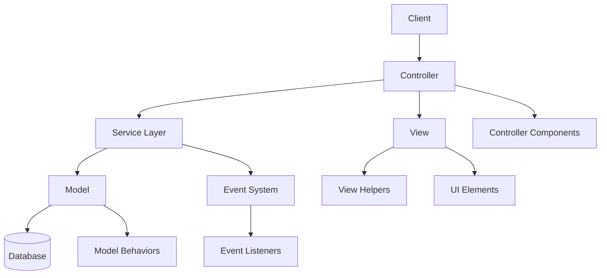
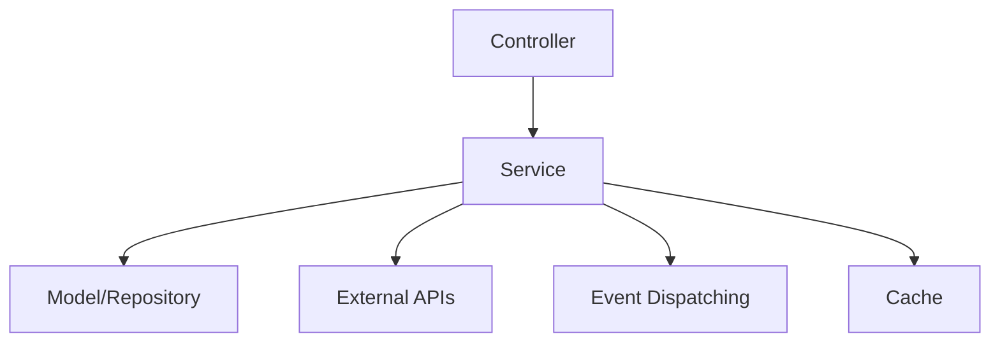
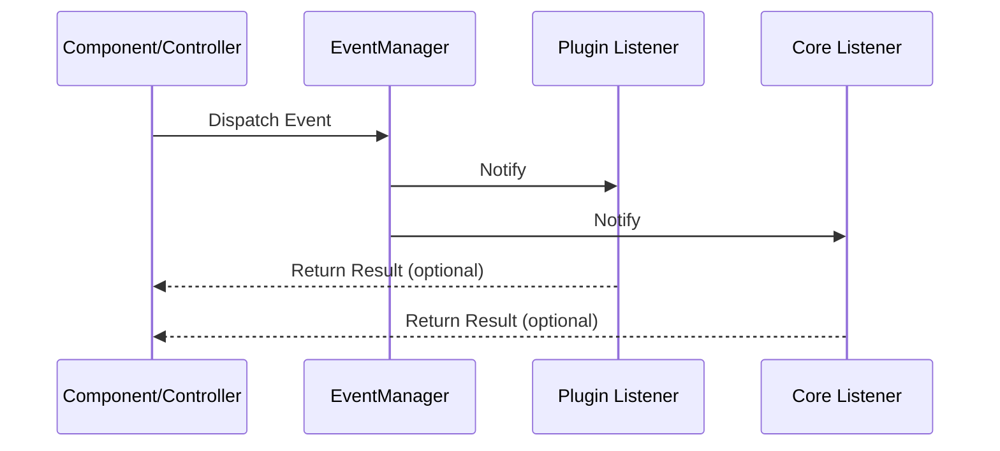
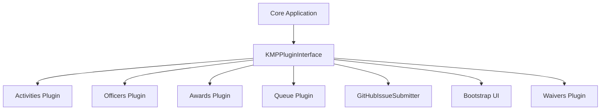
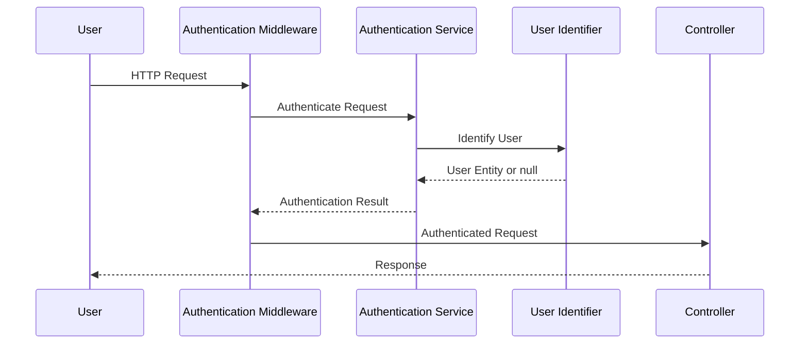
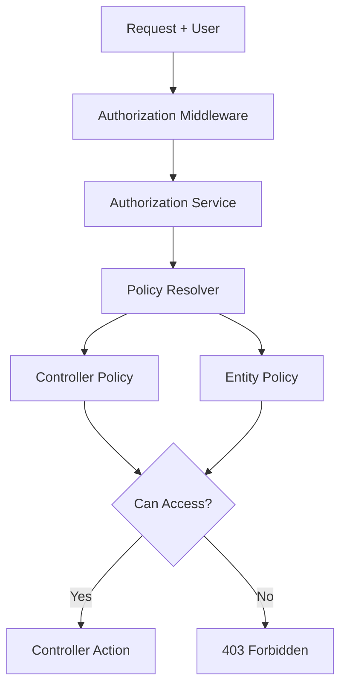
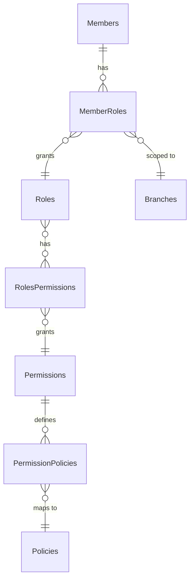
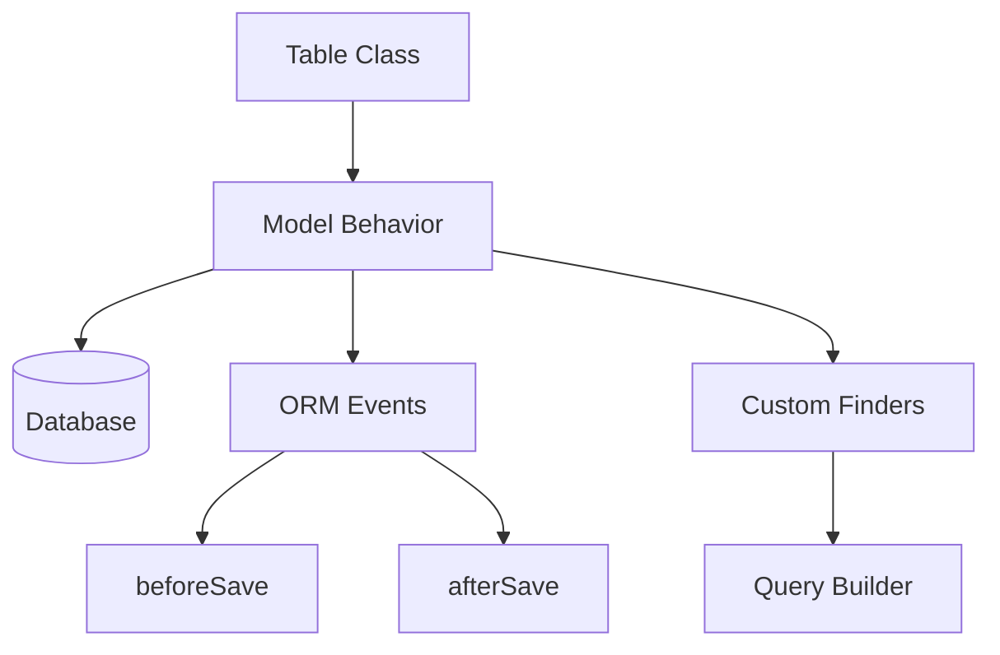
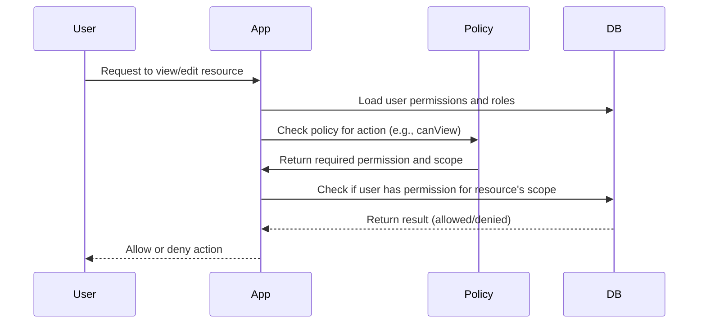

[← Back to Table of Contents](index.md)

# 3. Architecture

This section provides an overview of the KMP application architecture, explaining its structure, components, and design principles.

## 3.1 Application Structure

KMP follows the CakePHP directory structure with additional customizations for plugins and services. Understanding this structure is essential for effective development.

### Directory Structure Overview

```
app/
├── config/             # Configuration files
├── src/                # Core application code
│   ├── Application.php # Main application class
│   ├── Command/        # CLI commands
│   ├── Controller/     # Request controllers
│   ├── Event/          # Event listeners
│   ├── Form/           # Form classes
│   ├── Identifier/     # Authentication identifiers
│   ├── KMP/            # KMP-specific core code
│   ├── Mailer/         # Email templates and logic
│   ├── Model/          # Data models and entities
│   ├── Policy/         # Authorization policies
│   ├── Services/       # Business logic services
│   └── View/           # View templates and helpers
├── assets/             # Source asset files
│   ├── css/            # CSS source files
│   └── js/             # JavaScript source files
│       └── controllers/ # Stimulus controllers
├── plugins/            # Application plugins
│   ├── Activities/     # Activities management
│   ├── Awards/         # Awards management
│   ├── Bootstrap/      # UI components
│   ├── GitHubIssueSubmitter/ # User feedback
│   ├── Officers/       # Officers management
│   ├── Queue/          # Background processing
│   └── Waivers/        # Waiver management
├── templates/          # View templates
└── tests/              # Test cases
```

### MVC+ Implementation

KMP extends the traditional MVC pattern with services and events, creating a more modular and maintainable architecture:



## 3.2 Core Components

KMP extends CakePHP with several core components that provide essential functionality throughout the application.

### Application Class

The `Application.php` class serves as the entry point for the application, handling bootstrapping, middleware configuration, and plugin registration.

Key responsibilities:
- Configuring the dependency injection container
- Loading and initializing plugins
- Setting up authentication and authorization
- Configuring middleware

### Service Layer

KMP implements a service layer pattern to encapsulate business logic:



Key services include:
- **WarrantManager**: Handles warrant processing and lifecycle
- **ActiveWindowManager**: Manages date-bounded entities
- **AuthorizationService**: Custom authorization logic  
- **CsvExportService**: Data export functionality
- **NavigationRegistry**: Dynamic navigation menu management
- **ViewCellRegistry**: UI component registration and rendering

### Event System

The event system enables loose coupling between components, allowing for extensible architecture:



Common events include:
- Navigation building events
- Entity lifecycle events (before/after save)
- Authentication events
- Cell rendering events

### StaticHelpers

The `StaticHelpers` class provides global utility functions throughout the KMP application, particularly for managing application settings:

```php
// Example of StaticHelpers usage
StaticHelpers::getAppSetting("KMP.ShortSiteTitle", "KMP", null, true);
```

Key features include:
- Application settings management with version-based updates
- File system operations and image processing
- Template processing with placeholder replacement
- Security utilities for token generation
- Configuration access with fallback support

## 3.3 Plugin System

KMP uses CakePHP's plugin system extensively to organize features into cohesive, maintainable modules.

### Plugin Architecture




Each plugin follows a standard structure:
```
PluginName/
├── config/         # Plugin configuration and migrations
├── src/            # Plugin PHP code
│   ├── PluginNamePlugin.php  # Main plugin class (NamePlugin.php pattern)
│   ├── Controller/ # Plugin controllers
│   ├── Model/      # Plugin models
│   ├── Services/   # Plugin services (including NavigationProvider)
│   ├── Event/      # Event listeners (including CallForCellsHandler)
│   └── View/       # View-related code
├── templates/      # Template files
├── assets/         # Source asset files for the plugin
│   ├── css/        # CSS source files
│   └── js/         # JavaScript source files
│       └── controllers/ # Stimulus controllers (plugin-specific)
└── tests/          # Plugin tests
```

> **Note:** The main plugin class follows the pattern `PluginNamePlugin.php` (e.g., `ActivitiesPlugin.php`, `OfficersPlugin.php`). For plugin JavaScript, use `plugins/PluginName/assets/js/controllers/` for Stimulus controllers.

### Plugin Registration

Plugins are registered in `config/plugins.php` and loaded in the `Application.php` bootstrap method. Each plugin can specify its migration order for database setup:

```php
'Activities' => [
    'migrationOrder' => 1,
],
'Officers' => [
    'migrationOrder' => 2,
],
'Awards' => [
    'migrationOrder' => 3,
],
'Waivers' => [
    'migrationOrder' => 4,
],
```


### Plugin Integration Points

Plugins integrate with the core application through:
1. **NavigationProvider**: Registering navigation items for menus
2. **CallForCellsHandler**: Registering view cells/tabs for UI integration
3. **Events**: Listening for and dispatching events
4. **Services**: Exposing APIs for other plugins

## 3.4 Authentication & Authorization

KMP implements a comprehensive security system based on CakePHP's Authentication and Authorization plugins.

### Authentication Flow



Authentication features:
- Form-based login
- Session persistence
- Remember-me functionality
- Brute force protection
- Password reset flow

### Authorization System

KMP uses a policy-based authorization system with role-based access control (RBAC):



Authorization components:
- **Roles**: Define user types (e.g., Admin, Officer, Member)
- **Permissions**: Specific actions that can be performed
- **Policies**: Rules that determine access based on user and resource
- **Permission Policies**: Dynamic rules for role-based access

The authorization flow evaluates whether a user has permission to perform specific actions on resources, checking both static permissions and dynamic policies.

### Permission and Policy Scoping

KMP supports fine-grained authorization using permissions and policies, with flexible scoping rules to ensure users only see and do what they are allowed to.

#### Permission Scoping

Each permission can be scoped in one of three ways:
- **Global**: Applies everywhere in the system.
- **Branch Only**: Applies only to a specific branch.
- **Branch and Children**: Applies to a branch and all its descendant branches.

#### Policies and Scoping

Policies are mapped to permissions and define what actions a user can perform (e.g., `canView`, `canEdit`). The scoping of a permission determines both:
- **Query Scoping**: What records a user can see (e.g., which branches, members, or warrants).
- **Action Approval**: What actions a user can perform on a given resource.

**How it works:**
- When a user attempts to view or act on a resource, the system checks their permissions and the associated policy.
- If the permission is **global**, the user can see/do the action everywhere.
- If the permission is **branch-scoped**, the system checks if the resource belongs to a branch the user has access to.
- For **branch+children**, the user can see/do the action for the branch and all its descendants.

#### Example: Viewing Warrants
- A user with `Can View Warrants` permission scoped to Branch A can only see warrants in Branch A.
- If the permission is scoped to Branch A and children, the user can see warrants in Branch A and all its sub-branches.

#### Entity Relationship Diagram (ERD)



## 3.5 Model Behaviors

KMP implements custom CakePHP behaviors to provide reusable model functionality across the application. These behaviors encapsulate common data management patterns and ensure consistency in how temporal data, JSON fields, and sortable lists are handled.

### Behavior Architecture Overview



### ActiveWindow Behavior

The `ActiveWindowBehavior` provides temporal filtering capabilities for entities with date-bounded lifecycles. This behavior is essential for managing time-sensitive data throughout KMP.

#### Key Features
- **Temporal Queries**: Find current, upcoming, or expired records
- **Flexible Date Handling**: Support custom effective dates or defaults to current time  
- **Null-Safe Expiration**: Handle records with no expiration date (permanent records)
- **Group-Aware Filtering**: Respect entity relationships and hierarchies

#### Database Schema Requirements
```sql
-- Tables using ActiveWindow behavior must have:
start_on    DATETIME NOT NULL,  -- When record becomes active
expires_on  DATETIME NULL       -- When record expires (NULL = never expires)
```

#### Usage Examples
```php
// In Table initialize() method
$this->addBehavior('ActiveWindow');

// Find currently active records
$activeOfficers = $this->Officers->find('current');

// Find upcoming assignments
$upcomingWarrants = $this->Warrants->find('upcoming');

// Historical queries with specific date
$historicalDate = new DateTime('2024-01-01');
$activeAtDate = $this->Officers->find('current', effectiveDate: $historicalDate);
```

#### KMP Use Cases
- **Officer Assignments**: Track active, upcoming, and expired officer appointments
- **Warrant Periods**: Manage temporal validity of member warrants  
- **Activity Authorizations**: Handle time-bounded activity permissions
- **Membership Status**: Track membership validity periods

### JsonField Behavior

The `JsonFieldBehavior` provides enhanced JSON field handling capabilities for tables with JSON columns, enabling deep querying into JSON structures using database-native functions.

#### Key Features
- **JSON Path Querying**: Query specific paths within JSON fields using $.notation
- **Database-Native Functions**: Uses JSON_EXTRACT for optimal performance
- **Flexible Value Matching**: Support various data types within JSON structures
- **Query Builder Integration**: Seamless integration with CakePHP's query system

#### Database Requirements
- Database with JSON function support (MySQL 5.7+, PostgreSQL 9.3+, SQLite 3.38+)
- JSON or TEXT columns storing valid JSON data

#### Usage Examples
```php
// In Table initialize() method  
$this->addBehavior('JsonField');

// Query nested JSON data
$membersWithNotifications = $this->Members->find()
    ->addJsonWhere('additional_info', '$.preferences.notifications', true);

// Search complex JSON structures
$emergencyContacts = $this->Members->find()
    ->addJsonWhere('additional_info', '$.emergency.relationship', 'spouse');
```

#### JSON Path Syntax
- `$.field` - Root level field
- `$.nested.field` - Nested object field  
- `$.array[0]` - Array element by index
- `$.array[*].field` - All array elements' field

#### KMP Use Cases
- **Member Additional Info**: Search preferences, contact details, emergency information
- **Application Settings**: Query complex configuration structures
- **Activity Metadata**: Search event details, requirements, custom fields
- **Officer Qualifications**: Query certification details and specializations

### Sortable Behavior

The `SortableBehavior` provides comprehensive sortable list management for entities requiring position-based ordering. This behavior automatically manages position values and handles conflicts during reordering operations.

#### Key Features
- **Automatic Position Management**: Handle position assignment and conflict resolution
- **Group-Based Sorting**: Support multiple sorted lists within the same table
- **Flexible Movement Methods**: Move to top, bottom, before/after items, or specific positions
- **Gap Management**: Automatically manage gaps and overlaps in position sequences
- **Transaction Safety**: Atomic position updates with proper error handling
- **Event Integration**: Seamless integration with CakePHP's ORM events

#### Configuration Options
```php
$this->addBehavior('Sortable', [
    'field' => 'position',           // Position field name (default: 'position')
    'group' => ['category_id'],      // Grouping fields for separate lists
    'start' => 1,                    // Starting position value (default: 1)  
    'step' => 1,                     // Position increment (default: 1)
]);
```

#### Database Schema Requirements
```sql
-- Tables using Sortable behavior need:
position     INT NOT NULL,           -- Position field (configurable name)
category_id  INT NULL,               -- Optional: grouping fields
status       VARCHAR(50) NULL        -- Optional: additional grouping
```

#### Usage Examples
```php
// Basic reordering operations
$this->Recommendations->toTop($itemId);
$this->Recommendations->toBottom($itemId);
$this->Recommendations->moveBefore($sourceId, $targetId);
$this->Recommendations->moveAfter($sourceId, $targetId);
$this->Recommendations->move($itemId, 5); // Move to position 5

// Group-based sorting with multiple criteria
$this->addBehavior('Sortable', [
    'field' => 'stack_rank',
    'group' => ['category_id', 'status'], // Each category+status combination is separate
]);
```

#### KMP Use Cases
- **Award Recommendations**: Stack ranking for recommendation prioritization
- **Navigation Menus**: Menu item ordering and organization
- **Activity Lists**: Event and activity display ordering
- **Officer Assignments**: Priority ordering for multi-office holders
- **Document Lists**: Ordered document presentation

#### Group-Based Sorting
When group fields are configured, sorting operates independently within each group:
```php
// Each combination of grouping fields maintains its own sorted list
// Example: category_id=1,status='active' vs category_id=1,status='pending'
$this->addBehavior('Sortable', [
    'field' => 'priority',
    'group' => ['category_id', 'status']
]);
```

### Behavior Integration Patterns

#### ORM Event Handling
Behaviors integrate with CakePHP's ORM events to provide transparent functionality:

```php
// Automatic position assignment on save
public function beforeSave(EventInterface $event, EntityInterface $entity): void
{
    if ($entity->isNew()) {
        $entity->position = $this->getNew($this->_getConditions());
    }
}

// Custom finders for specialized queries  
public function findCurrent(SelectQuery $query, ?DateTime $effectiveDate = null): SelectQuery
{
    return $query->where([
        $this->_table->getAlias() . '.start_on <=' => $effectiveDate,
        'OR' => [
            $this->_table->getAlias() . '.expires_on >=' => $effectiveDate,
            $this->_table->getAlias() . '.expires_on IS' => null
        ]
    ]);
}
```

#### Performance Considerations
- **ActiveWindow**: Uses database indexes on date fields for optimal query performance
- **JsonField**: JSON queries can be slower than normalized data; consider indexes on common paths
- **Sortable**: Position updates may require multiple record modifications; use transactions for batch operations

#### Testing Behaviors
```php
// Test behavior integration in unit tests
public function testActiveWindowCurrentFinder()
{
    $currentDate = new DateTime('2024-01-15');
    $result = $this->Officers->find('current', effectiveDate: $currentDate);
    $this->assertNotEmpty($result);
}

public function testSortableMoveToTop()  
{
    $success = $this->Recommendations->toTop($this->recommendation->id);
    $this->assertTrue($success);
    
    $updated = $this->Recommendations->get($this->recommendation->id);
    $this->assertEquals(1, $updated->stack_rank);
}
```

#### Sequence Diagram: Authorization with Scoping



#### Implementation Notes
- Policies are defined in `src/Policy/` and map to permissions via the `permission_policies` table.
- The `BasePolicy` class handles scoping logic, using the user's permissions and the resource's branch.
- Query scoping is applied in policy `scope*` methods (e.g., `scopeIndex`), filtering results to only those the user is allowed to see.
- Action approval is checked in `can*` methods (e.g., `canView`, `canEdit`), ensuring the user has the right permission for the resource's scope.
