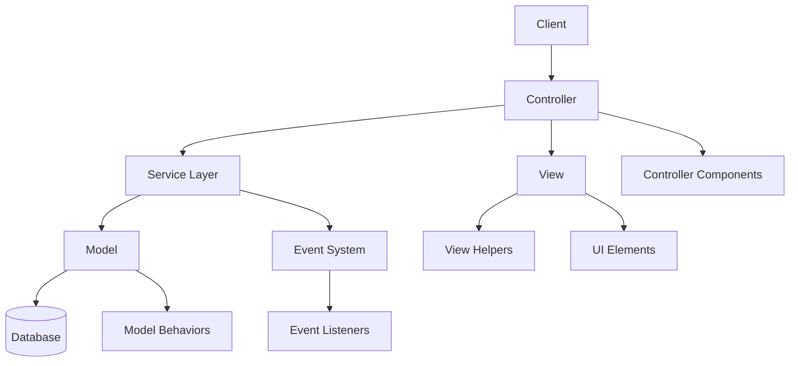
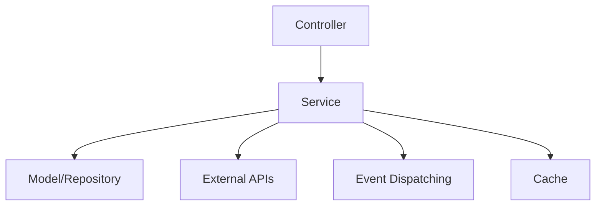
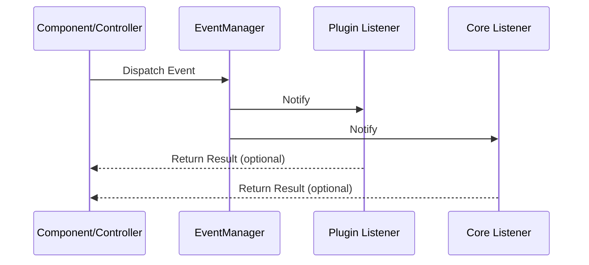
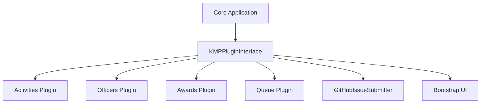
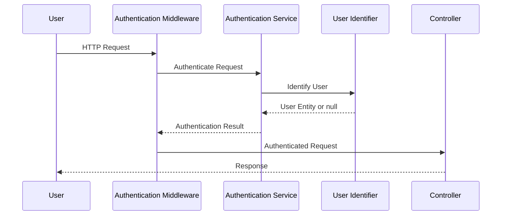
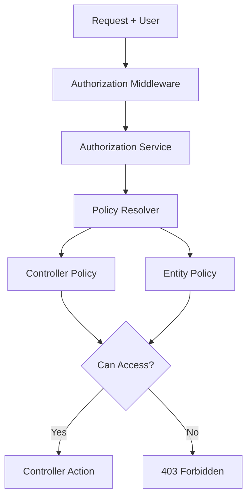
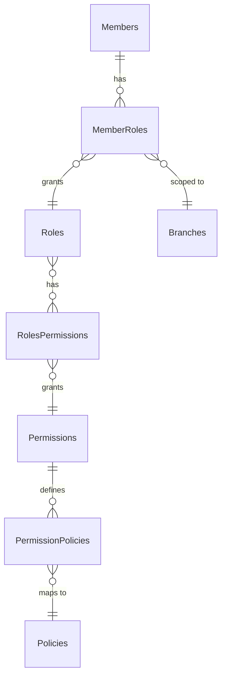
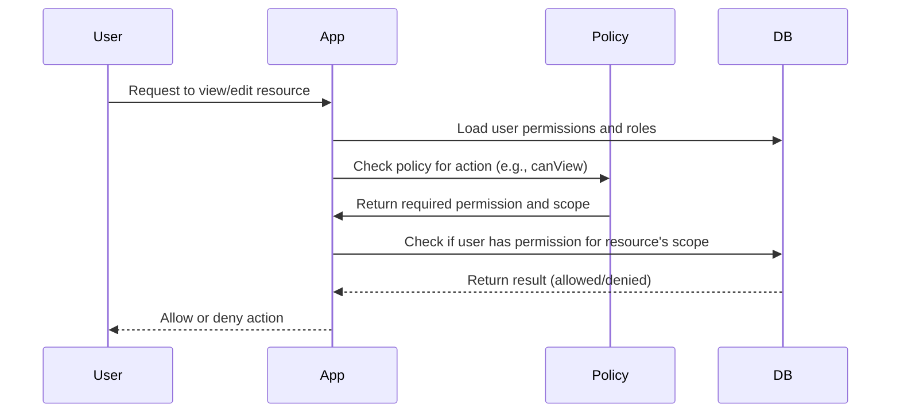

[← Back to Table of Contents](index.md)

# 3. Architecture

This section provides an overview of the KMP application architecture, explaining its structure, components, and design principles.

## 3.1 Application Structure

KMP follows the CakePHP directory structure with additional customizations for plugins and services. Understanding this structure is essential for effective development.

### Directory Structure Overview

```
app/
├── config/             # Configuration files
├── src/                # Core application code
│   ├── Application.php # Main application class
│   ├── Command/        # CLI commands
│   ├── Controller/     # Request controllers
│   ├── Event/          # Event listeners
│   ├── Form/           # Form classes
│   ├── Identifier/     # Authentication identifiers
│   ├── KMP/            # KMP-specific core code
│   ├── Mailer/         # Email templates and logic
│   ├── Model/          # Data models and entities
│   ├── Policy/         # Authorization policies
│   ├── Services/       # Business logic services
│   └── View/           # View templates and helpers
├── assets/             # Source asset files
│   ├── css/            # CSS source files
│   └── js/             # JavaScript source files
│       └── controllers/ # Stimulus controllers
├── plugins/            # Application plugins
│   ├── Activities/     # Activities management
│   ├── Awards/         # Awards management
│   ├── Bootstrap/      # UI components
│   ├── GitHubIssueSubmitter/ # User feedback
│   ├── Officers/       # Officers management
│   └── Queue/          # Background processing
├── templates/          # View templates
└── tests/              # Test cases
```

### MVC+ Implementation

KMP extends the traditional MVC pattern with services and events, creating a more modular and maintainable architecture:



## 3.2 Core Components

KMP extends CakePHP with several core components that provide essential functionality throughout the application.

### Application Class

The `Application.php` class serves as the entry point for the application, handling bootstrapping, middleware configuration, and plugin registration.

Key responsibilities:
- Configuring the dependency injection container
- Loading and initializing plugins
- Setting up authentication and authorization
- Configuring middleware

### Service Layer

KMP implements a service layer pattern to encapsulate business logic:



Key services include:
- **WarrantManager**: Handles warrant processing and lifecycle
- **ActiveWindowManager**: Manages date-bounded entities
- **AuthorizationService**: Custom authorization logic

### Event System

The event system enables loose coupling between components, allowing for extensible architecture:



Common events include:
- Navigation building events
- Entity lifecycle events (before/after save)
- Authentication events
- Cell rendering events

### StaticHelpers

The `StaticHelpers` class provides global utility functions, particularly for managing application settings:

```php
// Example of StaticHelpers usage
StaticHelpers::getAppSetting("KMP.ShortSiteTitle", "KMP", null, true);
```

## 3.3 Plugin System

KMP uses CakePHP's plugin system extensively to organize features into cohesive, maintainable modules.

### Plugin Architecture




Each plugin follows a standard structure:
```
PluginName/
├── config/         # Plugin configuration and migrations
├── src/            # Plugin PHP code
│   ├── Plugin.php  # Main plugin class (recommended name)
│   ├── Controller/ # Plugin controllers
│   ├── Model/      # Plugin models
│   ├── Services/   # Plugin services (including NavigationProvider)
│   ├── Event/      # Event listeners (including CallForCellsHandler)
│   └── View/       # View-related code
├── templates/      # Template files
├── assets/         # Source asset files for the plugin
│   ├── css/        # CSS source files
│   └── js/         # JavaScript source files
│       └── controllers/ # Stimulus controllers (plugin-specific)
└── tests/          # Plugin tests
```

> **Note:** For consistency, always use `Plugin.php` as the main plugin class. For plugin JavaScript, use `plugins/PluginName/assets/js/controllers/` for Stimulus controllers.

### Plugin Registration

Plugins are registered in `config/plugins.php` and loaded in the `Application.php` bootstrap method. Each plugin can specify its migration order for database setup:

```php
'Activities' => [
    'migrationOrder' => 1,
],
'Officers' => [
    'migrationOrder' => 2,
],
'Awards' => [
    'migrationOrder' => 3,
],
```


### Plugin Integration Points

Plugins integrate with the core application through:
1. **NavigationProvider**: Registering navigation items for menus
2. **CallForCellsHandler**: Registering view cells/tabs for UI integration
3. **Events**: Listening for and dispatching events
4. **Services**: Exposing APIs for other plugins

## 3.4 Authentication & Authorization

KMP implements a comprehensive security system based on CakePHP's Authentication and Authorization plugins.

### Authentication Flow



Authentication features:
- Form-based login
- Session persistence
- Remember-me functionality
- Brute force protection
- Password reset flow

### Authorization System

KMP uses a policy-based authorization system with role-based access control (RBAC):



Authorization components:
- **Roles**: Define user types (e.g., Admin, Officer, Member)
- **Permissions**: Specific actions that can be performed
- **Policies**: Rules that determine access based on user and resource
- **Permission Policies**: Dynamic rules for role-based access

The authorization flow evaluates whether a user has permission to perform specific actions on resources, checking both static permissions and dynamic policies.

### Permission and Policy Scoping

KMP supports fine-grained authorization using permissions and policies, with flexible scoping rules to ensure users only see and do what they are allowed to.

#### Permission Scoping

Each permission can be scoped in one of three ways:
- **Global**: Applies everywhere in the system.
- **Branch Only**: Applies only to a specific branch.
- **Branch and Children**: Applies to a branch and all its descendant branches.

#### Policies and Scoping

Policies are mapped to permissions and define what actions a user can perform (e.g., `canView`, `canEdit`). The scoping of a permission determines both:
- **Query Scoping**: What records a user can see (e.g., which branches, members, or warrants).
- **Action Approval**: What actions a user can perform on a given resource.

**How it works:**
- When a user attempts to view or act on a resource, the system checks their permissions and the associated policy.
- If the permission is **global**, the user can see/do the action everywhere.
- If the permission is **branch-scoped**, the system checks if the resource belongs to a branch the user has access to.
- For **branch+children**, the user can see/do the action for the branch and all its descendants.

#### Example: Viewing Warrants
- A user with `Can View Warrants` permission scoped to Branch A can only see warrants in Branch A.
- If the permission is scoped to Branch A and children, the user can see warrants in Branch A and all its sub-branches.

#### Entity Relationship Diagram (ERD)



#### Sequence Diagram: Authorization with Scoping



#### Implementation Notes
- Policies are defined in `src/Policy/` and map to permissions via the `permission_policies` table.
- The `BasePolicy` class handles scoping logic, using the user's permissions and the resource's branch.
- Query scoping is applied in policy `scope*` methods (e.g., `scopeIndex`), filtering results to only those the user is allowed to see.
- Action approval is checked in `can*` methods (e.g., `canView`, `canEdit`), ensuring the user has the right permission for the resource's scope.
