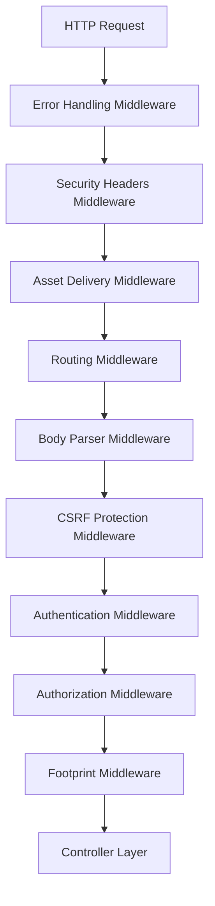
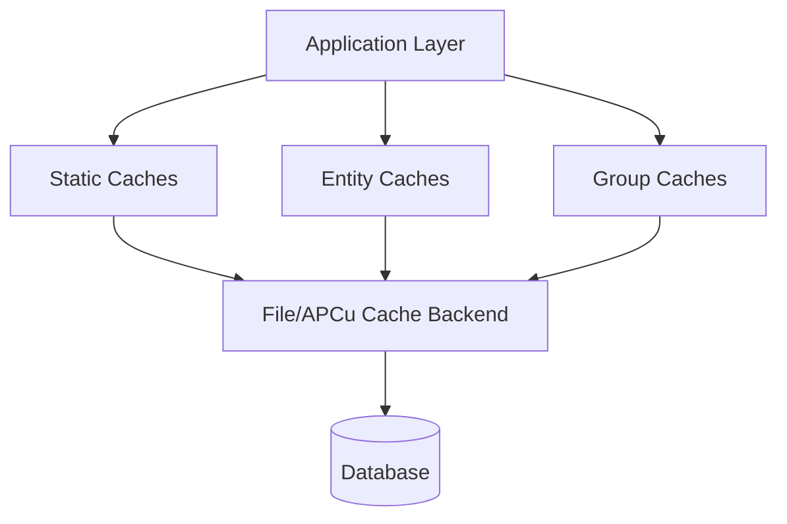
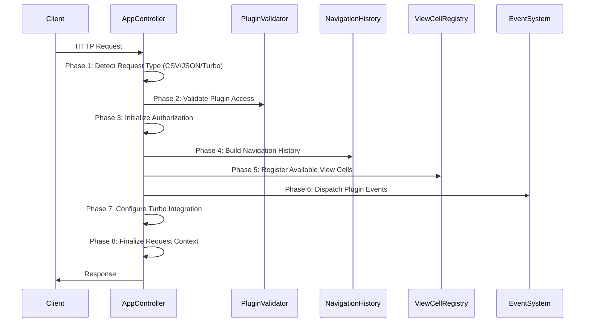
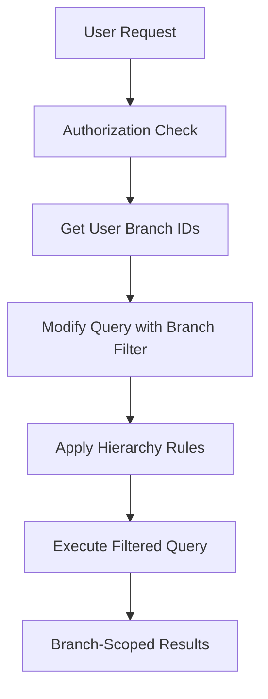
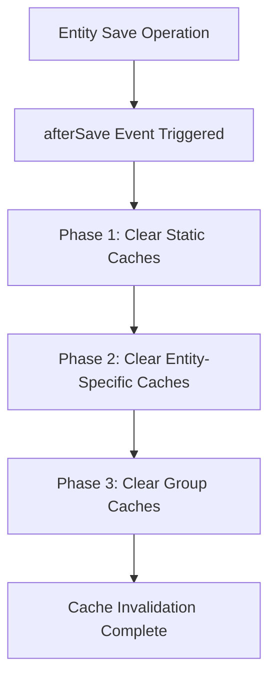
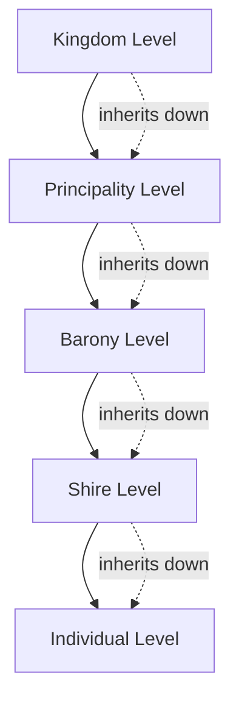
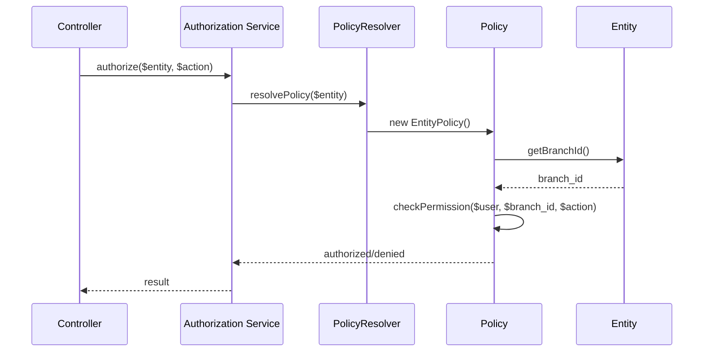
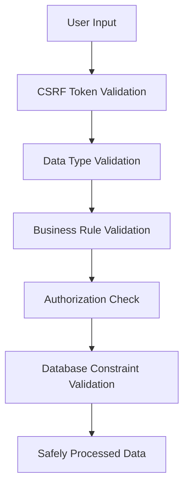
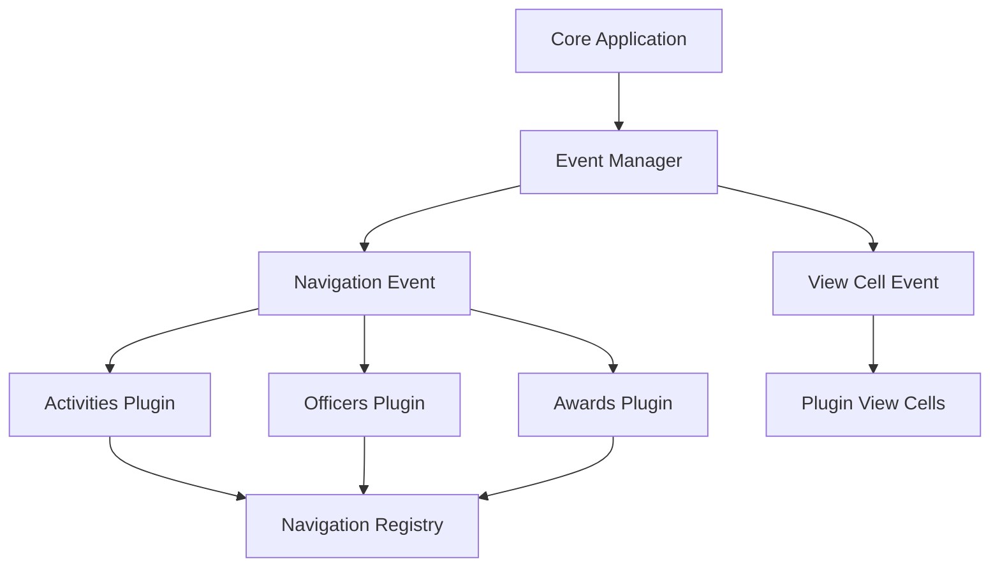

[← Back to Table of Contents](index.md)

# 3.1 Core Foundation Architecture

This document provides detailed architectural insights discovered during the comprehensive code documentation effort, focusing on the foundational patterns and systems that power the Kingdom Management Portal (KMP).

## Table of Contents

1. [Application Bootstrap & Configuration](#application-bootstrap--configuration)
2. [Core Architecture Components](#core-architecture-components)
3. [Cache Management Architecture](#cache-management-architecture)
4. [Authorization & Branch Scoping](#authorization--branch-scoping)
5. [Utility & Helper Systems](#utility--helper-systems)
6. [Performance Patterns](#performance-patterns)
7. [Security Architecture](#security-architecture)

## Application Bootstrap & Configuration

### Application.php - The Foundation

The `Application.php` class serves as the architectural foundation of KMP, implementing a sophisticated multi-tier bootstrap process with comprehensive security and performance considerations.

#### Middleware Stack Architecture

KMP implements a carefully ordered middleware stack for security and functionality:



**Key Architectural Decisions:**
- **Security-First Design**: Multiple security layers before reaching controllers
- **Comprehensive Security Headers**: CSP, HSTS, X-Frame-Options, X-Content-Type-Options
- **Asset Optimization**: Static asset delivery with caching
- **Error Resilience**: Comprehensive error handling with user-friendly messaging
- **Performance Focus**: Efficient middleware ordering to minimize processing overhead

#### Service Container Configuration

KMP uses dependency injection extensively for loose coupling and testability:

```php
// Service Registration Patterns
public function services(ContainerInterface $container): void
{
    $container->add(ActiveWindowManagerInterface::class, DefaultActiveWindowManager::class);
    $container->add(WarrantManagerInterface::class, DefaultWarrantManager::class)
        ->addArgument(ActiveWindowManagerInterface::class);
    $container->add(CsvExportService::class);
    $container->add(ICalendarService::class);
    $container->add(ImpersonationService::class);
}
```

**Container Architecture Benefits:**
- Interface-based programming for flexibility
- Lazy loading of services for performance
- Easy testing through dependency injection
- Plugin extensibility through container configuration

### Configuration Management Strategy

#### Multi-Environment Configuration

KMP implements a sophisticated configuration hierarchy based on CakePHP conventions:

```
Configuration Priority (Highest to Lowest):
1. Environment Variables (e.g., DEBUG, DATABASE_URL)
2. app_local.php (local overrides, not in version control)
3. app.php (default configuration)
4. Plugin-specific configuration files
5. Framework defaults
```

#### Security Configuration Patterns

**Session Security:**
```php
'Session' => [
    'defaults' => 'php',
    'timeout' => 30, // 30 minutes
    'cookie' => 'PHPSESSID',
    'ini' => [
        'session.cookie_secure' => true,
        'session.cookie_httponly' => true,
        'session.cookie_samesite' => 'Strict',
        'session.use_strict_mode' => true,
    ]
]
```

**CSRF Protection:**
```php
'csrfProtection' => [
    'cookieName' => 'csrfToken',
    'secure' => true,
    'httponly' => true,
    'samesite' => 'Strict'
]
```

#### Caching Strategy Architecture

KMP implements a multi-tier caching system optimized for organizational data:



**Cache Configuration Examples:**
```php
// High-performance cache for frequently accessed data
'_cake_core_' => [
    'className' => ApcuEngine::class,
    'prefix' => 'kmp_core_',
    'serialize' => true,
    'duration' => '+1 hours',
]

// Branch structure cache for authorization
'branch_structure' => [
    'className' => FileEngine::class,
    'prefix' => 'kmp_branches_',
    'duration' => '+30 minutes',
]
```

## Core Architecture Components

### BaseController Pattern (AppController)

The `AppController` implements a sophisticated 8-phase request processing pipeline:

#### Processing Pipeline



**Key Architectural Features:**
- **Content Negotiation**: Automatic format detection (CSV, JSON, XML, HTML)
- **Plugin Security**: Validates plugin access using StaticHelpers::pluginEnabled()
- **Navigation History**: Session-based breadcrumb management excluding sensitive operations
- **View Cell Orchestration**: Dynamic UI component registration via events
- **Turbo Integration**: Modern SPA-like experience with frame detection

### BaseTable Pattern

The `BaseTable` class implements a sophisticated data access layer with three-tier cache management:

#### Cache Management Architecture

```php
// Three-tier cache invalidation configuration
protected const CACHES_TO_CLEAR = [
    ['navigation_menu', 'navigation'],
    ['global_stats', 'statistics']
];

protected const ID_CACHES_TO_CLEAR = [
    ['member_profile_', 'members'],
    ['branch_descendants_', 'branch_structure']
];

protected const CACHE_GROUPS_TO_CLEAR = ['security', 'navigation'];
```

**Cache Invalidation Flow:**
1. **Static Caches**: Fixed cache keys cleared on any table change
2. **Entity Caches**: ID-prefixed cache keys cleared when specific entity changes
3. **Group Caches**: Entire cache groups cleared for related data sets

#### Branch Scoping Architecture

KMP implements organizational data isolation through branch scoping:



**Branch Scoping Implementation:**
```php
public function addBranchScopeQuery(Query $query, array $options = []): Query
{
    // Default implementation - child classes can override
    if (isset($this->_schema['branch_id'])) {
        $branchIds = $this->getAuthorizedBranchIds();
        if ($branchIds !== null) {
            return $query->where([$this->getAlias() . '.branch_id IN' => $branchIds]);
        }
    }
    return $query;
}
```

### BaseEntity Pattern

The `BaseEntity` class provides the foundation for all data entities with branch authorization support:

#### Authorization Integration

```php
public function getBranchId(): ?int
{
    // Core pattern - entities must provide their organizational scope
    // Default implementation for entities with direct branch_id
    return $this->branch_id ?? null;
}
```

**Entity Hierarchy Structure:**
```
BaseEntity
├── Branch (self-referential hierarchy, returns $this->id)
├── Member (implements KmpIdentityInterface, returns $this->branch_id)
├── Permission (security entities)
├── ActiveWindowBaseEntity (adds start/expire functionality)
│   ├── MemberRole (time-bounded role assignments)
│   ├── Warrant (warrant assignments)
│   └── WarrantRoster (batch warrant approval containers)
└── Plugin Entities
    ├── Award (Awards plugin)
    ├── Activity (Activities plugin)
    └── Office (Officers plugin)
```

## Cache Management Architecture

### Three-Tier Cache Strategy

KMP implements a sophisticated caching architecture optimized for organizational hierarchies and frequent authorization checks:

#### Tier 1: Static Application Caches

```php
// Application-wide data that changes infrequently
protected const CACHES_TO_CLEAR = [
    ['navigation_items', 'navigation'],
    ['app_settings_cache', 'default'],
    ['plugin_status_cache', 'default']
];
```

**Use Cases:**
- Navigation menu structures
- Application configuration settings
- Plugin availability status
- System-wide statistics

#### Tier 2: Entity-Specific Caches

```php
// Record-specific cached data with ID-based keys
protected const ID_CACHES_TO_CLEAR = [
    ['member_profile_', 'members'],        // member_profile_123
    ['branch_descendants_', 'branch_structure'], // branch_descendants_456
    ['warrant_eligibility_', 'warrants']   // warrant_eligibility_789
];
```

**Use Cases:**
- Member profile data and permissions
- Branch hierarchy relationships (descendants/ancestors)
- Warrant eligibility calculations
- Authorization matrices per user

#### Tier 3: Group-Based Caches

```php
// Related data sets with shared invalidation triggers
protected const CACHE_GROUPS_TO_CLEAR = [
    'security',        // All authorization-related caches
    'navigation',      // All navigation-related caches
    'branch_structure' // All hierarchy-related caches
];
```

**Use Cases:**
- Security and authorization data
- Organizational structure caches
- Navigation and menu data
- Plugin-specific cache groups

### Cache Invalidation Patterns

#### Automatic Invalidation on Entity Save



**Implementation:**
```php
public function afterSave(EventInterface $event, EntityInterface $entity, ArrayObject $options): void
{
    // Phase 1: Static cache clearing
    foreach (static::CACHES_TO_CLEAR as [$key, $config]) {
        Cache::delete($key, $config);
    }
    
    // Phase 2: Entity-specific cache clearing
    if ($entity->id) {
        foreach (static::ID_CACHES_TO_CLEAR as [$prefix, $config]) {
            Cache::delete($prefix . $entity->id, $config);
        }
    }
    
    // Phase 3: Group cache clearing
    foreach (static::CACHE_GROUPS_TO_CLEAR as $group) {
        Cache::clearGroup($group);
    }
}
```

## Authorization & Branch Scoping

### Hierarchical Permission System

KMP implements a sophisticated authorization system based on organizational hierarchy using the PermissionsLoader:

#### Permission Inheritance Model



**Authorization Flow:**
1. **Direct Permissions**: User has explicit permission for specific branch
2. **Inherited Permissions**: Permission granted at parent level includes all child branches
3. **Global Permissions**: Special permissions that bypass branch restrictions
4. **Scope-Based Permissions**: Role-based permissions with specific branch scopes

#### Actual Branch Scoping Implementation

Based on the PermissionsLoader implementation:

```php
// Real permission processing from PermissionsLoader
foreach ($query as $permission) {
    $branch_id = $permission->_matchingData['MemberRoles']->branch_id;
    
    switch ($permission->scoping_rule) {
        case Permission::SCOPE_GLOBAL:          // 'Global'
            // Global permissions have no branch restrictions
            break;
        case Permission::SCOPE_BRANCH_ONLY:     // 'Branch Only'
            $permissions[$permission->id]->branch_ids[] = $branch_id;
            break;
        case Permission::SCOPE_BRANCH_AND_CHILDREN: // 'Branch and Children'
            $descendants = $branchTable->getAllDecendentIds($branch_id);
            $descendants[] = $branch_id;
            $permissions[$permission->id]->branch_ids = $descendants;
            break;
    }
}
```

### Policy-Based Authorization

KMP uses CakePHP's Authorization plugin with custom policy resolution:

#### Policy Resolution Flow



## Utility & Helper Systems

### StaticHelpers Architecture

The `StaticHelpers` class provides 14 core utility methods organized into functional areas:

#### Multi-Layer Configuration System

**Configuration Resolution Hierarchy (from actual implementation):**
```php
public static function getAppSetting(string $key, mixed $default = null, ?string $type = null, bool $useDatabase = true): mixed
{
    // 1. Check CakePHP Configure first (highest priority)
    $value = Configure::read($key);
    if ($value !== null) {
        return $value;
    }
    
    // 2. Check database AppSettings table (if enabled)
    if ($useDatabase) {
        // Database query logic...
    }
    
    // 3. Return default value (lowest priority)
    return $default;
}
```

**Configuration Methods Available:**
- `getAppSetting()` - Single setting retrieval with fallbacks
- `setAppSetting()` - Database setting storage
- `getAppSettingsStartWith()` - Bulk retrieval by prefix
- `pluginEnabled()` - Plugin status checking

#### Template Processing System

**Advanced Template Processing with Nested Property Access:**
```php
// Real template processing from StaticHelpers
$template = "Welcome to {site_title} - Branch: {branch.name}";
$variables = [
    'site_title' => 'Kingdom of Atlantia',
    'branch' => ['name' => 'Barony of Windmasters Hill']
];

// Supports nested property access with array[index] and object.property syntax
$processed = StaticHelpers::processTemplate($template, $variables);
```

**Template Features:**
- **Nested Property Access**: Support for `object.property` and `array[index]` syntax
- **Default Values**: Fallback values for missing variables
- **Type Safety**: Automatic type conversion and validation
- **Security**: XSS prevention through proper escaping

#### File and Image Processing

**Comprehensive File Operations:**
```php
// Directory management with proper error handling
StaticHelpers::ensureDirectoryExists('/path/to/dir', 0755);

// Image scaling with aspect ratio preservation
$scaledPath = StaticHelpers::saveScaledImage(
    'source.jpg',      // Source image
    200, 200,         // Max dimensions
    '/uploads/',      // Source directory
    '/thumbs/'        // Destination directory
);

// Safe file deletion with existence checking
StaticHelpers::deleteFile('/path/to/file.txt');
```

## Performance Patterns

### Query Optimization Strategies

#### Efficient Association Loading

Based on actual KMP controller patterns:

```php
// Optimized member loading from BranchesController
$branch = $this->Branches->get($id, [
    'contain' => [
        'Parent',
        'Members' => function ($q) {
            return $q
                ->select(['id', 'sca_name', 'branch_id', 'membership_number', 
                         'membership_expires_on', 'status', 'birth_month', 'birth_year'])
                ->orderBy(['sca_name' => 'ASC']);
        }
    ]
]);
```

#### Cached Hierarchy Queries

**Branch Hierarchy Caching for O(1) Authorization (from BranchesTable):**
```php
public function getAllDecendentIds($id): array
{
    $descendants = Cache::read('descendants_' . $id, 'branch_structure');
    if (!$descendants) {
        $descendants = $this->getDescendantsLookup();
        foreach ($descendants as $key => $value) {
            Cache::write('descendants_' . $key, $value, 'branch_structure');
        }
        $descendants = $descendants[$id] ?? [];
    }
    return $descendants ?? [];
}
```

### Memory Management

#### Stream-Based Processing (from CsvExportService)

```php
public function exportFromQuery(Query $query, array $headers, ?callable $rowMapper = null): Response
{
    $response = new Response();
    $response = $response->withType('csv');
    
    $body = new CallbackStream(function () use ($query, $headers, $rowMapper) {
        $output = fopen('php://output', 'w');
        fputcsv($output, $headers);
        
        foreach ($query->enableBufferedResults(false) as $entity) {
            $row = $rowMapper ? $rowMapper($entity) : $entity->toArray();
            fputcsv($output, $row);
        }
        fclose($output);
    });
    
    return $response->withBody($body);
}
```

## Security Architecture

### Input Validation & Sanitization

#### Multi-Layer Validation Pipeline



#### XSS Prevention

**Automatic Output Escaping:**
```php
// Template output escaping (KMP standard)
echo h($user->sca_name); // Escaped output

// Safe HTML generation
echo $this->Html->link(
    h($branch->name),
    ['controller' => 'Branches', 'action' => 'view', $branch->id]
);
```

### Authentication Security

#### Session Security Configuration

**Actual Session Configuration from app.php:**
```php
'Session' => [
    'defaults' => 'php',
    'timeout' => 30, // 30 minutes
    'cookie' => 'PHPSESSID',
    'ini' => [
        'session.cookie_secure' => true,
        'session.cookie_httponly' => true,
        'session.cookie_samesite' => 'Strict',
        'session.use_strict_mode' => true,
    ]
]
```

#### Security Headers Implementation

**Comprehensive Security Headers (from Application.php middleware):**
```php
$response = $response
    ->withHeader('X-Content-Type-Options', 'nosniff')
    ->withHeader('X-Frame-Options', 'SAMEORIGIN')
    ->withHeader('X-XSS-Protection', '1; mode=block')
    ->withHeader('Referrer-Policy', 'strict-origin-when-cross-origin')
    ->withHeader('Content-Security-Policy', $cspHeader);
```

## Integration Patterns

### Plugin Integration Architecture

**Event-Driven Plugin System:**


### Service Integration Pattern

**Dependency Injection Service Configuration:**
```php
// Real service integration from Application.php
public function services(ContainerInterface $container): void
{
    $container->add(ActiveWindowManagerInterface::class, DefaultActiveWindowManager::class);
    
    $container->add(WarrantManagerInterface::class, DefaultWarrantManager::class)
        ->addArgument(ActiveWindowManagerInterface::class);
        
    $container->add(CsvExportService::class);
    $container->add(ICalendarService::class);
    $container->add(ImpersonationService::class);
}
```

This foundational architecture provides the robust, scalable, and secure foundation that powers all of KMP's advanced features and organizational management capabilities.

---

**Next:** [Core Modules](4-core-modules.md) | **Previous:** [Architecture Overview](3-architecture.md)
