# 3.5 Entity Relationship Diagrams

## Overview

This document provides comprehensive Entity Relationship (ER) diagrams for the KMP (Kingdom Management Platform) database schema. The diagrams illustrate the complex relationships between entities across the core system and plugin extensions.

## Core System ER Diagram

### Members and Authentication

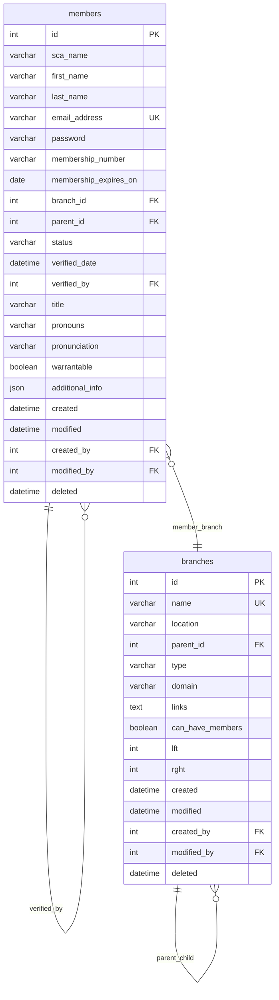

### Role-Based Access Control (RBAC)

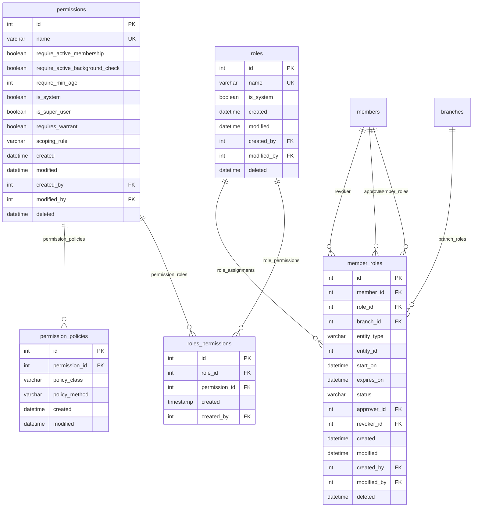

### Warrant System

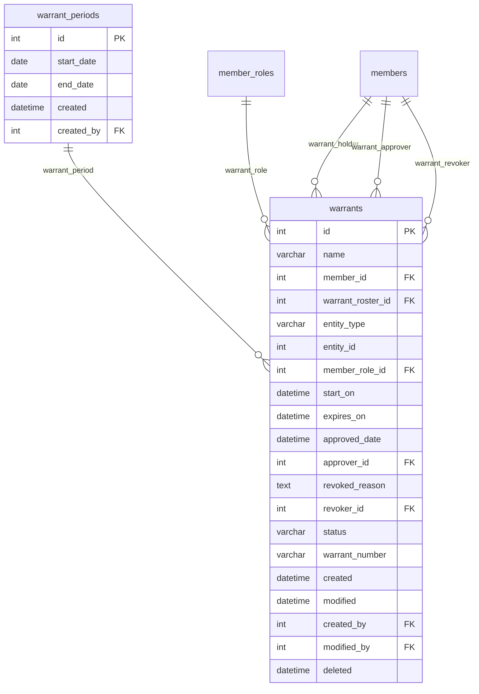

### Notes and Configuration

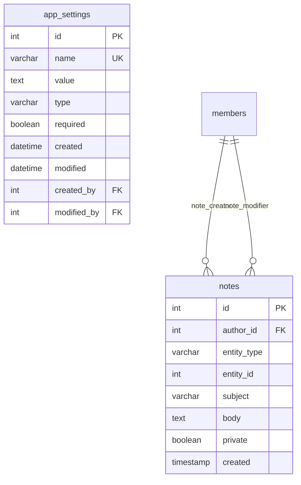

## Officers Plugin ER Diagram

### Organizational Structure

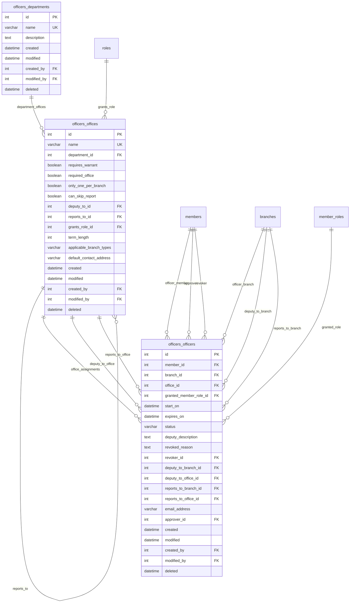

## Awards Plugin ER Diagram

### Award Classification System

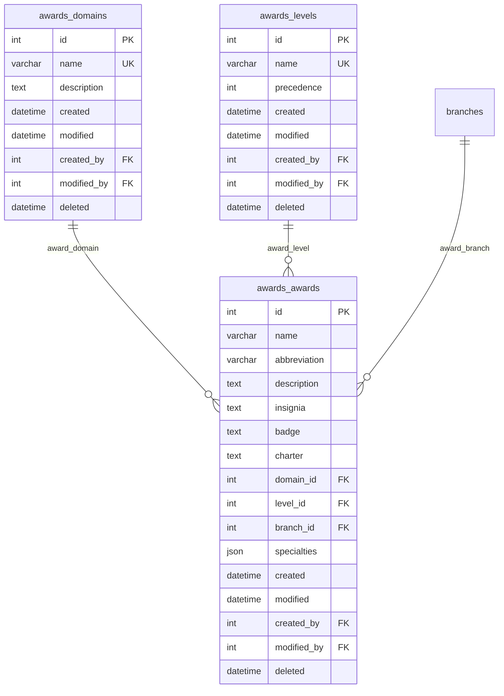

### Recommendation and Event System

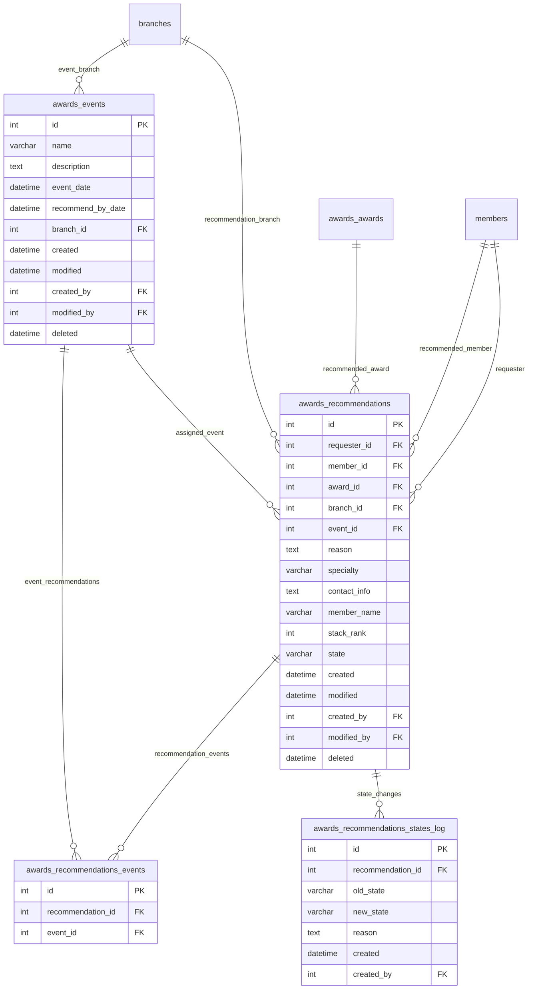

## Activities Plugin ER Diagram

### Activity Authorization System

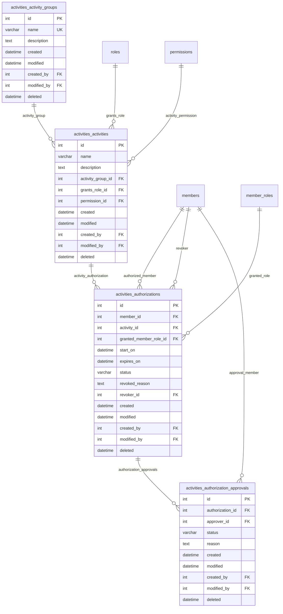

## System Integration Diagram

### Cross-Plugin Relationships

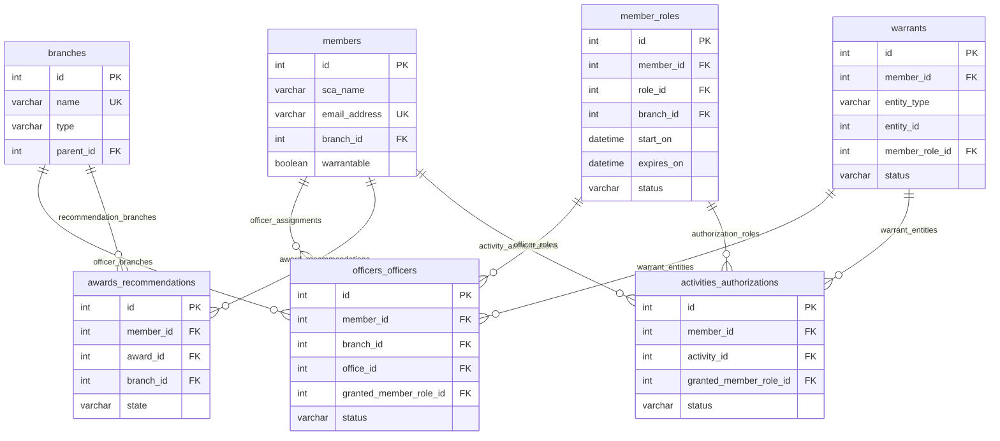

## Temporal Relationship Patterns

### ActiveWindow Entities

Many entities in KMP use the ActiveWindow pattern for temporal management:

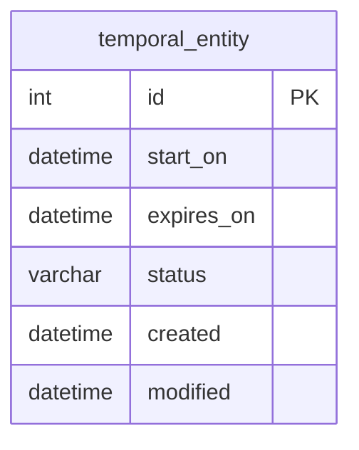

**Status Lifecycle**:
1. `new`: Created but not yet active
2. `upcoming`: Future activation date set
3. `current`: Currently active (between start_on and expires_on)
4. `expired`: Past expiration date
5. `revoked`: Manually terminated before expiration

### Audit Trail Pattern

All major entities include comprehensive audit trails:

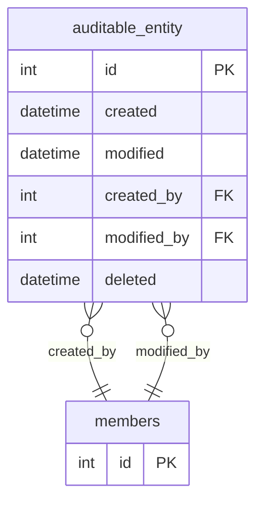

## Polymorphic Relationships

### Notes System

The notes system uses polymorphic associations to attach to any entity:

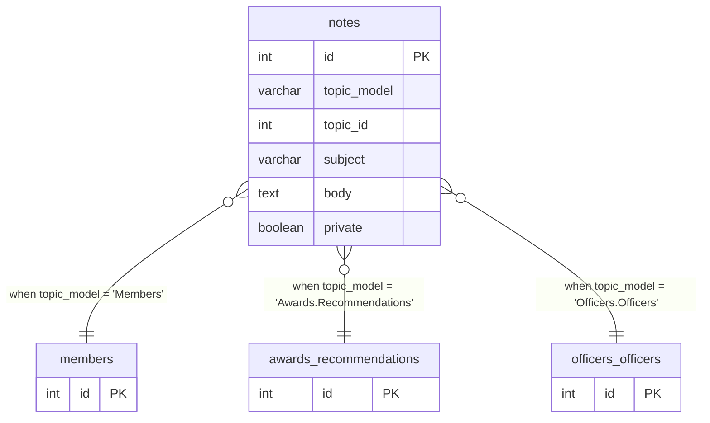

### Warrant System

Warrants can be assigned to various entity types:

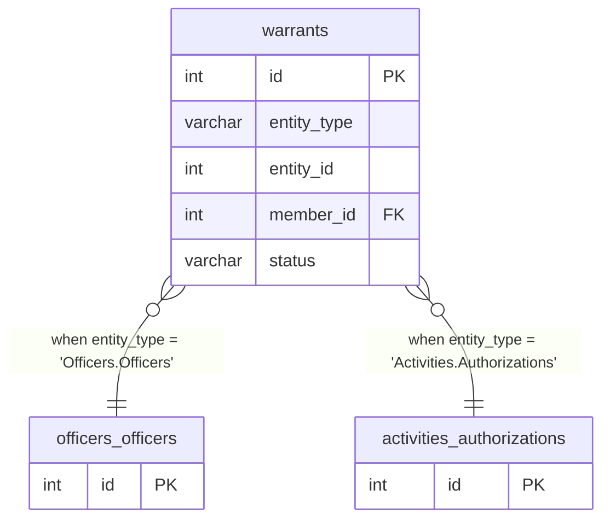

## JSON Field Structures

### Branch Links Configuration

```json
{
  "website": "https://branch.example.com",
  "facebook": "https://facebook.com/branchpage",
  "calendar": "https://calendar.google.com/...",
  "newsletter": "https://newsletter.example.com"
}
```

### Member Additional Information

```json
{
  "emergency_contact": {
    "name": "Jane Doe",
    "phone": "555-0123",
    "relationship": "spouse"
  },
  "dietary_restrictions": ["vegetarian", "nut allergy"],
  "interests": ["archery", "cooking", "music"],
  "awards_received": []
}
```

### Office Branch Type Constraints

```json
["Local", "College", "Household"]
```

### Award Specialties

```json
{
  "archery": ["target", "combat", "mounted"],
  "arts_sciences": ["cooking", "scribal", "clothing"],
  "service": ["event_steward", "officer", "teaching"]
}
```

## Database Design Principles

### 1. Referential Integrity

- All foreign key relationships properly constrained
- Cascade deletes for junction tables
- Soft deletes for entity tables to preserve history

### 2. Temporal Consistency

- ActiveWindow pattern ensures consistent temporal behavior
- Status fields automatically maintained based on dates
- Lifecycle transitions properly validated

### 3. Hierarchical Data

- Branch hierarchy using nested set model for efficient queries
- Self-referential relationships for office hierarchies
- Parent-child relationships for member management

### 4. Extensibility

- JSON fields for flexible configuration
- Polymorphic relationships for cross-cutting concerns
- Plugin-based schema extensions

### 5. Performance Optimization

- Comprehensive indexing strategy
- Efficient query patterns for common operations
- Caching integration for frequently accessed data

---

*These ER diagrams represent the complete KMP database schema as of the current version. For implementation details, refer to the Database Schema Documentation and Migration Documentation.*
