# 3.5 Database Schema & Entity Relationship Diagrams

## Overview

This document provides comprehensive database schema documentation for the KMP (Kingdom Management Platform), including detailed Entity Relationship (ER) diagrams, SQL schema definitions, and architectural patterns. The schema implements a sophisticated data model supporting organizational management for SCA (Society for Creative Anachronism) branches with hierarchical data, temporal relationships, role-based access control, and comprehensive audit trails.

## Schema Architecture

### Core Design Principles

- **Hierarchical Organization**: Support for branch hierarchies using nested set model
- **Temporal Data Management**: ActiveWindow pattern for time-bounded entities  
- **Role-Based Access Control**: Comprehensive RBAC with permissions and policies
- **Audit Trail**: Complete change tracking with user attribution
- **Soft Deletion**: Data preservation with logical deletion support
- **JSON Field Support**: Flexible data structures for complex configurations
- **Plugin Extensibility**: Standardized patterns for plugin database extensions

### Database Technologies

- **Primary Database**: MySQL/MariaDB with InnoDB engine
- **Migration Framework**: Phinx migrations via CakePHP
- **Schema Management**: CakePHP ORM with comprehensive associations
- **JSON Support**: Native JSON fields with database-level operations
- **Session Storage**: PHP file-based session management (`defaults` => `php`)

## Core System Schema & ER Diagrams

### Members and Authentication

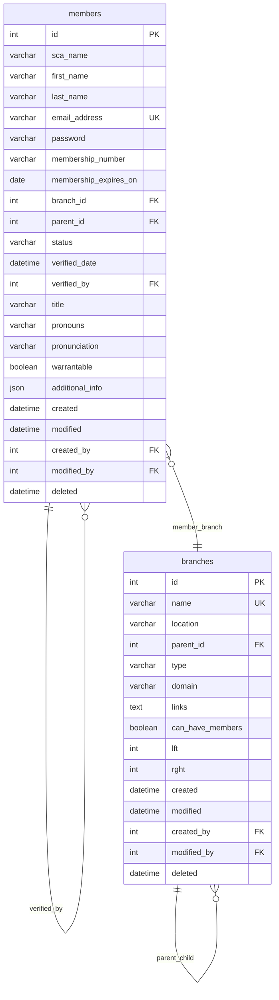

### Role-Based Access Control (RBAC)

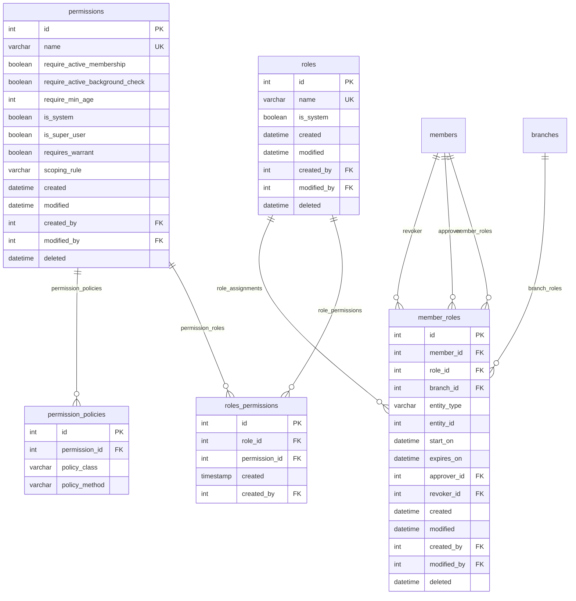

### Warrant System

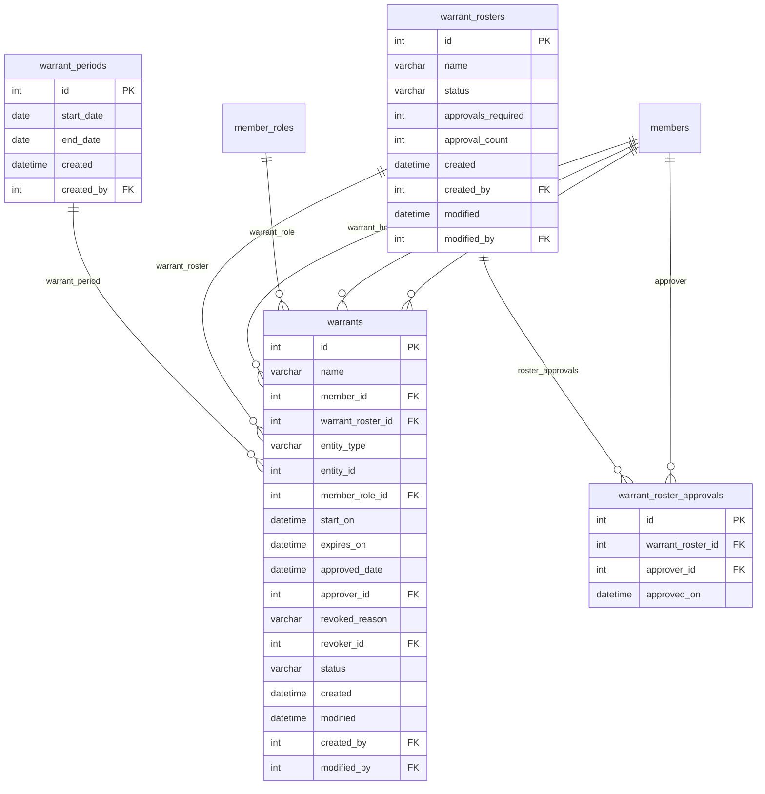

### Notes and Configuration

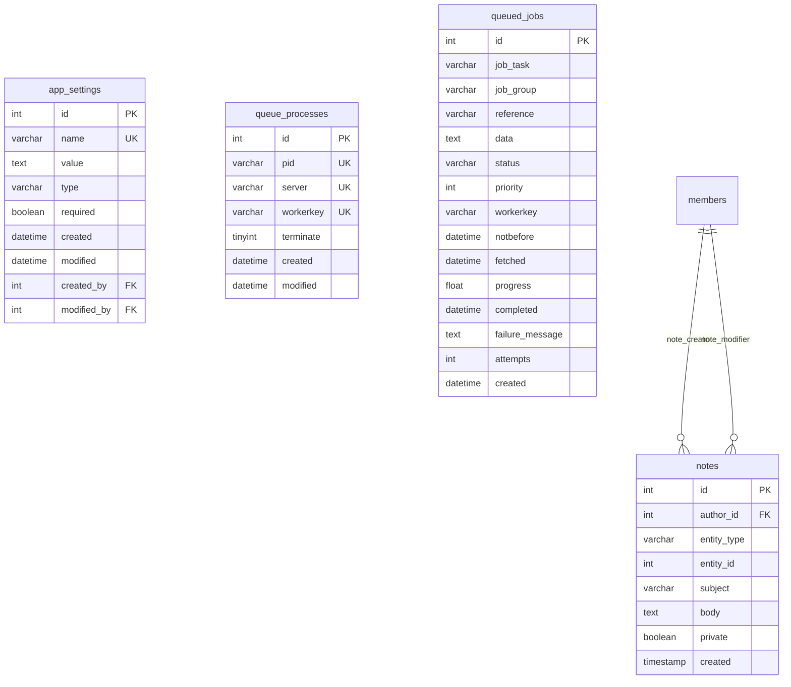

## Detailed SQL Schema Definitions

### 1. Core Member Management

#### `members` Table
Primary entity for member management and authentication.

```sql
CREATE TABLE members (
    id INT(11) AUTO_INCREMENT PRIMARY KEY,
    password VARCHAR(512) NOT NULL,
    sca_name VARCHAR(50) NOT NULL,
    first_name VARCHAR(30) NOT NULL,
    middle_name VARCHAR(30) NULL,
    last_name VARCHAR(30) NOT NULL,
    street_address VARCHAR(75) NULL,
    city VARCHAR(30) NULL,
    state VARCHAR(2) NULL,
    zip VARCHAR(5) NULL,
    phone_number VARCHAR(15) NULL,
    email_address VARCHAR(50) NOT NULL,
    membership_number VARCHAR(50) NULL,
    membership_expires_on DATE NULL,
    branch_id INT(11) NULL,
    background_check_expires_on DATE NULL,
    status VARCHAR(20) DEFAULT 'active',
    verified_date DATETIME NULL,
    verified_by INT(11) NULL,
    parent_id INT(11) NULL,
    mobile_card_token VARCHAR(255) NULL,
    password_token VARCHAR(255) NULL,
    password_token_expires_on DATETIME NULL,
    last_login DATETIME NULL,
    last_failed_login DATETIME NULL,
    failed_login_attempts INT(2) NULL,
    birth_month INT(11) NULL,
    birth_year INT(11) NULL,
    additional_info VARCHAR(255) NOT NULL DEFAULT '{}',
    membership_card_path VARCHAR(256) NULL,
    title VARCHAR(255) NULL,              -- Added via migration
    pronouns VARCHAR(50) NULL,            -- Added via migration
    pronunciation VARCHAR(255) NULL,      -- Added via migration
    warrantable BOOLEAN DEFAULT false,    -- Added via migration
    created DATETIME NOT NULL,
    modified DATETIME NULL,
    created_by INT(11) NULL,
    modified_by INT(11) NULL,
    deleted DATETIME NULL,
    
    INDEX idx_email (email_address),
    INDEX idx_sca_name (sca_name),
    INDEX idx_membership (membership_number),
    INDEX idx_branch (branch_id),
    INDEX idx_parent (parent_id),
    INDEX idx_status (status),
    INDEX idx_deleted (deleted),
    
    FOREIGN KEY (branch_id) REFERENCES branches(id),
    FOREIGN KEY (parent_id) REFERENCES members(id),
    FOREIGN KEY (verified_by) REFERENCES members(id)
);
```

**Key Features:**
- **Authentication**: Password hashing and token-based password reset
- **Profile Information**: Complete member profiles with contact details
- **Hierarchical Support**: Parent-child relationships for minors
- **Membership Tracking**: SCA membership number and expiration dates
- **Security Features**: Failed login tracking and account verification
- **JSON Configuration**: Flexible additional_info field for extensibility
- **Audit Trail**: Complete creation and modification tracking

#### `branches` Table
Hierarchical organizational structure using nested set model.

```sql
CREATE TABLE branches (
    id INT(11) AUTO_INCREMENT PRIMARY KEY,
    name VARCHAR(128) NOT NULL UNIQUE,
    location VARCHAR(128) NOT NULL,
    parent_id INT(11) NULL,
    links TEXT NULL,                      -- External links and resources 
    can_have_members BOOLEAN NOT NULL DEFAULT true,
    type VARCHAR(50) NULL,                -- Added via migration
    domain VARCHAR(255) NULL,             -- Added via migration
    lft INT(11) NULL,                     -- Nested set left value
    rght INT(11) NULL,                    -- Nested set right value
    created DATETIME NOT NULL,
    modified DATETIME NULL,
    created_by INT(11) NULL,
    modified_by INT(11) NULL,
    deleted DATETIME NULL,
    
    INDEX idx_name (name),
    INDEX idx_parent (parent_id),
    INDEX idx_lft (lft),
    INDEX idx_rght (rght),
    INDEX idx_type (type),
    INDEX idx_deleted (deleted),
    
    FOREIGN KEY (parent_id) REFERENCES branches(id)
);
```

### 2. Role-Based Access Control (RBAC)

#### `roles` Table

```sql
CREATE TABLE roles (
    id INT(11) AUTO_INCREMENT PRIMARY KEY,
    name VARCHAR(255) NOT NULL UNIQUE,
    is_system BOOLEAN NOT NULL DEFAULT false,
    created DATETIME NOT NULL,
    modified DATETIME NULL,
    created_by INT(11) NULL,
    modified_by INT(11) NULL,
    deleted DATETIME NULL,
    
    INDEX idx_name (name),
    INDEX idx_system (is_system),
    INDEX idx_deleted (deleted)
);
```

#### `permissions` Table

```sql
CREATE TABLE permissions (
    id INT(11) AUTO_INCREMENT PRIMARY KEY,
    name VARCHAR(255) NOT NULL UNIQUE,
    require_active_membership BOOLEAN NOT NULL DEFAULT false,
    require_active_background_check BOOLEAN NOT NULL DEFAULT false,
    require_min_age INT(2) NOT NULL DEFAULT 0,
    is_system BOOLEAN NOT NULL DEFAULT false,
    is_super_user BOOLEAN NOT NULL DEFAULT false,
    requires_warrant BOOLEAN NOT NULL DEFAULT false,
    scoping_rule VARCHAR(255) NOT NULL DEFAULT 'Global',  -- Added via migration
    created DATETIME NOT NULL,
    modified DATETIME NULL,
    created_by INT(11) NULL,
    modified_by INT(11) NULL,
    deleted DATETIME NULL,
    
    INDEX idx_name (name),
    INDEX idx_system (is_system),
    INDEX idx_super_user (is_super_user),
    INDEX idx_warrant (requires_warrant),
    INDEX idx_deleted (deleted)
);
```

#### `member_roles` Table
Temporal role assignments with ActiveWindow behavior.

```sql
CREATE TABLE member_roles (
    id INT(11) AUTO_INCREMENT PRIMARY KEY,
    member_id INT(11) NOT NULL,
    role_id INT(11) NOT NULL,
    entity_type VARCHAR(255) NULL,       -- Renamed from granting_model in migration
    entity_id INT(11) NULL,              -- Renamed from granting_id in migration
    branch_id INT(11) NULL,              -- Added via migration for scoping
    start_on DATETIME DEFAULT CURRENT_TIMESTAMP,
    expires_on DATETIME NULL,
    -- status field is virtual (computed from ActiveWindowBaseEntity)
    approver_id INT(11) NOT NULL,
    revoker_id INT(11) NULL,
    created DATETIME NOT NULL,
    modified DATETIME NULL,
    created_by INT(11) NULL,
    modified_by INT(11) NULL,
    deleted DATETIME NULL,
    
    INDEX idx_member (member_id),
    INDEX idx_role (role_id),
    INDEX idx_branch (branch_id),
    INDEX idx_entity (entity_type, entity_id),
    INDEX idx_start_on (start_on),
    INDEX idx_expires_on (expires_on),
    INDEX idx_deleted (deleted),
    
    FOREIGN KEY (member_id) REFERENCES members(id),
    FOREIGN KEY (role_id) REFERENCES roles(id),
    FOREIGN KEY (branch_id) REFERENCES branches(id),
    FOREIGN KEY (approver_id) REFERENCES members(id),
    FOREIGN KEY (revoker_id) REFERENCES members(id)
);
```

**Note**: The `status` field is not a physical database column but is computed dynamically by the `ActiveWindowBaseEntity` class based on the `start_on` and `expires_on` dates.

### 3. Additional Core Tables

#### `app_settings` Table

```sql
CREATE TABLE app_settings (
    id INT(11) AUTO_INCREMENT PRIMARY KEY,
    name VARCHAR(255) NOT NULL UNIQUE,
    value TEXT NULL,                      -- Always TEXT field
    type VARCHAR(255) NULL,               -- Added via migration
    required BOOLEAN DEFAULT false,       -- Added via migration
    created DATETIME NOT NULL,
    modified DATETIME NULL,
    created_by INT(11) NULL,
    modified_by INT(11) NULL,
    
    INDEX idx_name (name),
    INDEX idx_required (required)
);
```

#### `notes` Table
Polymorphic notes system.

```sql
CREATE TABLE notes (
    id INT(11) AUTO_INCREMENT PRIMARY KEY,
    author_id INT(11) NOT NULL,
    entity_type VARCHAR(255) NULL,     -- Renamed from topic_model
    entity_id INT(11) NOT NULL,        -- Renamed from topic_id  
    subject VARCHAR(255) NULL,
    body TEXT NULL,
    private BOOLEAN NOT NULL DEFAULT false,
    created TIMESTAMP NOT NULL DEFAULT CURRENT_TIMESTAMP,
    
    INDEX idx_entity (entity_type, entity_id),
    INDEX idx_private (private),
    
    FOREIGN KEY (author_id) REFERENCES members(id)
);
```

#### `warrants` Table

```sql
CREATE TABLE warrants (
    id INT(11) AUTO_INCREMENT PRIMARY KEY,
    name VARCHAR(255) NOT NULL,
    member_id INT(11) NOT NULL,
    warrant_roster_id INT(11) NOT NULL,
    entity_type VARCHAR(255) NULL,
    entity_id INT(11) NOT NULL,
    member_role_id INT(11) NULL,
    expires_on DATETIME NULL,
    start_on DATETIME NULL,
    approved_date DATETIME NULL,
    approver_id INT(11) NULL,
    revoked_reason VARCHAR(255) NULL,
    revoker_id INT(11) NULL,
    status VARCHAR(20) DEFAULT 'Pending',
    created DATETIME NOT NULL,
    modified DATETIME NULL,
    created_by INT(11) NULL,
    modified_by INT(11) NULL,
    
    INDEX idx_member (member_id),
    INDEX idx_entity (entity_type, entity_id),
    INDEX idx_status (status),
    INDEX idx_start_on (start_on),
    INDEX idx_expires_on (expires_on),
    
    FOREIGN KEY (member_id) REFERENCES members(id),
    FOREIGN KEY (member_role_id) REFERENCES member_roles(id),
    FOREIGN KEY (warrant_roster_id) REFERENCES warrant_rosters(id)
);
```

## Plugin Schema Extensions

## Officers Plugin ER Diagram

### Organizational Structure

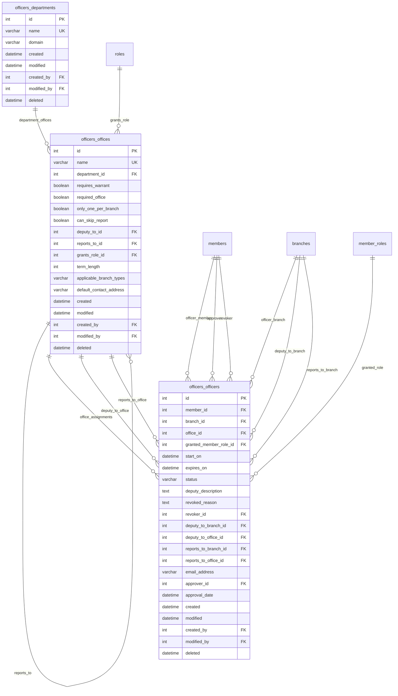

## Awards Plugin ER Diagram

### Award Classification System

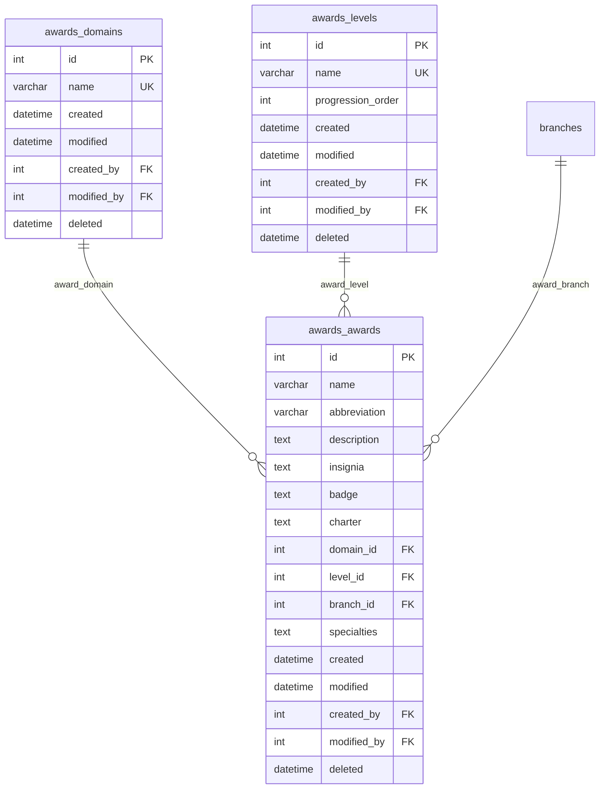

### Recommendation and Event System

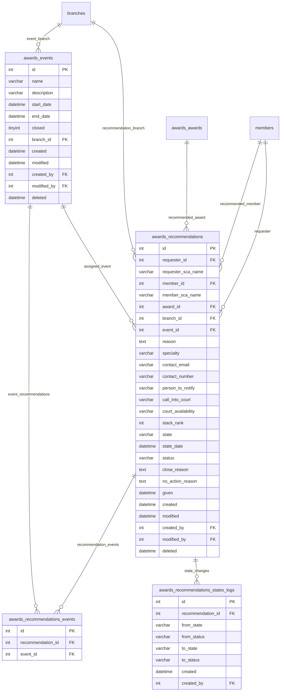

## Activities Plugin ER Diagram

### Activity Authorization System

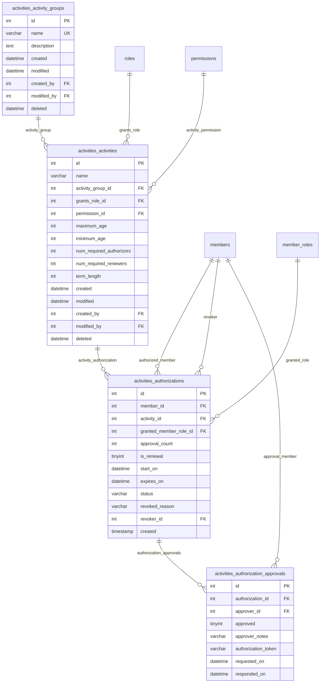

## System Integration Diagram

### Cross-Plugin Relationships

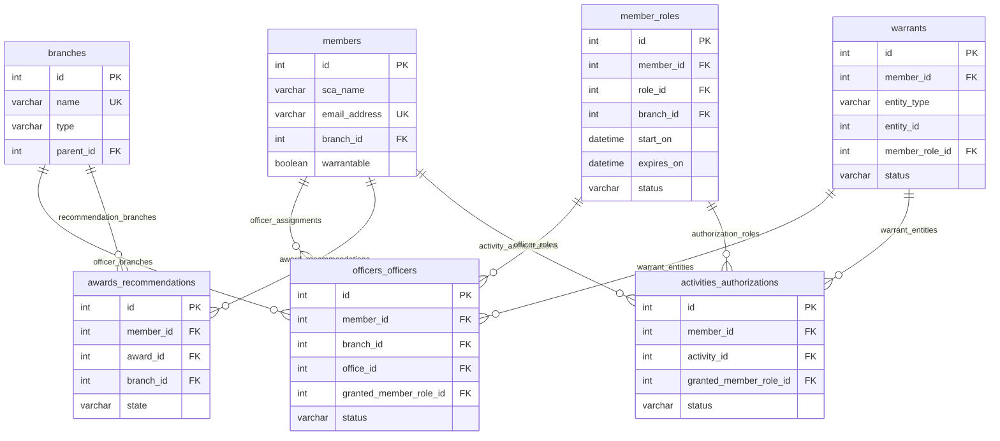

## Temporal Relationship Patterns

### ActiveWindow Entities

Many entities in KMP use the ActiveWindow pattern for temporal management:

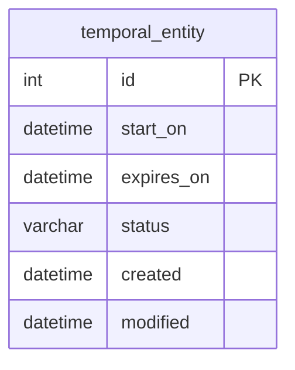

**Status Lifecycle**:
1. `new`: Created but not yet active
2. `upcoming`: Future activation date set
3. `current`: Currently active (between start_on and expires_on)
4. `expired`: Past expiration date
5. `revoked`: Manually terminated before expiration

### Audit Trail Pattern

All major entities include comprehensive audit trails:

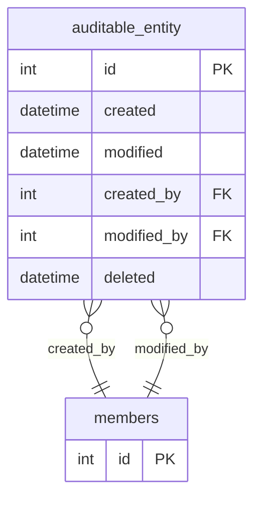

## Polymorphic Relationships

### Notes System

The notes system uses polymorphic associations to attach to any entity:

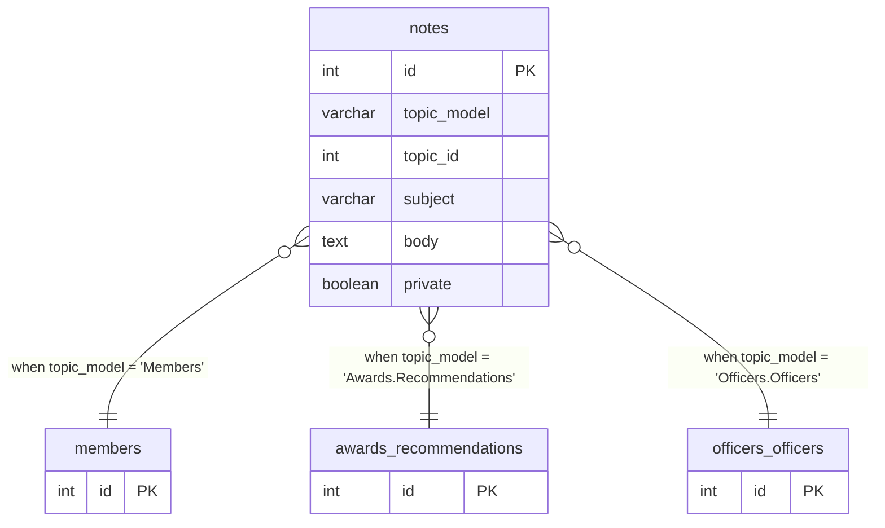

### Warrant System

Warrants can be assigned to various entity types:

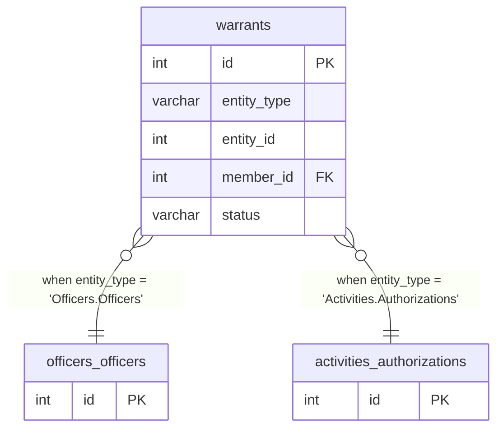

## JSON Field Structures

### Branch Links Configuration

```json
{
  "website": "https://branch.example.com",
  "facebook": "https://facebook.com/branchpage",
  "calendar": "https://calendar.google.com/...",
  "newsletter": "https://newsletter.example.com"
}
```

### Member Additional Information

```json
{
  "emergency_contact": {
    "name": "Jane Doe",
    "phone": "555-0123",
    "relationship": "spouse"
  },
  "dietary_restrictions": ["vegetarian", "nut allergy"],
  "interests": ["archery", "cooking", "music"],
  "awards_received": []
}
```

### Office Branch Type Constraints

```json
["Local", "College", "Household"]
```

### Award Specialties

```json
{
  "archery": ["target", "combat", "mounted"],
  "arts_sciences": ["cooking", "scribal", "clothing"],
  "service": ["event_steward", "officer", "teaching"]
}
```

## Database Design Principles

### 1. Referential Integrity

- All foreign key relationships properly constrained
- Cascade deletes for junction tables
- Soft deletes for entity tables to preserve history

### 2. Temporal Consistency

- ActiveWindow pattern ensures consistent temporal behavior
- Status fields automatically maintained based on dates
- Lifecycle transitions properly validated

### 3. Hierarchical Data

- Branch hierarchy using nested set model for efficient queries
- Self-referential relationships for office hierarchies
- Parent-child relationships for member management

### 4. Extensibility

- JSON fields for flexible configuration
- Polymorphic relationships for cross-cutting concerns
- Plugin-based schema extensions

### 5. Performance Optimization

- Comprehensive indexing strategy
- Efficient query patterns for common operations
- Caching integration for frequently accessed data

## Advanced Schema Patterns

### 1. ActiveWindow Pattern

Many tables implement the ActiveWindow pattern for temporal data management:

```php
// Common ActiveWindow fields
start_on DATETIME NULL,      // When the record becomes active
expires_on DATETIME NULL,    // When the record expires
status VARCHAR(20) DEFAULT 'new',  // Current lifecycle status
```

**Status Values:**
- `new`: Newly created, not yet active
- `current`: Currently active (between start_on and expires_on)
- `upcoming`: Future activation (start_on in future)
- `expired`: Past expiration (expires_on in past)
- `revoked`: Manually revoked before expiration

**Implementation Note**: The `status` field is not stored in the database but is computed dynamically by the `ActiveWindowBaseEntity` class. Entities that extend this base class (like `MemberRole`, `Officer`, `Authorization`) inherit this virtual status calculation.

### 2. Audit Trail Pattern

All major tables include comprehensive audit trails:

```php
// Standard audit fields
created DATETIME NOT NULL,
modified DATETIME NULL,
created_by INT(11) NULL,
modified_by INT(11) NULL,
deleted DATETIME NULL,      // Soft deletion timestamp
```

### 3. JSON Field Pattern

Several tables use JSON fields for flexible configuration:

```php
// Examples of JSON field usage
additional_info VARCHAR(255) DEFAULT '{}', // Member additional data
specialties JSON NULL,             // Award specialty classifications
```

### 4. Polymorphic Associations

The Notes system and MemberRoles table implement polymorphic associations:

```php
// Examples of polymorphic field usage
entity_type VARCHAR(255) NULL,     // Entity class name
entity_id INT(11) NOT NULL,        // Entity ID
```

### 5. Hierarchical Data

The Branches table uses the Nested Set Model for efficient hierarchy queries:

```php
parent_id INT(11) NULL,           // Direct parent reference
lft INT(11) NULL,                 // Nested set left boundary
rght INT(11) NULL,                // Nested set right boundary
```

## Migration History

The schema has evolved through comprehensive migrations:

1. **Initial Schema** (`20230511170042_Init.php`): Core tables and relationships
2. **View Permissions** (`20241001141705_AddViewMembersPermission.php`): Permission system enhancement
3. **Member Extensions** (`20241009145957_AddTitlePronounsPronunciationToMembers.php`): Profile enhancements
4. **Settings Restructure** (`20241024125311_ChangeAppSettingValueToText.php`): Configuration format change
5. **Warrant System** (`20241204160759_Warrants.php`): Complete warrant management system
6. **Member Warrantability** (`20241207172311_AddWarrantableToMembers.php`): Warrant eligibility tracking
7. **Join Field Refactor** (`20241225192403_RefactorAgnosticJoinFields.php`): Association improvements
8. **Branch Types** (`20241231164137_AddTypeToBranches.php`): Organizational classification
9. **Required Settings** (`20250108190610_AddRequiredToAppSetting.php`): Configuration validation
10. **Role Scoping** (`20250227173909_AddScopeToMemberRoles.php`): Role assignment context
11. **Branch Domains** (`20250227230531_AddDomainToBranch.php`): Multi-site support
12. **Permission Policies** (`20250328010857_PermissionPolicies.php`): Fine-grained authorization
13. **Settings Consolidation** (`20250415203922_ConvertAppSettingsToSingleRecord.php`): Configuration optimization

## Migration Tracking Tables

The system maintains Phinx migration logs for each schema section:

### Core Migration Log
- `phinxlog`: Core system migration tracking (not visible in export - likely filtered)

### Plugin Migration Logs  
- `activities_phinxlog`: Activities plugin migration history
- `officers_phinxlog`: Officers plugin migration history
- Awards and other plugins use similar patterns

These tables track database schema version history and are managed automatically by the Phinx migration framework.

## Validation and Constraints

### Foreign Key Relationships

The schema implements comprehensive referential integrity:

- **Cascade Deletes**: Junction tables use CASCADE for cleanup
- **Soft Deletes**: Entity tables use soft deletion for data preservation  
- **Optional Relations**: Many relationships use NULL for optional associations
- **Temporal Constraints**: ActiveWindow entities validate date ranges

### Unique Constraints

Key uniqueness constraints ensure data integrity:

- **Member Email**: Unique email addresses for authentication
- **Branch Names**: Unique branch names for identification
- **Role Names**: Unique role names for permission management
- **Office Names**: Unique office names for organizational clarity
- **Award Names**: Unique award names within classification hierarchy

### Index Strategy

Comprehensive indexing supports query performance:

- **Primary Keys**: Auto-incrementing integers for all entities
- **Foreign Keys**: All foreign key columns indexed
- **Status Fields**: Status columns indexed for lifecycle queries
- **Date Fields**: Temporal columns indexed for ActiveWindow queries
- **Search Fields**: Names and descriptive fields indexed for lookups
- **Composite Indexes**: Multi-column indexes for complex queries

## Performance Considerations

### Query Optimization

- **Association Loading**: Optimized contain strategies for related data
- **Nested Set Queries**: Efficient hierarchy traversal for branches
- **ActiveWindow Filters**: Optimized temporal query patterns
- **Permission Lookups**: Cached permission resolution strategies

### Caching Strategy

- **Member Permissions**: Cached for authorization performance
- **Branch Hierarchies**: Cached for organizational queries
- **Configuration Settings**: In-memory caching for application settings

### Data Archival

- **Soft Deletion**: Preserves audit trails and referential integrity
- **Temporal Partitioning**: Large tables partitioned by date ranges
- **Log Rotation**: Audit logs rotated to prevent excessive growth

## Security Considerations

### Data Protection

- **Password Hashing**: Secure password storage with salt
- **Token Security**: Secure random token generation
- **Input Sanitization**: Database-level constraints and application validation
- **Audit Logging**: Complete change tracking for sensitive operations

### Access Control

- **Branch Isolation**: Row-level security through branch scoping
- **Role-Based Permissions**: Granular access control via RBAC
- **Temporal Authorization**: Time-bounded permission assignments
- **Policy-Based Authorization**: Custom authorization logic via policies

---

*This comprehensive database schema documentation includes both ER diagrams and detailed SQL definitions for the complete KMP system. The schema reflects the current state of the database as implemented through migrations, with fact-checked accuracy against the actual codebase as of July 2025.*
