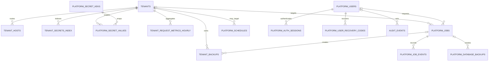
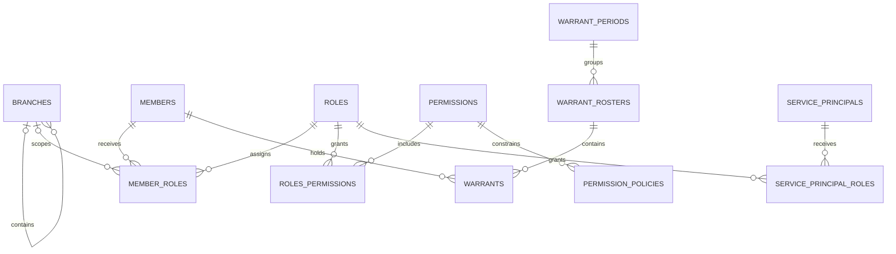
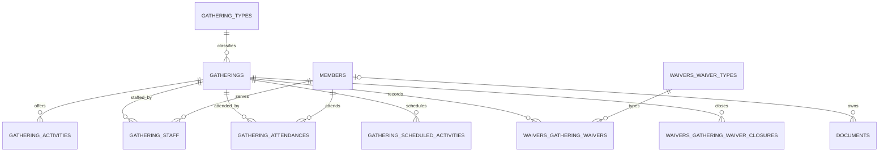
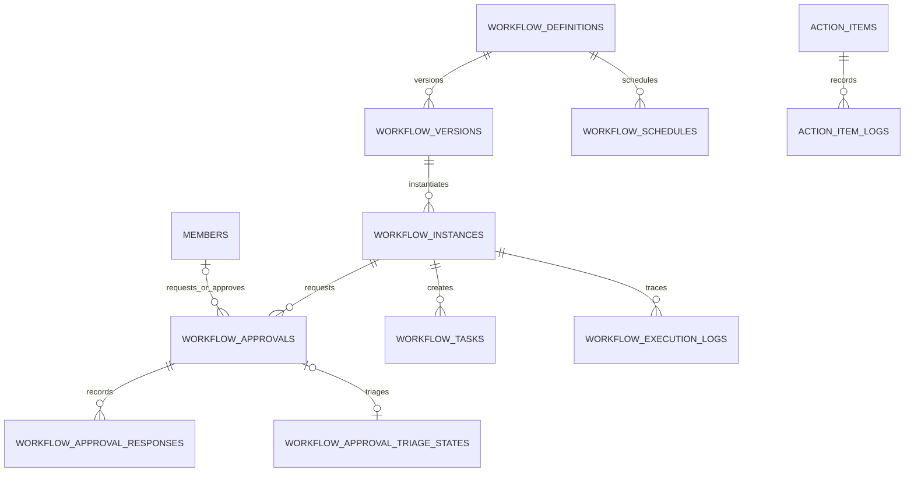
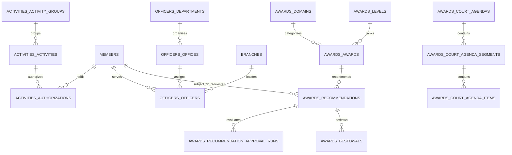
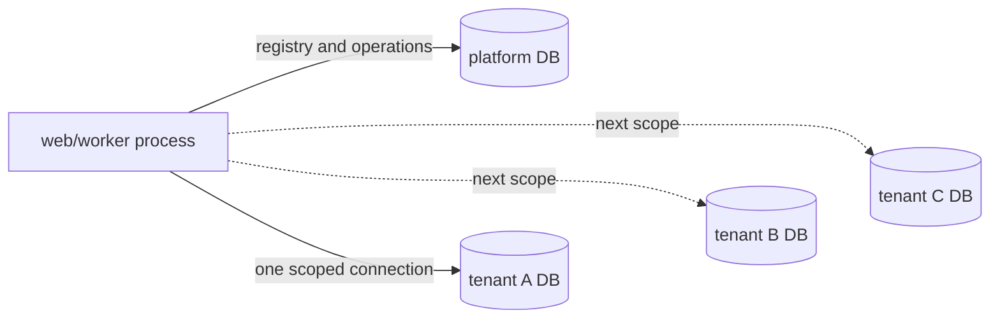

[← Data architecture](3.3-database-schema.md)

# 3.5 Entity relationship views

These diagrams show ownership and major relationships. They are intentionally
conceptual: migrations and CakePHP table classes are authoritative for fields,
constraints, and association names.

## Platform registry and operations

```mermaid
erDiagram
    TENANTS ||--o{ TENANT_HOSTS : routes
    TENANTS ||--o{ TENANT_SECRETS_INDEX : indexes
    TENANTS ||--o{ PLATFORM_SECRET_VALUES : scopes
    TENANTS ||--o{ TENANT_BACKUPS : owns
    TENANTS ||--o{ TENANT_REQUEST_METRICS_HOURLY : aggregates
    TENANTS o|--o{ PLATFORM_JOBS : targets
    TENANTS o|--o{ PLATFORM_SCHEDULES : may_target
    PLATFORM_USERS ||--o{ PLATFORM_AUTH_SESSIONS : authenticates
    PLATFORM_USERS ||--o{ PLATFORM_USER_RECOVERY_CODES : recovers
    PLATFORM_USERS o|--o{ AUDIT_EVENTS : acts
    PLATFORM_USERS o|--o{ PLATFORM_JOBS : requests
    PLATFORM_JOBS ||--o{ PLATFORM_JOB_EVENTS : records
    PLATFORM_JOBS o|--o{ TENANT_BACKUPS : creates
    PLATFORM_JOBS o|--o{ PLATFORM_DATABASE_BACKUPS : creates
    PLATFORM_SECRET_KEKS ||--o{ PLATFORM_SECRET_VALUES : wraps
```

A platform row may reference a tenant operationally; that does not move tenant
business records into the platform database. `platform_schedules` definitions
are allowlisted work descriptors, while `platform_jobs` are durable executions.

## Tenant membership and authorization

```mermaid
erDiagram
    BRANCHES o|--o{ BRANCHES : contains
    MEMBERS ||--o{ MEMBER_ROLES : receives
    ROLES ||--o{ MEMBER_ROLES : assigns
    ROLES ||--o{ ROLES_PERMISSIONS : grants
    PERMISSIONS ||--o{ ROLES_PERMISSIONS : includes
    PERMISSIONS ||--o{ PERMISSION_POLICIES : constrains
    BRANCHES o|--o{ MEMBER_ROLES : scopes
    MEMBERS ||--o{ WARRANTS : holds
    WARRANT_PERIODS ||--o{ WARRANT_ROSTERS : groups
    WARRANT_ROSTERS ||--o{ WARRANTS : contains
    SERVICE_PRINCIPALS ||--o{ SERVICE_PRINCIPAL_ROLES : receives
    ROLES ||--o{ SERVICE_PRINCIPAL_ROLES : grants
```

The branch tree and time-bounded assignments feed policy scope. This is an
authorization graph inside one tenant database; matching IDs in another tenant
have no relationship.

## Gatherings, documents, and waivers

```mermaid
erDiagram
    GATHERING_TYPES ||--o{ GATHERINGS : classifies
    GATHERINGS ||--o{ GATHERING_ACTIVITIES : offers
    GATHERINGS ||--o{ GATHERING_STAFF : staffed_by
    GATHERINGS ||--o{ GATHERING_ATTENDANCES : attended_by
    GATHERINGS ||--o{ GATHERING_SCHEDULED_ACTIVITIES : schedules
    MEMBERS ||--o{ GATHERING_STAFF : serves
    MEMBERS ||--o{ GATHERING_ATTENDANCES : attends
    MEMBERS o|--o{ DOCUMENTS : owns
    GATHERINGS ||--o{ WAIVERS_GATHERING_WAIVERS : records
    GATHERINGS ||--o{ WAIVERS_GATHERING_WAIVER_CLOSURES : closes
    WAIVERS_WAIVER_TYPES ||--o{ WAIVERS_GATHERING_WAIVERS : types
```

Actual Waivers table names are plugin-prefixed. Binary document objects live in
tenant-routed storage; the database stores tenant-owned metadata/references.

## Workflow engine

```mermaid
erDiagram
    WORKFLOW_DEFINITIONS ||--o{ WORKFLOW_VERSIONS : versions
    WORKFLOW_VERSIONS ||--o{ WORKFLOW_INSTANCES : instantiates
    WORKFLOW_INSTANCES ||--o{ WORKFLOW_APPROVALS : requests
    WORKFLOW_APPROVALS ||--o{ WORKFLOW_APPROVAL_RESPONSES : records
    WORKFLOW_APPROVALS o|--o| WORKFLOW_APPROVAL_TRIAGE_STATES : triages
    WORKFLOW_INSTANCES ||--o{ WORKFLOW_TASKS : creates
    WORKFLOW_INSTANCES ||--o{ WORKFLOW_EXECUTION_LOGS : traces
    WORKFLOW_DEFINITIONS ||--o{ WORKFLOW_SCHEDULES : schedules
    MEMBERS o|--o{ WORKFLOW_APPROVALS : requests_or_approves
    ACTION_ITEMS ||--o{ ACTION_ITEM_LOGS : records
```

Domain records reference or are referenced by workflow instances according to
the owning provider. Definitions and immutable versions describe the graph;
instances and approvals contain runtime state. Use engine services rather than
updating these tables independently.

## Domain plugins

```mermaid
erDiagram
    ACTIVITIES_ACTIVITY_GROUPS ||--o{ ACTIVITIES_ACTIVITIES : groups
    ACTIVITIES_ACTIVITIES ||--o{ ACTIVITIES_AUTHORIZATIONS : authorizes
    MEMBERS ||--o{ ACTIVITIES_AUTHORIZATIONS : holds

    OFFICERS_DEPARTMENTS ||--o{ OFFICERS_OFFICES : organizes
    OFFICERS_OFFICES ||--o{ OFFICERS_OFFICERS : assigns
    MEMBERS ||--o{ OFFICERS_OFFICERS : serves
    BRANCHES ||--o{ OFFICERS_OFFICERS : locates

    AWARDS_DOMAINS ||--o{ AWARDS_AWARDS : categorizes
    AWARDS_LEVELS ||--o{ AWARDS_AWARDS : ranks
    AWARDS_AWARDS ||--o{ AWARDS_RECOMMENDATIONS : recommends
    MEMBERS ||--o{ AWARDS_RECOMMENDATIONS : subject_or_requester
    AWARDS_RECOMMENDATIONS ||--o{ AWARDS_RECOMMENDATION_APPROVAL_RUNS : evaluates
    AWARDS_RECOMMENDATIONS ||--o{ AWARDS_BESTOWALS : bestows
    AWARDS_COURT_AGENDAS ||--o{ AWARDS_COURT_AGENDA_SEGMENTS : contains
    AWARDS_COURT_AGENDA_SEGMENTS ||--o{ AWARDS_COURT_AGENDA_ITEMS : contains
```

This view omits many Awards feedback, bestowal-to-do, gathering-activity, state
log, and migration tables. Consult the plugin migrations and current plugin
guide before changing a relationship.

## Isolation view

```mermaid
flowchart LR
    P[(platform DB)]
    A[(tenant A DB)]
    B[(tenant B DB)]
    C[(tenant C DB)]
    W[web/worker process]

    W -->|registry and operations| P
    W -->|one scoped connection| A
    W -. next scope .-> B
    W -. next scope .-> C
    A ~~~ B
    B ~~~ C
```

There are no foreign keys between databases. Platform tenant UUIDs identify
operational targets in the central schema; tenant tables retain their own
internal/public identifiers. A process visits databases sequentially with
explicit cleanup.

## Keeping diagrams current

When a change alters durable ownership or a major relationship:

1. update the correct migration and table associations;
2. update the relevant conceptual diagram if it changes how developers reason
   about the system;
3. keep field-level details in source/generated API references; and
4. verify the Mermaid blocks in the documentation build.

Do not paste generated SQL or a production database export into this page.

## Related guides

- [Data architecture](3.3-database-schema.md)
- [Migration lifecycle](3.4-migration-documentation.md)
- [Workflow approval nodes](6.5-workflow-approval-nodes.md)
- [Plugin architecture](5-plugins.md)
