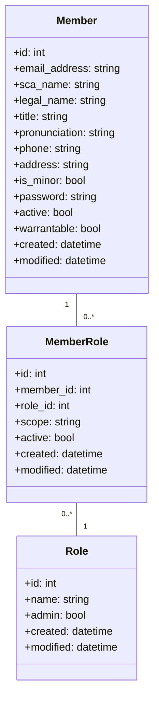
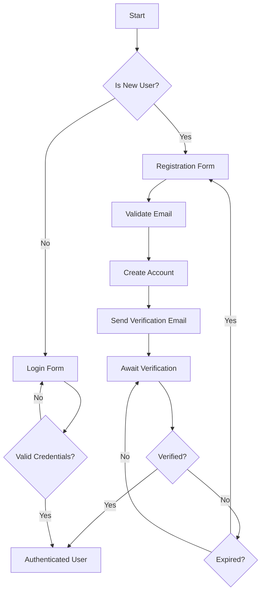
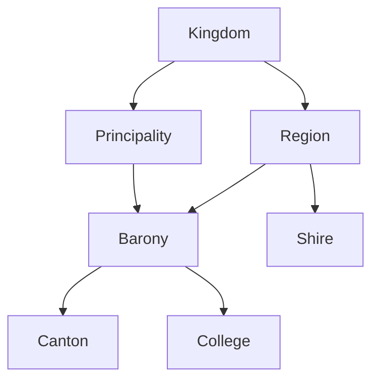
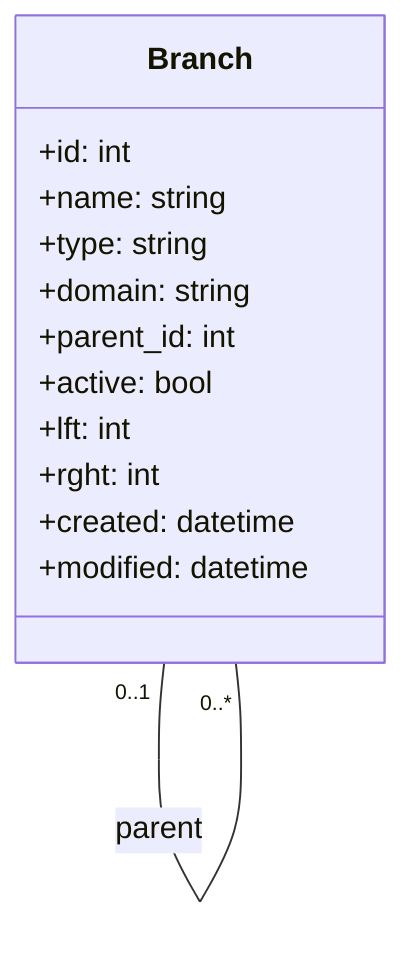
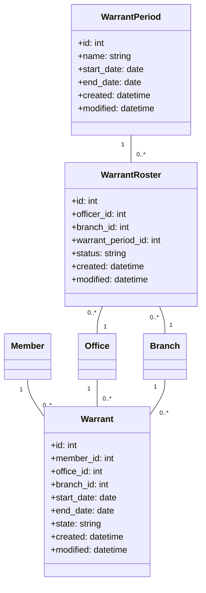
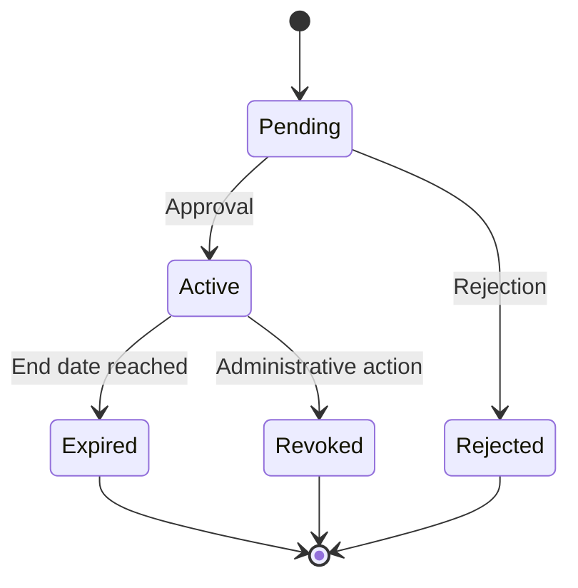
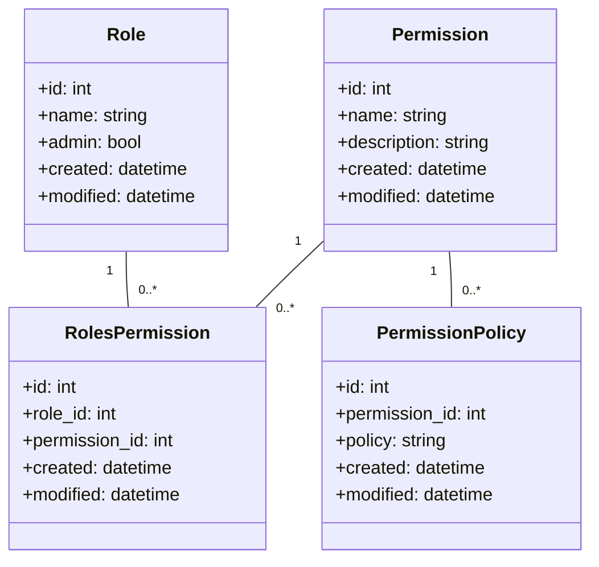
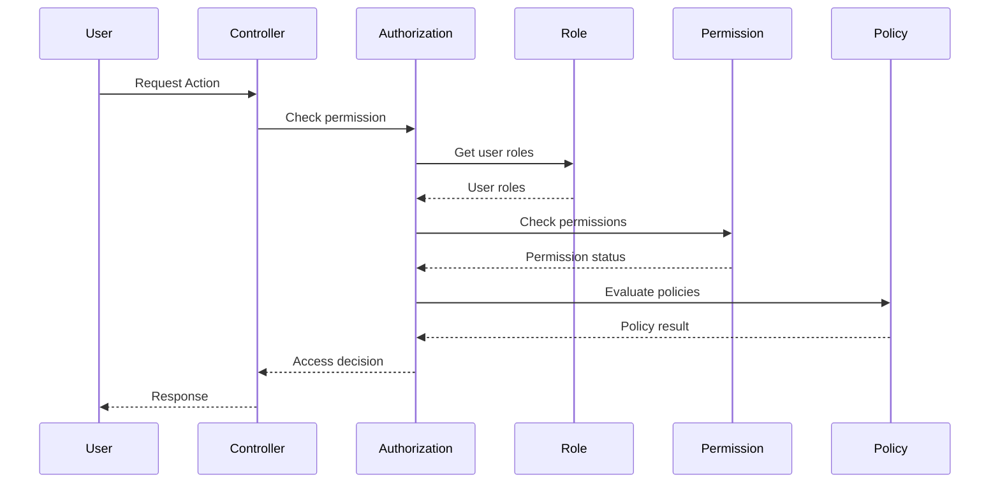
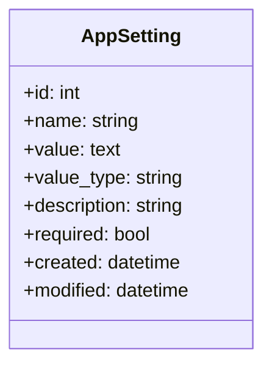

[← Back to Table of Contents](index.md)

# 4. Core Modules

This section documents the primary modules that make up the foundation of the Kingdom Management Portal. These modules manage the essential data and functionality required across the entire application.

## 4.1 Member Management

The member management module is the cornerstone of the KMP system, handling all aspects of member records, registration, and profile management.

### Data Model



### Registration Process

The member registration process follows this flow:



### Member Permissions

Members have permissions through their assigned roles. The system supports multiple roles per member, with different scopes (global, branch-specific, etc.).

## 4.2 Branches

The Branches module manages the hierarchical organization of the Kingdom's geographic structure.

### Branch Hierarchy



### Data Model



Branches use the nested set model (lft/rght fields) for efficient tree operations and querying.

### Branch Operations

Key operations on branches include:
- Creating new branches with proper hierarchy positioning
- Moving branches within the hierarchy
- Activating/deactivating branches
- Associating officers with branches
- Setting branch domains for authorization

## 4.3 Warrants

The Warrants module manages the official appointments of officers and other warranted positions within the Kingdom.

### Data Model



### Warrant States

Warrants progress through several states during their lifecycle:



### Warrant Roster Process

The warrant roster process allows bulk management of warrants:

1. A warrant period is created (e.g., "Q2 2025")
2. Rosters are created for each branch/office combination
3. Officers are assigned to rosters
4. Rosters go through approval workflow
5. Upon approval, individual warrants are created

## 4.4 Permissions & Roles

The Permissions and Roles module implements the role-based access control (RBAC) system used throughout KMP.

### Data Model



### Access Control Flow



### Common Permissions

The system includes the following common permission categories:
- **View**: Read-only access to resources
- **Add**: Ability to create new resources
- **Edit**: Ability to modify existing resources
- **Delete**: Ability to remove resources
- **Admin**: Administrative functions for a module

## 4.5 AppSettings

The AppSettings module provides a flexible configuration system that can be modified at runtime through the application UI.

### Data Model



### Value Types

AppSettings supports several value types:
- **string**: Simple text values
- **int**: Integer values
- **bool**: Boolean values (yes/no)
- **yaml**: Structured data stored as YAML
- **json**: Structured data stored as JSON

### Setting Categories

Settings are organized by prefix conventions:
- **KMP.**: Core application settings
- **Email.**: Email configuration
- **Member.**: Member-related settings
- **Activity.**: Activity module settings
- **Warrant.**: Warrant system settings
- **Branches.**: Branch management settings
- **Plugin.{PluginName}.**: Plugin-specific settings

### Accessing Settings

Settings can be accessed through the StaticHelpers class:

```php
// Get a setting with a default value
$siteTitle = StaticHelpers::getAppSetting("KMP.ShortSiteTitle", "KMP");

// Get with default value and create if missing
$setting = StaticHelpers::getAppSetting("KMP.Setting", "default", null, true);

// Set a setting value
StaticHelpers::setAppSetting("KMP.Setting", "new value");
```

### UI Management

AppSettings provides an admin interface for managing settings, including:
- Viewing all settings
- Filtering by name prefix
- Editing values
- Adding new settings
- Exporting settings as YAML
