[← Back to Table of Contents](index.md)

# 4. Core Modules

This section documents the primary modules that make up the foundation of the Kingdom Management Portal. These modules manage the essential data and functionality required across the entire application.

## Module Documentation

For detailed documentation on each core module, see:

- **[4.1 Member Lifecycle](4.1-member-lifecycle.md)** - Complete member lifecycle and data flow documentation
- **[4.2 Branch Hierarchy](4.2-branch-hierarchy.md)** - Organizational structure and tree management
- **[4.3 Warrant Lifecycle](4.3-warrant-lifecycle.md)** - Warrant state machine and approval processes  
- **[4.4 RBAC Security Architecture](4.4-rbac-security-architecture.md)** - Role-based access control with warrant temporal validation
- **[4.5 View Patterns](4.5-view-patterns.md)** - Template system, helpers, and UI components
- **[4.6 Gatherings System](4.6-gatherings-system.md)** - Event management, calendar views, and attendance tracking
- **[4.7 Document Management & Retention System](4.7-document-management-system.md)** - File uploads, storage, and retention policies

## Overview

Below is a high-level overview of the core modules. For comprehensive documentation, refer to the individual module pages listed above.

## 4.1 Member Management

The member management module is the cornerstone of the KMP system, handling all aspects of member records, registration, and profile management.

### Data Model

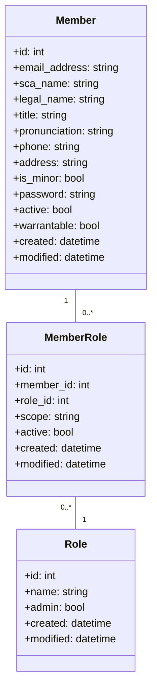

### Registration Process

The member registration process follows this flow:

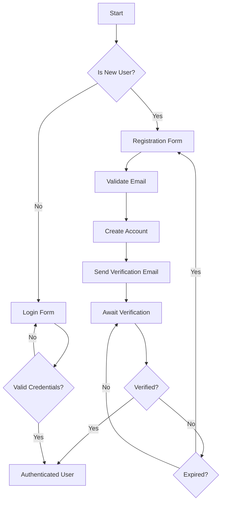

### Member Lifecycle Management

The KMP system implements a comprehensive member lifecycle management system that tracks members through various states and automatically manages transitions based on age, activity, and administrative actions.

#### Member Status System

KMP uses a seven-level status system to track member states:

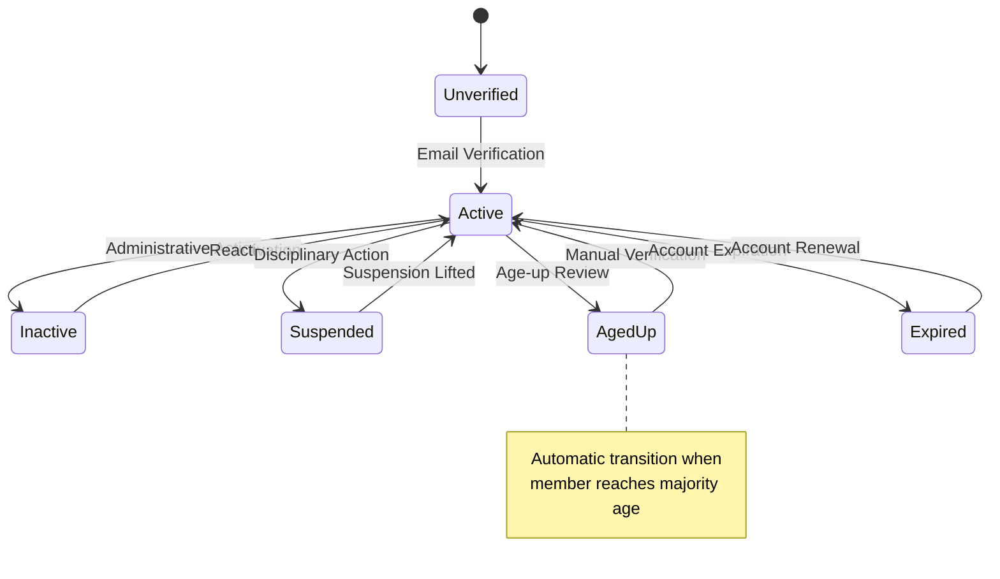

**Status Definitions:**
- **Unverified**: New account awaiting email verification
- **Active**: Fully active member with all privileges
- **Inactive**: Temporarily deactivated by administrator
- **Suspended**: Disciplinary suspension with restricted access
- **AgedUp**: Minor member who has reached majority age pending review
- **Expired**: Account expired due to inactivity or non-payment
- **Deleted**: Soft-deleted account (retained for historical records)

#### Age-Up Workflow

The system automatically manages the transition of minor members to adult status:

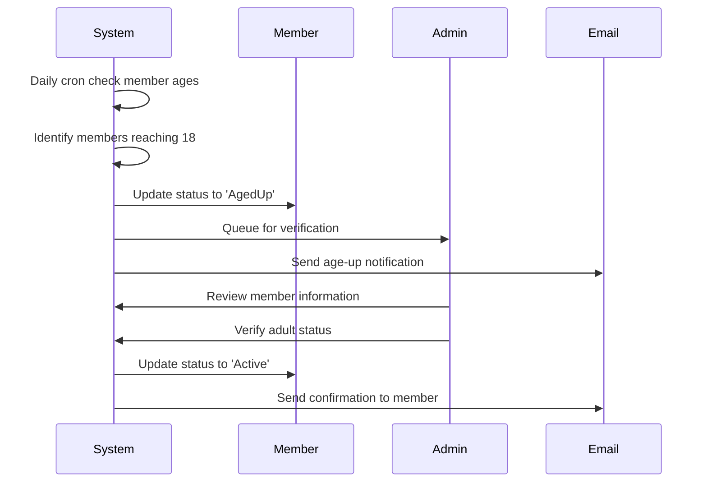

#### Warrant Eligibility System

Members' warrant eligibility is automatically calculated based on multiple factors:

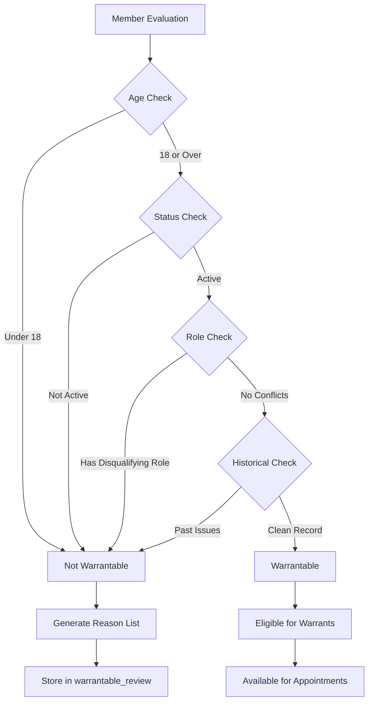

#### Privacy and Data Protection

The system implements comprehensive privacy controls:

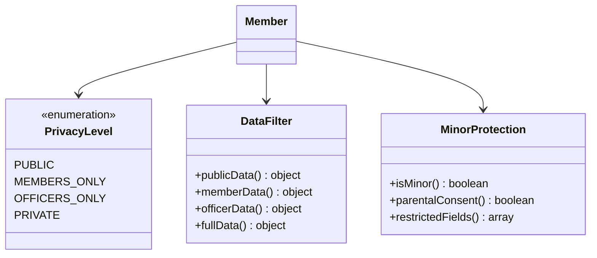

#### Registration and Verification Process

The complete member registration flow with verification:

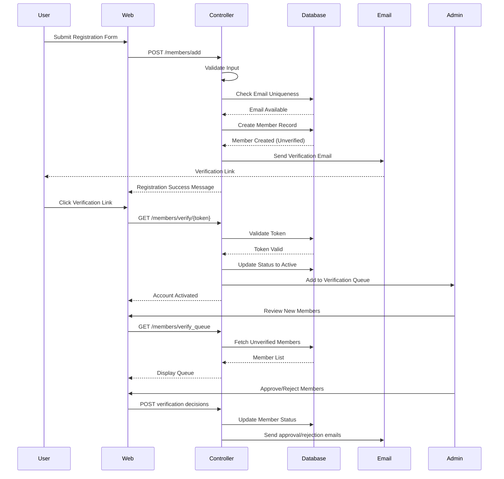

### Member Permissions

Members have permissions through their assigned roles. The system supports multiple roles per member, with different scopes (global, branch-specific, etc.).

#### Role-Based Access Control

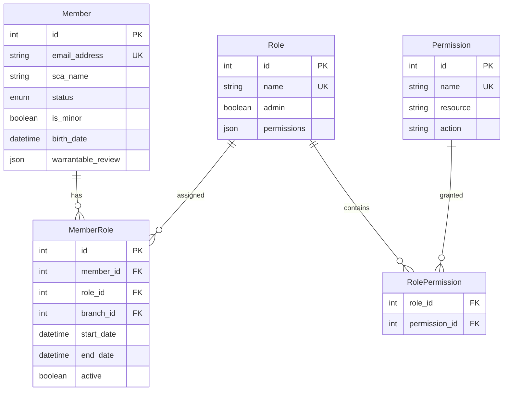

## 4.2 Branches

The Branches module manages the hierarchical organization of the Kingdom's geographic structure.

### Branch Hierarchy

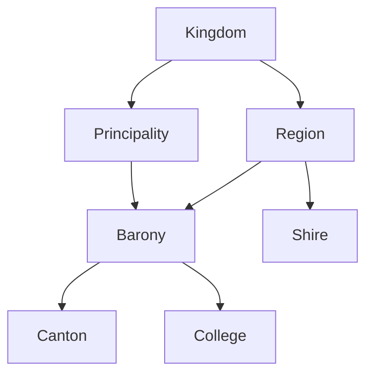

### Data Model

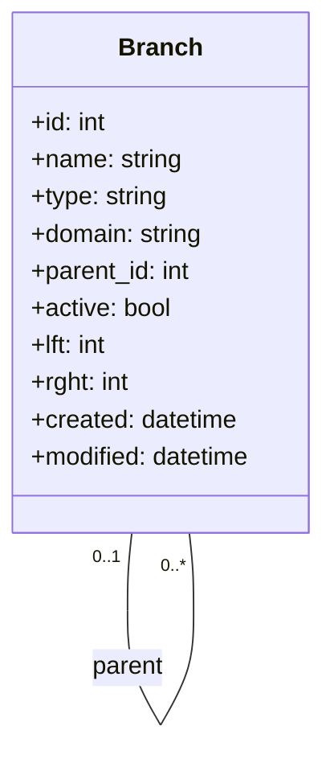

Branches use the nested set model (lft/rght fields) for efficient tree operations and querying.

### Branch Operations

Key operations on branches include:
- Creating new branches with proper hierarchy positioning
- Moving branches within the hierarchy
- Activating/deactivating branches
- Associating officers with branches
- Setting branch domains for authorization

## 4.3 Warrants

The Warrants module manages the official appointments of officers and other warranted positions within the Kingdom. It provides temporal validation for role-based access control through a sophisticated state machine and multi-level approval process.

**Detailed Documentation:** [4.3 Warrant Lifecycle](4.3-warrant-lifecycle.md)

### Data Model

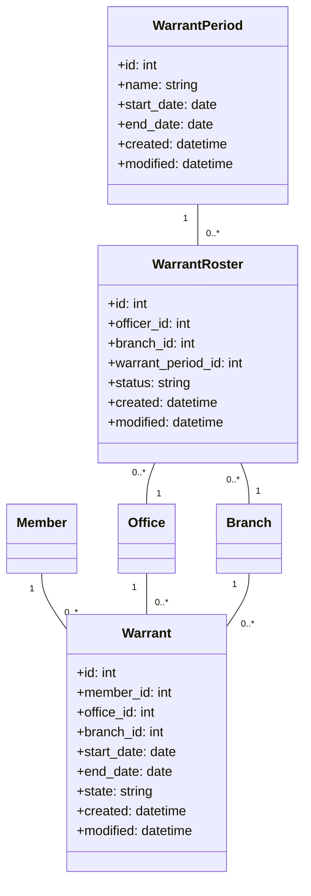

### Warrant States

Warrants progress through several states during their lifecycle:

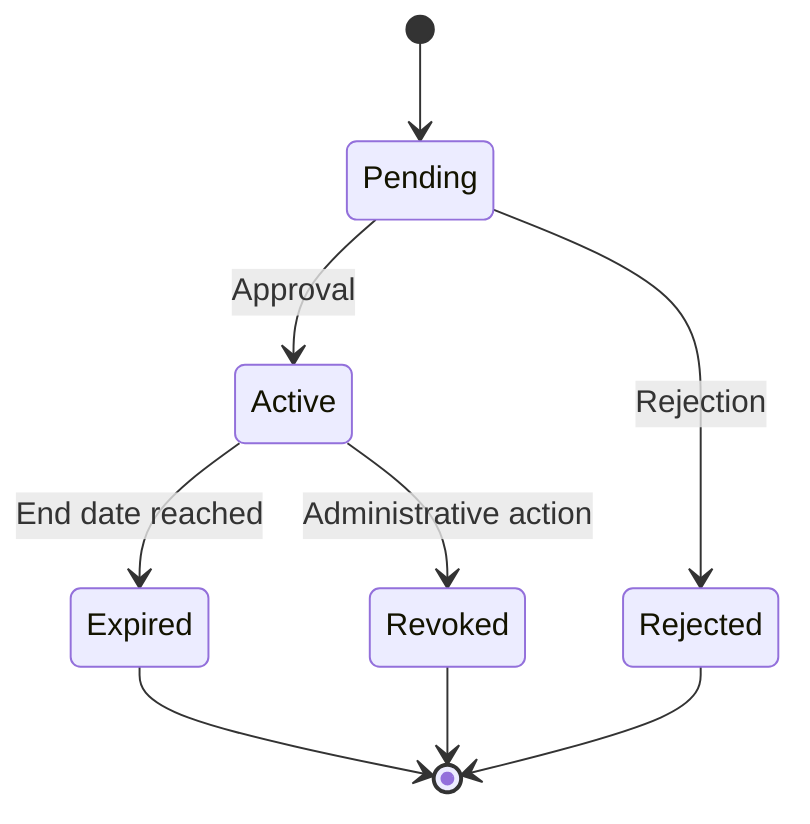

### Warrant Roster Process

The warrant roster process allows bulk management of warrants:

1. A warrant period is created (e.g., "Q2 2025")
2. Rosters are created for each branch/office combination
3. Officers are assigned to rosters
4. Rosters go through approval workflow
5. Upon approval, individual warrants are created

## 4.4 Permissions & Roles

The Permissions and Roles module implements the role-based access control (RBAC) system used throughout KMP.

### Data Model

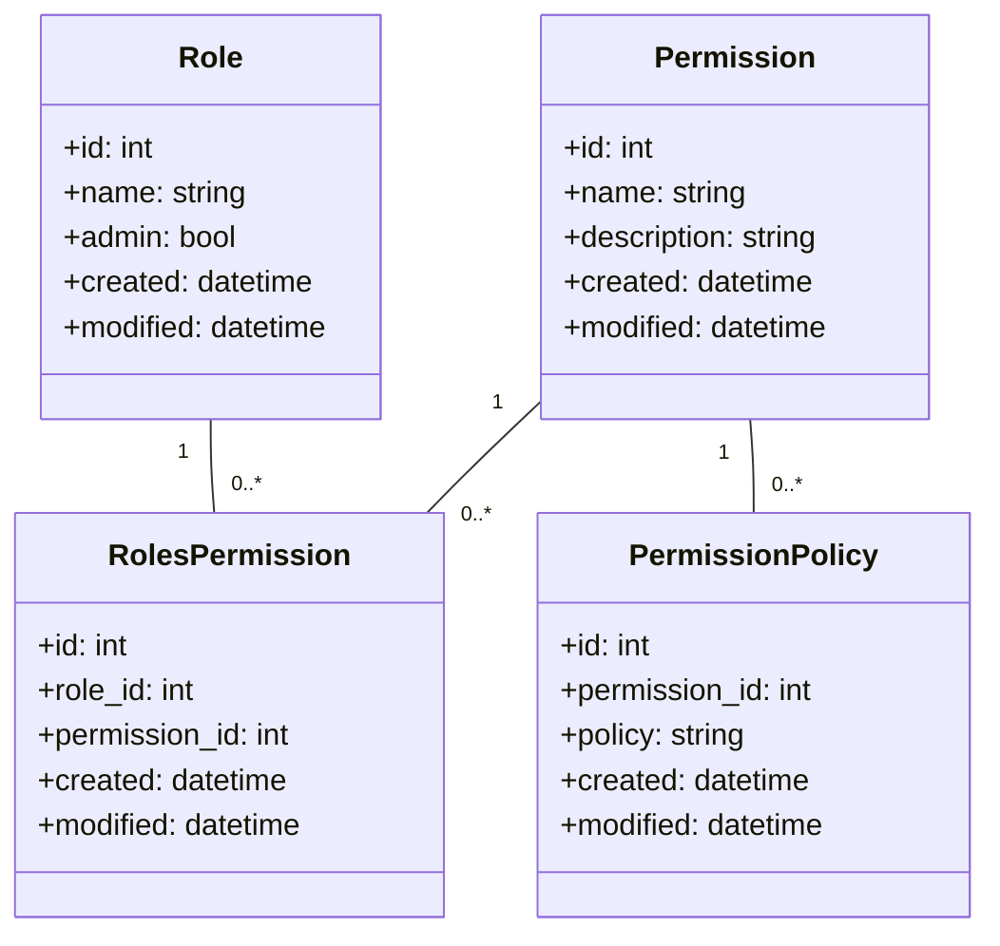

### Access Control Flow

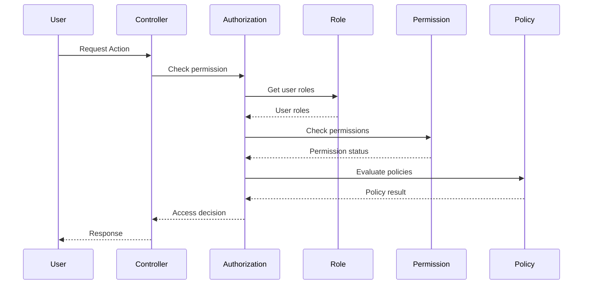

### Common Permissions

The system includes the following common permission categories:
- **View**: Read-only access to resources
- **Add**: Ability to create new resources
- **Edit**: Ability to modify existing resources
- **Delete**: Ability to remove resources
- **Admin**: Administrative functions for a module

## 4.5 AppSettings

The AppSettings module provides a flexible configuration system that can be modified at runtime through the application UI.

### Data Model

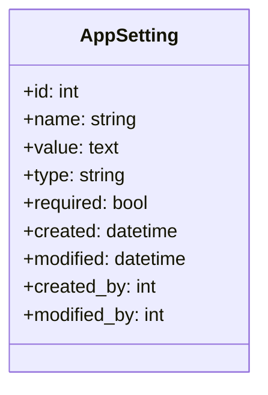

### Value Types

AppSettings supports several value types through the `type` field:
- **string** (default): Simple text values
- **json**: Structured data stored as JSON
- **yaml**: Structured data stored as YAML

### Setting Categories

Settings are organized by prefix conventions:
- **KMP.**: Core application settings
- **Email.**: Email configuration
- **Member.**: Member-related settings
- **Activity.**: Activity module settings
- **Warrant.**: Warrant system settings
- **Branches.**: Branch management settings
- **Plugin.{PluginName}.**: Plugin-specific settings

### Accessing Settings

Settings can be accessed through the StaticHelpers class:

```php
// Get a setting with a default value
$siteTitle = StaticHelpers::getAppSetting("KMP.ShortSiteTitle", "KMP");

// Get with default value and create if missing
$setting = StaticHelpers::getAppSetting("KMP.Setting", "default", null, true);

// Set a setting value
StaticHelpers::setAppSetting("KMP.Setting", "new value");
```

### UI Management

AppSettings provides an admin interface for managing settings, including:
- Viewing all settings
- Filtering by name prefix
- Editing values
- Adding new settings
- Exporting settings as YAML

## 4.6 View Patterns

The View layer in KMP provides a comprehensive presentation system built on CakePHP's MVC architecture with Bootstrap UI integration and custom helpers for KMP-specific functionality.

**Detailed Documentation:** [4.5 View Patterns](4.5-view-patterns.md)

### Key Components

- **AppView**: Base view class with integrated helper loading and Bootstrap UI framework
- **KmpHelper**: Custom helper providing KMP-specific form controls, data conversion, and UI utilities
- **View Cells**: Reusable UI components including AppNavCell, NavigationCell, and NotesCell
- **Template System**: Hierarchical templates with responsive layouts and security integration

### Architecture Overview

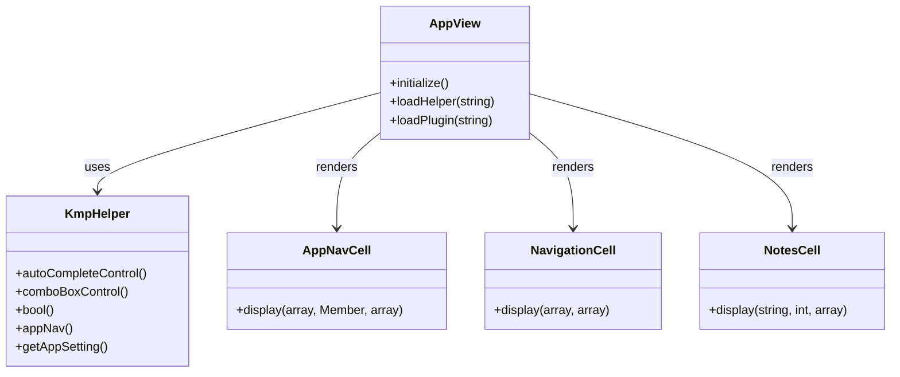

The view system provides advanced form controls, permission-based rendering, asset optimization, and comprehensive security patterns for safe user interface generation.
