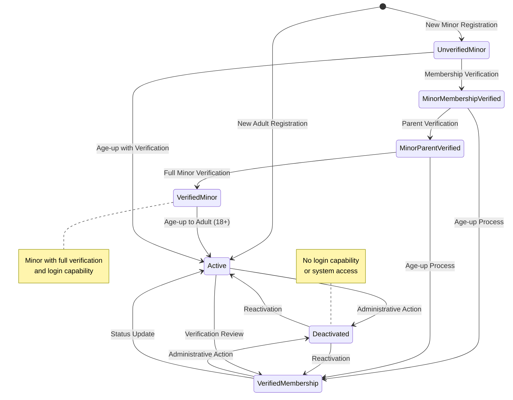
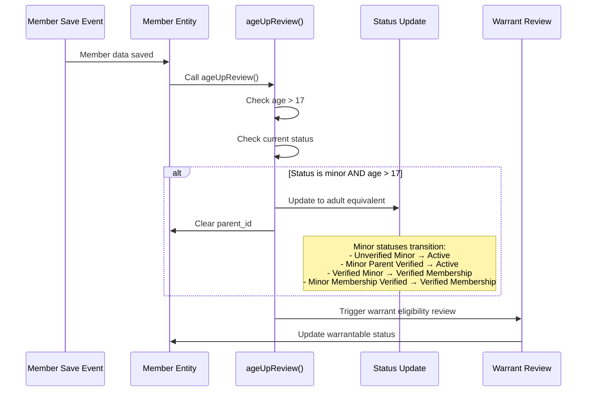
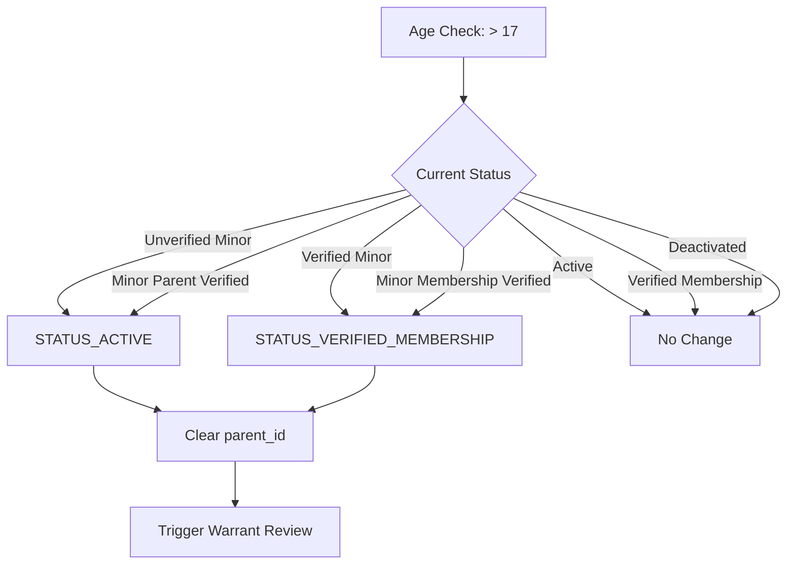
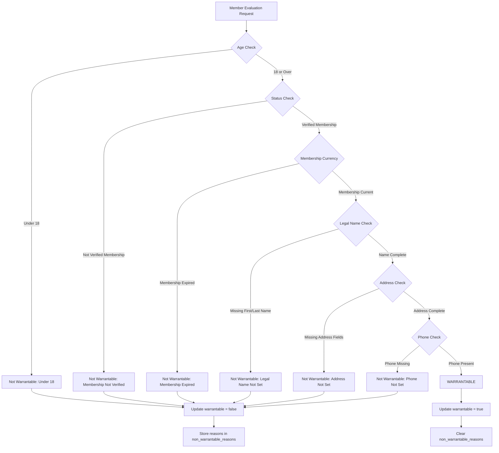
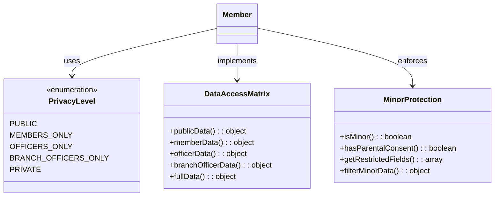
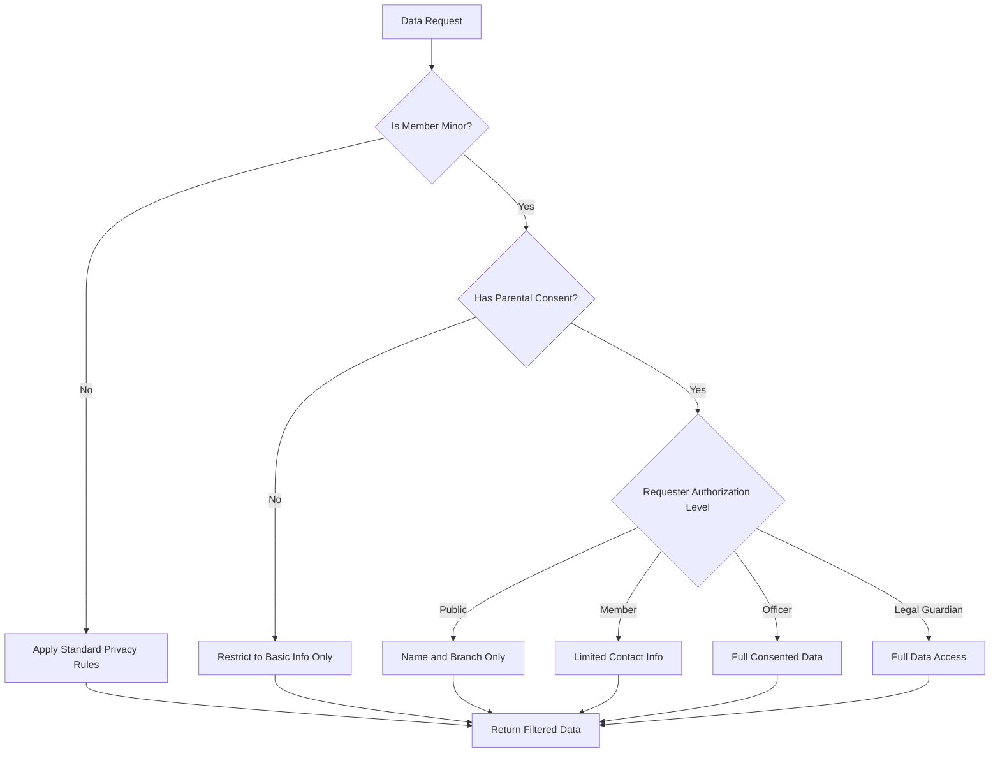
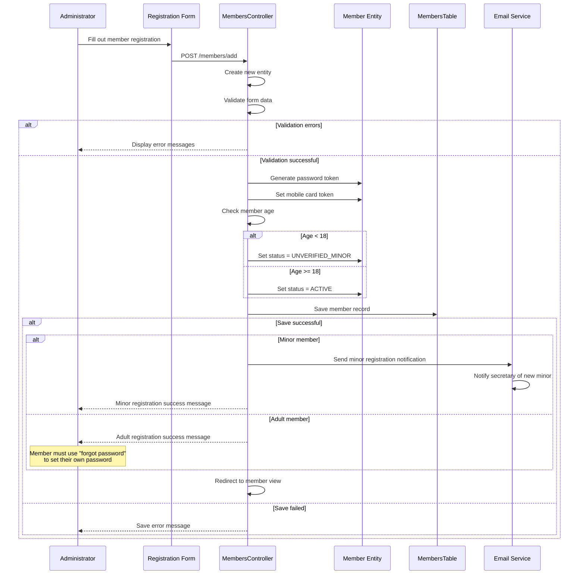
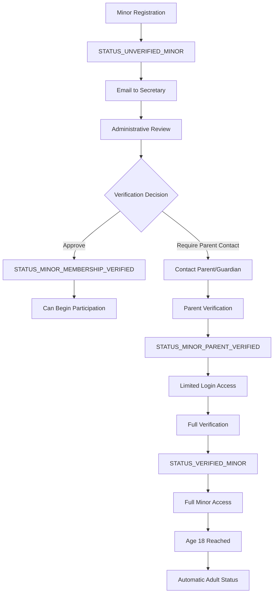

[← Back to Core Modules](4-core-modules.md) | [← Back to Table of Contents](index.md)

# 4.1 Member Lifecycle Management

The Kingdom Management Portal implements a comprehensive member lifecycle management system that automatically tracks members through various states, manages age transitions, evaluates warrant eligibility, and enforces privacy controls. This system is built around the core principle that member data and permissions evolve over time based on both automatic triggers and administrative actions.

## Overview

The member lifecycle system handles:
- **Status Management**: Seven distinct member states with automatic transitions
- **Age-Up Processing**: Automatic detection and handling of minors reaching majority age
- **Warrant Eligibility**: Dynamic calculation of member eligibility for official positions
- **Privacy Controls**: Comprehensive data protection with configurable visibility levels
- **Administrative Workflows**: Queue-based verification and approval processes

## Member Status System

### Status Hierarchy

KMP employs a seven-level status system that tracks member states with a focus on age-based access control and verification requirements:



### Status Definitions

#### 1. Active (`Member::STATUS_ACTIVE`)
- **Purpose**: Active adult member with full system access and login capability
- **Permissions**: Complete system access based on assigned roles
- **Automatic Transitions**: None (status maintained unless administratively changed)
- **Manual Transitions**: To Deactivated (admin action), To VerifiedMembership (verification review)
- **Business Rules**: 
  - Full login capability and system access
  - Eligible for all warrant and role assignments
  - Primary status for adult members

#### 2. Deactivated (`Member::STATUS_DEACTIVATED`)
- **Purpose**: Deactivated member with no login capability or system access
- **Permissions**: None (cannot login or access system)
- **Automatic Transitions**: None
- **Manual Transitions**: To Active or VerifiedMembership (reactivation by admin)
- **Business Rules**:
  - Complete system lockout
  - Cannot receive new warrants or assignments
  - Existing roles and warrants suspended

#### 3. Verified Membership (`Member::STATUS_VERIFIED_MEMBERSHIP`)
- **Purpose**: Member with verified membership status and full login access
- **Permissions**: Full system access based on assigned roles
- **Automatic Transitions**: None
- **Manual Transitions**: To Active (status update), To Deactivated (admin action)
- **Business Rules**:
  - Full login capability and system access
  - Equivalent to Active status for most purposes
  - May indicate special verification or membership category

#### 4. Unverified Minor (`Member::STATUS_UNVERIFIED_MINOR`)
- **Purpose**: Minor member (under 18) without verification, no login capability
- **Permissions**: None (no system access)
- **Automatic Transitions**: To Active/VerifiedMembership (age-up at 18+)
- **Manual Transitions**: To MinorMembershipVerified (verification process)
- **Business Rules**:
  - Cannot login or access system
  - Awaiting verification process
  - Limited to basic contact information storage

#### 5. Minor Membership Verified (`Member::STATUS_MINOR_MEMBERSHIP_VERIFIED`)
- **Purpose**: Minor member with verified membership but no login capability
- **Permissions**: None (no login access)
- **Automatic Transitions**: To VerifiedMembership (age-up at 18+)
- **Manual Transitions**: To MinorParentVerified (parent verification)
- **Business Rules**:
  - Membership verified but no system access
  - Cannot login until parent verification
  - Intermediate verification state for minors

#### 6. Minor Parent Verified (`Member::STATUS_MINOR_PARENT_VERIFIED`)
- **Purpose**: Minor member with parent verification and login capability
- **Permissions**: Limited system access appropriate for minors
- **Automatic Transitions**: To VerifiedMembership (age-up at 18+)
- **Manual Transitions**: To VerifiedMinor (full verification)
- **Business Rules**:
  - Can login with parental consent
  - Limited to age-appropriate activities
  - Enhanced privacy protections active

#### 7. Verified Minor (`Member::STATUS_VERIFIED_MINOR`)
- **Purpose**: Minor member with full verification and login capability
- **Permissions**: Full minor-appropriate system access
- **Automatic Transitions**: To Active (age-up at 18+)
- **Manual Transitions**: To Deactivated (admin action)
- **Business Rules**:
  - Full system access within minor constraints
  - Can participate in age-appropriate activities
  - Automatic transition to adult status at 18

## Age-Up Management System

The age-up system automatically manages the transition of minor members to adult status when they reach 18 years of age. This system ensures compliance with organizational policies while maintaining data integrity and proper access controls.

### Automatic Detection Process



### Age-Up Business Rules

#### Trigger Conditions
- Member age > 17 (18 years or older)
- Current status is a minor status (not Active, Verified Membership, or Deactivated)
- Automatic trigger on any member data save operation

#### Status Transition Matrix
The system uses specific rules for transitioning minor statuses to adult equivalents:



#### Automatic Actions
1. **Status Update**: Changes minor status to appropriate adult equivalent
2. **Parent Relationship Removal**: Clears `parent_id` field (adult members don't need parental oversight)
3. **Warrant Eligibility Review**: Triggers warrantable status recalculation
4. **Permission Updates**: Adult permissions become available

### Implementation Details

```php
// Age-up detection in Member::ageUpReview()
public function ageUpReview(): void
{
    if (
        $this->status !== self::STATUS_ACTIVE
        && $this->status !== self::STATUS_VERIFIED_MEMBERSHIP
        && $this->status !== self::STATUS_DEACTIVATED 
        && $this->age > 17
    ) {
        // Member has aged up and is no longer a minor
        $this->parent_id = null;
        
        switch ($this->status) {
            case self::STATUS_UNVERIFIED_MINOR:
            case self::STATUS_MINOR_PARENT_VERIFIED:
                $this->status = self::STATUS_ACTIVE;
                break;
                
            case self::STATUS_VERIFIED_MINOR:
            case self::STATUS_MINOR_MEMBERSHIP_VERIFIED:
                $this->status = self::STATUS_VERIFIED_MEMBERSHIP;
                break;
        }
    }
}
```

### Integration Points

#### Automatic Triggers
The age-up review is automatically triggered during:
- **Member Save Operations**: Every time member data is saved via MembersTable
- **Profile Updates**: When members update their information
- **Administrative Changes**: When admins modify member records
- **Bulk Operations**: During mass member updates or imports

#### No Manual Queue Required
Unlike the fictional system described earlier, KMP's age-up process is fully automatic and doesn't require administrative intervention. The system:
- Automatically detects age eligibility during any save operation
- Immediately transitions status without manual review
- Removes parental oversight automatically
- Updates permissions in real-time

## Warrant Eligibility System

The warrant eligibility system dynamically evaluates whether members can hold official positions based on multiple criteria including age, membership status, membership currency, and profile completeness.

### Eligibility Evaluation Flow



### Eligibility Criteria

#### Primary Requirements
1. **Age**: Must be 18 years or older
2. **Status**: Must have `STATUS_VERIFIED_MEMBERSHIP` status specifically
3. **Membership Currency**: Membership must not be expired
4. **Profile Completeness**: All required fields must be populated

#### Required Profile Fields
- **Legal Name**: Both `first_name` and `last_name` must be set
- **Complete Address**: All address fields must be populated:
  - `street_address`
  - `city` 
  - `state`
  - `zip`
- **Phone Number**: `phone_number` must be set

#### Evaluation Storage

The system stores eligibility evaluation results in the `non_warrantable_reasons` array field:

```php
// Example of reasons array when member is not warrantable
[
    "Member is under 18",
    "Membership is not verified", 
    "Legal name is not set",
    "Address is not set",
    "Phone number is not set"
]

// Empty array when member is warrantable
[]
```

### Implementation Example

```php
// Warrant eligibility evaluation in Member::getNonWarrantableReasons()
public function getNonWarrantableReasons(): array
{
    $reasons = [];
    
    // Age check
    if ($this->age < 18) {
        $reasons[] = 'Member is under 18';
        $this->warrantable = false;
    }
    
    // Status check - must be specifically verified membership
    if ($this->status != self::STATUS_VERIFIED_MEMBERSHIP) {
        $reasons[] = 'Membership is not verified';
        $this->warrantable = false;
    } else {
        // Membership expiration check
        if ($this->membership_expires_on == null || $this->membership_expires_on->isPast()) {
            $reasons[] = 'Membership is expired';
            $this->warrantable = false;
        }
    }
    
    // Legal name completeness
    if ($this->first_name == null || $this->last_name == null) {
        $reasons[] = 'Legal name is not set';
        $this->warrantable = false;
    }
    
    // Address completeness
    if ($this->street_address == null || $this->city == null || 
        $this->state == null || $this->zip == null) {
        $reasons[] = 'Address is not set';
        $this->warrantable = false;
    }
    
    // Phone number requirement
    if ($this->phone_number == null) {
        $reasons[] = 'Phone number is not set';
        $this->warrantable = false;
    }
    
    // If no reasons, member is warrantable
    if (empty($reasons)) {
        $this->warrantable = true;
    }
    
    return $reasons;
}
```

### Automatic Updates

The warrant eligibility review is automatically triggered:
- **On Save**: Every time member data is saved via MembersTable
- **Profile Changes**: When members update profile information
- **Status Changes**: When administrative status changes occur
- **Membership Updates**: When membership expiration dates change

The `warrantable` boolean flag is automatically updated based on the evaluation, providing quick access for warrant request validation.

## Privacy and Data Protection

The KMP system implements comprehensive privacy controls that protect member data while enabling appropriate access for organizational operations.

### Privacy Levels


```

### Data Filtering System

The system provides different data views based on the requester's relationship to the member:

#### Public Data (`Member::publicData()`)
Available to anonymous users and external systems:
```php
[
    'id' => $this->id,
    'sca_name' => $this->sca_name,
    'title' => $this->title,
    'pronunciation' => $this->pronunciation,
    'branch_name' => $this->branch->name ?? null
]
```

#### Member Data (`Member::memberData()`)
Available to authenticated members:
```php
[
    ...publicData(),
    'email_address' => $this->email_address,
    'phone' => $this->phone,
    'address' => $this->address,
    'warrantable' => $this->warrantable,
    'roles' => $this->active_roles
]
```

#### Officer Data
Available to officers and administrators:
```php
[
    ...memberData(),
    'legal_name' => $this->legal_name,
    'birth_date' => $this->birth_date,
    'status' => $this->status,
    'warrantable_review' => $this->warrantable_review,
    'audit_trail' => $this->audit_logs
]
```

### Minor Protection System

Special protections for members under 18:



#### Minor-Specific Restrictions
1. **Contact Information**: Limited visibility of email/phone
2. **Legal Name**: Restricted to authorized personnel only
3. **Birth Date**: Hidden except for age verification purposes
4. **Photo/Image**: Requires explicit parental consent
5. **Activity Participation**: Tracked separately with consent requirements

## Registration and Verification Workflows

### Complete Registration Flow



### Registration Business Rules

#### Age-Based Registration Paths
The system handles registration differently based on member age:

**Minor Members (Under 18)**:
- Automatically assigned `STATUS_UNVERIFIED_MINOR`
- Cannot login until verification process completed
- Special email notification sent to secretary
- Enhanced privacy protections activated
- Requires parental oversight and verification

**Adult Members (18 and Over)**:
- Automatically assigned `STATUS_ACTIVE` 
- Can immediately use "forgot password" to set password
- Full system access upon password setup
- Standard verification and privacy rules apply

#### Automatic Field Generation
During registration, the system automatically generates:
- **Password**: 16-character secure token (user must reset via "forgot password")
- **Mobile Card Token**: 16-character token for digital member card access
- **Status Assignment**: Based on age evaluation

#### Administrative Registration Model
Unlike many systems, KMP uses an administrative registration model:
- **Admin Created**: Members are typically created by administrators
- **No Self-Registration**: No public self-registration system
- **Password Reset Required**: New members use "forgot password" to set their password
- **Branch Assignment**: Members assigned to appropriate branches during creation

### Verification Queue Management

For minor members, a verification workflow is triggered:

#### Minor Verification Process


#### Email Notification System

The registration system integrates with KMP's email notification system:

**Minor Registration Notifications**:
- Secretary notification of new minor member
- Parent/guardian contact for verification
- Status change notifications throughout verification process

**Adult Registration**:
- No automatic email notifications
- Member directed to use password reset system
- Administrator handles any necessary communications

### No Public Registration Interface

KMP does not implement a public self-registration system. Instead:

- **Administrative Control**: Only authorized administrators can create new members
- **Controlled Access**: Ensures all members are properly vetted before account creation
- **Data Quality**: Administrator oversight ensures complete and accurate member data
- **Security**: Reduces potential for spam or malicious registrations

## Administrative Tools and Reporting

### Member Management Dashboard

Administrators have access to comprehensive member management tools:

```mermaid
graph TD
    A[Admin Dashboard] --> B[Verification Queue]
    A --> C[Status Management]
    A --> D[Age-Up Review]
    A --> E[Warrant Eligibility]
    A --> F[Privacy Settings]
    A --> G[Bulk Operations]
    A --> H[Audit Reports]
    
    B --> B1[Pending Registrations]
    B --> B2[Email Verifications]
    B --> B3[Document Reviews]
    
    C --> C1[Status Changes]
    C --> C2[Bulk Updates]
    C --> C3[Suspension Management]
    
    D --> D1[Age-Up Queue]
    D --> D2[Minor Transitions]
    D --> D3[Adult Verifications]
    
    E --> E1[Eligibility Reviews]
    E --> E2[Warrant Blocking]
    E --> E3[Role Conflicts]
    
    F --> F1[Consent Management]
    F --> F2[Data Visibility]
    F --> F3[Minor Protections]
    
    G --> G1[Mass Communications]
    G --> G2[Status Changes]
    G --> G3[Data Exports]
    
    H --> H1[Lifecycle Reports]
    H --> H2[Privacy Audits]
    H --> H3[Security Logs]
```



### Reporting and Analytics

The system provides comprehensive reporting on member lifecycle events:

#### Standard Reports
1. **Registration Trends**: New member registrations over time
2. **Status Distribution**: Current status breakdown across membership
3. **Age-Up Analytics**: Minor to adult transition patterns
4. **Warrant Eligibility**: Summary of warrantable member population
5. **Privacy Compliance**: Data access and consent tracking

#### Custom Queries
Administrators can create custom reports using the query builder interface, with pre-built filters for:
- Status transitions within date ranges
- Age demographics and projections
- Geographic distribution by branch
- Role and permission distributions
- Activity and engagement metrics

## Integration Points

### System Integration

The member lifecycle system integrates with multiple KMP components:

1. **Authorization System**: Status changes affect permission calculations
2. **Warrant Manager**: Eligibility updates trigger warrant reviews
3. **Email Service**: Automated notifications for lifecycle events
4. **Audit System**: All changes logged for compliance and tracking
5. **Branch Management**: Status affects branch-level access and visibility
6. **Activity Plugins**: Participation eligibility based on member status

### External System Integration

The lifecycle system provides APIs for external integration:

```php
// API endpoints for external systems
GET /api/members/{id}/status        // Current status information
GET /api/members/{id}/eligibility   // Warrant eligibility status
POST /api/members/{id}/verify       // Trigger verification workflow
GET /api/reports/lifecycle          // Lifecycle analytics data
```

### Plugin Extension Points

The system provides hooks for plugins to extend lifecycle functionality:

1. **Status Change Events**: Plugins can listen for status transitions
2. **Eligibility Evaluation**: Custom criteria can be added to warrant evaluation
3. **Verification Workflow**: Additional verification steps can be inserted
4. **Privacy Filters**: Custom data filtering rules can be implemented
5. **Notification Templates**: Custom email templates and delivery methods

## Security Considerations

### Data Protection
- All personally identifiable information encrypted at rest
- Access logging for all data access and modifications
- Regular security audits of permission matrices
- GDPR compliance for data retention and deletion

### Privacy Compliance
- Explicit consent tracking for all data collection
- Right to be forgotten implementation
- Data portability support
- Regular privacy impact assessments

### Authentication Security
- Multi-factor authentication for administrative functions
- Session management with secure token handling
- Failed login attempt monitoring and blocking
- Regular password security audits

---

This comprehensive member lifecycle management system ensures that KMP maintains accurate, secure, and compliant member data while providing the flexibility needed for complex organizational structures and requirements.
