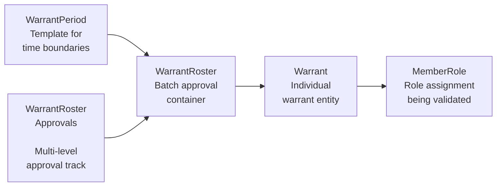
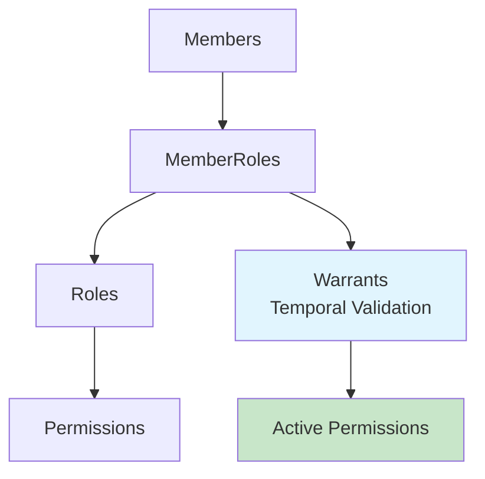
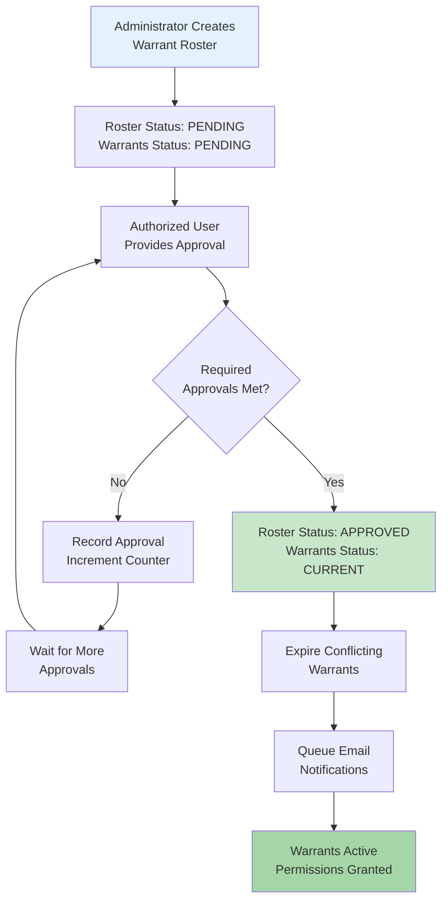
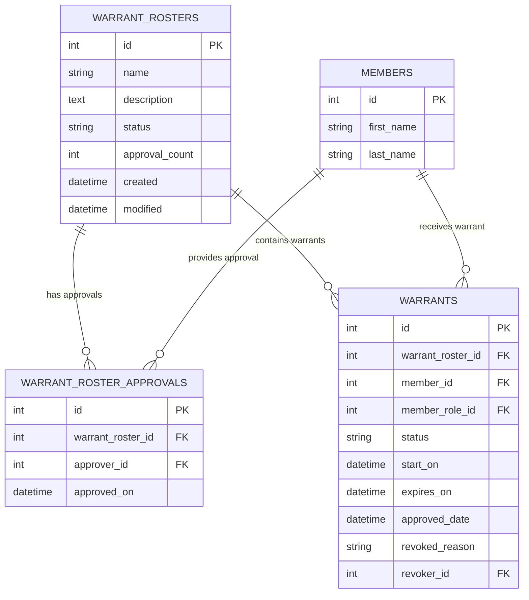
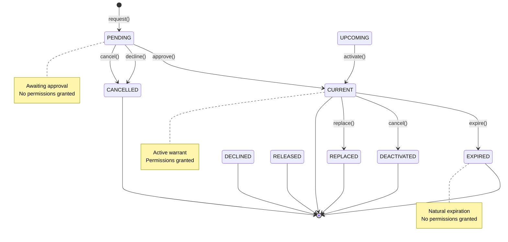

# 4.3 Warrant Lifecycle - Complete State Machine and Approval Process

**Version:** 1.0  
**Created:** July 16, 2025  
**Status:** Comprehensive documentation based on source code analysis  

## Overview

The KMP Warrant System provides temporal validation for Role-Based Access Control (RBAC) permissions through a sophisticated state machine and multi-level approval process. Warrants serve as time-bounded authorization that determines when role-based permissions are actually active and enforceable in the system.

## Table of Contents

1. [Warrant Architecture](#41-warrant-architecture)
2. [Entity Status Definitions](#42-entity-status-definitions)
3. [Warrant Lifecycle States](#43-warrant-lifecycle-states)
4. [Approval Workflow Process](#44-approval-workflow-process)
5. [RBAC Integration](#45-rbac-integration)
6. [State Transitions](#46-state-transitions)
7. [Administrative Operations](#47-administrative-operations)
8. [Security Architecture](#48-security-architecture)
9. [Performance Considerations](#49-performance-considerations)
10. [Integration Examples](#410-integration-examples)

## 4.1 Warrant Architecture

### Core Components

The warrant system consists of four primary entities that work together to provide temporal validation:



### RBAC Integration Flow



When `KMP.RequireActiveWarrantForSecurity` is enabled, the PermissionsLoader validates permissions only when:
- Member has the role assignment (MemberRole)
- AND there's an active warrant for that role assignment
- AND the warrant is within its valid time period
- AND the warrant status is 'Current'

## 4.2 Entity Status Definitions

### Warrant Entity Statuses

Based on `ActiveWindowBaseEntity` and `Warrant` entity constants:

| Status | Source | Description | Permission Impact |
|--------|--------|-------------|-------------------|
| **Pending** | `Warrant::PENDING_STATUS` | Awaiting approval through warrant roster system | No permissions granted |
| **Current** | `ActiveWindowBaseEntity::CURRENT_STATUS` | Active and providing temporal validation | Permissions granted if within time period |
| **Upcoming** | `ActiveWindowBaseEntity::UPCOMING_STATUS` | Scheduled for future activation | No permissions granted yet |
| **Expired** | `ActiveWindowBaseEntity::EXPIRED_STATUS` | Past expiration date | No permissions granted |
| **Deactivated** | `ActiveWindowBaseEntity::DEACTIVATED_STATUS` | Administratively terminated before expiration | No permissions granted |
| **Cancelled** | `ActiveWindowBaseEntity::CANCELLED_STATUS` | Cancelled during pending state before activation | No permissions granted |
| **Declined** | `Warrant::DECLINED_STATUS` | Rejected during approval process | No permissions granted |
| **Replaced** | `ActiveWindowBaseEntity::REPLACED_STATUS` | Superseded by newer warrant for same entity/member | No permissions granted |
| **Released** | `ActiveWindowBaseEntity::RELEASED_STATUS` | Explicitly released/terminated | No permissions granted |

### Warrant Roster Statuses

Based on `WarrantRoster` entity constants:

| Status | Constant | Description | Workflow State |
|--------|----------|-------------|----------------|
| **Pending** | `WarrantRoster::STATUS_PENDING` | Awaiting required approvals | Active approval workflow |
| **Approved** | `WarrantRoster::STATUS_APPROVED` | Has received required approvals | Warrants activated |
| **Declined** | `WarrantRoster::STATUS_DECLINED` | Rejected during approval process | Warrants cancelled |

## 4.3 Warrant Lifecycle States

### 1. Request Phase

**Initial State:** None (warrants don't exist yet)

**Process:** WarrantManager creates warrant roster and individual warrants

```php
// From DefaultWarrantManager::request()
$warrantRoster->status = WarrantRoster::STATUS_PENDING;
$warrantRequestEntity->status = Warrant::PENDING_STATUS;
```

**Validation Checks:**
- Member must be warrantable (`$member->warrantable != null`)
- Warrant period must not exceed membership expiration
- Valid warrant period must exist

**Database Transaction:** Ensures atomicity of roster and warrant creation

### 2. Pending Approval Phase

**State:** `Warrant::PENDING_STATUS`

**Characteristics:**
- Warrant exists but provides no permissions
- Part of a WarrantRoster awaiting approvals
- Can be viewed and managed through administrative interface
- Subject to approval workflow requirements

**Approval Requirements:**
- Configurable number of approvals required (from `StaticHelpers::getAppSetting('Warrant.RosterApprovalsRequired', '2')`)
- Each approval recorded in `WarrantRosterApprovals` table
- Approval count tracked in `WarrantRoster.approval_count`

### 3. Approval Transition

**Trigger:** `WarrantManager::approve()` when required approvals met

**Process from DefaultWarrantManager:**
```php
if ($warrantRoster->hasRequiredApprovals()) {
    $warrantRoster->status = WarrantRoster::STATUS_APPROVED;
    foreach ($warrants as $warrant) {
        $warrant->status = Warrant::CURRENT_STATUS;
        $warrant->approved_date = new DateTime();
        
        // Adjust start date if period already began
        if ($warrant->start_on == null || $warrantStart < $now) {
            $warrant->start_on = $now;
        }
        
        // Expire conflicting warrants
        $warrantTable->updateAll([
            'expires_on' => $warrant->start_on,
            'revoked_reason' => 'New Warrant Approved',
            'revoker_id' => $approver_id,
        ], [/* matching criteria */]);
    }
}
```

**Automatic Actions:**
- All pending warrants in roster become `CURRENT_STATUS`
- Start dates adjusted to current time if already past
- Conflicting warrants automatically expired
- Email notifications queued for warrant recipients

### 4. Active Phase

**State:** `ActiveWindowBaseEntity::CURRENT_STATUS`

**Characteristics:**
- Warrant provides temporal validation for RBAC permissions
- Subject to date range validation (`start_on` <= now < `expires_on`)
- Integrated with PermissionsLoader for security enforcement
- Can be administratively revoked or cancelled

**Permission Validation Query Pattern:**
```php
$warrantSubquery = $warrantsTable->find()
    ->select(['Warrants.member_role_id'])
    ->where([
        'Warrants.start_on <' => $now,      // Warrant has started
        'Warrants.expires_on >' => $now,    // Warrant hasn't expired
        'Warrants.status' => Warrant::CURRENT_STATUS,  // Warrant is active
    ]);
```

### 5. Expiration and Termination States

**Natural Expiration:**
- Automatic transition to `EXPIRED_STATUS` when `expires_on` date reached
- Handled by `SyncActiveWindowStatusesCommand` (`bin/cake sync_active_window_statuses`), which transitions entities from `CURRENT_STATUS` to `EXPIRED_STATUS` when `expires_on` has passed

**Administrative Termination:**
- `cancel()` method sets early expiration date and revocation reason
- `decline()` method marks entire roster as declined, warrants as cancelled
- `declineSingleWarrant()` method cancels individual warrants within roster

**Replacement:**
- New warrants automatically expire conflicting warrants
- Previous warrants marked as `REPLACED_STATUS` or expired

## 4.4 Approval Workflow Process

### Multi-Level Approval System



1. **Warrant Roster Creation**
   - Administrator creates roster with multiple warrant requests
   - Roster status: `STATUS_PENDING`
   - Individual warrants status: `PENDING_STATUS`
   - Approval requirement set from configuration

2. **Approval Collection**
   - Authorized users provide approvals via `WarrantRostersController::approve()`
   - Each approval recorded in `WarrantRosterApprovals` table
   - Approval count incremented on roster

3. **Threshold Validation**
   - `WarrantRoster::hasRequiredApprovals()` checks approval count
   - When threshold met, roster status becomes `STATUS_APPROVED`

4. **Warrant Activation**
   - All pending warrants transition to `CURRENT_STATUS`
   - Automatic conflict resolution expires overlapping warrants
   - Email notifications sent to warrant recipients

### Approval Tracking

**Database Schema:**


**Business Rules:**
- Same approver cannot approve multiple times
- Approval threshold configurable per system
- Complete audit trail of approval decisions

## 4.5 RBAC Integration

### Permission Validation Chain

When warrant-secured permissions are checked:

1. **Role Assignment Check:** Verify member has role through `MemberRole`
2. **Permission Check:** Verify role has required permission
3. **Warrant Validation:** If permission requires warrant, validate:
   - Active warrant exists for the member role assignment
   - Warrant status is `CURRENT_STATUS`
   - Current time within warrant's `start_on` and `expires_on` range
4. **Additional Validation:** Membership status, age requirements, etc.

### Configuration Control

**Warrant Requirement Toggle:**
- `KMP.RequireActiveWarrantForSecurity` - Global enable/disable
- Individual permissions can require warrants via `requires_warrant` flag
- Granular control per permission type and scope

### Security Enforcement

**PermissionsLoader Integration:**
```php
// Warrant validation subquery integrated into permission checking
$warrantSubquery = $warrantsTable->find()
    ->select(['member_role_id'])
    ->where([
        'start_on <' => $now,
        'expires_on >' => $now,
        'status' => Warrant::CURRENT_STATUS
    ]);

// Only member roles with valid warrants grant permissions
$memberRolesQuery->where(['MemberRoles.id IN' => $warrantSubquery]);
```

## 4.6 State Transitions

### Valid State Transitions



### Transition Triggers

| Transition | Method | Actor | Validation |
|------------|--------|-------|------------|
| None → Pending | `request()` | Administrator | Member warrantability, period validity |
| Pending → Current | `approve()` | Approver | Required approvals met |
| Pending → Cancelled | `decline()` or `cancel()` | Administrator | Roster status validation |
| Current → Expired | Automatic | System | Date-based expiration |
| Current → Deactivated | `cancel()` | Administrator | Manual termination |
| Current → Replaced | `approve()` new warrant | System | Conflict resolution |

## 4.7 Administrative Operations

### WarrantManager Service Methods

**Request Creation:**
```php
public function request($request_name, $desc, $warrantRequests): ServiceResult
```
- Creates warrant roster with batch of warrant requests
- Validates member eligibility and warrant periods
- Uses database transactions for atomicity

**Approval Processing:**
```php
public function approve($warrant_roster_id, $approver_id): ServiceResult
```
- Records approval vote for warrant roster
- Activates warrants when threshold met
- Handles automatic conflict resolution and notifications

**Decline Operations:**
```php
public function decline($warrant_roster_id, $rejecter_id, $reason): ServiceResult
```
- Rejects entire warrant roster
- Cancels all contained warrants
- Records decline reason in audit trail

**Individual Warrant Management:**
```php
public function cancel($warrant_id, $reason, $rejecter_id, $expiresOn): ServiceResult
public function cancelByEntity($entityType, $entityId, $reason, $rejecter_id, $expiresOn): ServiceResult
```
- Terminate specific warrants independent of roster
- Support for entity-based warrant cancellation
- Complete audit trail with revocation reasons

### Controller Operations

**WarrantRostersController methods:**
- `index()` - Dashboard and navigation interface
- `allRosters($state)` - Filtered roster listing with pagination
- `view($id)` - Detailed roster view with approval tracking
- `add()` - Create new warrant roster
- `edit($id)` - Modify existing roster
- `approve($id)` - Process roster approval
- `decline($id)` - Decline entire roster
- `declineWarrantInRoster($roster_id, $warrant_id)` - Individual warrant decline

## 4.8 Security Architecture

### Authorization Controls

**Policy-Based Access:**
- All warrant operations subject to authorization policies
- Entity-level authorization on specific warrants and rosters
- Branch scoping ensures organizational data isolation

**Request Security:**
- POST-only requirements for state-changing operations
- CSRF protection through request method validation
- Identity verification for all approval operations

### Audit Trail

**Complete Tracking:**
- All warrant state changes logged with user identity
- Approval decisions recorded with timestamps
- Revocation reasons and administrative actions tracked

**Database Audit Fields:**
- `created_by`, `modified_by` - User accountability
- `created`, `modified` - Timestamp tracking
- `revoked_reason`, `revoker_id` - Termination audit
- `approved_date` - Approval timestamp

### Data Integrity

**Transactional Operations:**
- Warrant roster creation uses database transactions
- Approval processing ensures atomicity
- Conflict resolution prevents data corruption

**Validation Rules:**
- Member warrantability requirements
- Temporal consistency between warrants and membership
- Approval threshold enforcement

## 4.9 Performance Considerations

### Database Optimization

**Indexing Strategy:**
- Temporal queries optimized with date range indexes
- Member role associations indexed for permission validation
- Status fields indexed for state filtering

**Query Optimization:**
- Subquery patterns for warrant validation
- Selective field loading for list views
- Efficient joins for related data

### Caching Integration

**Security Cache:**
- Warrant changes trigger security cache invalidation
- Permission validation results cached where appropriate
- Branch-scoped cache invalidation for organizational data

**Performance Monitoring:**
- Dashboard metrics for pending warrant counts
- Navigation badge integration for administrative alerts
- Optimized counting queries for status indicators

## 4.10 Integration Examples

### Creating Warrant Requests

```php
// Create warrant roster with multiple requests
$requests = [
    new WarrantRequest(
        'Branch Officer',           // name
        'Branches',                // entity_type
        $branchId,                 // entity_id
        $requesterId,              // requester_id
        $memberId,                 // member_id
        $startDate,                // start_on
        $endDate,                  // expires_on
        $memberRoleId              // member_role_id
    ),
];

$result = $warrantManager->request(
    'Q2 Officer Appointments',     // roster name
    'Quarterly officer appointments', // description
    $requests                      // warrant requests array
);
```

### Processing Approvals

```php
// Approve warrant roster
$result = $warrantManager->approve($rosterId, $approverId);

if ($result->success) {
    // Check if roster now has required approvals
    $roster = $warrantsTable->get($rosterId);
    if ($roster->hasRequiredApprovals()) {
        // All warrants are now active
    }
}
```

### Permission Validation

```php
// Check warrant-secured permission
$hasPermission = $member->checkCan('manage.events', 'Activities');

// This internally validates:
// 1. Member has role with 'manage.events' permission
// 2. Valid warrant exists for the role assignment (if required)
// 3. Warrant is in CURRENT_STATUS and within time bounds
// 4. All other permission requirements met
```

### Administrative Operations

```php
// Cancel specific warrant
$result = $warrantManager->cancel(
    $warrantId,                    // warrant ID
    'Officer resigned',            // reason
    $revokerId,                    // revoker ID
    new DateTime('+1 day')         // expiration date
);

// Decline entire roster
$result = $warrantManager->decline(
    $rosterId,                     // roster ID
    $rejectorId,                   // rejector ID
    'Insufficient qualifications'  // reason
);
```

---

## Summary

The KMP Warrant System provides a comprehensive temporal validation layer for RBAC permissions through:

1. **Multi-State Lifecycle:** Nine distinct states managing warrant progression from request through termination
2. **Approval Workflows:** Configurable multi-level approval system with complete audit trail
3. **RBAC Integration:** Seamless integration with permission validation for temporal security
4. **Administrative Control:** Comprehensive management interface with batch operations
5. **Security Architecture:** Policy-based authorization with complete audit trail and data integrity
6. **Performance Optimization:** Efficient database queries and caching integration

This system ensures that role-based permissions are only active when explicitly warranted and approved, providing temporal bounds and administrative oversight for sensitive system operations.

**Source Documentation:** This document is based entirely on analysis of the KMP source code, including entity definitions, service implementations, controller operations, and database schema as documented in the warrant system components.
