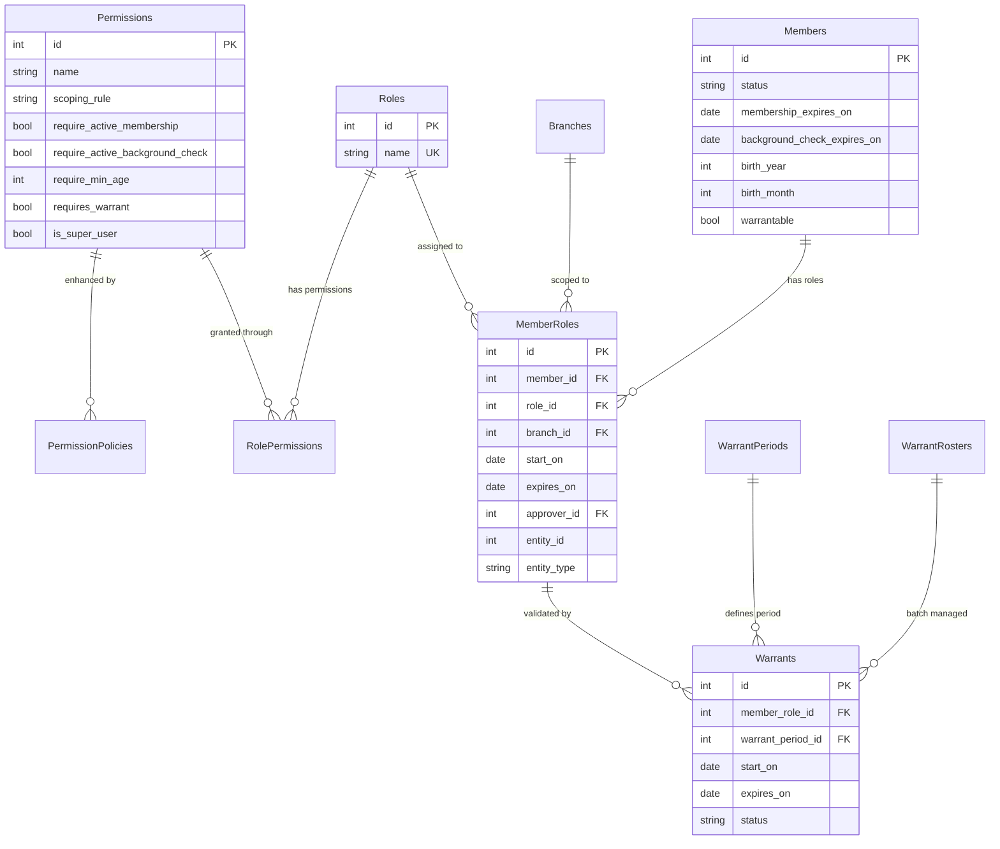
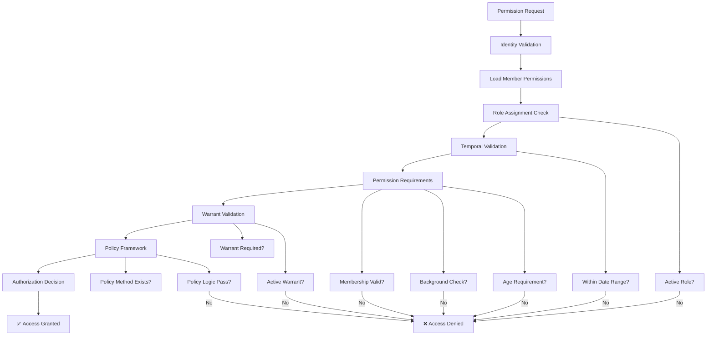
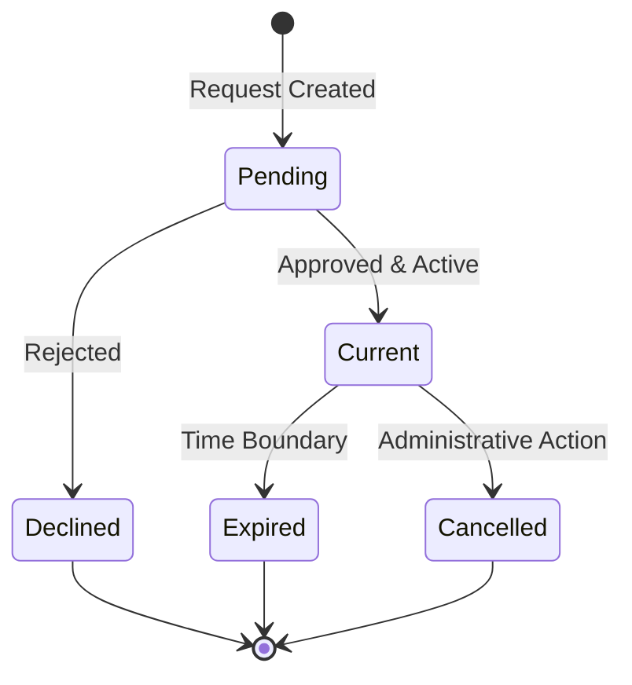

# KMP RBAC Security Architecture Guide

## Table of Contents

1. [Overview](#overview)
2. [Core Architecture](#core-architecture)
3. [Security Components](#security-components)
4. [Validation Chain](#validation-chain)
5. [Permission Scoping](#permission-scoping)
6. [Warrant Integration](#warrant-integration)
7. [Policy Framework](#policy-framework)
8. [Implementation Examples](#implementation-examples)
9. [Security Considerations](#security-considerations)
10. [Performance Optimization](#performance-optimization)
11. [Troubleshooting](#troubleshooting)

---

## Overview

The Kingdom Management Portal (KMP) implements a sophisticated Role-Based Access Control (RBAC) system with temporal validation layers and warrant-based security enforcement. This system provides fine-grained authorization control across the hierarchical SCA organizational structure while maintaining security, performance, and flexibility.

### Core Principles

- **Defense in Depth**: Multiple validation layers prevent privilege escalation
- **Temporal Security**: Time-bounded permissions prevent expired credential usage  
- **Hierarchical Scope**: Branch-based permissions respect organizational boundaries
- **Warrant Validation**: Additional security layer for sensitive operations
- **Policy Integration**: Dynamic authorization through custom policy classes

### Key Features

- ✅ **Five-Layer Validation Chain**: Identity, roles, permissions, warrants, policies
- ✅ **Three-Tier Scoping**: Global, Branch Only, Branch and Children
- ✅ **Temporal Validation**: Time-bounded role assignments and warrant periods
- ✅ **Configurable Security**: Optional warrant requirements for enhanced protection
- ✅ **Performance Optimized**: Multi-tier caching with intelligent invalidation
- ✅ **Branch Hierarchy**: Respects SCA organizational structure and inheritance

---

## Core Architecture

### RBAC Entity Relationship



### Authorization Flow



---

## Security Components

### 1. Member Identity System

**Entity**: `app/src/Model/Entity/Member.php`

The Member entity serves as the identity foundation, implementing the `KmpIdentityInterface` for authentication and authorization integration.

#### Key Security Properties

```php
// Member status validation - actual constants from source code
const STATUS_ACTIVE = 'active';
const STATUS_DEACTIVATED = 'deactivated';
const STATUS_VERIFIED_MEMBERSHIP = 'verified';
const STATUS_UNVERIFIED_MINOR = 'unverified minor';
const STATUS_MINOR_MEMBERSHIP_VERIFIED = '< 18 member verified';
const STATUS_MINOR_PARENT_VERIFIED = '< 18 parent verified';
const STATUS_VERIFIED_MINOR = 'verified < 18';
```

#### Critical Validation Points

- **Status Verification**: Only verified members can receive permissions
- **Membership Expiration**: `membership_expires_on` must be future
- **Background Check**: `background_check_expires_on` validated when required
- **Age Verification**: `birth_year` and `birth_month` for age-based restrictions
- **Warrant Eligibility**: `warrantable` flag controls warrant assignment

### 2. Role Management System

**Entities**: 
- `app/src/Model/Entity/Role.php`
- `app/src/Model/Table/RolesTable.php`

Roles serve as permission containers with time-bounded assignment capability.

#### Role Architecture

```php
// Role entity core properties
class Role extends BaseEntity
{
    protected array $_accessible = [
        'name' => true,
        'permissions' => true,
        'members' => true
    ];
}
```

#### Association Structure

- **Role ↔ Permissions**: Many-to-many through `roles_permissions`
- **Role ↔ Members**: Many-to-many through `MemberRoles` (time-bounded)
- **Temporal Assignments**: `start_on` and `expires_on` dates
- **Approval Tracking**: `approver_id` for accountability

### 3. Permission System

**Entities**:
- `app/src/Model/Entity/Permission.php`
- `app/src/Model/Table/PermissionsTable.php`

Permissions define atomic access rights with complex validation requirements.

#### Permission Types & Scoping

```php
// Scoping constants from Permission entity
const SCOPE_GLOBAL = 'global';
const SCOPE_BRANCH_ONLY = 'branch_only';
const SCOPE_BRANCH_AND_CHILDREN = 'branch_and_children';
```

#### Validation Requirements

```php
// Permission validation flags
$permission->require_active_membership    // SCA membership required
$permission->require_active_background_check  // Background check required
$permission->require_min_age             // Minimum age requirement
$permission->requires_warrant            // Active warrant required
$permission->is_super_user               // Super user permission
$permission->is_system                   // System-level permission
```

### 4. Warrant System (Temporal Validation Layer)

**Entities**:
- `app/src/Model/Entity/Warrant.php`
- `app/src/Model/Entity/WarrantPeriod.php`
- `app/src/Model/Entity/WarrantRoster.php`

Warrants provide an additional temporal validation layer for sensitive permissions.

#### Warrant Status Management

```php
// Warrant status constants
const CURRENT_STATUS = 'current';
const PENDING_STATUS = 'pending';
const DECLINED_STATUS = 'declined';
const EXPIRED_STATUS = 'expired';
const CANCELLED_STATUS = 'cancelled';
```

#### Warrant Validation Logic

- **Temporal Boundaries**: `start_on` < now < `expires_on`
- **Status Verification**: Must be `CURRENT_STATUS`
- **Role Linkage**: Linked to specific `member_role_id`
- **Period Association**: Linked to valid `warrant_period_id`

---

## Validation Chain

### Core Security Engine: PermissionsLoader

**File**: `app/src/KMP/PermissionsLoader.php`

The PermissionsLoader implements the core RBAC security engine with five-layer validation:

#### 1. Member Identity Validation

```php
// Identity verification in validPermissionClauses()
->where([
    'OR' => [
        'Permissions.require_active_membership' => false,
        'AND' => [
            'Members.status IN ' => [
                Member::STATUS_VERIFIED_MEMBERSHIP,  // 'verified'
                Member::STATUS_VERIFIED_MINOR,       // 'verified < 18'
                Member::STATUS_ACTIVE,               // 'active'
            ],
            'Members.membership_expires_on >' => DateTime::now(),
        ],
    ],
])
```

#### 2. Role Assignment Temporal Validation

```php
// Role assignment time bounds
->where([
    'MemberRoles.start_on < ' => DateTime::now(),
    'OR' => [
        'MemberRoles.expires_on IS ' => null,  // Permanent assignment
        'MemberRoles.expires_on >' => DateTime::now(),
    ],
])
```

#### 3. Permission Requirement Validation

**Background Check Validation**:
```php
->where([
    'OR' => [
        'Permissions.require_active_background_check' => false,
        'Members.background_check_expires_on >' => DateTime::now(),
    ],
])
```

**Age-Based Access Control**:
```php
->where([
    'OR' => [
        'Permissions.require_min_age' => 0,
        'AND' => [
            'Members.birth_year = ' . strval($now->year) . ' - Permissions.require_min_age',
            'Members.birth_month <=' => $now->month,
        ],
        'Members.birth_year < ' . strval($now->year) . ' - Permissions.require_min_age',
    ],
])
```

#### 4. Warrant Temporal Validation (Configurable)

```php
// Configurable warrant validation
$useWarrant = StaticHelpers::getAppSetting('KMP.RequireActiveWarrantForSecurity');
if (strtolower($useWarrant) == 'yes') {
    $warrantSubquery = $warrantsTable->find()
        ->select(['Warrants.member_role_id'])
        ->where([
            'Warrants.start_on <' => $now,
            'Warrants.expires_on >' => $now,
            'Warrants.status' => Warrant::CURRENT_STATUS,
        ]);
        
    $q = $q->where([
        'OR' => [
            'Permissions.requires_warrant' => false,
            'AND' => [
                'Members.warrantable' => true,
                'MemberRoles.id IN' => $warrantSubquery,
            ],
        ],
    ]);
}
```

#### 5. Policy Framework Integration

**Dynamic Policy Discovery**:
```php
// From getApplicationPolicies() method
foreach ($paths as $policyPath) {
    $iterator = new RecursiveIteratorIterator(
        new RecursiveDirectoryIterator($path)
    );
    foreach ($iterator as $file) {
        if ($file->isFile() && $file->getExtension() === 'php') {
            require_once $file->getPathname();
        }
    }
}
```

---

## Permission Scoping

### Branch-Based Security Model

The KMP system implements hierarchical permission scoping based on SCA organizational structure:

#### SCOPE_GLOBAL
- **Access Level**: System-wide without branch restrictions
- **Use Cases**: System administration, global reporting, super user functions
- **Security Risk**: Highest privilege level - use sparingly
- **Implementation**: `branch_ids = null` in permission structure

```php
// Global permission example
$permission = [
    'name' => 'System Administration',
    'scoping_rule' => Permission::SCOPE_GLOBAL,
    'branch_ids' => null,  // No branch restrictions
    'is_super_user' => true
];
```

#### SCOPE_BRANCH_ONLY  
- **Access Level**: Limited to specific branch only
- **Use Cases**: Local event management, branch-specific reporting
- **Security**: Isolated to single organizational unit
- **Implementation**: Specific branch IDs in permission structure

```php
// Branch-only permission example
$permission = [
    'name' => 'Manage Local Events',
    'scoping_rule' => Permission::SCOPE_BRANCH_ONLY,
    'branch_ids' => [5, 12, 23],  // Specific branch IDs only
];
```

#### SCOPE_BRANCH_AND_CHILDREN
- **Access Level**: Extends to child branches in hierarchy
- **Use Cases**: Regional administration, hierarchical reporting
- **Security**: Cascading permissions down organizational tree
- **Implementation**: Branch and descendant IDs automatically calculated

```php
// Hierarchical permission processing in PermissionsLoader
case Permission::SCOPE_BRANCH_AND_CHILDREN:
    $descendants = $branchTable->getAllDecendentIds($branch_id);
    $descendants[] = $branch_id; // Include the branch itself
    $permissions[$permission->id]->branch_ids = $descendants;
    break;
```

### Branch Hierarchy Integration

The branch scoping system integrates with the nested set model hierarchy:

```php
// From BranchesTable - getAllDecendentIds() method
public function getAllDecendentIds(int $id): array
{
    $cacheKey = 'branch_descendants_' . $id;
    $cached = Cache::read($cacheKey, static::CACHE_CONFIG);
    if ($cached !== null) {
        return $cached;
    }
    
    // Query descendant branches using nested set model
    $branch = $this->get($id);
    $descendants = $this->find()
        ->where([
            'lft >' => $branch->lft,
            'rght <' => $branch->rght
        ])
        ->select(['id'])
        ->toArray();
        
    $ids = collection($descendants)->extract('id')->toArray();
    Cache::write($cacheKey, $ids, static::CACHE_CONFIG);
    return $ids;
}
```

---

## Warrant Integration

### Warrant as Temporal Validation Layer

Warrants provide an additional security layer for sensitive permissions, adding temporal validation beyond role assignments.

#### Warrant Lifecycle



#### Warrant-Secured Permission Flow

```php
// From PermissionsLoader validPermissionClauses()
if (strtolower($useWarrant) == 'yes') {
    $warrantSubquery = $warrantsTable->find()
        ->select(['Warrants.member_role_id'])
        ->where([
            'Warrants.start_on <' => $now,           // Warrant has started
            'Warrants.expires_on >' => $now,         // Warrant hasn't expired  
            'Warrants.status' => Warrant::CURRENT_STATUS, // Warrant is active
        ]);
        
    $q = $q->where([
        'OR' => [
            'Permissions.requires_warrant' => false, // Permission doesn't require warrant
            'AND' => [
                'Members.warrantable' => true,              // Member is warrant-eligible
                'MemberRoles.id IN' => $warrantSubquery,    // Role has active warrant
            ],
        ],
    ]);
}
```

#### Configuration Control

```php
// App setting in config/app.php
'KMP' => [
    'RequireActiveWarrantForSecurity' => 'yes' // Enable warrant validation
]
```

### Warrant Management Components

#### WarrantPeriod Entity
- **Purpose**: Defines temporal boundaries for warrant validity
- **Features**: Period templates, organizational constraints, name generation
- **Integration**: Links warrants to specific time periods

#### WarrantRoster Entity  
- **Purpose**: Batch warrant management with multi-level approval
- **Features**: Approval workflow, status tracking, batch operations
- **Security**: Administrative oversight and accountability

#### Warrant Processing Service
**File**: `app/src/Services/WarrantManager/WarrantManagerInterface.php`

```php
interface WarrantManagerInterface
{
    public function requestWarrant(WarrantRequest $request): ServiceResult;
    public function approveWarrant(int $warrantId, int $approverId): ServiceResult;
    public function declineWarrant(int $warrantId, int $approverId, string $reason): ServiceResult;
    public function cancelWarrant(int $warrantId, int $cancellerId, string $reason): ServiceResult;
}
```

---

## Policy Framework

### Dynamic Authorization Integration

The policy framework provides method-level authorization granularity through custom policy classes.

#### PermissionPolicy Entity

**File**: `app/src/Model/Entity/PermissionPolicy.php`

```php
/**
 * Permission Policy Entity - Dynamic Authorization Framework
 * 
 * Links permissions to specific policy classes and methods for fine-grained authorization control.
 */
class PermissionPolicy extends BaseEntity
{
    protected array $_accessible = [
        'permission_id' => true,
        'policy_class' => true,    // Full class name (e.g., 'App\Policy\MemberPolicy')
        'policy_method' => true,   // Method name (e.g., 'canEdit')
    ];
}
```

#### Policy Discovery and Registration

```php
// From PermissionsLoader getApplicationPolicies()
public static function getApplicationPolicies(): array
{
    $paths = [];
    
    // Application policies: app/src/Policy/
    $appPolicyPath = realpath(__DIR__ . '/../Policy');
    if ($appPolicyPath !== false) {
        $paths[] = $appPolicyPath;
    }
    
    // Plugin policies: app/plugins/*/src/Policy/
    $pluginPolicyDirs = glob(__DIR__ . '/../../plugins/*/src/Policy', GLOB_ONLYDIR);
    foreach ($pluginPolicyDirs as $dir) {
        $realDir = realpath($dir);
        if ($realDir !== false) {
            $paths[] = $realDir;
        }
    }
    
    // Discover and analyze policy classes
    $policyClasses = [];
    foreach (get_declared_classes() as $class) {
        $reflector = new ReflectionClass($class);
        $methods = [];
        
        foreach ($reflector->getMethods(ReflectionMethod::IS_PUBLIC) as $method) {
            // Only include methods starting with 'can'
            if (preg_match('/^can/', $method->getName())) {
                $methods[] = $method->getName();
            }
        }
        
        if (!empty($methods)) {
            $policyClasses[$class] = $methods;
        }
    }
    
    return $policyClasses;
}
```

#### Policy Integration Example

```php
// Permission with policy association
$permission = [
    'name' => 'Edit Member Profiles',
    'scoping_rule' => Permission::SCOPE_BRANCH_ONLY,
    'policies' => [
        'App\Policy\MemberPolicy' => [
            'canEdit' => $policyId
        ]
    ]
];

// Policy method implementation
class MemberPolicy extends BasePolicy
{
    public function canEdit(Member $user, Member $target): bool
    {
        // Custom authorization logic
        if ($user->hasRole('Admin')) {
            return true;
        }
        
        if ($user->id === $target->id) {
            return true; // Users can edit their own profiles
        }
        
        return false;
    }
}
```

---

## Implementation Examples

### Basic Permission Checking

```php
// Controller authorization example
public function edit($id)
{
    $member = $this->Members->get($id);
    
    // Check permission through authorization service
    $this->Authorization->authorize($member, 'edit');
    
    // Continue with edit logic
}
```

### Advanced Permission Loading

```php
// Load complete permission set for member
$permissions = PermissionsLoader::getPermissions($memberId);

// Check specific permission with branch scope
if (isset($permissions[$permissionId])) {
    $permission = $permissions[$permissionId];
    
    if ($permission->scoping_rule === Permission::SCOPE_GLOBAL || 
        in_array($currentBranchId, $permission->branch_ids)) {
        // Permission granted
        return true;
    }
}

return false;
```

### Policy Framework Usage

```php
// Get policy mappings for member
$policies = PermissionsLoader::getPolicies($memberId, [$branchId]);

// Check specific policy method
if (isset($policies['App\Policy\MemberPolicy']['canEdit'])) {
    $policy = $policies['App\Policy\MemberPolicy']['canEdit'];
    
    // Use with CakePHP Authorization plugin
    $result = $this->Authorization->can($entity, 'edit');
}
```

### Warrant-Secured Operations

```php
// Service method requiring warrant validation
public function performSensitiveOperation($memberId, $branchId)
{
    // Load permissions with warrant validation
    $permissions = PermissionsLoader::getPermissions($memberId);
    
    // Check for warrant-secured permission
    foreach ($permissions as $permission) {
        if ($permission->name === 'Sensitive Operation' && 
            $permission->requires_warrant && 
            in_array($branchId, $permission->branch_ids ?? [])) {
            
            // Permission granted with warrant validation
            return $this->executeSensitiveOperation();
        }
    }
    
    throw new UnauthorizedException('Warrant-secured permission required');
}
```

---

## Security Considerations

### Attack Prevention

#### 1. Privilege Escalation Prevention
- **Multiple Validation Layers**: Each layer adds security without single points of failure
- **Temporal Validation**: Prevents expired credential usage
- **Branch Isolation**: Prevents cross-organizational access
- **Warrant Requirements**: Additional security for sensitive operations

#### 2. Data Protection
- **Member Privacy**: Minor protection with data filtering
- **Audit Trails**: Comprehensive logging of all authorization changes
- **Soft Deletion**: Data retention with security through obscurity
- **Cache Security**: Proper cache invalidation prevents stale permissions

#### 3. Configuration Security
```php
// Secure configuration examples
'KMP' => [
    'RequireActiveWarrantForSecurity' => 'yes',  // Enable warrant validation
    'MinPasswordComplexity' => 8,               // Password requirements
    'SessionTimeout' => 3600,                   // Session security
    'FailedLoginAttempts' => 5,                 // Brute force protection
]
```

### Input Validation

#### Permission Creation Validation
```php
// From PermissionsTable validation rules
$validator
    ->requirePresence('name', 'create')
    ->notEmptyString('name')
    ->maxLength('name', 255)
    ->add('scoping_rule', 'inList', [
        'rule' => ['inList', [
            Permission::SCOPE_GLOBAL,
            Permission::SCOPE_BRANCH_ONLY,
            Permission::SCOPE_BRANCH_AND_CHILDREN
        ]]
    ])
    ->boolean('require_active_membership')
    ->boolean('require_active_background_check')
    ->naturalNumber('require_min_age')
    ->boolean('requires_warrant');
```

#### Age Validation Logic
```php
// Complex age validation in PermissionsLoader
->where([
    'OR' => [
        'Permissions.require_min_age' => 0,
        'AND' => [
            // Edge case: Birthday this year but hasn't occurred yet
            'Members.birth_year = ' . strval($now->year) . ' - Permissions.require_min_age',
            'Members.birth_month <=' => $now->month,
        ],
        // Standard case: Birth year is before the required age cutoff
        'Members.birth_year < ' . strval($now->year) . ' - Permissions.require_min_age',
    ],
])
```

---

## Performance Optimization

### Multi-Tier Caching Strategy

#### 1. Permission Caching
```php
// From PermissionsLoader getPermissions()
$cacheKey = 'member_permissions' . $memberId;
$cache = Cache::read($cacheKey, 'member_permissions');
if ($cache) {
    return $cache; // Return cached result if available
}

// ... complex permission loading logic ...

Cache::write($cacheKey, $permissions, 'member_permissions');
```

#### 2. Policy Caching
```php
// Policy mappings cache
$cacheKey = 'permissions_policies' . $id;
$cache = Cache::read($cacheKey, 'member_permissions');
```

#### 3. Branch Hierarchy Caching
```php
// From BranchesTable
$cacheKey = 'branch_descendants_' . $id;
$cached = Cache::read($cacheKey, static::CACHE_CONFIG);
if ($cached !== null) {
    return $cached;
}
```

### Query Optimization

#### 1. Efficient JOIN Strategy
```php
// From PermissionsLoader validPermissionClauses()
$q = $q->innerJoinWith('Roles.Members') // Efficient role-member association
    ->select([
        'Permissions.id',
        'Permissions.name', 
        'Permissions.scoping_rule',
        'MemberRoles.branch_id',
    ])
    ->distinct(); // Prevent duplicate permissions
```

#### 2. Subquery Optimization
```php
// Warrant validation subquery
$warrantSubquery = $warrantsTable->find()
    ->select(['Warrants.member_role_id']) // Only need role linkage
    ->where([
        'Warrants.start_on <' => $now,
        'Warrants.expires_on >' => $now,
        'Warrants.status' => Warrant::CURRENT_STATUS,
    ]);
```

#### 3. Cache Invalidation Strategy

**Three-Tier Cache Invalidation** (from BaseTable):
```php
// Static application-level caches
Cache::clear('branches');
Cache::clear('members');

// Entity-specific caches  
Cache::delete('member_permissions' . $memberId, 'member_permissions');

// Group-based cache clearing
Cache::clearGroup('permissions', 'member_permissions');
```

---

## Troubleshooting

### Common Authorization Issues

#### 1. Permission Not Found
**Symptoms**: User reports access denied for valid operation
**Diagnosis**:
```php
// Debug permission loading
$permissions = PermissionsLoader::getPermissions($memberId);
debug($permissions);

// Check specific permission
if (!isset($permissions[$expectedPermissionId])) {
    // Permission not assigned to user
}
```

**Solutions**:
- Verify role assignment is active (check `start_on`/`expires_on`)
- Confirm permission is assigned to role
- Check member status requirements
- Validate warrant requirements if enabled

#### 2. Branch Scope Issues
**Symptoms**: Permission denied in specific branches
**Diagnosis**:
```php
$permission = $permissions[$permissionId];
echo "Scoping rule: " . $permission->scoping_rule . "\n";
echo "Allowed branches: " . print_r($permission->branch_ids, true) . "\n";
echo "Current branch: " . $currentBranchId . "\n";
```

**Solutions**:
- Verify branch hierarchy is correctly configured
- Check branch descendant calculation
- Confirm member role assignment in correct branch

#### 3. Warrant Validation Failures
**Symptoms**: Permission denied when warrant should be valid
**Diagnosis**:
```php
// Check warrant configuration
$useWarrant = StaticHelpers::getAppSetting('KMP.RequireActiveWarrantForSecurity');
echo "Warrant validation enabled: " . $useWarrant . "\n";

// Check warrant status
$warrant = $warrantsTable->find()
    ->where(['member_role_id' => $memberRoleId])
    ->first();
debug($warrant);
```

**Solutions**:
- Verify warrant status is 'current'
- Check warrant temporal boundaries
- Confirm member is warrantable
- Validate warrant period configuration

#### 4. Cache-Related Issues
**Symptoms**: Stale permissions after role changes
**Solutions**:
```php
// Clear specific member permissions
Cache::delete('member_permissions' . $memberId, 'member_permissions');

// Clear all permission caches
Cache::clearGroup('permissions', 'member_permissions');

// Clear branch hierarchy caches
Cache::clear('branches');
```

### Performance Debugging

#### 1. Slow Permission Loading
**Diagnosis**:
```php
$start = microtime(true);
$permissions = PermissionsLoader::getPermissions($memberId);
$end = microtime(true);
echo "Permission loading took: " . ($end - $start) . " seconds\n";
```

**Optimization**:
- Enable query caching
- Optimize branch hierarchy queries
- Review warrant validation complexity

#### 2. Memory Usage
**Diagnosis**:
```php
echo "Memory usage: " . memory_get_usage(true) / 1024 / 1024 . " MB\n";
echo "Peak memory: " . memory_get_peak_usage(true) / 1024 / 1024 . " MB\n";
```

**Optimization**:
- Use lazy loading for associations
- Implement pagination for large result sets
- Optimize cache key strategies

### Error Logging

```php
// Enable detailed authorization logging
Log::debug('Permission check failed', [
    'member_id' => $memberId,
    'permission' => $permissionName,
    'branch_id' => $branchId,
    'reason' => $failureReason
]);
```

---

## Configuration Reference

### Required App Settings

```php
// config/app.php
'KMP' => [
    // Warrant validation
    'RequireActiveWarrantForSecurity' => 'yes',
    
    // Security settings
    'MinPasswordComplexity' => 8,
    'SessionTimeout' => 3600,
    'FailedLoginAttempts' => 5,
    
    // Cache settings
    'CachePermissions' => true,
    'PermissionCacheTimeout' => 3600,
]
```

### Cache Configuration

```php
// config/app.php Cache section
'member_permissions' => [
    'className' => 'File',
    'path' => CACHE . 'member_permissions' . DS,
    'duration' => '+1 hours',
    'groups' => ['permissions']
],
'permissions' => [
    'className' => 'File', 
    'path' => CACHE . 'permissions' . DS,
    'duration' => '+1 day',
    'groups' => ['permissions']
]
```

This comprehensive RBAC security architecture provides the foundation for secure, scalable, and maintainable authorization within the KMP system, ensuring proper access control across the complex SCA organizational hierarchy while maintaining performance and security standards.

---

*This document is based on the actual implementation documented in the KMP codebase as of July 2025.*
