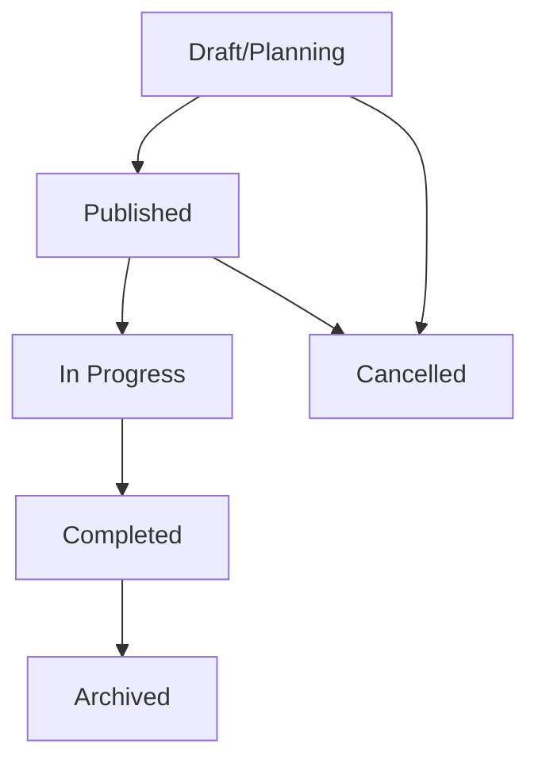
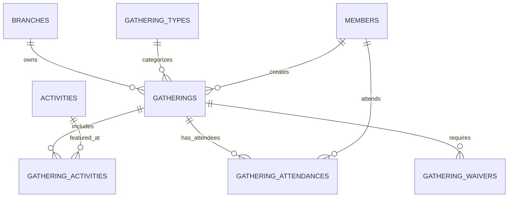

[← Back to Table of Contents](index.md) | [← Back to Core Modules](4-core-modules.md)

# 4.6 Gatherings System

**Last Updated:** October 30, 2025  
**Status:** Complete  
**Module Location:** `app/src/Controller/GatheringsController.php`  

## Overview

The Gatherings system is KMP's comprehensive event management module, enabling kingdoms to plan, organize, track, and manage all types of events from local practices to kingdom-wide tournaments. The system includes calendar views, attendance tracking, location management, activity scheduling, and waiver compliance.

## Table of Contents

- [Core Concepts](#core-concepts)
- [Gathering Lifecycle](#gathering-lifecycle)
- [Database Schema](#database-schema)
- [Calendar Views](#calendar-views)
- [Attendance Tracking](#attendance-tracking)
- [Location & Maps](#location--maps)
- [Activity Management](#activity-management)
- [Waiver Integration](#waiver-integration)
- [Authorization & Security](#authorization--security)
- [User Interface](#user-interface)
- [API Reference](#api-reference)
- [Development Guide](#development-guide)

## Core Concepts

### What is a Gathering?

A **Gathering** in KMP represents any organized event within the kingdom, including:

- **Practices**: Regular local practice sessions
- **Tournaments**: Competitive events
- **Feasts**: Social gatherings and dinners
- **Kingdom Events**: Large multi-day events
- **Workshops**: Educational sessions
- **Court**: Formal court sessions
- **Demos**: Public demonstrations
- **Revels**: Social celebrations

### Key Features

1. **Multi-View Calendar**: Month, week, and list views for event browsing
2. **Attendance System**: Track who's coming to events
3. **Location Management**: Address, map integration, directions
4. **Activity Scheduling**: Define what happens at each gathering
5. **Type-Based Organization**: Categorize events by type with custom colors
6. **Waiver Management**: Track required waivers for activities (via Waivers plugin)
7. **Branch Association**: Events belong to branches in the hierarchy
8. **Multi-Day Support**: Handle events spanning multiple days
9. **Visibility Control**: Public vs. members-only events

## Gathering Lifecycle

### States and Workflow



### Entity Properties

**Gathering Entity:**

```php
// Core Properties
int $id
string $name                   // Event name
string $description           // Full description
int $branch_id               // Owning branch
int $gathering_type_id       // Event type (practice, tourney, etc.)

// Date & Time
Date $start_date             // Event start date
Time $start_time            // Event start time (optional)
Date $end_date              // Event end date (for multi-day)
Time $end_time             // Event end time (optional)

// Location
string $location_name        // Venue name
string $address             // Full address
float $latitude            // GPS coordinates
float $longitude           // GPS coordinates
string $location_notes     // Directions, parking, etc.

// Visibility & Access
bool $is_public             // Visible to non-members
bool $is_cancelled         // Event cancelled
string $cancellation_reason // Why cancelled

// Registration (if applicable)
bool $requires_registration
Date $registration_deadline
int $max_attendees
int $current_attendees

// Metadata
int $created_by
DateTime $created
DateTime $modified

// Virtual Fields
bool $is_multi_day          // end_date != start_date
bool $is_past              // end_date < now
bool $is_upcoming          // start_date > now
bool $is_today            // start_date == today
string $date_range         // "Oct 15-17, 2025"
string $status_display     // Human-readable status
```

### Business Rules

1. **Date Validation**
   - End date must be same or after start date
   - Cannot create gatherings for past dates (unless admin)
   - Multi-day events validated for reasonable duration

2. **Branch Association**
   - Every gathering must belong to a branch
   - Branch determines authorization scope
   - Can view gatherings from child branches

3. **Type Requirements**
   - Must have a gathering type assigned
   - Type determines default color in calendar
   - Type can define activity requirements

4. **Activity Associations**
   - Gatherings can have multiple activities
   - Activities stored in `gathering_activities` junction table
   - Activity types determine waiver requirements

5. **Attendance Rules**
   - Members can mark attendance for upcoming events
   - Can update attendance until event starts
   - Attendance tracked per member per gathering

## Database Schema

### Tables

#### `gatherings`

Primary table storing event information:

```sql
CREATE TABLE gatherings (
    id INT AUTO_INCREMENT PRIMARY KEY,
    name VARCHAR(255) NOT NULL,
    description TEXT,
    branch_id INT NOT NULL,
    gathering_type_id INT NOT NULL,
    
    -- Date & Time
    start_date DATE NOT NULL,
    start_time TIME NULL,
    end_date DATE NULL,
    end_time TIME NULL,
    
    -- Location
    location_name VARCHAR(255),
    address TEXT,
    latitude DECIMAL(10, 8),
    longitude DECIMAL(11, 8),
    location_notes TEXT,
    
    -- Visibility
    is_public BOOLEAN DEFAULT 0,
    is_cancelled BOOLEAN DEFAULT 0,
    cancellation_reason TEXT,
    
    -- Registration
    requires_registration BOOLEAN DEFAULT 0,
    registration_deadline DATE,
    max_attendees INT,
    
    -- Metadata
    created_by INT NOT NULL,
    created DATETIME NOT NULL,
    modified DATETIME NOT NULL,
    
    FOREIGN KEY (branch_id) REFERENCES branches(id),
    FOREIGN KEY (gathering_type_id) REFERENCES gathering_types(id),
    FOREIGN KEY (created_by) REFERENCES members(id),
    
    INDEX idx_branch_id (branch_id),
    INDEX idx_gathering_type_id (gathering_type_id),
    INDEX idx_start_date (start_date),
    INDEX idx_end_date (end_date),
    INDEX idx_is_public (is_public),
    INDEX idx_is_cancelled (is_cancelled)
);
```

#### `gathering_types`

Event type definitions with color coding:

```sql
CREATE TABLE gathering_types (
    id INT AUTO_INCREMENT PRIMARY KEY,
    name VARCHAR(100) NOT NULL,
    description TEXT,
    color VARCHAR(7) DEFAULT '#0d6efd',  -- Hex color for calendar
    icon VARCHAR(50),                     -- Bootstrap icon name
    is_active BOOLEAN DEFAULT 1,
    created DATETIME NOT NULL,
    modified DATETIME NOT NULL,
    
    INDEX idx_is_active (is_active)
);
```

#### `gathering_activities`

Junction table linking gatherings to activities:

```sql
CREATE TABLE gathering_activities (
    id INT AUTO_INCREMENT PRIMARY KEY,
    gathering_id INT NOT NULL,
    activity_id INT NOT NULL,
    notes TEXT,
    
    FOREIGN KEY (gathering_id) REFERENCES gatherings(id) ON DELETE CASCADE,
    FOREIGN KEY (activity_id) REFERENCES activities(id),
    
    UNIQUE KEY unique_gathering_activity (gathering_id, activity_id)
);
```

#### `gathering_attendances`

Attendance tracking:

```sql
CREATE TABLE gathering_attendances (
    id INT AUTO_INCREMENT PRIMARY KEY,
    gathering_id INT NOT NULL,
    member_id INT NOT NULL,
    status VARCHAR(50) DEFAULT 'attending',  -- attending, maybe, not_attending
    notes TEXT,
    created DATETIME NOT NULL,
    modified DATETIME NOT NULL,
    
    FOREIGN KEY (gathering_id) REFERENCES gatherings(id) ON DELETE CASCADE,
    FOREIGN KEY (member_id) REFERENCES members(id) ON DELETE CASCADE,
    
    UNIQUE KEY unique_gathering_member (gathering_id, member_id),
    INDEX idx_status (status)
);
```

### Relationships



## Calendar Views

The calendar system provides three viewing modes for different use cases.

### Month View

Traditional calendar grid showing all gatherings in a month.

**Features:**
- 7-column grid (Sunday-Saturday)
- Color-coded by gathering type
- Multiple gatherings per day
- Visual badges for attendance, location, activities
- Multi-day events span across dates
- Click gathering for quick view modal

**Implementation:**

```php
// Controller action
public function calendar()
{
    $year = $this->request->getQuery('year', date('Y'));
    $month = $this->request->getQuery('month', date('m'));
    $view = $this->request->getQuery('view', 'month');
    
    // Calculate date range (include partial weeks)
    $startDate = (new FrozenDate("$year-$month-01"))
        ->modify('first day of this month')
        ->modify('last Sunday');
    
    $endDate = (new FrozenDate("$year-$month-01"))
        ->modify('last day of this month')
        ->modify('next Saturday');
    
    // Load gatherings
    $gatherings = $this->Gatherings->find()
        ->where([
            'OR' => [
                ['start_date >=' => $startDate, 'start_date <=' => $endDate],
                ['end_date >=' => $startDate, 'end_date <=' => $endDate],
                ['start_date <=' => $startDate, 'end_date >=' => $endDate]
            ]
        ])
        ->contain(['Branches', 'GatheringTypes', 'GatheringActivities'])
        ->order(['start_date' => 'ASC', 'start_time' => 'ASC'])
        ->all();
    
    // Group by date for template
    $gatheringsByDate = [];
    foreach ($gatherings as $gathering) {
        $date = $gathering->start_date->format('Y-m-d');
        if (!isset($gatheringsByDate[$date])) {
            $gatheringsByDate[$date] = [];
        }
        $gatheringsByDate[$date][] = $gathering;
    }
    
    $this->set(compact('gatherings', 'gatheringsByDate', 'year', 'month', 'view'));
}
```

**Template Element:** `templates/element/Gatherings/calendar_month.php`

```php
<div class="calendar-grid">
    <?php foreach ($calendar_days as $day): ?>
        <div class="calendar-day <?= $day['classes'] ?>"
             data-date="<?= h($day['date']) ?>">
            <div class="day-number"><?= $day['day'] ?></div>
            
            <?php if (isset($gatheringsByDate[$day['date']])): ?>
                <?php foreach ($gatheringsByDate[$day['date']] as $gathering): ?>
                    <div class="gathering-item"
                         style="border-left: 3px solid <?= h($gathering->gathering_type->color) ?>"
                         data-action="click->gatherings-calendar#showQuickView"
                         data-gathering-id="<?= $gathering->id ?>">
                        
                        <div class="gathering-name">
                            <?= h($gathering->name) ?>
                        </div>
                        
                        <div class="gathering-badges">
                            <?php if ($gathering->is_attending): ?>
                                <span class="badge bg-success">✓</span>
                            <?php endif; ?>
                            
                            <?php if ($gathering->location_name): ?>
                                <span class="badge bg-info">📍</span>
                            <?php endif; ?>
                            
                            <?php if ($gathering->is_multi_day): ?>
                                <span class="badge bg-warning">📅</span>
                            <?php endif; ?>
                            
                            <?php if (count($gathering->gathering_activities) > 0): ?>
                                <span class="badge bg-secondary">
                                    <?= count($gathering->gathering_activities) ?>
                                </span>
                            <?php endif; ?>
                        </div>
                    </div>
                <?php endforeach; ?>
            <?php endif; ?>
        </div>
    <?php endforeach; ?>
</div>
```

### Week View

Timeline view showing one week at a time.

**Features:**
- Day-by-day layout
- Highlights current day
- Compact gathering cards
- Quick navigation between weeks
- Better for dense schedules

**Template Element:** `templates/element/Gatherings/calendar_week.php`

### List View

Detailed list format showing full gathering information.

**Features:**
- Complete gathering details
- Description text
- All metadata visible
- Direct action buttons
- Pagination for long lists
- Best for searching specific events

**Template Element:** `templates/element/Gatherings/calendar_list.php`

### View Mode Selection

Users can switch between views with navigation buttons:

```php
<div class="view-mode-selector">
    <?= $this->Html->link(
        '<i class="bi bi-calendar-month"></i> Month',
        ['action' => 'calendar', '?' => array_merge($this->request->getQueryParams(), ['view' => 'month'])],
        ['class' => 'btn ' . ($view === 'month' ? 'btn-primary' : 'btn-outline-secondary'), 'escape' => false]
    ) ?>
    
    <?= $this->Html->link(
        '<i class="bi bi-calendar-week"></i> Week',
        ['action' => 'calendar', '?' => array_merge($this->request->getQueryParams(), ['view' => 'week'])],
        ['class' => 'btn ' . ($view === 'week' ? 'btn-primary' : 'btn-outline-secondary'), 'escape' => false]
    ) ?>
    
    <?= $this->Html->link(
        '<i class="bi bi-list-ul"></i> List',
        ['action' => 'calendar', '?' => array_merge($this->request->getQueryParams(), ['view' => 'list'])],
        ['class' => 'btn ' . ($view === 'list' ? 'btn-primary' : 'btn-outline-secondary'), 'escape' => false]
    ) ?>
</div>
```

### Calendar JavaScript Controller

**File:** `assets/js/controllers/gatherings-calendar-controller.js`

```javascript
import { Controller } from "@hotwired/stimulus"

class GatheringsCalendarController extends Controller {
    static values = {
        year: Number,
        month: Number,
        view: String
    }
    
    /**
     * Show quick view modal for a gathering
     */
    async showQuickView(event) {
        event.preventDefault();
        const gatheringId = event.currentTarget.dataset.gatheringId;
        
        // Load gathering details via Turbo Frame
        const turboFrame = document.getElementById('gatheringQuickView');
        turboFrame.src = `/gatherings/view/${gatheringId}?modal=1`;
        
        // Show modal
        const modal = new bootstrap.Modal(
            document.getElementById('gatheringQuickViewModal')
        );
        modal.show();
    }
    
    /**
     * Mark attendance for a gathering
     */
    async markAttendance(event) {
        event.preventDefault();
        const gatheringId = event.target.dataset.gatheringId;
        
        try {
            const response = await fetch(
                `/gathering-attendances/mark/${gatheringId}`,
                {
                    method: 'POST',
                    headers: {
                        'X-CSRF-Token': this.csrfToken,
                        'Content-Type': 'application/json'
                    }
                }
            );
            
            if (response.ok) {
                // Update UI to show attendance badge
                this.updateAttendanceBadge(gatheringId, true);
            }
        } catch (error) {
            console.error('Failed to mark attendance:', error);
        }
    }
}

if (!window.Controllers) {
    window.Controllers = {};
}
window.Controllers["gatherings-calendar"] = GatheringsCalendarController;
```

### Filtering System

Calendar views support powerful filtering:

**Available Filters:**
- **Branch**: Show only gatherings from specific branch(es)
- **Gathering Type**: Filter by event type
- **Activity**: Show gatherings with specific activities
- **Date Range**: Custom date range selection

**Filter Sidebar:**

```php
<div class="calendar-filters">
    <?= $this->Form->create(null, ['type' => 'get', 'class' => 'filter-form']) ?>
    
    <?= $this->Form->control('branch_id', [
        'label' => 'Branch',
        'type' => 'select',
        'options' => $branches,
        'empty' => 'All Branches',
        'class' => 'form-select'
    ]) ?>
    
    <?= $this->Form->control('gathering_type_id', [
        'label' => 'Event Type',
        'type' => 'select',
        'options' => $gatheringTypes,
        'empty' => 'All Types',
        'class' => 'form-select'
    ]) ?>
    
    <?= $this->Form->control('activity_id', [
        'label' => 'Activity',
        'type' => 'select',
        'options' => $activities,
        'empty' => 'All Activities',
        'class' => 'form-select'
    ]) ?>
    
    <div class="d-grid gap-2">
        <?= $this->Form->button('Apply Filters', [
            'class' => 'btn btn-primary'
        ]) ?>
        <?= $this->Html->link('Clear Filters', [
            'action' => 'calendar'
        ], [
            'class' => 'btn btn-outline-secondary'
        ]) ?>
    </div>
    
    <?= $this->Form->end() ?>
</div>
```

## Attendance Tracking

### Overview

The attendance system allows members to indicate their plan to attend gatherings.

### Attendance Entity

```php
// GatheringAttendance Properties
int $id
int $gathering_id
int $member_id
string $status              // 'attending', 'maybe', 'not_attending'
string $notes              // Optional notes
DateTime $created
DateTime $modified
```

### Marking Attendance

**Controller Action:**

```php
// GatheringAttendancesController::mark()
public function mark($gatheringId = null)
{
    $this->request->allowMethod(['post', 'put']);
    
    $gathering = $this->Gatherings->get($gatheringId);
    $memberId = $this->Authentication->getIdentity()->id;
    
    // Check if attendance already exists
    $attendance = $this->GatheringAttendances->find()
        ->where([
            'gathering_id' => $gatheringId,
            'member_id' => $memberId
        ])
        ->first();
    
    if (!$attendance) {
        $attendance = $this->GatheringAttendances->newEntity([
            'gathering_id' => $gatheringId,
            'member_id' => $memberId,
            'status' => 'attending'
        ]);
    } else {
        // Toggle status
        $attendance->status = ($attendance->status === 'attending') 
            ? 'not_attending' 
            : 'attending';
    }
    
    if ($this->GatheringAttendances->save($attendance)) {
        $this->Flash->success(__('Attendance updated.'));
    }
    
    return $this->redirect($this->referer());
}
```

### Attendance Display

Show attendance status on gathering views:

```php
<?php if ($gathering->user_attendance): ?>
    <div class="alert alert-success">
        <i class="bi bi-check-circle"></i>
        You're marked as attending this gathering.
    </div>
<?php else: ?>
    <?= $this->Form->postButton(
        '<i class="bi bi-calendar-check"></i> Mark Attendance',
        ['controller' => 'GatheringAttendances', 'action' => 'mark', $gathering->id],
        ['class' => 'btn btn-primary', 'escape' => false]
    ) ?>
<?php endif; ?>
```

### Attendance List

View all attendees for a gathering:

```php
public function viewAttendees($gatheringId)
{
    $gathering = $this->Gatherings->get($gatheringId, [
        'contain' => ['GatheringAttendances.Members']
    ]);
    
    $this->Authorization->authorize($gathering, 'viewAttendees');
    
    $attending = [];
    $maybe = [];
    $not_attending = [];
    
    foreach ($gathering->gathering_attendances as $attendance) {
        switch ($attendance->status) {
            case 'attending':
                $attending[] = $attendance->member;
                break;
            case 'maybe':
                $maybe[] = $attendance->member;
                break;
            case 'not_attending':
                $not_attending[] = $attendance->member;
                break;
        }
    }
    
    $this->set(compact('gathering', 'attending', 'maybe', 'not_attending'));
}
```

## Location & Maps

### Location Data

Gatherings can store detailed location information:

```php
// Location fields
string $location_name       // "Lions Park"
string $address            // "123 Main St, City, State 12345"
float $latitude           // 45.5234
float $longitude          // -122.6762
string $location_notes    // "Park on west side, shelter #3"
```

### Google Maps Integration

Display gathering location on an interactive map:

```php
<?php if ($gathering->latitude && $gathering->longitude): ?>
    <div id="gathering-map" 
         style="height: 400px;"
         data-controller="google-map"
         data-google-map-lat-value="<?= $gathering->latitude ?>"
         data-google-map-lng-value="<?= $gathering->longitude ?>"
         data-google-map-title-value="<?= h($gathering->location_name) ?>">
    </div>
<?php endif; ?>
```

### Location Autocomplete

Use Google Places API for address entry:

```php
<?= $this->Form->control('address', [
    'label' => 'Location Address',
    'type' => 'text',
    'class' => 'form-control',
    'data-controller' => 'auto-complete',
    'data-auto-complete-type-value' => 'address',
    'placeholder' => 'Start typing address...'
]) ?>

<?= $this->Form->hidden('latitude') ?>
<?= $this->Form->hidden('longitude') ?>
```

### Get Directions

Provide direct link to mapping service:

```php
<?php if ($gathering->latitude && $gathering->longitude): ?>
    <?= $this->Html->link(
        '<i class="bi bi-map"></i> Get Directions',
        sprintf(
            'https://www.google.com/maps/dir/?api=1&destination=%f,%f',
            $gathering->latitude,
            $gathering->longitude
        ),
        [
            'class' => 'btn btn-outline-primary',
            'target' => '_blank',
            'escape' => false
        ]
    ) ?>
<?php endif; ?>
```

## Activity Management

### Associating Activities

Gatherings can include multiple activities:

```php
// In gathering add/edit form
<?= $this->Form->control('activities._ids', [
    'label' => 'Activities at this Gathering',
    'type' => 'select',
    'multiple' => true,
    'options' => $activities,
    'class' => 'form-select select2',
    'help' => 'Select all activities offered at this gathering'
]) ?>
```

### Activity Display

Show activities on gathering view:

```php
<h4>Activities</h4>
<?php if (!empty($gathering->gathering_activities)): ?>
    <div class="row">
        <?php foreach ($gathering->gathering_activities as $gatheringActivity): ?>
            <div class="col-md-6 mb-2">
                <div class="card">
                    <div class="card-body">
                        <h5 class="card-title">
                            <?= h($gatheringActivity->activity->name) ?>
                        </h5>
                        <p class="card-text">
                            <strong>Type:</strong> 
                            <?= h($gatheringActivity->activity->activity_type->name) ?>
                        </p>
                        <?php if ($gatheringActivity->notes): ?>
                            <p class="card-text text-muted">
                                <?= h($gatheringActivity->notes) ?>
                            </p>
                        <?php endif; ?>
                    </div>
                </div>
            </div>
        <?php endforeach; ?>
    </div>
<?php else: ?>
    <p class="text-muted">No activities scheduled for this gathering.</p>
<?php endif; ?>
```

### Activity-Based Filtering

Filter calendar by specific activities:

```php
// In calendar controller
if ($activityId = $this->request->getQuery('activity_id')) {
    $gatherings = $gatherings->matching('GatheringActivities', function ($q) use ($activityId) {
        return $q->where(['GatheringActivities.activity_id' => $activityId]);
    });
}
```

## Waiver Integration

When the Waivers plugin is enabled, gatherings integrate waiver management.

### Waiver Requirements

Activities can require waivers. The system:
1. Identifies required waiver types based on activities
2. Alerts users if waivers are missing
3. Provides waiver upload interface
4. Tracks waiver compliance

### Waiver Tab

Gathering view includes waiver tab:

```php
<?php if ($this->KMP->hasPlugin('Waivers')): ?>
    <div class="tab-pane" 
         id="nav-waivers" 
         role="tabpanel"
         data-tab-order="60"
         style="order: 60;">
        
        <?= $this->cell('Waivers.GatheringWaiverSummary', [
            'gathering' => $gathering,
            'activities' => $gathering->gathering_activities
        ]) ?>
        
        <?php if ($user->checkCan('add', 'GatheringWaivers')): ?>
            <?= $this->Html->link(
                '<i class="bi bi-upload"></i> Upload Waiver',
                [
                    'plugin' => 'Waivers',
                    'controller' => 'GatheringWaivers',
                    'action' => 'add',
                    '?' => ['gathering_id' => $gathering->id]
                ],
                ['class' => 'btn btn-primary', 'escape' => false]
            ) ?>
        <?php endif; ?>
    </div>
<?php endif; ?>
```

See [Waivers Plugin Documentation](5.7-waivers-plugin.md) for details.

## Authorization & Security

### Policy-Based Access Control

**GatheringPolicy:**

```php
class GatheringPolicy extends BasePolicy
{
    public function canAdd(IdentityInterface $user, Gathering $resource): bool
    {
        // Must have add permission for the branch
        return $this->_hasPolicy(
            $user,
            $resource->branch_id,
            'Gatherings',
            'add'
        );
    }
    
    public function canEdit(IdentityInterface $user, Gathering $resource): bool
    {
        // Creator or has edit permission for branch
        if ($resource->created_by === $user->id) {
            return true;
        }
        
        return $this->_hasPolicy(
            $user,
            $resource->branch_id,
            'Gatherings',
            'edit'
        );
    }
    
    public function canDelete(IdentityInterface $user, Gathering $resource): bool
    {
        // Only with delete permission for branch
        return $this->_hasPolicy(
            $user,
            $resource->branch_id,
            'Gatherings',
            'delete'
        );
    }
    
    public function canViewAttendees(IdentityInterface $user, Gathering $resource): bool
    {
        // Creator or event steward can view attendees
        if ($resource->created_by === $user->id) {
            return true;
        }
        
        return $this->_hasPolicy(
            $user,
            $resource->branch_id,
            'Gatherings',
            'view'
        );
    }
}
```

### Public vs Private Gatherings

Control visibility:

```php
// In GatheringsTable::findPublic()
public function findPublic(Query $query, array $options): Query
{
    return $query->where([
        'Gatherings.is_public' => true,
        'Gatherings.is_cancelled' => false
    ]);
}

// In controller
if (!$this->Authentication->getIdentity()) {
    // Non-logged-in users see only public gatherings
    $gatherings = $this->Gatherings->find('public');
} else {
    // Logged-in users see all gatherings they have access to
    $gatherings = $this->Gatherings->find('accessible', [
        'user' => $this->Authentication->getIdentity()
    ]);
}
```

## User Interface

### Gathering Types with Colors

Each gathering type has a color for visual identification:

```php
// Migration: 20251030000001_AddColorToGatheringTypes.php
$table->addColumn('color', 'string', [
    'default' => '#0d6efd',
    'limit' => 7,
    'null' => false,
]);
```

Color picker in type form:

```php
<?= $this->Form->control('color', [
    'type' => 'color',
    'label' => 'Calendar Color',
    'class' => 'form-control form-control-color',
    'help' => 'Color used in calendar display'
]) ?>
```

### Status Badges

Visual indicators for gathering status:

```php
protected function _getStatusBadgeClass(): string
{
    if ($this->is_cancelled) {
        return 'badge bg-danger';
    }
    if ($this->is_past) {
        return 'badge bg-secondary';
    }
    if ($this->is_today) {
        return 'badge bg-success';
    }
    if ($this->is_upcoming) {
        return 'badge bg-primary';
    }
    return 'badge bg-light';
}
```

### Responsive Design

Calendar adapts to screen size:

```css
/* Desktop: sidebar + calendar grid */
@media (min-width: 768px) {
    .calendar-container {
        display: grid;
        grid-template-columns: 250px 1fr;
        gap: 1rem;
    }
}

/* Mobile: stacked layout */
@media (max-width: 767px) {
    .calendar-container {
        display: block;
    }
    
    .calendar-filters {
        margin-bottom: 1rem;
    }
    
    .calendar-grid {
        grid-template-columns: 1fr;
    }
}
```

## API Reference

### Controller Actions

**GatheringsController:**

| Action | Method | Description |
|--------|--------|-------------|
| `index()` | GET | List all gatherings |
| `calendar()` | GET | Calendar view with filters |
| `view($id)` | GET | View single gathering details |
| `add()` | GET, POST | Create new gathering |
| `edit($id)` | GET, POST | Edit gathering |
| `delete($id)` | POST, DELETE | Delete gathering |
| `cancel($id)` | POST | Cancel gathering |

**GatheringAttendancesController:**

| Action | Method | Description |
|--------|--------|-------------|
| `mark($gatheringId)` | POST | Mark/update attendance |
| `viewAttendees($gatheringId)` | GET | View all attendees |

### Query Parameters

**Calendar Action:**

```
/gatherings/calendar?year=2025&month=10&view=month&branch_id=1&gathering_type_id=2
```

| Parameter | Type | Description |
|-----------|------|-------------|
| `year` | int | Display year |
| `month` | int | Display month (1-12) |
| `view` | string | View mode: 'month', 'week', 'list' |
| `branch_id` | int | Filter by branch |
| `gathering_type_id` | int | Filter by type |
| `activity_id` | int | Filter by activity |

## Development Guide

### Creating a Gathering Programmatically

```php
$gathering = $this->Gatherings->newEntity([
    'name' => 'Fighter Practice',
    'description' => 'Weekly armored combat practice',
    'branch_id' => 1,
    'gathering_type_id' => 2,  // Practice type
    'start_date' => new FrozenDate('2025-11-05'),
    'start_time' => new FrozenTime('18:00:00'),
    'end_date' => new FrozenDate('2025-11-05'),
    'end_time' => new FrozenTime('21:00:00'),
    'location_name' => 'Lions Park',
    'address' => '123 Main St, City, State 12345',
    'is_public' => true,
    'created_by' => $currentUserId
]);

// Save gathering
if ($this->Gatherings->save($gathering)) {
    // Associate activities
    $activityIds = [1, 2, 3];  // Combat, fencing, archery
    $this->Gatherings->Activities->link($gathering, $activityIds);
}
```

### Custom Finders

```php
// GatheringsTable::findUpcoming()
public function findUpcoming(Query $query, array $options): Query
{
    return $query->where([
        'start_date >=' => new FrozenDate('now'),
        'is_cancelled' => false
    ])->order(['start_date' => 'ASC']);
}

// GatheringsTable::findByDateRange()
public function findByDateRange(Query $query, array $options): Query
{
    if (!isset($options['start']) || !isset($options['end'])) {
        return $query;
    }
    
    return $query->where([
        'OR' => [
            ['start_date >=' => $options['start'], 'start_date <=' => $options['end']],
            ['end_date >=' => $options['start'], 'end_date <=' => $options['end']],
            ['start_date <=' => $options['start'], 'end_date >=' => $options['end']]
        ]
    ]);
}

// Usage
$upcoming = $this->Gatherings->find('upcoming')->all();
$november = $this->Gatherings->find('byDateRange', [
    'start' => new FrozenDate('2025-11-01'),
    'end' => new FrozenDate('2025-11-30')
])->all();
```

### Testing

```php
// tests/TestCase/Controller/GatheringsControllerTest.php
public function testCalendarView(): void
{
    $this->get('/gatherings/calendar');
    $this->assertResponseOk();
    $this->assertResponseContains('Kingdom Gatherings Calendar');
}

public function testFilterByBranch(): void
{
    $this->get('/gatherings/calendar?branch_id=1');
    $this->assertResponseOk();
    
    // Verify only branch 1 gatherings shown
    $gatherings = $this->viewVariable('gatherings');
    foreach ($gatherings as $gathering) {
        $this->assertEquals(1, $gathering->branch_id);
    }
}

public function testMarkAttendance(): void
{
    $gathering = $this->Gatherings->get(1);
    
    $this->post("/gathering-attendances/mark/{$gathering->id}");
    $this->assertResponseSuccess();
    
    // Verify attendance created
    $attendance = $this->GatheringAttendances->find()
        ->where([
            'gathering_id' => $gathering->id,
            'member_id' => $this->_loggedInUserId
        ])
        ->first();
    
    $this->assertNotNull($attendance);
    $this->assertEquals('attending', $attendance->status);
}
```

## Best Practices

1. **Date Handling**
   - Always use FrozenDate/FrozenTime for dates
   - Consider timezones for multi-region kingdoms
   - Validate date ranges

2. **Performance**
   - Use eager loading for associations
   - Index frequently queried fields
   - Paginate large result sets
   - Cache gathering types

3. **User Experience**
   - Provide clear visual feedback
   - Use color coding consistently
   - Make mobile interface touch-friendly
   - Offer multiple view modes

4. **Data Integrity**
   - Validate all date/time combinations
   - Ensure branch associations exist
   - Verify gathering types are active
   - Check for duplicate events

## Related Documentation

- [4.2 Branch Hierarchy](4.2-branch-hierarchy.md)
- [4.4 RBAC Security](4.4-rbac-security-architecture.md)
- [5.6 Activities Plugin](5.6-activities-plugin.md)
- [5.7 Waivers Plugin](5.7-waivers-plugin.md)
- [9 UI Components](9-ui-components.md)
- [10.1 JavaScript Framework](10.1-javascript-framework.md)

---

**Navigation:** [← Back to Core Modules](4-core-modules.md) | [Table of Contents](index.md)
