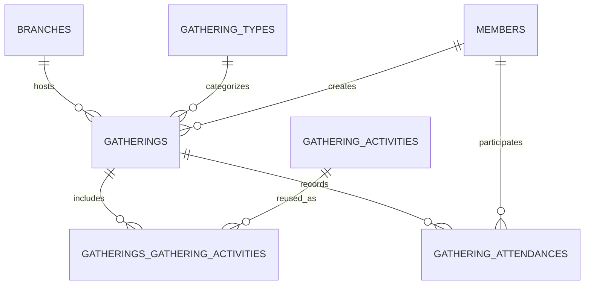

[← Back to Table of Contents](index.md) | [← Back to Core Modules](4-core-modules.md)

# 4.6 Gatherings System

**Last Updated:** October 30, 2025  
**Status:** Active  
**Primary Module:** `app/src/Controller/GatheringsController.php`

## Overview

The Gatherings system provides a focused workflow for creating and managing kingdom events. A gathering stores the hosting branch, type, dates, location, attached activities, and member attendance. The feature set is intentionally narrow—there are no ticketing flows, multi-step registrations, or custom data payloads. Instead, the module centers on three capabilities that intersect with the rest of KMP:

- Present upcoming and historical events in list and calendar views.
- Associate gatherings with reusable activity templates that can be customized per event.
- Allow members to record their attendance and control how widely that information is shared.

## Table of Contents

- [Module Snapshot](#module-snapshot)
- [Data Model](#data-model)
  - [`gatherings`](#gatherings)
  - [`gathering_types`](#gathering_types)
  - [`gathering_activities`](#gathering_activities)
  - [`gatherings_gathering_activities`](#gatherings_gathering_activities)
  - [`gathering_attendances`](#gathering_attendances)
- [Gathering Types](#gathering-types)
- [Gathering Activities](#gathering-activities)
- [Attendance Tracking](#attendance-tracking)
- [User Interface Surfaces](#user-interface-surfaces)
- [Authorization Model](#authorization-model)
- [Integrations](#integrations)
- [Testing & Fixtures](#testing--fixtures)
- [Future Enhancements](#future-enhancements)

## Module Snapshot

- **Controllers**
  - `GatheringsController` — CRUD operations, calendar, CSV export, activity management, attendance modals.
  - `GatheringTypesController` & `GatheringActivitiesController` — manage the configuration data referenced by gatherings.
- **Stimulus Controller** `app/assets/js/controllers/gatherings-calendar-controller.js` handles calendar quick views and attendance toggles.
- **Policies** `app/src/Policy/GatheringsTablePolicy.php` enforces table-level access; entity policies depend on branch-scoped permissions exposed by the authenticated identity.
- **Primary Templates**
  - `app/templates/Gatherings/index.php` (list view)
  - `app/templates/Gatherings/calendar.php` with `element/Gatherings/calendar_*` partials
  - `app/templates/Gatherings/view.php` (tabbed detail view)
  - `app/templates/Gatherings/add.php` and `edit.php`

## Data Model

The Gatherings module stores only the data it owns and relies on other modules for auxiliary behavior (e.g., waivers). Soft deletes are implemented through the `deleted` timestamp provided by the Muffin/Trash behavior.


```

### `gatherings`

Core event record. End dates default to the start date when omitted; validation enforces `end_date >= start_date`.

| Column | Type | Notes |
| --- | --- | --- |
| `id` | int | Primary key |
| `branch_id` | int | Required. FK to `branches.id` |
| `gathering_type_id` | int | Required. FK to `gathering_types.id` |
| `name` | varchar(255) | Required display name |
| `description` | text | Optional Markdown description rendered in the detail tab |
| `start_date` | date | Required start date |
| `end_date` | date | Required; may equal `start_date` for single-day events |
| `location` | varchar(255) | Optional venue/address text |
| `latitude` | decimal(10,8) | Optional geocode used by the map tab |
| `longitude` | decimal(11,8) | Optional geocode used by the map tab |
| `created`, `modified` | datetime | Managed by the `Timestamp` behavior |
| `created_by`, `modified_by` | int | Populated by Muffin/Footprint |
| `deleted` | datetime | Soft-delete marker (null when active) |

### `gathering_types`

Reusable labels that describe the nature of a gathering (tournament, practice, court, etc.).

| Column | Type | Notes |
| --- | --- | --- |
| `id` | int | Primary key |
| `name` | varchar(255) | Required, unique |
| `description` | text | Optional helper text displayed in management UI |
| `clonable` | boolean | Controls whether gatherings of this type expose the "Clone" action |
| `color` | varchar(7) | Hex value used to tint calendar badges |
| Standard audit columns | | Added by Muffin behaviors |

### `gathering_activities`

Configuration catalog of activities (heavy combat, archery, A&S, etc.). The description here is the default that can be overridden per gathering.

| Column | Type | Notes |
| --- | --- | --- |
| `id` | int | Primary key |
| `name` | varchar(255) | Required |
| `description` | text | Optional default description |
| Standard audit columns | | |

### `gatherings_gathering_activities`

Join table that pairs activities with specific gatherings while preserving per-gathering customization.

| Column | Type | Notes |
| --- | --- | --- |
| `id` | int | Primary key |
| `gathering_id` | int | FK to `gatherings.id` |
| `gathering_activity_id` | int | FK to `gathering_activities.id` |
| `sort_order` | int | Display ordering within the activities tab |
| `custom_description` | text | Optional override shown instead of the activity default |
| Standard audit columns | | |
| Unique index | (`gathering_id`, `gathering_activity_id`) | Prevents duplicates |

### `gathering_attendances`

Attendance records are intentionally simple: a member either has a single record for the gathering or they do not. There is no RSVP status enum—attendance is implied by the record's existence.

| Column | Type | Notes |
| --- | --- | --- |
| `id` | int | Primary key |
| `gathering_id` | int | FK to `gatherings.id` (cascade delete) |
| `member_id` | int | FK to `members.id` (cascade delete) |
| `public_note` | text | Optional note shown wherever sharing rules allow |
| `share_with_kingdom` | boolean | Visible to kingdom-level officers |
| `share_with_hosting_group` | boolean | Visible to officers for the hosting branch |
| `share_with_crown` | boolean | Reserved for high-office reporting |
| `is_public` | boolean | Visible to any authenticated user with gathering access |
| Standard audit columns | | Includes soft-delete marker |
| Unique index | (`gathering_id`, `member_id`) | Enforced by validation and the database |

## Gathering Types

Gathering types are managed through `GatheringTypesController` and exposed in the gathering create/edit forms. They provide three key behaviors:

1. **Categorisation:** Each gathering must reference a type; the association is eager-loaded for list, calendar, and detail views.
2. **Color Coding:** The optional `color` column is consumed by the calendar elements (`calendar_month.php`, `calendar_week.php`, `calendar_list.php`). When blank, the UI falls back to Bootstrap blue.
3. **Clone Eligibility:** `clonable = false` hides the "Clone" modal in `templates/Gatherings/view.php`, preventing users from using that type as a template.

Administrators can extend the catalog without code changes. Validation ensures unique names and hex-formatted colors.

## Gathering Activities

Activities act as reusable building blocks. When attaching activities to a gathering:

- The modal (`element/gatherings/addActivityModal.php`) lists activities not already attached, sorted alphabetically.
- Activities appear in the "Activities" tab of `templates/Gatherings/view.php`, showing either the join-table `custom_description` or the base activity description.
- `sort_order` preserves display ordering. New activities append to the end (`sort_order` defaults to the next available integer).
- If waivers have been uploaded for the gathering, activity editing is locked (see [Integrations](#integrations)).

`GatheringsController::addActivity()` and `removeActivity()` enforce uniqueness through ORM checks before the database constraint fires, producing user-friendly errors.

## Attendance Tracking

Attendance is recorded through AJAX modals driven by the Stimulus controller.

- **Marking Attendance:** The "Attend This Gathering" button on `templates/Gatherings/view.php` and the calendar quick-view modal both open `element/gatherings/attendGatheringModal.php`.
- **Sharing Controls:** Members choose which audiences can see their attendance via four boolean checkboxes (`share_with_hosting_group`, `share_with_kingdom`, `share_with_crown`, `is_public`). These map directly to the columns listed earlier.
- **Visibility:**
  - Calendar badges simply indicate that *you* are attending; they do not expose other attendees.
  - The Attendance tab shows only records visible to the current user. Hosting officers see records flagged for the branch; public records are visible to anyone authorised for the gathering.
- **Editing Window:** Members can edit or withdraw attendance until the gathering's end date; afterwards the Attend button is hidden.

`GatheringAttendancesTable` supplies helper finders (`findShared`, `findSharedWithKingdom`, etc.) that higher-level reporting can reuse.

## User Interface Surfaces

- **Index (`/gatherings`):** Paginated list with filters for branch, type, and date range. Supports CSV export for the applied filters via `CsvExportService`.
- **Calendar (`/gatherings/calendar`):** Month/week/list views, filter sidebar, and quick-view modal. Stimulus handles AJAX requests for attendance and detail snippets without page reloads.
- **View (`/gatherings/view/{id}`):** Tabbed layout covering description, activities, location map (when geo data exists), and attendance. Modal actions allow activity management, cloning (type permitting), and attendance editing.
- **Create/Edit (`/gatherings/add`, `/gatherings/edit/{id}`):** Basic forms restricted by branch permissions. End date defaults to start date when omitted.
- **Clone:** Modal that duplicates the source gathering (type must be clonable) and allows adjustments before saving a new record.

## Authorization Model

- **Model-Level:** `GatheringsTablePolicy` authorises `index` and `add` at the table level. Entity checks rely on the authenticated user's branch permissions via `getBranchIdsForAction()`.
- **Branch Scope:** Queries in `GatheringsController` filter to the branches permitted for the current user. This applies to listing, calendar queries, and activity lookups.
- **Attendance Visibility:** The `viewAttendance` capability controls access to the Attendance tab. Even with access, only the records flagged for the relevant audience are shown.
- **Soft Deletes:** The Muffin/Trash behavior hides `deleted` records without removing them. Associated child records cascade according to their own `dependent` settings.

## Integrations

- **Waivers Plugin:** When the optional Waivers plugin is present, `GatheringsController::view()` checks for `Waivers.GatheringWaivers`. If any exist, activity modifications are disabled to protect the integrity of submitted paperwork.
- **Location Maps:** The map tab (`element/gatherings/mapTab.php`) uses stored latitude/longitude to render an interactive map (see `docs/gathering-location-maps.md`). Geocoding is performed client-side when users pick a location.
- **CSV Export:** `CsvExportService` (`app/src/Services/CsvExportService.php`) streams filtered gathering data without loading the entire dataset into memory.

## Testing & Fixtures

- Fixtures: `app/tests/Fixture/GatheringsFixture.php`, `GatheringTypesFixture.php`, `GatheringActivitiesFixture.php`, `GatheringsGatheringActivitiesFixture.php`, and `GatheringAttendancesFixture.php` mirror the schema described above.
- Controller tests in `app/tests/TestCase/Controller/GatheringsControllerTest.php` cover calendar access, CRUD operations, and attendance flows.
- Waiver-specific behaviors are tested within the Waivers plugin.

## Future Enhancements

The current implementation intentionally keeps scope narrow. Potential follow-ups include:

1. **Recurring Gatherings:** Template recurring series rather than manual cloning.
2. **Attendance Reporting:** Aggregate dashboards leveraging the finders in `GatheringAttendancesTable`.
3. **External Calendar Feeds:** Generate iCal exports from the calendar view.
4. **Reminder Emails:** Notify attendees as gatherings approach using stored attendance preferences.

Evaluate these against kingdom needs before expanding the data model.
