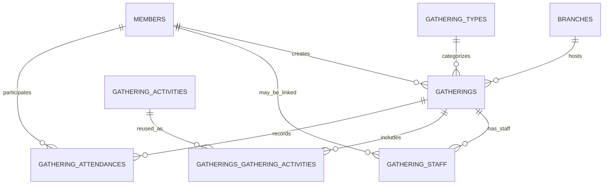

[← Back to Table of Contents](index.md) | [← Back to Core Modules](4-core-modules.md)

# 4.6 Gatherings System

**Last Updated:** November 4, 2025  
**Status:** Active  
**Primary Module:** `app/src/Controller/GatheringsController.php`

## Overview

The Gatherings system provides a comprehensive workflow for creating and managing kingdom events. A gathering stores the hosting branch, type, dates, location, staff, attached activities, and member attendance. The system includes:

- Present upcoming and historical events in list and calendar views.
- Staff management with stewards and customizable roles.
- **Steward editing:** Stewards can edit, cancel, and restore their own gatherings without branch-level permissions.
- **Cancel & restore:** Soft-cancel gatherings while preserving all associated data.
- Calendar download (.ics) for importing into personal calendar applications.
- **Calendar subscription feeds:** Public iCal feeds that calendar apps (Google Calendar, Apple Calendar, Outlook) can subscribe to, with filtering by branch and gathering type.
- Associate gatherings with reusable activity templates that can be customized per event.
- Allow members to record their attendance and control how widely that information is shared.
- Public landing pages for event promotion with QR codes.
- Interactive location maps with geocoding support.
- Event cloning for similar or recurring events.

## Table of Contents

- [Module Snapshot](#module-snapshot)
- [Data Model](#data-model)
  - [`gatherings`](#gatherings)
  - [`gathering_types`](#gathering_types)
  - [`gathering_staff`](#gathering_staff)
  - [`gathering_activities`](#gathering_activities)
  - [`gatherings_gathering_activities`](#gatherings_gathering_activities)
  - [`gathering_attendances`](#gathering_attendances)
- [Gathering Types](#gathering-types)
- [Event Timezone Support](#event-timezone-support)
- [Gathering Staff Management](#gathering-staff-management)
- [Calendar Download Feature](#calendar-download-feature)
- [Gathering Activities](#gathering-activities)
- [Attendance Tracking](#attendance-tracking)
- [Public Landing Pages](#public-landing-pages)
- [Location Maps](#location-maps)
- [Event Cloning](#event-cloning)
- [Cancel & Restore](#cancel--restore)
- [User Interface Surfaces](#user-interface-surfaces)
- [Authorization Model](#authorization-model)
- [Integrations](#integrations)
- [Testing & Fixtures](#testing--fixtures)
- [Future Enhancements](#future-enhancements)

## Module Snapshot

- **Controllers**
  - `GatheringsController` — CRUD operations, calendar, CSV export, activity management, attendance modals, calendar downloads.
  - `GatheringStaffController` — Staff member management with steward and custom role support.
  - `GatheringTypesController` & `GatheringActivitiesController` — manage the configuration data referenced by gatherings.
- **Services**
  - `ICalendarService` — RFC 5545 compliant iCalendar (.ics) file generation.
- **Stimulus Controllers**
  - `app/assets/js/controllers/gatherings-calendar-controller.js` handles calendar quick views and attendance toggles.
  - `app/assets/js/controllers/qrcode-controller.js` generates QR codes for public landing pages.
- **Policies**
  - `app/src/Policy/GatheringsTablePolicy.php` enforces table-level access.
  - `app/src/Policy/GatheringStaffPolicy.php` controls staff management permissions.
- **Primary Templates**
  - `app/templates/Gatherings/index.php` (list view)
  - `app/templates/Gatherings/calendar.php` with `element/Gatherings/calendar_*` partials
  - `app/templates/Gatherings/view.php` (tabbed detail view with staff, activities, location tabs)
  - `app/templates/Gatherings/add.php` and `edit.php`
  - `app/templates/Gatherings/public_landing.php` (public event page with QR code)

## Data Model

The Gatherings module stores only the data it owns and relies on other modules for auxiliary behavior (e.g., waivers). Soft deletes are implemented through the `deleted` timestamp provided by the Muffin/Trash behavior.



### `gatherings`

Core event record. End dates default to the start date when omitted; validation enforces `end_date >= start_date`. Start and end dates support both date and time to allow specific event scheduling.

| Column | Type | Notes |
| --- | --- | --- |
| `id` | int | Primary key |
| `public_id` | varchar(36) | UUID for public URLs; generated automatically |
| `branch_id` | int | Required. FK to `branches.id` |
| `gathering_type_id` | int | Required. FK to `gathering_types.id` |
| `name` | varchar(255) | Required display name |
| `description` | text | Optional Markdown description rendered in the detail tab |
| `start_date` | datetime | Required start date and time (stored as UTC DATETIME) |
| `end_date` | datetime | Required end date and time (stored as UTC DATETIME); may equal `start_date` for single-day events |
| `location` | varchar(255) | Optional venue/address text |
| `timezone` | varchar(50) | Optional IANA timezone identifier (e.g., "America/Chicago"); falls back to user/app timezone when null |
| `latitude` | decimal(10,8) | Optional geocode used by the map tab |
| `longitude` | decimal(11,8) | Optional geocode used by the map tab |
| `public_page_enabled` | boolean | When true, enables public landing page access |
| `show_host_branch_on_public_page` | boolean | Controls branch visibility on public page |
| `cancelled_at` | datetime | When set, the gathering is cancelled. Null = active |
| `cancellation_reason` | text | Optional reason for cancellation |
| `created`, `modified` | datetime | Managed by the `Timestamp` behavior |
| `created_by`, `modified_by` | int | Populated by Muffin/Footprint |
| `deleted` | datetime | Soft-delete marker (null when active) |

**Migration History:**
- Originally created with `start_date` and `end_date` as DATE type
- Migration `20251105000002_ConvertGatheringDatesToDatetime.php` converted to DATETIME type to support specific event times

### `gathering_types`

Reusable labels that describe the nature of a gathering (tournament, practice, court, etc.).

| Column | Type | Notes |
| --- | --- | --- |
| `id` | int | Primary key |
| `name` | varchar(255) | Required, unique |
| `description` | text | Optional helper text displayed in management UI |
| `clonable` | boolean | Controls whether gatherings of this type expose the "Clone" action |
| `color` | varchar(7) | Hex value used to tint calendar badges |
| Standard audit columns | | Added by Muffin behaviors |

### `gathering_staff`

Staff management system for gatherings. Supports both stewards (who must be AMP members with contact info) and other staff (who can be AMP members or generic SCA names).

| Column | Type | Notes |
| --- | --- | --- |
| `id` | int | Primary key |
| `gathering_id` | int | Required. FK to `gatherings.id` (CASCADE on delete) |
| `member_id` | int | Optional FK to `members.id` for AMP member staff |
| `sca_name` | varchar(255) | Optional SCA name for non-AMP staff (XOR with member_id) |
| `role` | varchar(100) | Required role name (e.g., "Steward", "Herald", "List Master") |
| `is_steward` | boolean | True for event stewards; requires contact info |
| `email` | varchar(255) | Contact email (auto-populated from member, editable for privacy) |
| `phone` | varchar(50) | Contact phone (auto-populated from member, editable for privacy) |
| `contact_notes` | text | Optional contact preferences (e.g., "text only", "no calls after 9 PM") |
| `sort_order` | int | Display ordering (stewards: 0-99, other staff: 100+) |
| `show_on_public_page` | boolean | Whether to display this staff member on the public landing page |
| `created`, `modified` | datetime | Standard audit columns |
| `created_by`, `modified_by` | int | Standard audit columns |
| `deleted` | datetime | Soft-delete marker |

**Business Rules:**
- XOR constraint: Must have either `member_id` OR `sca_name`, not both
- Steward contact rule: If `is_steward = true`, must have `email` OR `phone`
- Auto-population: When steward with `member_id` is created, contact info auto-fills from member record

### `gathering_activities`

Configuration catalog of activities (heavy combat, archery, A&S, etc.). The description here is the default that can be overridden per gathering.

| Column | Type | Notes |
| --- | --- | --- |
| `id` | int | Primary key |
| `name` | varchar(255) | Required |
| `description` | text | Optional default description |
| Standard audit columns | | |

### `gatherings_gathering_activities`

Join table that pairs activities with specific gatherings while preserving per-gathering customization.

| Column | Type | Notes |
| --- | --- | --- |
| `id` | int | Primary key |
| `gathering_id` | int | FK to `gatherings.id` |
| `gathering_activity_id` | int | FK to `gathering_activities.id` |
| `sort_order` | int | Display ordering within the activities tab |
| `custom_description` | text | Optional override shown instead of the activity default |
| Standard audit columns | | |
| Unique index | (`gathering_id`, `gathering_activity_id`) | Prevents duplicates |

### `gathering_attendances`

Attendance records are intentionally simple: a member either has a single record for the gathering or they do not. There is no RSVP status enum—attendance is implied by the record's existence.

| Column | Type | Notes |
| --- | --- | --- |
| `id` | int | Primary key |
| `gathering_id` | int | FK to `gatherings.id` (cascade delete) |
| `member_id` | int | FK to `members.id` (cascade delete) |
| `public_note` | text | Optional note shown wherever sharing rules allow |
| `share_with_kingdom` | boolean | Visible to kingdom-level officers |
| `share_with_hosting_group` | boolean | Visible to officers for the hosting branch |
| `share_with_crown` | boolean | Reserved for high-office reporting |
| `is_public` | boolean | Visible to any authenticated user with gathering access |
| Standard audit columns | | Includes soft-delete marker |
| Unique index | (`gathering_id`, `member_id`) | Enforced by validation and the database |

## Gathering Types

Gathering types are managed through `GatheringTypesController` and exposed in the gathering create/edit forms. They provide three key behaviors:

1. **Categorisation:** Each gathering must reference a type; the association is eager-loaded for list, calendar, and detail views.
2. **Color Coding:** The optional `color` column is consumed by the calendar elements (`calendar_month.php`, `calendar_week.php`, `calendar_list.php`). When blank, the UI falls back to Bootstrap blue.
3. **Clone Eligibility:** `clonable = false` hides the "Clone" modal in `templates/Gatherings/view.php`, preventing users from using that type as a template.

Administrators can extend the catalog without code changes. Validation ensures unique names and hex-formatted colors.

### Template Activities

**Controller:** `GatheringTypesController`  
**Methods:** `addActivity()`, `removeActivity()`  
**Join Table:** `gathering_type_gathering_activities`

Gathering types can have template activities that are automatically added to new gatherings of that type. This streamlines event creation by pre-populating common activities.

**Features:**

1. **Automatic Application:** When a gathering is created with a specific type, all template activities for that type are automatically added to the gathering
2. **Not Removable Flag:** Template activities can be marked as "not removable," preventing event organizers from removing them from individual gatherings
3. **Tab Interface:** Template activities are managed via a dedicated tab on the gathering type view page
4. **Modal-based Management:** Add activities via modal form, remove with confirmation

**Workflow:**

1. Create gathering type
2. Navigate to "Template Activities" tab
3. Click "Add Template Activity"
4. Select activity from dropdown
5. Optionally check "Not Removable" to lock it on gatherings
6. Click "Add Activity"

**Use Cases:**

*Standard Tournament Activities:*
- Heavy Combat (not removable)
- Rapier Combat (not removable)
- Archery (not removable)
- Arts & Sciences Display (removable)

*Feast Requirements:*
- Feast (not removable)
- Court (not removable)
- Bardic Circle (removable)

*Practice Defaults:*
- Heavy Combat Practice (removable)
- Rapier Practice (removable)

**Authorization:**
- Both `addActivity()` and `removeActivity()` require `edit` permission on the gathering type
- UI elements (add/remove buttons) are conditionally rendered based on permissions

**Database Structure:**
```
gathering_type_gathering_activities
├── id (primary key)
├── gathering_type_id (FK to gathering_types)
├── gathering_activity_id (FK to gathering_activities)
├── not_removable (boolean)
└── audit columns (created, modified, created_by_id, modified_by_id)
```

**Synchronization:**
Template activities sync to gatherings happens automatically in `GatheringsTable::afterSave()` when:
- A new gathering is created with a gathering type
- An existing gathering's `gathering_type_id` is changed

## Event Timezone Support

**Migration:** `20251105000001_AddTimezoneToGatherings.php`  
**Entity Field:** `Gathering::$timezone`  
**Helper:** `TimezoneHelper::getGatheringTimezone()`

KMP supports event-specific timezones for gatherings, allowing events to be displayed consistently in their location's timezone regardless of where users are viewing from. This is especially important for:

- Events at kingdom borders (e.g., Illinois events in Central Time vs. Indiana events in Eastern Time)
- Events in different time zones than the user's preference
- Multi-kingdom events that need a consistent reference time
- Historical accuracy when viewing past events

### Timezone Priority for Gatherings

When displaying gathering dates/times, the system resolves timezone in this order:

1. **Gathering's Timezone** (`gatherings.timezone`) - Event location timezone
2. **User's Timezone** (`members.timezone`) - Individual preference
3. **Application Default** (`KMP.DefaultTimezone`) - Kingdom-wide setting
4. **UTC** - Universal fallback

### Database Schema

The `gatherings` table includes a `timezone` column:

- **Type:** VARCHAR(50), nullable
- **Format:** IANA timezone identifier (e.g., "America/Chicago", "America/New_York")
- **Validation:** Validated against PHP's `DateTimeZone` class
- **Fallback:** When null, uses user/application timezone

### Usage in Controllers

When saving gathering data with datetime fields, convert from gathering timezone to UTC:

```php
use App\KMP\TimezoneHelper;

// When creating or editing a gathering
if ($this->request->is(['post', 'put'])) {
    $data = $this->request->getData();
    
    // Get the appropriate timezone (gathering's or user's)
    $timezone = TimezoneHelper::getGatheringTimezone($gathering, $this->Authentication->getIdentity());
    
    // Convert from event timezone to UTC for storage
    $data['start_date'] = TimezoneHelper::toUtc($data['start_date'], $timezone);
    $data['end_date'] = TimezoneHelper::toUtc($data['end_date'], $timezone);
    
    $gathering = $this->Gatherings->patchEntity($gathering, $data);
    $this->Gatherings->save($gathering);
}
```

### Usage in Templates

Display gathering times in the event's timezone:

```php
<!-- Gathering view page -->
<h3><?= h($gathering->name) ?></h3>
<p>
    <strong>When:</strong>
    <?= $this->Timezone->format($gathering->start_date, 'l, F j, Y g:i A T', true, null, $gathering) ?>
    to
    <?= $this->Timezone->format($gathering->end_date, 'l, F j, Y g:i A T', true, null, $gathering) ?>
</p>

<!-- Scheduled activities in gathering timezone -->
<?php foreach ($gathering->gathering_scheduled_activities as $activity): ?>
    <div class="activity">
        <strong><?= h($activity->name) ?></strong><br>
        <?= $this->Timezone->format($activity->start_datetime, 'g:i A', false, null, $gathering) ?>
        <?php if ($activity->has_end_time): ?>
            - <?= $this->Timezone->time($activity->end_datetime, null, null, $gathering) ?>
        <?php endif; ?>
    </div>
<?php endforeach; ?>
```

### Form Input

Add timezone selector to gathering add/edit forms:

```php
<?= $this->Form->control('timezone', [
    'type' => 'select',
    'options' => $this->Timezone->getTimezoneOptions(),
    'empty' => '(Use user timezone)',
    'label' => 'Event Timezone',
    'help' => 'Set the timezone for this event based on its location. If not set, times will display in each user\'s timezone.'
]) ?>

<?= $this->Form->control('start_date', [
    'type' => 'datetime-local',
    'value' => $this->Timezone->forInput($gathering->start_date, null, null, $gathering)
]) ?>
```

### Benefits

1. **Event Consistency:** Event times display consistently in the event's location timezone
2. **User Flexibility:** Users can still set their own timezone for non-event views
3. **Location Accuracy:** Multi-timezone kingdoms can specify exact timezone per event
4. **Clear Communication:** Event times are unambiguous when gathering timezone is set
5. **Backward Compatible:** Events without timezone still work (use user/app default)

### See Also

For complete timezone implementation details, see [10.3 Timezone Handling](10.3-timezone-handling.md).

## Gathering Staff Management

**Controller:** `GatheringStaffController`  
**Models:** `GatheringStaffTable`, `GatheringStaff` entity  
**View Element:** `templates/element/gatherings/staffTab.php`

The staff management system allows gatherings to have multiple staff members with customizable roles. Staff members are categorized into two types:

### Stewards

Event stewards are the primary contacts for a gathering and must meet stricter requirements:

- **Must be AMP members:** Linked via `member_id` foreign key
- **Contact information required:** Must have either email or phone (at least one)
- **Auto-population:** Email and phone auto-populate from the member's account when assigned
- **Privacy control:** Contact info is editable to allow stewards to use event-specific contacts
- **Contact notes:** Optional field for preferences like "text only" or "no calls after 9 PM"
- **Badge display:** Marked with steward badge in UI, displayed first in staff listings

### Other Staff

Non-steward staff provide flexibility for volunteers and roles:

- **AMP members OR generic SCA names:** Can be linked to member accounts or use free-text SCA names
- **Custom role names:** Free-text role field (e.g., "Herald", "List Master", "Water Bearer")
- **Optional contact information:** Contact info is not required
- **Flexible for non-members:** Supports volunteers without AMP accounts

### Features

**Adding Staff:**
1. Click "Add Staff Member" button in the Staff tab
2. Select whether person is a steward
3. Choose AMP member from dropdown OR enter SCA name
4. For stewards, contact info auto-populates (editable)
5. Specify role name
6. Optionally add contact notes
7. Choose whether to display on public landing page

**AJAX Contact Lookup:**
- Endpoint: `/gathering-staff/get-member-contact-info?member_id={id}`
- Returns member's email and phone for auto-population
- Triggered when member is selected in add/edit modals

**Sort Ordering:**
- Stewards: `sort_order` 0-99 (displayed first)
- Other staff: `sort_order` 100+ (displayed after stewards)
- Manual reordering via drag-and-drop (if implemented)

**Authorization:**
- All staff management actions require `edit` permission on the parent gathering
- Enforced via `GatheringStaffPolicy::canEdit()`

### Use Cases

**Multiple Co-Stewards:**
Large events can assign multiple stewards, each with their own contact preferences and information.

**Privacy-Conscious Contacts:**
Stewards can override their personal AMP contact info with event-specific email addresses or phone numbers.

**Mixed Staff Rosters:**
Typical gathering might include:
- 2 Stewards (AMP members, full contact info)
- Herald (AMP member, optional contact)
- List Master (non-AMP, SCA name only)
- Water Bearer volunteers (non-AMP, no contact info)

### Public Page Display

Staff members can opt-in to display on the public landing page via the `show_on_public_page` boolean. This allows stewards to control their privacy while still providing event contact information to potential attendees.

## Calendar Download Feature

**Service:** `ICalendarService`  
**Controller Action:** `GatheringsController::downloadCalendar()`  
**Routes:**
- Authenticated: `/gatherings/{id}/download-calendar`
- Public: `/gatherings/download-calendar/{publicId}`

The calendar download feature generates RFC 5545 compliant iCalendar (.ics) files that can be imported into any calendar application (Google Calendar, Outlook, Apple Calendar, Android, etc.).

### Features

**Universal Compatibility:**
- Works with all major calendar applications
- Proper MIME type (`text/calendar`) and file extension
- UTF-8 encoding for international characters
- Smart handling of single-day vs. multi-day events

**Event Information Included:**
- Event name and description
- Start and end dates/times
- Location address and GPS coordinates (if available)
- Event type and hosting branch
- List of activities
- Event stewards with contact information
- Link back to the event page in KMP

**Access Patterns:**
- **Authenticated users:** Can download for any gathering they have view permission for
- **Public users:** Can download for gatherings with `public_page_enabled = true`
- **Security:** All text properly sanitized per iCalendar specification

**Event Formats:**
- **Single-day events:** Uses date-time format with 9 AM - 5 PM default times
- **Multi-day events:** Uses all-day format for better calendar display

### UI Integration

**Download buttons appear in three locations:**

1. **Gathering View Page** (`/gatherings/view/{id}`)
   - Prominent button with calendar icon
   - First in action buttons row
   - Tooltip: "Download calendar file (.ics) for Outlook, Google Calendar, iOS, etc."

2. **Calendar Quick View Modal**
   - Appears when clicking event in calendar view
   - Positioned before "Full Details" button
   - Allows quick download without navigating away

3. **Public Landing Page** (`/gatherings/public-landing/{publicId}`)
   - Large, visible button in hero section
   - Available to all visitors (no login required)
   - Allows potential attendees to add event before registering

### Browser Behavior

- **Desktop browsers:** File downloads to default downloads folder
- **iOS Safari:** Option to add directly to Calendar app
- **Android:** Option to select calendar app for import
- **All platforms:** Can manually import downloaded .ics file

### Testing

Unit tests in `tests/TestCase/Services/ICalendarServiceTest.php` validate:
- Single-day and multi-day event generation
- Filename generation
- Text escaping and line folding
- RFC 5545 compliance

## Calendar Subscription Feeds

**Route:** `/gatherings/feed` (public, no authentication required)

The calendar subscription feed provides a multi-event iCalendar endpoint that calendar applications can subscribe to. Unlike the single-event download, this feed is polled periodically by the calendar app and automatically updates with new, changed, or removed events.

### Endpoint

```http
GET /gatherings/feed[?filter[branch_id][]=Ab3kX9pQ&filter[gathering_type_id][]=3]
```

**Query Parameters (all optional):**

The feed accepts the same `filter[column][]` query parameters as the calendar grid.

| Parameter | Description | Example |
|-----------|-------------|---------|
| `filter[branch_id][]` | Filter by branch public ID (repeatable) | `?filter[branch_id][]=mfoBwnBC` |
| `filter[gathering_type_id][]` | Filter by gathering type ID (repeatable) | `?filter[gathering_type_id][]=3` |

Parameters can be combined: `?filter[branch_id][]=mfoBwnBC&filter[gathering_type_id][]=3`

### Feed Behavior

- **Content:** All gatherings (including cancelled) from 30 days ago onward
- **Cancelled events:** Included with `STATUS:CANCELLED` and "CANCELLED: " title prefix so calendar apps display the cancellation
- **Data:** Only public-safe information — event name, dates, location, description, type, branch
- **Calendar name:** Reflects active filters (e.g., "KMP Gatherings - Barony of Namron / Tournament")
- **Refresh hint:** `REFRESH-INTERVAL:PT6H` suggests 6-hour polling to calendar apps
- **No filter:** Returns all gatherings across all branches

### Subscribing from Calendar Apps

| App | How to Subscribe |
|-----|-----------------|
| **Google Calendar** | Settings → Add calendar → From URL → paste feed URL |
| **Apple Calendar** | File → New Calendar Subscription → paste feed URL |
| **Outlook** | Add calendar → Subscribe from web → paste feed URL |
| **Thunderbird** | New Calendar → On the Network → paste feed URL |

### UI Integration

The calendar toolbar includes a **Subscribe** dropdown button that:
1. Builds the feed URL based on current grid filter selections
2. Displays a copyable URL in a dropdown panel
3. Provides one-click copy to clipboard

### Implementation

- `ICalendarService::generateFeed()` produces the multi-event VCALENDAR
- `ICalendarService::generateVEvent()` renders individual events (shared with single-event download)
- Unique `VTIMEZONE` components are deduplicated across events
- `GatheringsController::feed()` handles query, filtering, and response

## Gathering Activities

Activities act as reusable building blocks. When attaching activities to a gathering:

- The modal (`element/gatherings/addActivityModal.php`) lists activities not already attached, sorted alphabetically.
- Activities appear in the "Activities" tab of `templates/Gatherings/view.php`, showing either the join-table `custom_description` or the base activity description.
- `sort_order` preserves display ordering. New activities append to the end (`sort_order` defaults to the next available integer).
- If waivers have been uploaded for the gathering, activity editing is locked (see [Integrations](#integrations)).

`GatheringsController::addActivity()` and `removeActivity()` enforce uniqueness through ORM checks before the database constraint fires, producing user-friendly errors.

## Attendance Tracking

Attendance is recorded through AJAX modals driven by the Stimulus controller.

- **Marking Attendance:** The "Attend This Gathering" button on `templates/Gatherings/view.php` and the calendar quick-view modal both open `element/gatherings/attendGatheringModal.php`.
- **Sharing Controls:** Members choose which audiences can see their attendance via four boolean checkboxes (`share_with_hosting_group`, `share_with_kingdom`, `share_with_crown`, `is_public`). These map directly to the columns listed earlier.
- **Visibility:**
  - Calendar badges simply indicate that *you* are attending; they do not expose other attendees.
  - The Attendance tab shows only records visible to the current user. Hosting officers see records flagged for the branch; public records are visible to anyone authorised for the gathering.
- **Editing Window:** Members can edit or withdraw attendance until the gathering's end date; afterwards the Attend button is hidden.

`GatheringAttendancesTable` supplies helper finders (`findShared`, `findSharedWithKingdom`, etc.) that higher-level reporting can reuse.

## Public Landing Pages

**Template:** `templates/Gatherings/public_landing.php`  
**Element:** `templates/element/gatherings/public_content.php`  
**Route:** `/gatherings/public-landing/{publicId}`

Public landing pages allow events to be shared with non-authenticated users for promotion and information gathering. Each gathering has a unique `public_id` (UUID) used in the public URL.

### Features

**Activation:**
- Enable via `public_page_enabled` boolean on gathering record
- Edit form includes toggle switch for easy activation
- Public ID is auto-generated on first save

**Content Display:**
- Event name, type, and dates prominently displayed
- Location information with interactive map (if coordinates available)
- Full event description (Markdown rendered)
- List of activities
- Staff information (for staff members with `show_on_public_page = true`)
- "Add to Calendar" button for .ics download

**QR Code Integration:**
- Dynamic QR code generated via `qrcode-controller.js` Stimulus controller
- Displays public URL for easy sharing
- Download as PNG image
- Copy to clipboard functionality
- Modal view for larger display

**Branch Visibility Control:**
- Toggle `show_host_branch_on_public_page` to control branch name display
- Useful for gatherings that prefer not to display hosting branch publicly
- Branch information still accessible to authenticated users

**Security:**
- Public pages only accessible when `public_page_enabled = true`
- No authentication required for viewing
- No sensitive data exposed (PII protected)
- Staff contact info only shown if explicitly opted-in

### Use Cases

**Event Promotion:**
Share public URL via social media, email, or printed materials. QR code can be displayed on posters for easy mobile access.

**Pre-Registration Information:**
Allow potential attendees to view event details and add to their calendar before creating an AMP account or registering.

**Cross-Kingdom Sharing:**
Share events with members of other kingdoms or regions who may not have AMP access.

## Location Maps

**Template Element:** `templates/element/gatherings/mapTab.php`  
**JavaScript:** Leaflet library integration

Interactive location maps provide visual event location information using OpenStreetMap (OSM) and Leaflet.

### Features

**Map Display:**
- Interactive map with zoom and pan controls
- Marker shows exact event location
- Popup displays location name and address
- Map only appears when `latitude` and `longitude` are set

**Geocoding:**
- Client-side geocoding when location address is entered
- Automatically sets latitude/longitude coordinates
- Used by both authenticated view and public landing page

**CSP Configuration:**
Content Security Policy (CSP) headers are configured to allow OSM tile loading:
- `img-src` includes `https://*.openstreetmap.org`
- `connect-src` includes OSM tile servers
- Configured in `src/Application.php` middleware

**Leaflet Integration:**
- Uses Leaflet.js library for map rendering
- Loads OSM tiles from public tile servers
- Supports marker customization and popup styling
- Mobile-friendly touch controls

### Configuration

CSP settings in `Application.php` (middleware stack):
```php
$csp = "default-src 'self'; "
     . "img-src 'self' data: https://*.tile.openstreetmap.org https://*.openstreetmap.org; "
     . "connect-src 'self' https://*.tile.openstreetmap.org;";
```

This configuration allows the application to load map tiles while maintaining security.

## Event Cloning

**Modal:** `templates/element/gatherings/cloneModal.php`  
**Controller Action:** `GatheringsController::clone()`

Event cloning allows organizers to quickly create new gatherings based on existing events, preserving structure while allowing customization.

### Features

**Clonable Types:**
- Only gathering types with `clonable = true` show the clone button
- Configured per gathering type in `GatheringTypesController`
- Prevents cloning of one-time or unique event types

**Cloned Data:**
- **Copied:** Name (with "Copy of" prefix), description, type, location, activities
- **Not Copied:** Dates, staff, attendances, waivers
- **Reset:** Dates must be set for the new event
- **Preserved:** Activity customizations and sort order

**Cloning Process:**
1. Click "Clone This Gathering" button (only if type is clonable)
2. Modal opens with pre-filled form
3. Adjust name, dates, and other details
4. System creates new gathering with copied activities
5. Redirect to new gathering's view page

**Use Cases:**

**Recurring Events:**
Clone monthly practices or quarterly tournaments with consistent structure.

**Event Series:**
Create series of related events (e.g., "Spring War", "Summer War", "Fall War") with similar activities and descriptions.

**Multi-Location Events:**
Clone event template for different locations or branches.

### Authorization

Clone action requires:
- `add` permission at table level (can create new gatherings)
- `view` permission on source gathering
- Source gathering's type must have `clonable = true`

## Cancel & Restore

Gatherings can be cancelled without deleting them, preserving all associated data (waivers, attendance, staff, activities).

### Cancellation

- **Action:** `GatheringsController::cancel()` — POST request sets `cancelled_at` to current timestamp
- **Reason:** Optional `cancellation_reason` text field
- **Authorization:** Requires `edit` permission on the gathering (stewards included)
- **Effect:** The gathering remains in the database with all associations intact

### Restoration

- **Action:** `GatheringsController::uncancel()` — POST request clears `cancelled_at` and `cancellation_reason`
- **Authorization:** Same as cancel — requires `edit` permission
- **Effect:** Gathering returns to active state; all prior data is preserved

### Impact on Other Features

| Feature | When Cancelled |
|---------|---------------|
| **Waiver uploads** | Blocked — returns 403 error |
| **Existing waivers** | Remain viewable for audit |
| **Attendance** | No new attendance recording |
| **Calendar views** | Shown with cancelled indicator |
| **Public landing page** | Displays cancellation notice |
| **Cloning** | Still possible from cancelled source |

### Entity Virtual Field

```php
// Gathering entity
protected function _getIsCancelled(): bool
{
    return $this->cancelled_at !== null;
}
```

## User Interface Surfaces

- **Index (`/gatherings`):** Paginated list with filters for branch, type, and date range. Supports CSV export for the applied filters via `CsvExportService`.
- **Calendar (`/gatherings/calendar`):** Interactive calendar system with multiple viewing modes:
  
  **View Modes:**
  - **Month View**: Traditional calendar grid showing all gatherings in a month
  - **Week View**: Focused week-by-week timeline view
  - **List View**: Detailed list format with full gathering information
  
  **Interactive Features:**
  - Quick View modal: Click any gathering to see details without leaving calendar
  - Attendance Tracking: Mark yourself as attending with one click
  - Location Integration: Quick access to gathering location maps
  - Real-time Updates: Calendar reflects attendance changes immediately
  
  **Filtering System:**
  - Branch filter: View gatherings from specific branches
  - Gathering Type filter: Filter by event type (tournament, practice, feast, etc.)
  - Activity filter: Show only gatherings with specific activities
  - Filter sidebar with apply/clear buttons
  
  **Visual Indicators:**
  - Gathering Type Colors: Each type has distinct color for easy identification
  - Attendance Badge (Green): Shows gatherings you're attending
  - Location Badge (Blue): Indicates gatherings with location information
  - Multi-day Badge (Yellow): Marks events spanning multiple days
  - Activity Count Badge (Gray): Shows number of activities at the gathering
  
  **Navigation:**
  - Month navigation: Previous/Next month arrows
  - Today button: Jump to current month instantly
  - View mode toggle: Switch between Month, Week, and List views
  - URL state management and browser history integration
  
  **Calendar Grid (Month View):**
  - 7-column layout: Sunday through Saturday
  - Day highlighting: Current day highlighted in yellow
  - Other months: Days from previous/next months shown in gray
  - Compact gathering cards showing name, hosting branch, and status badges
  
  **Quick View Modal:**
  - Accessible by clicking any gathering in calendar
  - Shows gathering details including date range in gathering timezone
  - Displays timezone badge with identifier and abbreviation when set
  - Format: `🕐 America/Chicago (CDT)`
  - Compact format suitable for modal display
  
  **Implementation:**
  - `GatheringsController::calendar()`: Loads gatherings with eager loading and permission filters
  - `gatherings-calendar-controller.js`: Stimulus controller for quick views and attendance
  - `calendar_month.php`, `calendar_week.php`, `calendar_list.php`: View elements
  - Query parameters: `year`, `month`, `view`, `branch_id`, `gathering_type_id`, `activity_id`
- **View (`/gatherings/view/{id}`):** Comprehensive tabbed layout with the following tabs:
  - **Description:** Event details with Markdown rendering
    - Displays event dates in gathering's timezone (when set)
    - Shows "Event Timezone" row when timezone is specified
    - Includes timezone abbreviation (e.g., "CDT", "EST")
    - Informational note when times are in event timezone
  - **Staff:** Stewards and other staff members with contact information (order: 3)
  - **Schedule:** Event timeline and schedule information in gathering timezone (order: 4)
  - **Activities:** Attached activities with customizable descriptions (order: 5)
  - **Location:** Interactive map when coordinates are available (order: 6)
  - **Attendance:** Attendance records with privacy controls (order: 7)
  - **Waivers:** Plugin tab for waiver management (order: 10, if plugin enabled)
  
  Action buttons include: "Add to Calendar", "Share Event", "Attend This Gathering", "Clone" (if type permits), and "Edit" (if authorized).

- **Create/Edit (`/gatherings/add`, `/gatherings/edit/{id}`):** Forms include basic event details plus:
  - Timezone selector dropdown (optional) - positioned after location field
    - Common US timezones listed first
    - Empty option shows "(Use User Timezone: [timezone])" for clarity
    - Help text explains timezone purpose
  - Public page toggle with branch visibility control
  - Location fields with map preview
  - Date validation (end >= start)
  - Branch selection (filtered by user permissions)
  
  **Timezone Integration:**
  - Datetime inputs automatically convert to/from selected timezone
  - When timezone is set, all event times display in that timezone
  - When timezone is empty, falls back to user's timezone preference

- **Public Landing (`/gatherings/public-landing/{publicId}`):** Public-facing event page with:
  - Hero section with event name, type, and dates in gathering timezone
  - Timezone display in hero banner: `🕐 America/Chicago (CDT)`
  - Timezone meta item in quick meta section (alongside date, location, branch)
  - "Add to Calendar" button (generates .ics with proper timezone)
  - QR code for easy sharing
  - Full event description and activities list
  - Staff contact information (for opted-in staff)
  - Interactive location map
  - No authentication required when `public_page_enabled = true`

- **Staff Management:** Modal-based interface embedded in view tab:
  - Add staff member modal with AMP member lookup
  - Edit staff member modal with pre-populated data
  - AJAX contact info auto-population
  - Public page display toggle per staff member
  - Delete confirmation

- **Clone:** Modal that duplicates the source gathering (type must be clonable) and allows adjustments before saving a new record.

## Authorization Model

- **Model-Level:** `GatheringsTablePolicy` authorises `index` and `add` at the table level. Entity checks rely on the authenticated user's branch permissions via `getBranchIdsForAction()`.
- **Branch Scope:** Queries in `GatheringsController` filter to the branches permitted for the current user. This applies to listing, calendar queries, and activity lookups.
- **Steward Override:** `GatheringPolicy` implements a dual-authorization model. If the user has standard branch-level permission for the action, it is granted. Otherwise, the policy checks if the user is a **steward** for the gathering (via `gathering_staff.is_steward`). Stewards are automatically granted `edit`, `cancel`, `uncancel`, `view`, and `viewAttendance` permissions on their gathering without needing branch-level roles.
- **Attendance Visibility:** The `viewAttendance` capability controls access to the Attendance tab. Even with access, only the records flagged for the relevant audience are shown.
- **Soft Deletes:** The Muffin/Trash behavior hides `deleted` records without removing them. Associated child records cascade according to their own `dependent` settings.

## Integrations

- **Waivers Plugin:** When the optional Waivers plugin is present, `GatheringsController::view()` checks for `Waivers.GatheringWaivers`. If any exist, activity modifications are disabled to protect the integrity of submitted paperwork. Waivers tab appears with order: 10.

- **Activities Plugin:** The Activities plugin provides authorization tracking that integrates with gathering activities. Template activities from the plugin can be associated with gathering events, and the UI restructure provides better visualization of activity-to-authorization mappings.

- **ICalendarService:** The calendar download feature uses `ICalendarService` to generate RFC 5545 compliant .ics files. Service handles:
  - Text escaping and line folding per specification
  - Single-day vs. multi-day event formatting
  - **Timezone support:** Adds `TZID` parameter to DTSTART/DTEND when gathering has timezone set
  - Falls back to UTC if no timezone specified
  - Includes timezone information in event description
  - Location with GPS coordinates (GEO property)
  - Event metadata (type, branch, activities, staff)
  - Universal calendar application compatibility

- **Location Maps:** The map tab (`element/gatherings/mapTab.php`) uses stored latitude/longitude to render an interactive map powered by Leaflet and OpenStreetMap. CSP headers in `Application.php` allow tile loading.

- **QR Code Generation:** Public landing pages use the `qrcode-controller.js` Stimulus controller with the npm `qrcode` package to generate dynamic QR codes for easy URL sharing. Supports download as PNG and clipboard copying.

- **CSV Export:** `CsvExportService` (`app/src/Services/CsvExportService.php`) streams filtered gathering data without loading the entire dataset into memory. Export includes all visible gathering fields and can be filtered by branch, type, and date range.

- **Public ID System:** Gatherings use the application-wide Public ID system for generating UUIDs used in public URLs. Public IDs are automatically generated on first save and remain stable even if event details change.

## Testing & Fixtures

- **Fixtures:**
  - `GatheringsFixture.php` - Core gathering records
  - `GatheringTypesFixture.php` - Event type catalog
  - `GatheringStaffFixture.php` - Staff assignments (stewards and other roles)
  - `GatheringActivitiesFixture.php` - Activity templates
  - `GatheringsGatheringActivitiesFixture.php` - Activity-to-gathering associations
  - `GatheringAttendancesFixture.php` - Attendance records with privacy settings

- **Controller Tests:**
  - `GatheringsControllerTest.php` - CRUD operations, calendar access, cloning, calendar downloads
  - `GatheringStaffControllerTest.php` - Staff management, contact info lookup
  - Tests cover authorization checks, validation, and business rules

- **Service Tests:**
  - `ICalendarServiceTest.php` - iCalendar generation, text escaping, single/multi-day events, filename generation
  - All tests pass with comprehensive assertions

- **Integration Tests:**
  - Waiver-plugin interactions tested within Waivers plugin
  - Public landing page access tested with public_page_enabled flag
  - Staff visibility tested with show_on_public_page flag

- **Test Super User:**
  - `TestSuperUserFixture.php` provides a super user account for testing
  - See `docs/TEST_SUPER_USER_QUICK_REFERENCE.md` for usage details

## Future Enhancements

The current implementation provides comprehensive event management. Potential follow-ups include:

1. **Recurring Gatherings:** Template recurring series rather than manual cloning.
2. **Attendance Reporting:** Aggregate dashboards leveraging the finders in `GatheringAttendancesTable`.
3. **Reminder Emails:** Notify attendees as gatherings approach using stored attendance preferences.
4. **Staff Scheduling:** Expand staff management to include shift scheduling and volunteer coordination.
5. **Advanced Map Features:** Add route planning, nearby amenities, parking information.
6. **Public Registration:** Allow non-authenticated users to pre-register via public landing page.

> 💡 **Implemented since initial release:** Event time customization (datetime support with timezone), cancel/restore workflow, steward editing permissions, calendar subscription feeds.

Evaluate these against kingdom needs before expanding the data model.

---

## Related Documentation

- [4.6.1 Calendar Download Feature](4.6.1-calendar-download-feature.md) - iCalendar export
- [4.6.2 Gathering Staff Management](4.6.2-gathering-staff-management.md) - Staff system details
- [4.6.3 Gathering Schedule System](4.6.3-gathering-schedule-system.md) - Scheduled activities and timezone handling
- [10.3 Timezone Handling](10.3-timezone-handling.md) - Application-wide timezone documentation
