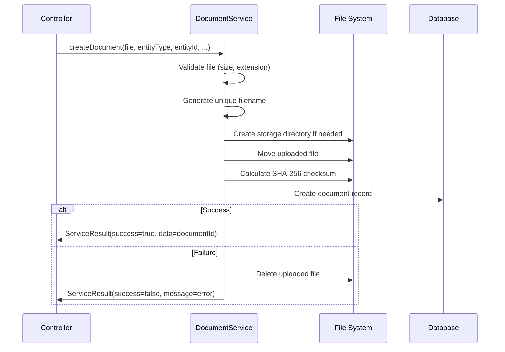

[← Back to Table of Contents](index.md) | [← Back to Core Modules](4-core-modules.md)

# 4.7 Document Management & Retention System

**Last Updated:** October 30, 2025  
**Status:** Complete  
**Module Location:** `app/src/Model/Table/DocumentsTable.php`, `app/src/Services/DocumentService.php`  

## Overview

KMP provides a comprehensive document management system for handling file uploads, storage, retrieval, and retention across all modules. The system includes a polymorphic documents table, a centralized document service, and flexible retention policy framework used by the Waivers plugin and other modules requiring document lifecycle management.

## Table of Contents

- [Core Concepts](#core-concepts)
- [Document Entity](#document-entity)
- [Document Service](#document-service)
- [Retention Policy System](#retention-policy-system)
- [Database Schema](#database-schema)
- [File Storage](#file-storage)
- [Upload & Retrieval](#upload--retrieval)
- [Security & Validation](#security--validation)
- [Integration Patterns](#integration-patterns)
- [Development Guide](#development-guide)

## Core Concepts

### What is a Document?

A **Document** in KMP represents any uploaded file with associated metadata and storage information. Documents are:

- **Polymorphic**: Can belong to any entity type (WaiverTypes, Members, Gatherings, etc.)
- **Tracked**: Full audit trail with uploader, timestamps, and modifications
- **Secure**: Stored outside webroot with access control
- **Verified**: Checksums ensure file integrity
- **Flexible**: Supports multiple storage adapters (local, S3, etc.)

### Key Features

1. **Polymorphic Storage**: Single table serves all document needs
2. **Centralized Service**: DocumentService provides consistent interface
3. **File Integrity**: SHA-256 checksums for validation
4. **Metadata Support**: JSON metadata for custom information
5. **Retention Policies**: Flexible expiration rules via RetentionPolicyService
6. **Soft Deletes**: Trash behavior for recovery
7. **Audit Trail**: Footprint behavior tracks all changes
8. **Storage Abstraction**: Easy to swap storage backends

## Document Entity

### Entity Properties

**Document Entity (`App\Model\Entity\Document`):**

```php
// Core Properties
int $id
string $entity_type          // E.g., 'Waivers.WaiverTypes', 'Members'
int $entity_id              // Foreign key to the owning entity

// File Information
string $original_filename    // User's original filename
string $stored_filename     // Unique generated filename
string $file_path          // Relative path from storage root
string $mime_type         // MIME type (application/pdf, image/jpeg, etc.)
int $file_size           // File size in bytes
string $checksum        // SHA-256 checksum for integrity

// Storage
string $storage_adapter     // 'local', 's3', 'azure', etc.
string|null $metadata      // JSON-encoded metadata

// Audit Trail
int $uploaded_by          // Member who uploaded
int $created_by          // Record creator
int|null $modified_by    // Last modifier
DateTime $created
DateTime $modified

// Associations
Member $uploader
Member $creator
Member $modifier

// Virtual Fields
array|null $metadata_array          // Parsed metadata JSON
string $file_size_formatted        // "1.5 MB", "245 KB", etc.
```

### Virtual Fields

**File Size Formatting:**

```php
protected function _getFileSizeFormatted(): string
{
    $bytes = $this->file_size;
    $units = ['B', 'KB', 'MB', 'GB'];
    $unitIndex = 0;
    
    while ($bytes >= 1024 && $unitIndex < count($units) - 1) {
        $bytes /= 1024;
        $unitIndex++;
    }
    
    return round($bytes, 2) . ' ' . $units[$unitIndex];
}
```

**Metadata Access:**

```php
protected function _getMetadataArray(): ?array
{
    if (empty($this->metadata)) {
        return null;
    }
    
    $decoded = json_decode($this->metadata, true);
    return is_array($decoded) ? $decoded : null;
}
```

### Polymorphic Association Pattern

Documents use a polymorphic pattern to associate with any entity:

```php
// In a model using documents (e.g., WaiverType)
$this->hasOne('Documents', [
    'foreignKey' => 'entity_id',
    'conditions' => [
        'Documents.entity_type' => 'Waivers.WaiverTypes'
    ],
    'dependent' => true
]);

// Or hasMany for multiple documents
$this->hasMany('Documents', [
    'foreignKey' => 'entity_id',
    'conditions' => [
        'Documents.entity_type' => 'Members'
    ],
    'dependent' => true
]);
```

## Document Service

### Service Overview

**Location:** `app/src/Services/DocumentService.php`

The DocumentService provides a centralized interface for all document operations, encapsulating upload logic, storage management, and file retrieval.

### Key Responsibilities

1. **File Upload Processing**: Validates and processes uploaded files
2. **Document Creation**: Creates document records with metadata
3. **File Storage**: Handles physical file storage with configurable adapters
4. **File Retrieval**: Provides file download responses
5. **Storage Abstraction**: Isolates storage implementation from consumers
6. **Error Handling**: Consistent error reporting via ServiceResult pattern

### Creating Documents

**Method Signature:**

```php
public function createDocument(
    UploadedFile $file,
    string $entityType,
    int $entityId,
    int $uploadedBy,
    array $metadata = [],
    string $subDirectory = '',
    array $allowedExtensions = ['pdf']
): ServiceResult
```

**Parameters:**

- `$file`: The uploaded file object from request
- `$entityType`: Entity type identifier (e.g., 'Waivers.WaiverTypes')
- `$entityId`: ID of the entity this document belongs to
- `$uploadedBy`: Member ID of the uploader
- `$metadata`: Optional metadata array (stored as JSON)
- `$subDirectory`: Optional subdirectory within storage (e.g., 'waiver-templates')
- `$allowedExtensions`: Array of allowed file extensions (default: ['pdf'])

**Example Usage:**

```php
// In a controller
$documentService = new DocumentService();

$result = $documentService->createDocument(
    $this->request->getData('template_file'),    // UploadedFile
    'Waivers.WaiverTypes',                        // Entity type
    $waiverType->id,                              // Entity ID
    $this->Authentication->getIdentity()->id,     // Uploader ID
    ['type' => 'waiver_template', 'version' => '1.0'],  // Metadata
    'waiver-templates',                           // Subdirectory
    ['pdf', 'docx']                              // Allowed extensions
);

if ($result->success) {
    $documentId = $result->data;
    $waiverType->document_id = $documentId;
    $this->WaiverTypes->save($waiverType);
} else {
    $this->Flash->error($result->message);
}
```

### Document Creation Workflow



### Retrieving Documents

**Download Response Method:**

```php
public function getDocumentDownloadResponse(
    Document $document,
    ?string $downloadFilename = null,
    bool $inline = false
): Response
```

**Parameters:**

- `$document`: Document entity to download
- `$downloadFilename`: Optional filename for download (defaults to original)
- `$inline`: If true, display in browser; if false, force download

**Example Usage:**

```php
// In a controller action
public function download($documentId = null)
{
    $document = $this->fetchTable('Documents')->get($documentId);
    
    // Authorization check
    $this->Authorization->authorize($document, 'download');
    
    $documentService = new DocumentService();
    return $documentService->getDocumentDownloadResponse(
        $document,
        $document->original_filename,
        false  // Force download
    );
}

// Inline display (e.g., PDF viewer)
public function preview($documentId = null)
{
    $document = $this->fetchTable('Documents')->get($documentId);
    $this->Authorization->authorize($document, 'view');
    
    $documentService = new DocumentService();
    return $documentService->getDocumentDownloadResponse(
        $document,
        $document->original_filename,
        true  // Display inline
    );
}
```

### File Conversion

**Convert Images to PDF:**

```php
public function convertImageToPdf(
    string $imagePath,
    string $outputPath
): ServiceResult
```

Converts uploaded images (JPG, PNG) to PDF format using ImageMagick or GD.

**Example:**

```php
$documentService = new DocumentService();

$result = $documentService->convertImageToPdf(
    WWW_ROOT . '../images/uploaded/waiver-scan.jpg',
    WWW_ROOT . '../images/uploaded/waiver-scan.pdf'
);

if ($result->success) {
    // Update document record to point to PDF
}
```

### Deleting Documents

**Soft Delete:**

Documents use the Trash behavior for soft deletes:

```php
// Soft delete (sets deleted timestamp)
$this->Documents->delete($document);

// Find including deleted
$allDocuments = $this->Documents->find()->withDeleted()->all();

// Permanently delete (removes file and record)
$this->Documents->hardDelete($document);
```

## Retention Policy System

### Overview

The retention policy system provides flexible document expiration rules. While primarily used by the Waivers plugin, it's designed for use by any module requiring document lifecycle management.

**Service Location:** `app/plugins/Waivers/src/Services/RetentionPolicyService.php`

### Policy Structure

Retention policies are stored as JSON with three key elements:

1. **Anchor**: The starting point for retention calculation
2. **Duration**: How long to retain from the anchor
3. **Format**: Supports years, months, and days

**JSON Structure:**

```json
{
  "anchor": "gathering_end_date",
  "duration": {
    "years": 7,
    "months": 0,
    "days": 0
  }
}
```

**Alternative Flat Format:**

```json
{
  "anchor": "upload_date",
  "years": 1,
  "months": 6,
  "days": 30
}
```

### Anchor Types

#### 1. Gathering End Date

Count retention from when the gathering ends:

```json
{
  "anchor": "gathering_end_date",
  "duration": { "years": 7 }
}
```

**Use Case**: Legal requirements tied to event dates (e.g., "retain waivers for 7 years after event")

**Calculation**: `retention_date = gathering.end_date + duration`

#### 2. Upload Date

Count retention from when the document was uploaded:

```json
{
  "anchor": "upload_date",
  "duration": { "years": 2, "months": 6 }
}
```

**Use Case**: Standard document retention (e.g., "retain all uploads for 2.5 years")

**Calculation**: `retention_date = document.created + duration`

#### 3. Permanent Retention

Never expire the document:

```json
{
  "anchor": "permanent"
}
```

**Use Case**: Historical records, legal documents that must be kept indefinitely

**Calculation**: Returns `null` (no expiration date)

### Service Methods

#### Calculate Retention Date

```php
public function calculateRetentionDate(
    string $policyJson,
    ?Date $gatheringEndDate = null,
    ?Date $uploadDate = null
): ServiceResult
```

**Example:**

```php
$service = new RetentionPolicyService();

// Policy: 7 years from gathering end
$policy = '{"anchor":"gathering_end_date","duration":{"years":7}}';
$gatheringEndDate = new Date('2024-12-31');

$result = $service->calculateRetentionDate($policy, $gatheringEndDate);

if ($result->success) {
    $retentionDate = $result->data;  // Date: 2031-12-31
    echo "Retain until: " . $retentionDate->format('Y-m-d');
}
```

#### Validate Policy

```php
public function validatePolicy(string $policyJson): ServiceResult
```

Validates policy JSON structure before use:

```php
$result = $service->validatePolicy($policyJson);

if (!$result->success) {
    echo "Invalid policy: " . $result->message;
} else {
    $parsedPolicy = $result->data;  // Array with validated structure
}
```

#### Check if Expired

```php
public function isExpired(
    string $policyJson,
    ?Date $gatheringEndDate = null,
    ?Date $uploadDate = null,
    ?Date $checkDate = null
): bool
```

**Example:**

```php
// Check if a document has expired
$hasExpired = $service->isExpired(
    $waiver->waiver_type->retention_policy,
    $waiver->gathering->end_date,
    $waiver->created,
    new Date()  // Check against today
);

if ($hasExpired) {
    $waiver->status = 'expired';
    $this->GatheringWaivers->save($waiver);
}
```

#### Get Human-Readable Description

```php
public function getHumanReadableDescription(string $policyJson): string
```

Converts policy JSON to user-friendly text:

```php
$description = $service->getHumanReadableDescription(
    '{"anchor":"gathering_end_date","duration":{"years":7}}'
);
// Returns: "Retain for 7 years after gathering end date"

$description = $service->getHumanReadableDescription(
    '{"anchor":"permanent"}'
);
// Returns: "Retain permanently"

$description = $service->getHumanReadableDescription(
    '{"anchor":"upload_date","duration":{"years":1,"months":6,"days":15}}'
);
// Returns: "Retain for 1 year, 6 months, 15 days after upload date"
```

### Retention Policy UI Component

The Waivers plugin includes a Stimulus controller for retention policy input:

**Controller:** `retention-policy-input-controller.js`

**HTML Structure:**

```php
<div data-controller="retention-policy-input">
    <!-- Anchor Selection -->
    <select data-retention-policy-input-target="anchorSelect"
            data-action="change->retention-policy-input#updatePreview">
        <option value="gathering_end_date">Gathering End Date</option>
        <option value="upload_date">Upload Date</option>
        <option value="permanent">Permanent</option>
    </select>
    
    <!-- Duration Inputs (hidden for permanent) -->
    <div data-retention-policy-input-target="durationInputs">
        <input type="number" 
               data-retention-policy-input-target="yearsInput"
               data-action="input->retention-policy-input#updatePreview"
               placeholder="Years">
        <input type="number"
               data-retention-policy-input-target="monthsInput"
               data-action="input->retention-policy-input#updatePreview"
               placeholder="Months">
        <input type="number"
               data-retention-policy-input-target="daysInput"
               data-action="input->retention-policy-input#updatePreview"
               placeholder="Days">
    </div>
    
    <!-- Live Preview -->
    <div class="alert alert-info">
        <strong>Preview:</strong>
        <span data-retention-policy-input-target="preview">
            7 years from gathering end date
        </span>
    </div>
    
    <!-- Hidden Input (actual form value) -->
    <input type="hidden"
           name="retention_policy"
           data-retention-policy-input-target="hiddenInput">
</div>
```

**Features:**

- Live preview of retention description
- Auto-hide duration inputs for permanent retention
- Generates JSON for form submission
- Validates input values

## Database Schema

### documents Table

```sql
CREATE TABLE documents (
    id INT AUTO_INCREMENT PRIMARY KEY,
    
    -- Polymorphic Association
    entity_type VARCHAR(100) NOT NULL,
    entity_id INT NOT NULL,
    
    -- File Information
    original_filename VARCHAR(255) NOT NULL,
    stored_filename VARCHAR(255) NOT NULL,
    file_path VARCHAR(500) NOT NULL UNIQUE,
    mime_type VARCHAR(100) NOT NULL,
    file_size INT NOT NULL,
    checksum VARCHAR(64) NOT NULL,
    
    -- Storage
    storage_adapter VARCHAR(50) DEFAULT 'local',
    metadata TEXT,
    
    -- Audit Trail
    uploaded_by INT NOT NULL,
    created_by INT NOT NULL,
    modified_by INT,
    created DATETIME NOT NULL,
    modified DATETIME NOT NULL,
    deleted DATETIME,  -- Soft delete
    
    FOREIGN KEY (uploaded_by) REFERENCES members(id),
    FOREIGN KEY (created_by) REFERENCES members(id),
    FOREIGN KEY (modified_by) REFERENCES members(id),
    
    INDEX idx_entity (entity_type, entity_id),
    INDEX idx_uploaded_by (uploaded_by),
    INDEX idx_deleted (deleted),
    INDEX idx_checksum (checksum)
);
```

### Field Descriptions

- `entity_type`: Plugin.Model or Model (e.g., 'Waivers.WaiverTypes', 'Members')
- `entity_id`: Foreign key to the owning entity
- `original_filename`: User's uploaded filename (preserved for download)
- `stored_filename`: Unique generated filename (UUID-based)
- `file_path`: Relative path from storage root
- `mime_type`: File MIME type for proper serving
- `file_size`: File size in bytes
- `checksum`: SHA-256 hash for integrity verification
- `storage_adapter`: Storage backend identifier ('local', 's3', 'azure')
- `metadata`: JSON-encoded custom metadata

## File Storage

### Storage Structure

Documents are stored outside the webroot for security:

```
/workspaces/KMP/
├── app/
│   └── webroot/         # Web-accessible (no documents here)
└── images/
    └── uploaded/        # Document storage (not web-accessible)
        ├── waiver-templates/
        │   ├── abc123-uuid.pdf
        │   └── def456-uuid.pdf
        ├── member-photos/
        │   └── ghi789-uuid.jpg
        └── gathering-maps/
            └── jkl012-uuid.png
```

### Filename Generation

**Unique Filename Pattern:**

```php
private function generateUniqueFilename(string $extension): string
{
    // UUID v4 + timestamp + extension
    $uuid = Uuid::uuid4()->toString();
    $timestamp = time();
    return "{$uuid}_{$timestamp}.{$extension}";
}

// Example: "a1b2c3d4-e5f6-7890-abcd-ef1234567890_1698700800.pdf"
```

### Storage Adapters

The system supports multiple storage backends via the `storage_adapter` field:

#### Local Filesystem (Default)

```php
'storage_adapter' => 'local'
```

Files stored in `/images/uploaded/` outside webroot.

#### Amazon S3 (Future)

```php
'storage_adapter' => 's3'
```

Would store files in S3 bucket with `file_path` containing S3 key.

#### Azure Blob Storage (Future)

```php
'storage_adapter' => 'azure'
```

Would store files in Azure blob container.

**Adapter Abstraction**: The DocumentService isolates storage logic, making it easy to add new adapters without changing consumer code.

## Upload & Retrieval

### Upload Flow

**1. Form with File Input:**

```php
<?= $this->Form->create($waiverType, ['type' => 'file']) ?>
<?= $this->Form->control('template_file', [
    'type' => 'file',
    'label' => 'Template PDF',
    'accept' => '.pdf,.docx',
    'required' => true
]) ?>
<?= $this->Form->button(__('Upload')) ?>
<?= $this->Form->end() ?>
```

**2. Controller Upload Processing:**

```php
public function add()
{
    $waiverType = $this->WaiverTypes->newEmptyEntity();
    
    if ($this->request->is('post')) {
        $waiverType = $this->WaiverTypes->patchEntity(
            $waiverType,
            $this->request->getData()
        );
        
        // Handle template file upload
        $templateFile = $this->request->getData('template_file');
        if ($templateFile && $templateFile->getSize() > 0) {
            $documentService = new DocumentService();
            $result = $documentService->createDocument(
                $templateFile,
                'Waivers.WaiverTypes',
                0,  // Entity ID not yet known (will update after save)
                $this->Authentication->getIdentity()->id,
                ['type' => 'waiver_template'],
                'waiver-templates',
                ['pdf', 'docx', 'doc']
            );
            
            if ($result->success) {
                $waiverType->document_id = $result->data;
            } else {
                $this->Flash->error($result->message);
                return;
            }
        }
        
        if ($this->WaiverTypes->save($waiverType)) {
            // Update document's entity_id now that we have it
            if ($waiverType->document_id) {
                $document = $this->fetchTable('Documents')
                    ->get($waiverType->document_id);
                $document->entity_id = $waiverType->id;
                $this->fetchTable('Documents')->save($document);
            }
            
            $this->Flash->success(__('Template uploaded.'));
            return $this->redirect(['action' => 'index']);
        }
    }
    
    $this->set(compact('waiverType'));
}
```

### Download Flow

**1. Controller Download Action:**

```php
public function download($id = null)
{
    $document = $this->fetchTable('Documents')->get($id, [
        'contain' => ['Uploaders']
    ]);
    
    // Authorization
    $this->Authorization->authorize($document, 'download');
    
    // Verify file exists
    $fullPath = WWW_ROOT . '../images/uploaded/' . $document->file_path;
    if (!file_exists($fullPath)) {
        throw new NotFoundException(__('File not found'));
    }
    
    // Return file response
    $documentService = new DocumentService();
    return $documentService->getDocumentDownloadResponse(
        $document,
        $document->original_filename,
        false  // Force download
    );
}
```

**2. View Link:**

```php
<?= $this->Html->link(
    '<i class="bi bi-download"></i> Download Template',
    ['action' => 'download', $waiverType->document_id],
    ['class' => 'btn btn-primary', 'escape' => false]
) ?>
```

### File Preview (Inline Display)

For PDFs and images that should display in browser:

```php
public function preview($id = null)
{
    $document = $this->fetchTable('Documents')->get($id);
    $this->Authorization->authorize($document, 'view');
    
    $documentService = new DocumentService();
    return $documentService->getDocumentDownloadResponse(
        $document,
        null,
        true  // Inline display
    );
}
```

**Embed in View:**

```php
<iframe src="<?= $this->Url->build([
    'action' => 'preview',
    $document->id
]) ?>" 
width="100%" 
height="600px"
style="border: 1px solid #ccc;">
</iframe>
```

## Security & Validation

### Access Control

**Policy-Based Authorization:**

```php
class DocumentPolicy extends BasePolicy
{
    public function canView(IdentityInterface $user, Document $document): bool
    {
        // Check if user can access the owning entity
        $owningEntity = $this->getOwningEntity($document);
        return $user->checkCan('view', $owningEntity);
    }
    
    public function canDownload(IdentityInterface $user, Document $document): bool
    {
        // Same as view for most cases
        return $this->canView($user, $document);
    }
    
    public function canDelete(IdentityInterface $user, Document $document): bool
    {
        // Must own the document or have admin access
        if ($document->uploaded_by === $user->id) {
            return true;
        }
        
        $owningEntity = $this->getOwningEntity($document);
        return $user->checkCan('delete', $owningEntity);
    }
    
    private function getOwningEntity(Document $document)
    {
        [$plugin, $model] = pluginSplit($document->entity_type);
        $table = $this->fetchTable($document->entity_type);
        return $table->get($document->entity_id);
    }
}
```

### File Validation

**Extension Validation:**

```php
// Whitelist approach - only allow specific types
$allowedExtensions = ['pdf', 'jpg', 'jpeg', 'png'];
```

**Size Validation:**

KMP provides client-side file size validation to prevent upload failures and improve user experience.

**PHP Helper Method - `KmpHelper::getUploadLimits()`:**

```php
// Get server upload limits
$uploadLimits = $this->KMP->getUploadLimits();
// Returns:
// [
//     'maxFileSize' => 26214400,        // bytes (smaller of upload_max_filesize and post_max_size)
//     'formatted' => '25MB',            // human-readable string
//     'uploadMaxFilesize' => 26214400,  // upload_max_filesize in bytes
//     'postMaxSize' => 31457280,        // post_max_size in bytes
// ]
```

**Client-Side Validation with Stimulus Controller:**

```php
<?php $uploadLimits = $this->KMP->getUploadLimits(); ?>

<div data-controller="file-size-validator"
     data-file-size-validator-max-size-value="<?= h($uploadLimits['maxFileSize']) ?>"
     data-file-size-validator-max-size-formatted-value="<?= h($uploadLimits['formatted']) ?>">
    
    <!-- Warning container -->
    <div data-file-size-validator-target="warning" class="d-none mb-3"></div>
    
    <!-- File input -->
    <?= $this->Form->control('document', [
        'type' => 'file',
        'label' => 'Upload Document',
        'class' => 'form-control',
        'data-file-size-validator-target' => 'fileInput',
        'data-action' => 'change->file-size-validator#validateFiles',
        'help' => 'Max size: ' . h($uploadLimits['formatted'])
    ]) ?>
    
    <!-- Submit button (will be disabled if file is too large) -->
    <button type="submit" data-file-size-validator-target="submitButton">
        Upload
    </button>
</div>
```

**Multiple File Upload:**

```php
<div data-controller="file-size-validator"
     data-file-size-validator-max-size-value="<?= h($uploadLimits['maxFileSize']) ?>"
     data-file-size-validator-max-size-formatted-value="<?= h($uploadLimits['formatted']) ?>"
     data-file-size-validator-total-max-size-value="<?= h($uploadLimits['postMaxSize']) ?>">
    
    <div data-file-size-validator-target="warning" class="d-none mb-3"></div>
    
    <input type="file"
           multiple
           accept="image/*"
           data-file-size-validator-target="fileInput"
           data-action="change->file-size-validator#validateFiles">
    
    <small class="text-muted">
        Max per file: <?= h($uploadLimits['formatted']) ?><br>
        Recommended total: <?= h($uploadLimits['formatted']) ?>
    </small>
</div>
```

**Validation Behavior:**
- **Valid Files**: No warnings shown, submit button remains enabled
- **Single File Too Large**: Error alert displayed, submit button disabled
- **Multiple Files - Individual Too Large**: Error alert with list of invalid files, submit button disabled
- **Multiple Files - Total Size Warning**: Warning alert (not error), submit button remains enabled

**Stimulus Controller Events:**
- `file-size-validator:valid` - All files are valid
- `file-size-validator:invalid` - One or more files exceed limits
- `file-size-validator:warning` - Warning displayed to user

**Server-Side Validation (Always Required):**

```php
// In controller - NEVER trust client-side validation alone
if ($file->getSize() > 5 * 1024 * 1024) {  // 5MB
    $this->Flash->error(__('File too large. Maximum size: 5MB'));
    return;
}
```

**MIME Type Validation:**

```php
$allowedMimeTypes = [
    'application/pdf',
    'image/jpeg',
    'image/png'
];

if (!in_array($file->getClientMediaType(), $allowedMimeTypes)) {
    return new ServiceResult(false, __('Invalid file type'));
}
```

### Integrity Verification

**Checksum Calculation:**

Documents store SHA-256 checksums for integrity verification:

```php
$checksum = hash_file('sha256', $fullFilePath);

// Verify on download
$currentChecksum = hash_file('sha256', $fullFilePath);
if ($currentChecksum !== $document->checksum) {
    Log::error('Document integrity check failed', [
        'document_id' => $document->id,
        'expected' => $document->checksum,
        'actual' => $currentChecksum
    ]);
    throw new InternalErrorException(__('Document integrity check failed'));
}
```

### Path Traversal Prevention

**Sanitize Filenames:**

```php
private function sanitizeFilename(string $filename): string
{
    // Remove path separators and dangerous characters
    $filename = basename($filename);
    $filename = preg_replace('/[^a-zA-Z0-9._-]/', '_', $filename);
    return $filename;
}
```

**Validate Storage Paths:**

```php
private function validateStoragePath(string $path): bool
{
    $realPath = realpath($path);
    $basePath = realpath(WWW_ROOT . '../images/uploaded/');
    
    // Ensure path is within allowed storage directory
    return $realPath && strpos($realPath, $basePath) === 0;
}
```

## Integration Patterns

### Pattern 1: Single Document Association

**Use Case**: Waiver template - one template file per waiver type

```php
// In WaiverTypesTable
public function initialize(array $config): void
{
    parent::initialize($config);
    
    $this->belongsTo('Documents', [
        'foreignKey' => 'document_id',
        'joinType' => 'LEFT'
    ]);
}

// In controller
if ($templateFile) {
    $documentService = new DocumentService();
    $result = $documentService->createDocument(
        $templateFile,
        'Waivers.WaiverTypes',
        $waiverType->id,
        $currentUserId,
        ['type' => 'template'],
        'waiver-templates'
    );
    
    if ($result->success) {
        $waiverType->document_id = $result->data;
    }
}
```

### Pattern 2: Multiple Documents (Polymorphic)

**Use Case**: Member profile - multiple documents per member

```php
// In MembersTable
public function initialize(array $config): void
{
    parent::initialize($config);
    
    $this->hasMany('Documents', [
        'foreignKey' => 'entity_id',
        'conditions' => [
            'Documents.entity_type' => 'Members'
        ],
        'dependent' => true
    ]);
}

// Upload multiple documents
foreach ($uploadedFiles as $file) {
    $documentService->createDocument(
        $file,
        'Members',
        $member->id,
        $currentUserId,
        ['category' => 'profile_photo'],
        'members'
    );
}

// Query documents
$memberDocuments = $this->fetchTable('Documents')
    ->find()
    ->where([
        'entity_type' => 'Members',
        'entity_id' => $memberId
    ])
    ->all();
```

### Pattern 3: Document with Retention Policy

**Use Case**: Gathering waivers with automatic expiration

```php
// In GatheringWaiver entity
public function calculateRetentionDate(): ?Date
{
    if (!$this->waiver_type || !$this->gathering) {
        return null;
    }
    
    $service = new RetentionPolicyService();
    $result = $service->calculateRetentionDate(
        $this->waiver_type->retention_policy,
        $this->gathering->end_date,
        $this->created
    );
    
    return $result->success ? $result->data : null;
}

// Automatic expiration check
public function checkExpiration(): bool
{
    if (!$this->retention_date) {
        return false;
    }
    
    if ($this->retention_date->isPast()) {
        $this->status = 'expired';
        return true;
    }
    
    return false;
}
```

### Pattern 4: Document Conversion

**Use Case**: Convert uploaded images to PDF

```php
// In upload processing
if (in_array($extension, ['jpg', 'jpeg', 'png'])) {
    // Create initial document
    $imageResult = $documentService->createDocument(
        $file,
        $entityType,
        $entityId,
        $uploadedBy,
        ['original_format' => $extension],
        $subDirectory
    );
    
    if ($imageResult->success) {
        $imageDocument = $this->Documents->get($imageResult->data);
        $imagePath = WWW_ROOT . '../images/uploaded/' . $imageDocument->file_path;
        $pdfPath = str_replace('.' . $extension, '.pdf', $imagePath);
        
        // Convert to PDF
        $convertResult = $documentService->convertImageToPdf($imagePath, $pdfPath);
        
        if ($convertResult->success) {
            // Update document to point to PDF
            $imageDocument->file_path = str_replace('.' . $extension, '.pdf', $imageDocument->file_path);
            $imageDocument->mime_type = 'application/pdf';
            $imageDocument->stored_filename = str_replace('.' . $extension, '.pdf', $imageDocument->stored_filename);
            $this->Documents->save($imageDocument);
            
            // Delete original image
            unlink($imagePath);
        }
    }
}
```

## Development Guide

### Creating a Document

**Basic Upload:**

```php
public function uploadDocument()
{
    $file = $this->request->getData('document');
    $documentService = new DocumentService();
    
    $result = $documentService->createDocument(
        $file,
        'MyPlugin.MyModel',
        $entityId,
        $this->Authentication->getIdentity()->id
    );
    
    if ($result->success) {
        $documentId = $result->data;
        // Associate with your entity
    } else {
        $this->Flash->error($result->message);
    }
}
```

### Querying Documents

**Find by Entity:**

```php
$documents = $this->Documents->find()
    ->where([
        'entity_type' => 'Members',
        'entity_id' => $memberId
    ])
    ->contain(['Uploaders'])
    ->order(['created' => 'DESC'])
    ->all();
```

**Find by Metadata:**

```php
// Using JSON contains (MySQL 5.7+)
$documents = $this->Documents->find()
    ->where([
        'entity_type' => 'Waivers.WaiverTypes',
        'JSON_CONTAINS(metadata, ?, \'$.type\')' => '"waiver_template"'
    ])
    ->all();
```

**Find Expired Documents:**

```php
// Using retention policies
$expiredWaivers = $this->GatheringWaivers->find()
    ->where([
        'status' => 'active',
        'retention_date <' => new Date()
    ])
    ->contain(['Documents'])
    ->all();

foreach ($expiredWaivers as $waiver) {
    $waiver->status = 'expired';
    $this->GatheringWaivers->save($waiver);
}
```

### Custom Validation

**Add to Model:**

```php
// In DocumentsTable
public function buildRules(RulesChecker $rules): RulesChecker
{
    $rules->add(function ($entity, $options) {
        // Verify entity exists
        [$plugin, $model] = pluginSplit($entity->entity_type);
        $table = $this->fetchTable($entity->entity_type);
        
        try {
            $table->get($entity->entity_id);
            return true;
        } catch (RecordNotFoundException $e) {
            return false;
        }
    }, 'entityExists', [
        'errorField' => 'entity_id',
        'message' => 'Associated entity does not exist'
    ]);
    
    return $rules;
}
```

### Testing

**Document Upload Test:**

```php
public function testDocumentUpload(): void
{
    // Create a test file
    $testFile = new UploadedFile(
        TEST_FILES . 'sample.pdf',
        filesize(TEST_FILES . 'sample.pdf'),
        UPLOAD_ERR_OK,
        'sample.pdf',
        'application/pdf'
    );
    
    $documentService = new DocumentService();
    $result = $documentService->createDocument(
        $testFile,
        'TestEntity',
        1,
        1,
        ['test' => true],
        'test-uploads'
    );
    
    $this->assertTrue($result->success);
    $this->assertIsInt($result->data);
    
    // Verify document was created
    $document = $this->Documents->get($result->data);
    $this->assertEquals('sample.pdf', $document->original_filename);
    $this->assertEquals('TestEntity', $document->entity_type);
    $this->assertEquals(1, $document->entity_id);
    
    // Verify file exists
    $filePath = WWW_ROOT . '../images/uploaded/' . $document->file_path;
    $this->assertFileExists($filePath);
    
    // Cleanup
    $this->Documents->hardDelete($document);
}
```

**Retention Policy Test:**

```php
public function testRetentionCalculation(): void
{
    $service = new RetentionPolicyService();
    
    // Test gathering end date anchor
    $policy = '{"anchor":"gathering_end_date","duration":{"years":7}}';
    $endDate = new Date('2024-12-31');
    
    $result = $service->calculateRetentionDate($policy, $endDate);
    
    $this->assertTrue($result->success);
    $this->assertInstanceOf(Date::class, $result->data);
    $this->assertEquals('2031-12-31', $result->data->format('Y-m-d'));
}
```

## Best Practices

### 1. Always Use DocumentService

Don't create document records directly - use the service:

```php
// ❌ Don't do this
$document = $this->Documents->newEntity([...]);
$this->Documents->save($document);

// ✅ Do this
$documentService = new DocumentService();
$result = $documentService->createDocument(...);
```

### 2. Validate Before Upload

Check file size and type before processing:

```php
$maxSize = 5 * 1024 * 1024;  // 5MB
if ($file->getSize() > $maxSize) {
    $this->Flash->error(__('File too large'));
    return;
}

if (!in_array($extension, $allowedExtensions)) {
    $this->Flash->error(__('Invalid file type'));
    return;
}
```

### 3. Use Subdirectories

Organize documents by type:

```php
$documentService->createDocument(
    $file,
    $entityType,
    $entityId,
    $userId,
    [],
    'waiver-templates'  // Subdirectory
);
```

### 4. Store Meaningful Metadata

Include context in metadata:

```php
$metadata = [
    'type' => 'waiver_template',
    'version' => '2.0',
    'uploaded_from' => 'wizard',
    'original_size' => $file->getSize(),
    'user_agent' => $this->request->getHeaderLine('User-Agent')
];
```

### 5. Implement Retention Policies

For documents with lifecycle requirements:

```php
// Define policy in entity/configuration
$retentionPolicy = [
    'anchor' => 'gathering_end_date',
    'duration' => ['years' => 7]
];

// Calculate and store retention date
$retentionDate = $retentionService->calculateRetentionDate(...);
$entity->retention_date = $retentionDate;
```

### 6. Authorization Checks

Always authorize document access:

```php
$document = $this->Documents->get($id);
$this->Authorization->authorize($document, 'download');
```

### 7. Error Handling

Use ServiceResult pattern consistently:

```php
$result = $documentService->createDocument(...);

if (!$result->success) {
    Log::error('Document upload failed', [
        'error' => $result->message,
        'user_id' => $userId
    ]);
    $this->Flash->error($result->message);
    return;
}
```

## Related Documentation

- [5.7 Waivers Plugin](5.7-waivers-plugin.md) - Primary user of retention policies
- [4.6 Gatherings System](4.6-gatherings-system.md) - Document associations
- [3.1 Core Foundation](3.1-core-foundation-architecture.md) - Service layer patterns
- [4.4 RBAC Security](4.4-rbac-security-architecture.md) - Authorization policies

---

**Navigation:** [← Back to Core Modules](4-core-modules.md) | [Table of Contents](index.md)
