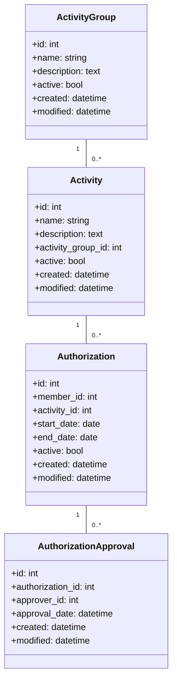
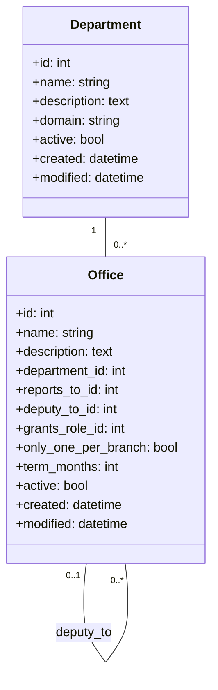
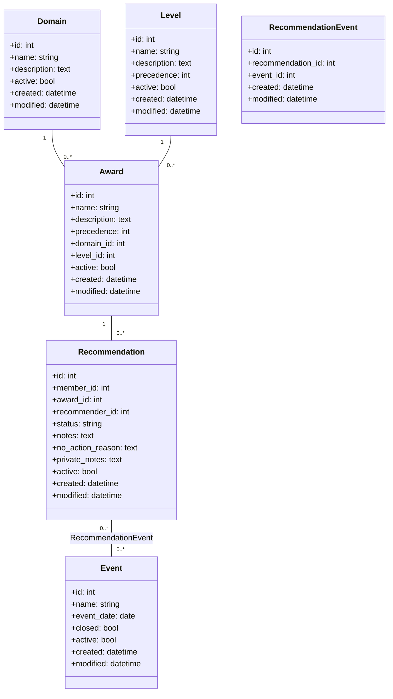
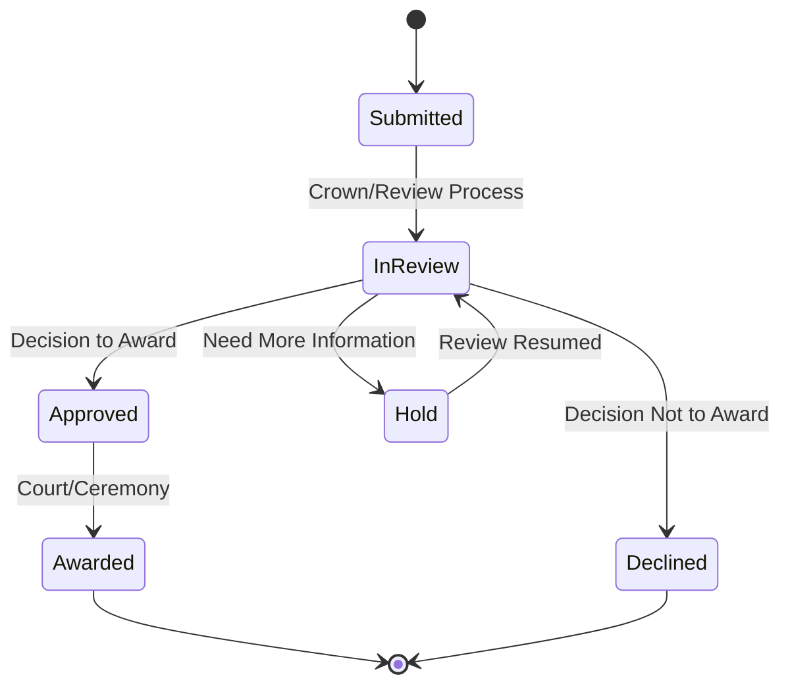
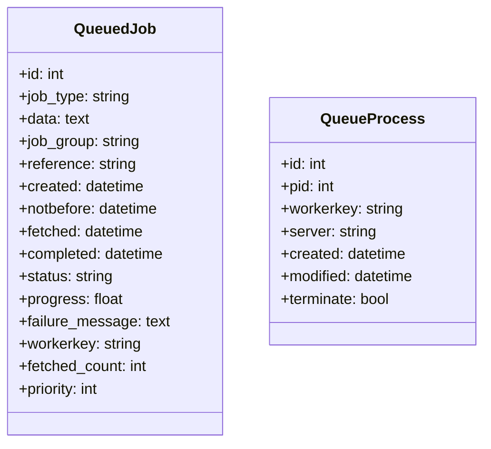
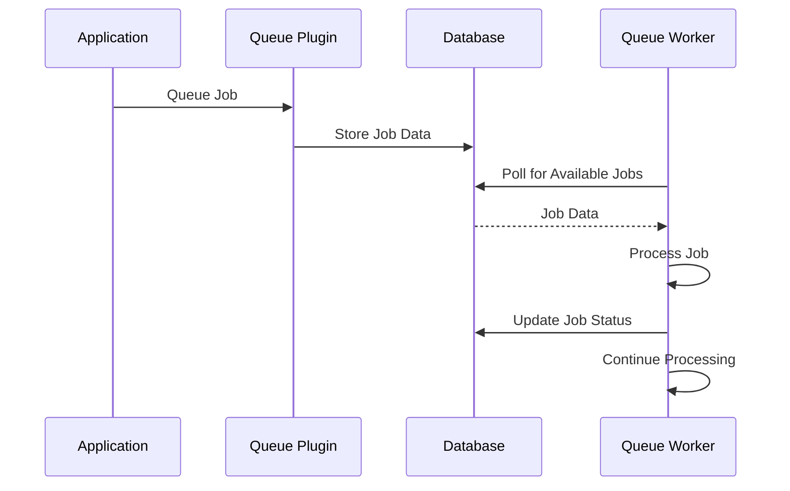

[← Back to Table of Contents](index.md)

# 5. Plugins

KMP uses a plugin architecture to organize functionality into modular, maintainable components. This section documents the primary plugins that extend the core system.

## 5.1 Activities

The Activities plugin manages member authorizations and participation in various kingdom activities.

### Purpose

This plugin tracks member participation in activities that require special authorizations, such as combat activities, arts and sciences, or other regulated pursuits within the SCA.

### Data Model



### Key Features

- **Activity Groups**: Categorize similar activities (e.g., "Heavy Combat", "Rapier", "A&S")
- **Activities**: Specific activities that members can be authorized for
- **Authorizations**: Record of a member's authorization for a specific activity
- **Approvals**: Tracking of who approved an authorization and when
- **Reporting**: Generate reports on authorizations by activity, group, or member

### Integration Points

The Activities plugin integrates with the core system via:
- Member records for authorization tracking
- Roles and permissions for access control
- Events for notifications and updates

## 5.2 Officers

The Officers plugin manages the officer structure, responsibilities, and hierarchy within the kingdom.

### Purpose

This plugin defines the officer positions, their relationships, and their organizational structure. It works closely with the Warrants module to manage officer appointments.

### Data Model



### Key Features

- **Departments**: Organizational units that group related offices (e.g., "Marshallate", "Exchequer", "Herald")
- **Offices**: Specific officer positions with defined responsibilities
- **Reporting Structure**: Hierarchical relationships between offices
- **Deputy Structure**: Deputy relationships between offices
- **Role Grants**: Automatic role assignments based on office held
- **Term Management**: Configuration of standard term lengths for each office

### Integration Points

The Officers plugin integrates with:
- The Warrants module for officer appointments
- Branches for geographic organization of officers
- Roles and permissions for access control
- The core navigation system to provide officer-specific menus

## 5.3 Awards

The Awards plugin manages the award recommendation and processing system for the kingdom.

### Purpose

This plugin allows members to submit award recommendations for other members, tracks the progress of recommendations through the review process, and maintains a record of awarded honors.

### Data Model



### Recommendation Status Flow



### Key Features

- **Awards**: Defined awards that can be given, organized by domain and level
- **Domains**: Categories of awards (e.g., "Service", "Arts", "Combat")
- **Levels**: Award precedence levels (e.g., "AoA", "Grant", "Peerage")
- **Recommendations**: Member-submitted award suggestions
- **Events**: Association of recommendations with events for court planning
- **Status Tracking**: Progress of recommendations through the review process
- **Reporting**: Generate reports on recommendations and awards

## 5.4 Queue

The Queue plugin provides background job processing capabilities for the KMP system.

### Purpose

This plugin allows the application to defer time-consuming tasks to background processes, improving user experience and system performance. It's based on the dereuromark/cakephp-queue plugin.

### Data Model



### Job Processing Flow



### Key Features

- **Job Types**: Different types of background tasks (e.g., email sending, report generation)
- **Job Queue**: Persistent storage of pending jobs
- **Workers**: Background processes that execute queued jobs
- **Status Tracking**: Monitoring of job progress and completion
- **Failure Handling**: Retry logic for failed jobs
- **Prioritization**: Job scheduling based on priority and timing
- **Admin Interface**: Management UI for monitoring and controlling the queue

### Common Job Types

- **Email**: Sending email notifications
- **Report Generation**: Creating complex reports
- **Data Import/Export**: Processing bulk data operations
- **System Maintenance**: Cleanup and optimization tasks

## 5.5 GitHubIssueSubmitter

The GitHubIssueSubmitter plugin allows users to submit feedback and bug reports directly to the project's GitHub repository.

### Purpose

This plugin provides an in-application interface for capturing user feedback and automatically creating GitHub issues, streamlining the bug reporting and feature request process.

### Key Features

- **Feedback Form**: User-friendly form for reporting issues
- **Automatic GitHub Integration**: Direct submission to GitHub via API
- **Context Collection**: Automatic collection of system state for better debugging
- **User Attribution**: Optional tracking of which user reported an issue
- **Status Tracking**: Follow-up on submitted issues

### Configuration

The plugin requires GitHub API credentials configured in the `app_settings` table:
- `GitHubIssueSubmitter.ApiToken`: GitHub API token for authentication
- `GitHubIssueSubmitter.Repository`: Target repository (e.g., "Ansteorra/KMP")
- `GitHubIssueSubmitter.Labels`: Default labels for submitted issues

## 5.6 Bootstrap

The Bootstrap plugin provides UI components and helpers for the Twitter Bootstrap 5 framework.

### Purpose

This plugin extends the FriendsOfCake/bootstrap-ui plugin with additional UI components and helpers specifically tailored for KMP.

### Key Features

- **UI Components**: Pre-built UI elements following Bootstrap design
- **Form Templates**: Bootstrap-compatible form styling
- **Modal Helpers**: Streamlined creation of modal dialogs
- **Navbar Helpers**: Tools for building consistent navigation
- **Layout Templates**: Standard layouts (dashboard, signin, etc.)

### Usage Examples

#### Modal Helper

```php
echo $this->Modal->create([
    'id' => 'myModal',
    'title' => 'Modal Title',
    'size' => 'lg',
]);
echo $this->Modal->body('Modal content goes here...');
echo $this->Modal->footer([
    $this->Form->button('Cancel', ['data-bs-dismiss' => 'modal']),
    $this->Form->button('Save', ['class' => 'btn-primary']),
]);
echo $this->Modal->end();
```

#### Navbar Helper

```php
echo $this->Navbar->create();
echo $this->Navbar->beginBrand();
echo $this->Html->link('Brand', '/', ['class' => 'navbar-brand']);
echo $this->Navbar->endBrand();
echo $this->Navbar->beginItems(['class' => 'navbar-nav']);
echo $this->Navbar->item('Home', '/');
echo $this->Navbar->endItems();
echo $this->Navbar->end();
```
