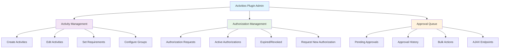

[← Back to Table of Contents](index.md)

# 5. Plugin Architecture

**Last Updated:** July 17, 2025  
**Status:** Complete  
**Phase:** 4 - Plugin Architecture Documentation  

The Kingdom Management Portal (KMP) employs a sophisticated plugin architecture that extends CakePHP's BasePlugin system with organizational management-specific features. This architecture enables modular development, conditional loading, and proper dependency management for complex organizational workflows.

## Table of Contents

- [Core Plugin Infrastructure](#core-plugin-infrastructure)
- [Plugin Registration System](#plugin-registration-system)
- [Integration Points](#integration-points)
- [Security Architecture](#security-architecture)
- [Plugin Categories](#plugin-categories)
- [Development Best Practices](#development-best-practices)
- [Troubleshooting](#troubleshooting)
- [Individual Plugin Documentation](#individual-plugin-documentation)
  - [Officers Plugin](5.1-officers-plugin.md)
  - [Awards Plugin](5.2-awards-plugin.md)
  - [Queue Plugin](5.3-queue-plugin.md)
  - [GitHub Issue Submitter](5.4-github-issue-submitter-plugin.md)
  - [Bootstrap Plugin](5.5-bootstrap-plugin.md)
  - [Activities Plugin](5.6-activities-plugin.md)
  - [Waivers Plugin](5.7-waivers-plugin.md)

## Core Plugin Infrastructure

### KMPPluginInterface

The `KMPPluginInterface` serves as the foundation contract for all KMP plugins, defining the essential requirements for plugin integration:

```php
interface KMPPluginInterface
{
    public function getMigrationOrder(): int;
}
```

### KMPApiPluginInterface

Plugins that publish API endpoints for service-principal consumers implement `KMPApiPluginInterface`:

```php
interface KMPApiPluginInterface
{
    public function registerApiRoutes(RouteBuilder $builder): void;
}
```

Pattern:
- Define plugin API routes inside `registerApiRoutes()`
- Keep endpoints read-only first (`index`, `view`) for safe integration rollout
- Delegate data shaping and query logic to plugin service classes under `src/Services/Api/`
- Keep controllers thin and focused on auth, pagination params, and response envelopes

Reference implementation:
- `OfficersPlugin` publishes `/api/v1/officers/*` routes
- Read-only services:
  - `DefaultReadOnlyDepartmentService`
  - `DefaultReadOnlyOfficeService`
  - `DefaultReadOnlyOfficerRosterService`

#### Migration Order System

The migration order system ensures plugins are initialized in the correct sequence to handle:

- **Database Dependencies**: Tables must exist before foreign key references
- **Service Registration**: Core services must be available before plugin services
- **Configuration Dependencies**: Shared configuration must be established first

**Standard Migration Orders:**
- **1**: Activities (base activity and authorization system)
- **2**: Officers (depends on activities for event reporting)
- **3**: Awards (depends on activities and officers for workflows)
- **4**: Waivers (waiver tracking for gatherings)

### Plugin Registration Pattern

All KMP plugins are registered in `config/plugins.php` with standardized configuration:

```php
'PluginName' => [
    'migrationOrder' => 1,      // Database initialization order (domain plugins only)
],
```

### Standard Plugin Structure

KMP plugins follow a consistent directory structure for maintainability:

```
plugins/PluginName/
├── assets/                     # Frontend assets
│   ├── css/                   # Plugin-specific stylesheets
│   └── js/controllers/        # Stimulus.js controllers
├── config/                    # Plugin configuration files
│   ├── routes.php            # Plugin-specific routes
│   └── Migrations/           # Database migrations
├── src/                       # Plugin source code
│   ├── Controller/           # Controllers
│   ├── Model/                # Models (Entity, Table)
│   ├── Services/             # Business logic services
│   ├── Event/                # Event handlers
│   └── PluginNamePlugin.php  # Main plugin class
├── templates/                 # Plugin templates
├── tests/                     # Plugin tests
│   ├── TestCase/             # Unit and integration tests
│   └── Fixture/              # Test fixtures
└── webroot/                   # Public plugin assets
```

## Plugin Registration System

### Configuration Management

Plugins are configured in `config/plugins.php` with comprehensive metadata:

```php
/**
 * KMP Plugin Registry Configuration
 *
 * Plugin Categories:
 * 1. Development Tools (DebugKit, Bake, Tools)
 * 2. Database Management (Migrations, Muffin/Trash, Muffin/Footprint)
 * 3. UI Framework (Bootstrap, BootstrapUI, AssetMix)
 * 4. Security & Auth (Authentication, Authorization)
 * 5. Core KMP Features (Activities, Awards, Officers)
 * 6. Utility Plugins (Queue, CsvView, ADmad/Glide, GitHubIssueSubmitter)
 */

return [
    'Activities' => [
        'migrationOrder' => 1,
    ],
    'Officers' => [
        'migrationOrder' => 2,
    ],
    'Awards' => [
        'migrationOrder' => 3,
    ],
    'Waivers' => [
        'migrationOrder' => 4,
    ],
    // ... utility plugins (no migrationOrder)
];
```

### Conditional Loading

Plugins can be conditionally loaded based on environment or configuration:

```php
// Environment-specific loading
if (env('DEBUG', false)) {
    $plugins['DebugKit'] = ['bootstrap' => true];
}

// Feature flag loading
if (StaticHelpers::getAppSetting('Plugin.Awards.Active', 'yes') === 'yes') {
    $plugins['Awards'] = ['migrationOrder' => 3];
}
```

## Integration Points

### Navigation System Integration

Plugins integrate with the KMP navigation system through the NavigationRegistry:

```php
NavigationRegistry::register(
    'PluginName',
    [], // Static navigation items
    function ($user, $params) {
        return PluginNavigationProvider::getNavigationItems($user, $params);
    }
);
```

**Navigation Provider Pattern:**
```php
class PluginNavigationProvider
{
    public static function getNavigationItems($user, $params): array
    {
        $items = [];
        
        // Permission-based navigation
        if ($user->can('index', 'PluginController')) {
            $items[] = [
                'title' => 'Plugin Dashboard',
                'url' => '/plugin',
                'icon' => 'fas fa-chart-bar',
                'badge' => PluginService::getPendingCount($user),
            ];
        }
        
        return $items;
    }
}
```

### View Cell Integration

Plugins register view cells for dashboard and page integration:

```php
ViewCellRegistry::register(
    'PluginName',
    [], // Static view cells
    function ($urlParams, $user) {
        return PluginViewCellProvider::getViewCells($urlParams, $user);
    }
);
```

**View Cell Provider Pattern:**
```php
class PluginViewCellProvider
{
    public static function getViewCells($urlParams, $user): array
    {
        $cells = [];
        
        // Context-sensitive cells
        if ($urlParams['controller'] === 'Members' && $urlParams['action'] === 'view') {
            $cells[] = [
                'cell' => 'Plugin.MemberDetails',
                'data' => ['member_id' => $urlParams['pass'][0]],
                'position' => 'member-tabs',
            ];
        }
        
        return $cells;
    }
}
```

### Configuration Management

Plugins use StaticHelpers for versioned configuration management:

```php
public function bootstrap(PluginApplicationInterface $app): void
{
    $currentConfigVersion = "25.01.11.a";
    $configVersion = StaticHelpers::getAppSetting("Plugin.configVersion", "0.0.0", null, true);
    
    if ($configVersion != $currentConfigVersion) {
        StaticHelpers::setAppSetting("Plugin.configVersion", $currentConfigVersion, null, true);
        
        // Update plugin configuration
        StaticHelpers::getAppSetting("Plugin.ButtonClass", "btn-primary", null, true);
        StaticHelpers::getAppSetting("Plugin.MaxItems", "100", null, true);
        
        // Configure member additional info fields
        StaticHelpers::getAppSetting(
            "Member.AdditionalInfo.PluginField",
            "select:Option1,Option2,Option3|user|public",
            null,
            true
        );
    }
}
```

## Security Architecture

### Authorization Integration

Plugins must integrate with KMP's RBAC system through:

#### Policy Classes
```php
class PluginResourcePolicy
{
    use \Authorization\Policy\BeforePolicyInterface;
    
    public function before($user, $resource, $action)
    {
        // Global authorization checks
        if (!$user || !$user->hasPermission('Plugin.Access')) {
            return false;
        }
    }
    
    public function canIndex($user, $resource)
    {
        return $user->hasPermission('Plugin.Index');
    }
    
    public function canEdit($user, $resource)
    {
        return $user->hasPermission('Plugin.Edit') && 
               $user->getBranchId() === $resource->getBranchId();
    }
}
```

#### Permission Requirements
```php
// In plugin controller
public function initialize(): void
{
    parent::initialize();
    $this->Authorization->authorizeModel("index", "add");
}

// In plugin service
public function processAction($user, $data)
{
    if (!$user->hasPermission('Plugin.Process')) {
        throw new ForbiddenException('Insufficient permissions');
    }
    
    // Business logic
}
```

### Data Protection Patterns

Plugin implementations must follow KMP security standards:

```php
// Input validation
public function edit($id = null)
{
    $entity = $this->PluginTable->get($id, [
        'contain' => []
    ]);
    
    if ($this->request->is(['patch', 'post', 'put'])) {
        $entity = $this->PluginTable->patchEntity($entity, $this->request->getData());
        
        // Validate and sanitize
        if ($this->PluginTable->save($entity)) {
            $this->Flash->success(__('The record has been saved.'));
            return $this->redirect(['action' => 'index']);
        }
        $this->Flash->error(__('The record could not be saved. Please, try again.'));
    }
    
    $this->set(compact('entity'));
}

// XSS protection in templates
echo h($entity->user_input);
echo $this->Html->link(h($entity->title), ['action' => 'view', $entity->id]);
```

## Plugin Categories

### Core Business Logic Plugins

#### Activities Plugin (`migrationOrder: 1`)



- **Purpose**: Authorization tracking and member participation management
- **Features**: Activity management, authorization workflows, event integration
- **Dependencies**: None (base system)
- **Integration**: Navigation, view cells, permission requirements

#### Officers Plugin (`migrationOrder: 2`)
- **Purpose**: Officer roster and reporting chain management
- **Features**: Officer appointments, reporting structures, event reporting
- **Dependencies**: Activities (for event reporting integration)
- **Integration**: Organizational charts, reporting workflows

#### Awards Plugin (`migrationOrder: 3`)
- **Purpose**: Award recommendation and ceremony management
- **Features**: Recommendation workflows, approval processes, ceremony planning
- **Dependencies**: Activities (for some authorization workflows)
- **Integration**: Kanban boards, approval workflows, court integration

### Utility Plugins

#### Queue Plugin
- **Purpose**: Background job processing and bulk operations
- **Features**: Job scheduling, progress tracking, error handling
- **Dependencies**: Minimal (utility service)
- **Integration**: Administrative dashboard, bulk operation triggers

#### Bootstrap Plugin
- **Purpose**: UI framework and component library
- **Features**: Responsive design, component helpers, styling consistency
- **Dependencies**: None (presentation layer)
- **Integration**: View helpers, component library, styling framework

#### GitHubIssueSubmitter Plugin
- **Purpose**: External service integration for feedback collection
- **Features**: Issue submission, feedback workflows, API integration
- **Dependencies**: None (external service)
- **Integration**: Feedback forms, error reporting, user communication

## Development Best Practices

### Standard Plugin Implementation

```php
<?php
declare(strict_types=1);

namespace PluginName;

use Cake\Console\CommandCollection;
use Cake\Core\BasePlugin;
use Cake\Core\ContainerInterface;
use Cake\Core\PluginApplicationInterface;
use Cake\Http\MiddlewareQueue;
use Cake\Routing\RouteBuilder;
use App\KMP\KMPPluginInterface;
use Cake\Event\EventManager;
use App\Services\NavigationRegistry;
use App\Services\ViewCellRegistry;
use App\KMP\StaticHelpers;

class PluginNamePlugin extends BasePlugin implements KMPPluginInterface
{
    protected int $_migrationOrder = 1;

    public function __construct($config = [])
    {
        if (!isset($config['migrationOrder'])) {
            $config['migrationOrder'] = 1;
        }
        $this->_migrationOrder = $config['migrationOrder'];
    }

    public function getMigrationOrder(): int
    {
        return $this->_migrationOrder;
    }

    public function bootstrap(PluginApplicationInterface $app): void
    {
        // Event handler registration
        $handler = new PluginEventHandler();
        EventManager::instance()->on($handler);

        // Navigation registration
        NavigationRegistry::register(
            'PluginName',
            [],
            function ($user, $params) {
                return PluginNavigationProvider::getNavigationItems($user, $params);
            }
        );

        // View cell registration
        ViewCellRegistry::register(
            'PluginName',
            [],
            function ($urlParams, $user) {
                return PluginViewCellProvider::getViewCells($urlParams, $user);
            }
        );

        // Configuration management
        $this->setupConfiguration();
    }

    public function routes(RouteBuilder $routes): void
    {
        $routes->plugin(
            'PluginName',
            ['path' => '/plugin-path'],
            function (RouteBuilder $builder) {
                $builder->fallbacks();
            }
        );
        parent::routes($routes);
    }

    public function services(ContainerInterface $container): void
    {
        // Service registration and dependency injection
        $container->add(
            PluginServiceInterface::class,
            PluginService::class
        );
    }

    private function setupConfiguration(): void
    {
        $currentConfigVersion = "25.01.11.a";
        $configVersion = StaticHelpers::getAppSetting(
            "PluginName.configVersion", 
            "0.0.0", 
            null, 
            true
        );
        
        if ($configVersion != $currentConfigVersion) {
            StaticHelpers::setAppSetting(
                "PluginName.configVersion", 
                $currentConfigVersion, 
                null, 
                true
            );
            
            // Configure plugin settings
            StaticHelpers::getAppSetting(
                "Plugin.PluginName.Active", 
                "yes", 
                null, 
                true
            );
        }
    }
}
```

### Performance Optimization

#### Lazy Loading Strategies
```php
// Navigation provider with lazy loading
public static function getNavigationItems($user, $params): array
{
    // Cache expensive permission checks
    $cacheKey = "nav_plugin_{$user->id}";
    return Cache::remember($cacheKey, function () use ($user, $params) {
        // Expensive navigation generation
        return $this->generateNavigationItems($user, $params);
    }, '1 hour');
}

// View cell provider with conditional loading
public static function getViewCells($urlParams, $user): array
{
    // Only load cells for relevant pages
    if (!in_array($urlParams['controller'], ['Members', 'Branches'])) {
        return [];
    }
    
    // Load cells based on context
    return $this->loadContextualCells($urlParams, $user);
}
```

#### Database Optimization
```php
// Optimized queries in plugin tables
class PluginTable extends BaseTable
{
    public function findActiveWithRelations(SelectQuery $query, array $options): SelectQuery
    {
        return $query
            ->contain(['RelatedEntity' => function ($q) {
                return $q->select(['id', 'name']); // Minimal fields
            }])
            ->where(['PluginEntity.active' => true])
            ->cache('plugin_active_list', 'plugin_cache'); // Cached results
    }
}
```

### Testing Integration

#### Unit Tests
```php
class PluginServiceTest extends TestCase
{
    protected $fixtures = [
        'app.Members',
        'plugin.PluginName.PluginEntities',
    ];

    public function testProcessAction()
    {
        $user = $this->getAuthenticatedUser();
        $service = new PluginService();
        
        $result = $service->processAction($user, ['test' => 'data']);
        
        $this->assertTrue($result->isSuccess());
        $this->assertEquals('Expected result', $result->getData());
    }
}
```

#### Integration Tests
```php
class PluginControllerTest extends IntegrationTestCase
{
    public function testIndex()
    {
        $this->loginAsUser('admin');
        $this->get('/plugin');
        
        $this->assertResponseOk();
        $this->assertResponseContains('Plugin Dashboard');
    }

    public function testAuthorizationRequired()
    {
        $this->loginAsUser('member'); // User without plugin permissions
        $this->get('/plugin/admin');
        
        $this->assertResponseCode(403);
    }
}
```

## Troubleshooting

### Common Plugin Issues

#### Migration Order Problems
**Symptom**: Database foreign key constraint errors during plugin initialization

**Causes**:
- Plugin depends on tables from higher-order plugins
- Circular dependencies between plugins
- Missing migration order configuration

**Solutions**:
```php
// Review and adjust migration order in config/plugins.php
'DependentPlugin' => [
    'migrationOrder' => 5, // After dependencies
    'dependencies' => ['BasePlugin'], // Explicit dependencies
],

// Add dependency checking in plugin bootstrap
public function bootstrap(PluginApplicationInterface $app): void
{
    if (!TableRegistry::getTableLocator()->exists('BasePlugin.BaseEntities')) {
        throw new \RuntimeException('DependentPlugin requires BasePlugin to be loaded first');
    }
}
```

#### Service Registration Conflicts
**Symptom**: Service resolution errors or unexpected service behavior

**Causes**:
- Multiple plugins registering the same service interface
- Service registration order conflicts
- Missing service dependencies

**Solutions**:
```php
// Use plugin-namespaced service names
$container->add(
    'PluginName.' . ServiceInterface::class,
    ServiceImplementation::class
);

// Add explicit service dependencies
$container->add(ServiceInterface::class, ServiceImplementation::class)
    ->addArgument(DependencyInterface::class);
```

#### Configuration Conflicts
**Symptom**: Unexpected configuration values or plugin behavior

**Causes**:
- Configuration key conflicts between plugins
- Version update issues
- Environment-specific configuration problems

**Solutions**:
```php
// Use plugin-prefixed configuration keys
StaticHelpers::getAppSetting("PluginName.SpecificSetting", $default);

// Add configuration validation
private function validateConfiguration(): void
{
    $required = ['PluginName.RequiredSetting'];
    foreach ($required as $setting) {
        if (!StaticHelpers::hasAppSetting($setting)) {
            throw new \RuntimeException("Missing required configuration: {$setting}");
        }
    }
}
```

### Performance Issues

#### Navigation Loading Delays
**Monitoring**:
```php
// Add timing to navigation providers
$start = microtime(true);
$items = $this->generateNavigationItems($user, $params);
$duration = microtime(true) - $start;

if ($duration > 0.1) { // 100ms threshold
    Log::warning("Slow navigation generation: {$duration}s");
}
```

**Optimization**:
```php
// Implement proper caching
$cacheKey = "nav_plugin_{$user->id}_" . md5(serialize($params));
return Cache::remember($cacheKey, function () use ($user, $params) {
    return $this->generateNavigationItems($user, $params);
}, '15 minutes');
```

#### View Cell Performance
**Monitoring**:
```php
// Profile view cell execution
$cells = [];
$timing = [];

foreach ($cellProviders as $provider) {
    $start = microtime(true);
    $providerCells = $provider($urlParams, $user);
    $timing[$provider] = microtime(true) - $start;
    $cells = array_merge($cells, $providerCells);
}

// Log slow providers
foreach ($timing as $provider => $duration) {
    if ($duration > 0.05) { // 50ms threshold
        Log::warning("Slow view cell provider: {$provider} ({$duration}s)");
    }
}
```

## References

- [CakePHP Plugin Development](https://book.cakephp.org/5/en/plugins.html)
- [KMP Navigation System](./6-services.md#navigation-registry)
- [KMP View Cell System](./9-ui-components.md#view-cells)
- [KMP Authorization System](./4.4-rbac-security-architecture.md)
- [KMP Configuration Management](./3-architecture.md#configuration-management)

## Individual Plugin Documentation

The following plugins are documented in detail in separate files to facilitate collaborative editing and maintenance:

### Core Business Logic Plugins

- **[5.1 Officers Plugin](5.1-officers-plugin.md)** - Officer structure, responsibilities, and hierarchy management
- **[5.2 Awards Plugin](5.2-awards-plugin.md)** - Award recommendation and processing system
- **[5.6 Activities Plugin](5.6-activities-plugin.md)** - Comprehensive authorization management system
- **[5.7 Waivers Plugin](5.7-waivers-plugin.md)** - Waiver upload, tracking, and compliance management for gatherings

### Utility and Infrastructure Plugins

- **[5.3 Queue Plugin](5.3-queue-plugin.md)** - Background job processing capabilities
- **[5.4 GitHubIssueSubmitter Plugin](5.4-github-issue-submitter-plugin.md)** - Bug reporting and feedback system
- **[5.5 Bootstrap Plugin](5.5-bootstrap-plugin.md)** - UI components and Bootstrap framework integration

Each plugin document includes:
- **Purpose and Overview** - Core functionality and use cases
- **Data Models** - Database structure and relationships
- **Workflows** - Process flows and business logic
- **Integration Points** - How the plugin connects with other KMP components
- **Configuration** - Setup and customization options
- **Examples** - Code samples and usage patterns
