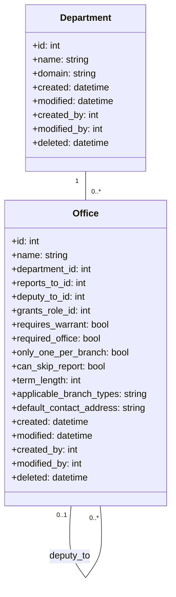

[← Back to Plugin Architecture](5-plugins.md)

# 5.1 Officers Plugin

**Last Updated:** July 18, 2025  
**Status:** Complete  
**Plugin:** Officers  

The Officers plugin manages the officer structure, responsibilities, and hierarchy within the kingdom.

## Purpose

This plugin defines the officer positions, their relationships, and their organizational structure. It works closely with the Warrants module to manage officer appointments.

## Data Model



## Key Features

- **Departments**: Organizational units that group related offices (e.g., "Marshallate", "Exchequer", "Herald")
- **Offices**: Specific officer positions with defined responsibilities
- **Reporting Structure**: Hierarchical relationships between offices
- **Deputy Structure**: Deputy relationships between offices
- **Role Grants**: Automatic role assignments based on office held
- **Term Management**: Configuration of standard term lengths (in months) for each office
- **Warrant Requirements**: Configurable warrant requirements for officer positions
- **Branch Applicability**: Office availability based on branch types

## Officer Assignment Workflow

### Complete Assignment Lifecycle

The Officers plugin implements a comprehensive officer assignment lifecycle that spans from initial appointment through active management to eventual release. This workflow integrates multiple KMP systems including warrant management, role-based access control, temporal validation, and organizational hierarchy management.

#### 1. Assignment Initiation

**Member Selection and Validation**
- Administrative users navigate to the officer assignment interface through the Officers navigation menu
- The assignment controller (`assign-officer-controller.js`) provides real-time member search with autocomplete functionality
- Member validation includes:
  - Active membership status verification
  - Branch context validation for organizational scope
  - Existing assignment conflict checking
  - Eligibility verification based on organizational rules

**Office Discovery and Selection**
- The system presents available offices based on:
  - Department organizational structure
  - Branch context and geographical scope
  - Hierarchical relationships and reporting structures
  - Current assignment status and availability
- Office configuration includes:
  - Warrant requirements and role grants
  - Hierarchical position within departmental structure
  - Deputy relationships and reporting chains
  - Term length and temporal management settings

#### 2. Assignment Processing

**Service-Oriented Architecture**
The `DefaultOfficerManager` service implements the core assignment business logic:

```php
// Assignment workflow through OfficerManagerInterface
$result = $officerManager->assign(
    $officeId,
    $memberId,
    $branchId,
    $startOn,
    $endOn,
    $deputyDescription,
    $approverId,
    $emailAddress
);
```

**Validation and Business Rules**
- Pre-assignment validation includes:
  - Office availability verification
  - Member eligibility checking
  - Hierarchical constraint validation
  - Temporal conflict resolution
- Business rule enforcement:
  - Single assignment per office constraints
  - Deputy relationship validation
  - Reporting structure integrity
  - Branch scope compliance

**Warrant Integration**
- Automatic warrant request generation for roles requiring formal appointments
- Warrant validation through `WarrantManager` integration:
  - Role requirement checking
  - Automatic role assignment upon warrant approval
  - Temporal validation with ActiveWindow management
  - Status tracking and lifecycle coordination

#### 3. Temporal Management

**ActiveWindow Integration**
- Officer assignments use ActiveWindow temporal validation for:
  - Start and end date management
  - Automatic status transitions
  - Overlap conflict detection
  - Historical assignment tracking

**Automatic Status Management**
- Real-time status updates based on temporal boundaries
- Assignment activation on start dates
- Automatic expiration handling
- Grace period management for transitions

#### 4. Role-Based Security Integration

**Permission-Based Assignment Authority**
- Authorization policies control assignment capabilities:
  - `OfficerPolicy::canAssign()` validates assignment authority
  - Branch context authorization for geographical scope
  - Administrative oversight permissions
  - Hierarchical authority validation

**Automatic Role Assignment**
- Warrant approval triggers automatic role grants:
  - Office-specific role assignment
  - Permission inheritance from office configuration
  - Hierarchical permission propagation
  - Access control updates

### Assignment Management Operations

#### Officer Editing and Updates

**Assignment Modification Interface**
The officer editing workflow (`edit-officer-controller.js`) provides:
- Real-time assignment data population through outlet coordination
- Assignment-aware editing with temporal validation
- Deputy relationship management
- Warrant status integration

**Data Integrity Validation**
- Assignment modification includes:
  - Temporal constraint validation
  - Hierarchical integrity checking
  - Warrant requirement compliance
  - Audit trail maintenance

#### Officer Release Processing

**Release Workflow**
The release process through `DefaultOfficerManager::release()` includes:
- Assignment termination processing
- Warrant revocation coordination
- Role removal and permission cleanup
- Audit trail creation

**Cleanup and Transition**
- Systematic cleanup of assignment-related data:
  - Active warrant termination
  - Role permission revocation
  - Hierarchical relationship updates
  - Historical record preservation

### Bulk Operations and Administrative Management

#### Roster Generation and Management

**Organizational Roster Creation**
The `RostersController` provides bulk assignment capabilities:
- Department-based officer roster generation
- Warrant period integration for temporal scoping
- Eligibility validation and batch processing
- Bulk warrant request generation

**Administrative Oversight**
- Roster management includes:
  - Organizational compliance monitoring
  - Assignment gap identification
  - Bulk operation coordination
  - Administrative reporting integration

#### Officer Search and Discovery

**Advanced Search Capabilities**
The officer roster search system (`officer-roster-search-controller.js`) provides:
- Multi-parameter search with warrant period and department filtering
- Real-time search validation and button state management
- Organizational scoping for administrative oversight
- Advanced filtering with character variant support

**Table Management and Selection**
The roster table system (`officer-roster-table-controller.js`) includes:
- Multi-row selection for bulk operations
- Selection state tracking and coordination
- Outlet button integration for bulk actions
- Administrative workflow optimization

## Office Hierarchy Management

### Organizational Structure Configuration

#### Department Management

**Departmental Organization**
Departments provide the foundational organizational structure:
- Categorical grouping of related offices (Marshallate, Exchequer, Herald)
- Domain-based organization for specialized areas
- Administrative oversight and reporting structure
- Integration with branch geographical organization

**Department Lifecycle Management**
- Department creation with comprehensive validation
- Modification interface with integrity checking
- Soft deletion with referential integrity protection
- Administrative reporting and analytics

#### Office Configuration and Hierarchy

**Hierarchical Office Structure**
Offices implement sophisticated hierarchical relationships:
- Reporting structure with `reports_to_id` hierarchical chains
- Deputy relationships through `deputy_to_id` configurations
- Warrant requirement integration with automatic role grants
- Term management with configurable duration settings

**Office Lifecycle Operations**
- Office creation with department integration and hierarchy validation
- Modification interface with hierarchical constraint checking
- Administrative oversight with assignment impact analysis
- Soft deletion with comprehensive referential integrity protection

### Hierarchical Relationship Management

#### Reporting Structure Integration

**Hierarchical Navigation**
The system provides comprehensive hierarchical navigation:
- Parent-child office relationships
- Deputy chain management
- Reporting structure visualization
- Administrative oversight capabilities

**Hierarchy Validation**
- Circular reference prevention in reporting chains
- Deputy relationship constraint validation
- Organizational integrity enforcement
- Administrative compliance checking

#### Integration with Assignment System

**Hierarchy-Aware Assignment Processing**
Officer assignments respect hierarchical constraints:
- Reporting relationship validation during assignment
- Deputy assignment coordination
- Hierarchical permission inheritance
- Organizational compliance enforcement

**Administrative Workflow Integration**
- Hierarchy-aware administrative interfaces
- Reporting structure visualization in management tools
- Organizational compliance monitoring
- Administrative oversight capabilities

## Warrant Integration and Role Management

### Warrant Requirement Configuration

#### Automatic Role Assignment

**Warrant-Triggered Role Management**
The system implements sophisticated warrant integration:
- Office configuration with `grants_role_id` automatic assignment
- Warrant approval triggers role grant processing
- Temporal validation with ActiveWindow coordination
- Role inheritance through hierarchical structures

**Configuration Management**
- Office-specific warrant requirements
- Role grant configuration and validation
- Temporal coordination with assignment lifecycle
- Administrative oversight and compliance monitoring

### Warrant Lifecycle Integration

#### Assignment and Warrant Coordination

**Integrated Workflow Processing**
Officer assignments coordinate with warrant management:
- Automatic warrant request generation for required roles
- Warrant status tracking and lifecycle coordination
- Assignment activation upon warrant approval
- Temporal validation and status synchronization

**Business Rule Enforcement**
- Warrant requirement validation during assignment
- Role eligibility checking and compliance
- Organizational authority validation
- Administrative oversight and audit trail

#### Automatic Role Management

**Role Assignment Automation**
Warrant approval triggers automatic role processing:
- Office-specific role grant execution
- Permission inheritance and propagation
- Hierarchical role coordination
- Access control system integration

**Role Lifecycle Management**
- Role assignment tracking and validation
- Permission coordination with RBAC system
- Temporal role management with assignment lifecycle
- Administrative reporting and compliance monitoring

### Administrative Oversight and Compliance

#### Warrant Status Reporting

**Comprehensive Compliance Monitoring**
The system provides extensive warrant compliance reporting:
- Officer warrant status analytics through `officersByWarrantStatus()`
- Organizational compliance monitoring
- Assignment validation and gap analysis
- Administrative reporting and oversight

**Compliance Validation**
- Real-time warrant status tracking
- Assignment compliance monitoring
- Organizational requirement validation
- Administrative alert and notification systems

#### Integration with Administrative Workflows

**Administrative Interface Integration**
Warrant management integrates with administrative workflows:
- Officer assignment interfaces with warrant status display
- Administrative oversight with compliance monitoring
- Reporting integration with organizational analytics
- Audit trail and historical tracking

**Workflow Automation**
- Automatic warrant processing for routine assignments
- Administrative approval workflows for complex cases
- Notification systems for compliance monitoring
- Integration with organizational reporting systems

## Integration Points

The Officers plugin integrates with:
- **Warrant Management System**: Automatic warrant requests, role assignment, and temporal validation
- **Branch Organization**: Geographic scoping and organizational context
- **RBAC Security System**: Permission-based assignment authority and automatic role grants
- **ActiveWindow Management**: Temporal validation and automatic status transitions
- **Navigation System**: Dynamic navigation for officer management workflows
- **View Cell System**: Member profile integration, branch officer displays, and administrative dashboards
- **Reporting System**: Administrative analytics, compliance monitoring, and organizational oversight

## References

- [Back to Plugin Architecture](5-plugins.md)
- [Warrant Lifecycle](4.3-warrant-lifecycle.md)
- [RBAC Security Architecture](4.4-rbac-security-architecture.md)
