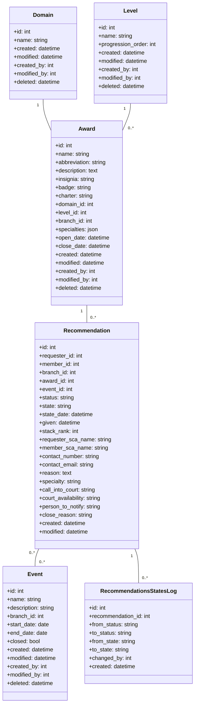
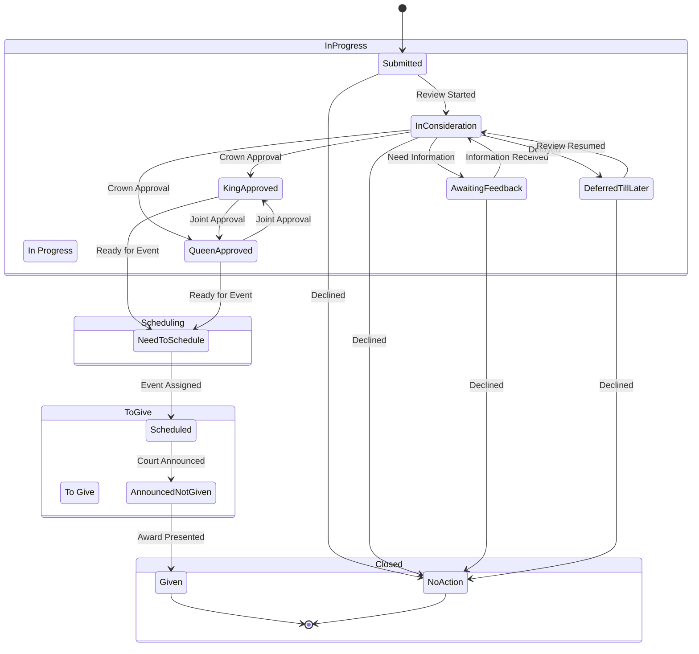

[← Back to Plugin Architecture](5-plugins.md)

# 5.2 Awards Plugin

**Last Updated:** July 17, 2025  
**Status:** Complete  
**Plugin:** Awards  

The Awards plugin manages the comprehensive award recommendation and processing system for the kingdom, implementing a sophisticated state machine-based workflow for managing the complete recommendation lifecycle from submission through ceremonial presentation.

## Purpose

This plugin provides a complete award management system that enables:

- **Award Recommendation Submission**: Members and public can submit award recommendations
- **Hierarchical Award Management**: Organized award system with domains, levels, and precedence
- **Workflow State Management**: Complex state machine for recommendation processing
- **Event-Based Ceremony Coordination**: Integration with events for award presentation
- **Administrative Oversight**: Comprehensive tools for managing the award process
- **Audit Trail Management**: Complete tracking of all recommendation state changes

## Architecture Overview

The Awards plugin implements a sophisticated architecture combining hierarchical award organization with flexible workflow management:

### Core Components

- **Awards Hierarchy**: Domain/Level-based organization with branch scoping
- **Recommendation Workflow**: State machine-driven process management  
- **Event Integration**: Ceremony scheduling and coordination
- **Member Integration**: Deep integration with member profiles and permissions
- **Administrative Tools**: Kanban boards, bulk operations, and reporting

### Data Model

## Award Recommendation Workflow

The Awards plugin implements a sophisticated dual-tracking state machine for managing recommendation workflows:

### Status/State Dual Tracking System

The system uses both **Status** (high-level category) and **State** (specific workflow position) for granular control:

#### Status Categories

- **In Progress**: Active recommendations being processed
- **Scheduling**: Recommendations approved and needing ceremony assignment
- **To Give**: Recommendations scheduled for presentation
- **Closed**: Completed or terminated recommendations

#### Detailed State Machine

### State Rules and Business Logic

Each state has specific rules governing field visibility, requirements, and transitions:

#### State-Specific Rules

**Need to Schedule:**
- Shows event planning fields
- Disables award/member modification
- Requires event assignment for progression

**Scheduled:**
- Requires assigned event
- Shows ceremonial planning fields
- Enables stack ranking for ceremony order

**Given:**
- Requires event assignment and given date
- Shows completion fields
- Automatically sets close reason to "Given"

**No Action:**
- Requires close reason explanation
- Disables most fields except closure details
- Represents declined or withdrawn recommendations

### Workflow Integration Points

#### Event Management Integration
- **Temporal Validation**: Events have open/close dates for recommendation processing
- **Ceremony Coordination**: Recommendations scheduled for specific events
- **Automatic Processing**: Event-based recommendation state transitions
- **Stack Ranking**: Priority ordering for ceremony presentation

#### Member Management Integration
- **Requester Tracking**: Links to submitting member or public contact
- **Subject Validation**: Verifies recommended member eligibility
- **Contact Management**: Maintains communication channels for coordination
- **Profile Synchronization**: Member data integration for court protocol

#### Administrative Workflows
- **Bulk Operations**: Multi-selection state transitions with transaction safety
- **Queue Management**: Status-based processing queues
- **Oversight Capabilities**: Administrative review and approval controls

## Award Hierarchy Management

### Domain/Level Organization

Awards are organized in a hierarchical structure:

#### Award Domains
- **Service**: Awards recognizing service to the kingdom
- **Arts & Sciences**: Recognition for artistic and scholarly achievement  
- **Martial**: Combat and martial arts recognition
- **Court**: Ceremonial and court-related awards

#### Award Levels  
- **Recognition**: Basic acknowledgment awards
- **Award of Arms**: Entry-level armigerous awards
- **Grant of Arms**: Mid-level grants with enhanced precedence
- **Peerage**: Highest level awards with voting rights

#### Branch Integration
- Awards scoped to specific branches within the kingdom
- Branch-based access control and data filtering
- Organizational hierarchy respect in recommendation routing

### Award Configuration

Each award includes:
- **Hierarchical Position**: Domain and level classification
- **Precedence Ranking**: Numerical ordering within level
- **Specialty Tracking**: Specific focus areas or disciplines
- **Branch Scope**: Organizational boundaries and jurisdiction
- **Temporal Boundaries**: Open/close dates controlling award availability
- **Heraldic Details**: Abbreviation, insignia, badge, and charter

## Event Management and Temporal Coordination

### Event Lifecycle

Award events coordinate the ceremonial presentation of awards:

#### Event Types
- **Court Events**: Formal ceremonies with structured award presentation
- **Tournament Events**: Martial competitions with field awards
- **Special Events**: Unique ceremonies for particular occasions

#### Temporal Validation
- **Open/Close Dates**: Event windows for recommendation processing
- **Deadline Management**: Automatic recommendation processing boundaries
- **Ceremony Coordination**: Integration with recommendation workflow states

#### Administrative Management
- **Event Creation**: Temporal event setup with recommendation integration
- **Ceremony Planning**: Recommendation assignment and stack ranking
- **Reporting Integration**: Event-based analytics and award tracking

### Recommendation-Event Integration

#### Assignment Workflow
1. **Approval**: Recommendations move to "Need to Schedule" state
2. **Event Assignment**: Administrative assignment to appropriate events
3. **Ceremony Preparation**: Stack ranking and court protocol preparation
4. **Presentation**: Award ceremony execution with completion tracking

#### Stack Ranking System
- **Priority Ordering**: Numerical ranking for ceremony organization
- **Precedence Respect**: Automatic ordering by award level and precedence
- **Ceremony Flow**: Optimal presentation order for court efficiency
- **Administrative Control**: Manual override capabilities for special circumstances

## User Interface and Workflow Management

### Tabular Display Mode

Comprehensive table interface for recommendation management:

#### Advanced Filtering
- **Multi-Criteria Filtering**: Status, state, award, member, date ranges
- **Permission-Based Visibility**: Dynamic filtering based on user permissions
- **Saved Filter Configurations**: Customizable view presets for different roles
- **Real-Time Search**: Dynamic filtering with immediate results

#### Data Export Capabilities
- **CSV Export**: Configurable column selection for data analysis
- **Filtered Exports**: Export based on current filter criteria
- **Administrative Reporting**: Comprehensive data extraction for oversight
- **Custom Column Configuration**: User-selectable export fields

### Kanban Board Interface

Visual workflow management with drag-and-drop functionality:

#### Interactive State Management
- **Drag-and-Drop Transitions**: Visual state changes with validation
- **Column-Based Organization**: State representation with workflow visualization
- **Real-Time Updates**: AJAX-based updates without page refresh
- **Business Rule Enforcement**: Transition validation with rule checking

#### Permission-Based Columns
- **Dynamic Visibility**: Columns shown based on user permissions
- **Role-Based Interface**: Different views for different administrative roles
- **Authorization Validation**: State transition permissions enforced
- **Administrative Override**: Elevated permission capabilities

### Bulk Operations Management

Administrative efficiency tools for large-scale operations:

#### Multi-Selection Operations
- **Batch State Transitions**: Simultaneous state changes for multiple recommendations
- **Selection Management**: Advanced selection tools with filtering integration
- **Transaction Safety**: ACID compliance for bulk operations
- **Validation Enforcement**: Business rule checking for batch operations

#### Administrative Efficiency
- **Quick Edit Interface**: Streamlined editing for rapid updates
- **Bulk Edit Forms**: Multi-field updates across selections
- **Automated Workflows**: Scripted processing for routine operations
- **Audit Trail Integration**: Complete tracking of bulk modifications

## Authorization and Security Architecture

### Multi-Level Authorization

The Awards plugin implements sophisticated authorization controls:

#### Entity-Level Authorization
- **Recommendation Access**: Owner-based and permission-based access control
- **Award Management**: Administrative permissions for award configuration
- **Event Management**: Temporal event access with coordination permissions
- **Audit Access**: Transparency controls with privacy protection

#### Permission-Based Features
- **Dynamic Approval Authority**: Level-specific approval permissions (e.g., canApproveAoA, canApproveGoA)
- **Branch Scoping**: Organizational boundary enforcement
- **Workflow Permissions**: State-specific operation authorization
- **Export Controls**: Data access permissions for reporting

#### Dual Ownership Model
- **Requester Access**: Submitters can view and track their recommendations
- **Subject Access**: Recommended members can view recommendations about them
- **Administrative Oversight**: Enhanced permissions for workflow management
- **Public Submission**: Unauthenticated submission with moderation workflow

### Security Considerations

#### Data Protection
- **Mass Assignment Protection**: Secure field access configuration
- **Query Scoping**: Automatic data filtering based on permissions
- **Audit Trail Integrity**: Immutable state change logging
- **Privacy Controls**: Balancing transparency with appropriate privacy

#### Workflow Integrity
- **State Validation**: Business rule enforcement for state transitions
- **Transaction Management**: ACID compliance for complex operations
- **Concurrent Access**: Safe handling of simultaneous modifications
- **Authorization Caching**: Performance optimization with security maintenance

## Integration Points

### Member Management Integration
- **Profile Synchronization**: Member data integration for recommendations
- **Permission System**: RBAC integration for access control
- **Contact Management**: Communication preferences and protocols
- **Warrant Integration**: Officer permissions for approval authority

### Branch Hierarchy Integration
- **Organizational Scoping**: Branch-based data filtering and access
- **Hierarchical Navigation**: Branch relationship management
- **Administrative Boundaries**: Organizational jurisdiction enforcement
- **Reporting Scopes**: Branch-specific analytics and oversight

### Core System Integration
- **Flash Messaging**: User feedback through CakePHP Flash component
- **View Cell System**: Integration with ViewCellRegistry for component display
- **Navigation Services**: Dynamic navigation generation with permission-based visibility
- **Configuration System**: AppSettings integration for workflow configuration

### Limited API Integration
- **Awards Discovery API**: Single JSON endpoint for domain-based award discovery (`awardsByDomain`)
- **AJAX Interfaces**: JavaScript controllers for dynamic form updates and kanban operations
- **CSV Export**: Data export capabilities through CsvExportService integration

## Administrative Features

### Recommendation Queue Management
- **Status-Based Queues**: Organized processing workflows
- **Priority Management**: Stack ranking and precedence ordering
- **Assignment Tools**: Event and reviewer assignment interfaces
- **Progress Tracking**: Workflow advancement monitoring

### Award Configuration Management
- **Hierarchical Setup**: Domain and level configuration
- **Precedence Management**: Award ordering and priority
- **Specialty Tracking**: Discipline-specific award variants
- **Branch Assignment**: Organizational scope configuration

### Reporting and Analytics
- **Workflow Analytics**: State transition timing and efficiency
- **Award Statistics**: Distribution and frequency analysis
- **Member Recognition**: Individual and branch achievement tracking
- **Performance Metrics**: Administrative efficiency measurements

### Audit Trail and Compliance
- **Complete State Logging**: Every recommendation change tracked
- **User Attribution**: Change tracking with user accountability
- **Timestamp Management**: Precise timing for all modifications
- **Immutable Records**: Audit trail integrity protection

## Key Features

- **Hierarchical Award System**: Domain/Level organization with branch scoping
- **Sophisticated State Machine**: Dual status/state tracking with business rules
- **Event Integration**: Ceremony coordination with temporal validation
- **Multi-Interface Support**: Tabular and kanban workflow management
- **Comprehensive Authorization**: Entity and permission-based access control
- **Audit Trail Management**: Complete state change tracking
- **Bulk Operations**: Administrative efficiency tools
- **Public Submission**: Unauthenticated recommendation capability
- **Export and Reporting**: Comprehensive data analysis tools
- **Real-Time Updates**: AJAX-based interface updates

## References

- [Back to Plugin Architecture](5-plugins.md)
- [Activities Plugin](5.6-activities-plugin.md) (for authorization workflows)
- [RBAC Security Architecture](4.4-rbac-security-architecture.md)
- [Member Lifecycle](4.1-member-lifecycle.md)
- [Branch Hierarchy](4.2-branch-hierarchy.md)
