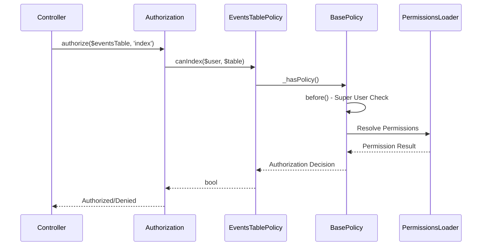

[← Back to Awards Plugin](5.2-awards-plugin.md)

# 5.2.10 EventsTable Policy Reference

**Last Updated:** December 4, 2025  
**Status:** Complete  
**Plugin:** Awards  
**Source:** `plugins/Awards/src/Policy/EventsTablePolicy.php`

## Overview

The `EventsTablePolicy` class provides table-level authorization for award event management within the Awards plugin. It manages temporal event data access, bulk operations, and administrative oversight through integration with the KMP RBAC system.

## Class Definition

```php
namespace Awards\Policy;

class EventsTablePolicy extends BasePolicy
```

All authorization methods are inherited from `BasePolicy` and delegate to the centralized `_hasPolicy()` method for consistent RBAC integration.

## RBAC Integration Architecture

### Permission-Based Authorization

- **Delegation Pattern**: All authorization decisions delegated to `BasePolicy._hasPolicy()`
- **Temporal Validation**: Event access controlled through temporal boundaries
- **Administrative Oversight**: Super user privileges for administrative event management
- **Query Scoping**: Branch-scoped queries for organizational access control

### BasePolicy Inheritance

The policy inherits standard table authorization methods:

| Method | Purpose |
|--------|---------|
| `canIndex()` | Event listing with organizational and temporal scoping |
| `canAdd()` | Event creation with administrative permission requirements |
| `scopeIndex()` | Query scoping for branch-based access control |

## Table Operations Governance

Authorization is enforced for all table-level operations:

| Operation | Authorization Requirements |
|-----------|---------------------------|
| Query Authorization | Permission validation for event listing and temporal data retrieval |
| Temporal Management | Access control for date-based queries and event lifecycle operations |
| Structural Modifications | Administrative permissions for bulk event operations |
| Administrative Access | Elevated access for comprehensive event management |

## Query Scoping

The policy implements query filtering through BasePolicy:

- **Branch-Scoped Queries**: Organizational access control through branch filtering
- **Temporal Filtering**: Event lifecycle management with date-based queries
- **Administrative Scoping**: Comprehensive event oversight for authorized administrators

## Authorization Flow



## Usage Examples

### Controller Integration

```php
// Standard table authorization in EventsController
public function index() {
    $this->Authorization->authorize($this->Events, 'index');
    $events = $this->paginate($this->Events);
    $this->set(compact('events'));
}
```

### Temporal Management Services

```php
// Event management with temporal filtering
$eventsQuery = $this->Events->find()
    ->where(['open_date <=' => date('Y-m-d')])
    ->order(['open_date' => 'DESC']);
$authorizedQuery = $this->Authorization->applyScope($user, 'index', $eventsQuery);
```

### Administrative Operations

```php
// Administrative event creation
if ($this->Authorization->can($user, 'add', $this->Events)) {
    // Bulk event creation with temporal validation...
}
```

## Integration Points

### Events Controller Integration

- **CRUD Operations**: Table-level create, read authorization
- **Temporal Management**: Event scheduling and deadline management
- **Administrative Interface**: Permission-based feature visibility

### RBAC System Integration

- **Permission Framework**: Integration with KMP RBAC through BasePolicy
- **Warrant System**: Warrant-based permission validation
- **Role Integration**: Role-based permissions and organizational hierarchy

### Awards Plugin Integration

- **Entity Policy Coordination**: Works with EventPolicy for entity-level authorization
- **Recommendation System**: Event data access for recommendation processing
- **Temporal Windows**: Authorization respects event temporal boundaries

## Security Considerations

### Access Control Security

- **Authentication Required**: All operations require authenticated user identity
- **Permission Validation**: Comprehensive RBAC permission checking
- **Query Filtering**: Automatic branch-based query scoping
- **Administrative Protection**: Administrative permission requirements

### Data Protection

- **Organizational Scoping**: Event data access limited to authorized contexts
- **Temporal Security**: Time-based access constraints for event lifecycle
- **Audit Trail**: Authorization decisions logged for compliance monitoring

## Related Documentation

- [Awards Plugin Overview](5.2-awards-plugin.md)
- [EventsTable API Reference](5.2.1-awards-events-table.md)
- [Event Policy Reference](5.2.9-awards-event-policy.md)
- [RBAC Security Architecture](4.4-rbac-security-architecture.md)
