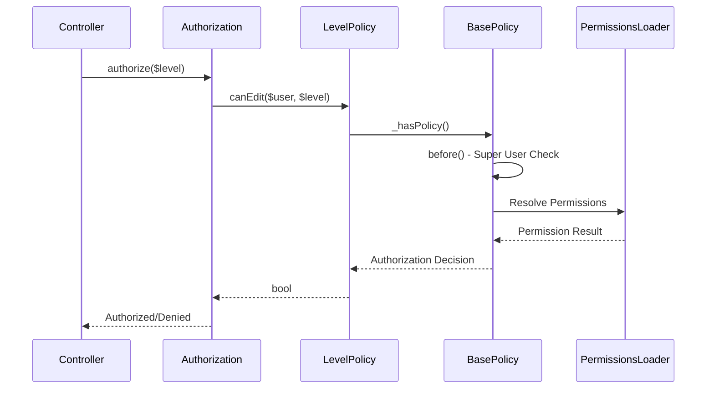

[← Back to Awards Plugin](5.2-awards-plugin.md)

# 5.2.11 Level Policy Reference

**Last Updated:** December 4, 2025  
**Status:** Complete  
**Plugin:** Awards  
**Source:** `plugins/Awards/src/Policy/LevelPolicy.php`

## Overview

The `LevelPolicy` class provides authorization control for Level entities within the Awards plugin. It manages access to award levels including precedence control, hierarchical ordering, and administrative oversight through integration with the KMP RBAC system.

## Class Definition

```php
namespace Awards\Policy;

class LevelPolicy extends BasePolicy
```

All authorization methods are inherited from `BasePolicy` and delegate to the centralized `_hasPolicy()` method for consistent RBAC integration.

## RBAC Integration Architecture

### Permission-Based Authorization

- **Delegation Pattern**: All authorization decisions delegated to `BasePolicy._hasPolicy()`
- **Hierarchical Support**: Level access controlled through precedence relationships
- **Administrative Oversight**: Super user privileges for administrative level management
- **Warrant Integration**: Permission validation through warrant-based authority checking

### BasePolicy Inheritance

The policy inherits standard CRUD authorization methods:

| Method | Purpose |
|--------|---------|
| `canView()` | Level viewing with organizational access validation |
| `canAdd()` | Level creation with administrative permission requirements |
| `canEdit()` | Level editing with precedence adjustment authorization |
| `canDelete()` | Level removal with precedence integrity validation |
| `canIndex()` | Level listing with organizational scoping |

## Level Operations Governance

Authorization is enforced for all level operations:

| Operation | Authorization Requirements |
|-----------|---------------------------|
| Creation | Administrative permissions for creating levels and defining precedence |
| Modification | Edit permissions with precedence adjustment authorization |
| Deletion | Delete permissions with precedence integrity protection |
| Precedence Management | Specialized permissions for hierarchical ordering operations |

## Authorization Flow



## Usage Examples

### Controller Integration

```php
// Standard CRUD authorization in LevelsController
public function view($id) {
    $level = $this->Levels->get($id);
    $this->Authorization->authorize($level); // Uses canView()
    $this->set(compact('level'));
}

public function edit($id) {
    $level = $this->Levels->get($id);
    $this->Authorization->authorize($level); // Uses canEdit()
    // Level editing logic...
}
```

### Administrative Operations

```php
// Administrative level management
public function delete($id) {
    $level = $this->Levels->get($id);
    $this->Authorization->authorize($level, 'delete');
    // Level deletion with precedence validation...
}
```

### Service Layer Authorization

```php
// Level management service with policy validation
public function updateLevel($levelId, $data) {
    $level = $this->Levels->get($levelId);
    if (!$this->Authorization->can($level, 'edit')) {
        throw new ForbiddenException('Not authorized to edit level');
    }
    return $this->Levels->patchEntity($level, $data);
}
```

## Integration Points

### Levels Controller Integration

- **CRUD Operations**: Standard create, read, update, delete authorization
- **Precedence Management**: Level ordering and hierarchy management
- **Administrative Interface**: Permission-based feature visibility

### RBAC System Integration

- **Permission Framework**: Integration with KMP RBAC through BasePolicy
- **Warrant System**: Warrant-based permission validation
- **Role Integration**: Role-based permissions and organizational hierarchy

### Awards Plugin Integration

- **Award Management**: Level-award relationship authorization
- **Precedence Hierarchy**: Maintains integrity of level ordering
- **Recommendation System**: Level validation for recommendation processing

## Security Considerations

### Access Control Security

- **Authentication Required**: All operations require authenticated user identity
- **Permission Validation**: Comprehensive RBAC permission checking
- **Entity-Level Security**: Entity ownership validation
- **Administrative Protection**: Administrative permission requirements

### Data Protection

- **Hierarchical Security**: Precedence hierarchy respected in access control
- **Audit Trail**: Authorization decisions logged for compliance monitoring
- **Data Integrity**: Authorization respects referential integrity constraints

## Related Documentation

- [Awards Plugin Overview](5.2-awards-plugin.md)
- [LevelsTable API Reference](5.2.2-awards-levels-table.md)
- [Award Policy Reference](5.2.5-awards-award-policy.md)
- [RBAC Security Architecture](4.4-rbac-security-architecture.md)
