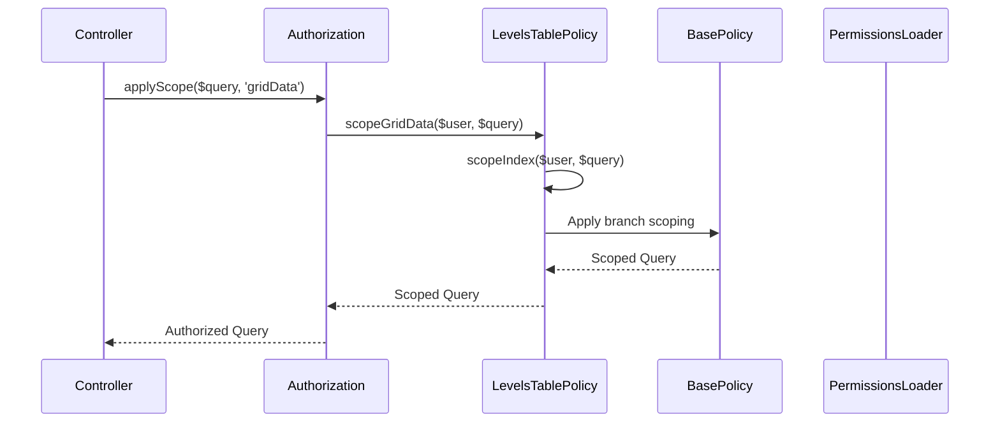

[← Back to Awards Plugin](5.2-awards-plugin.md)

# 5.2.12 LevelsTable Policy Reference

**Last Updated:** December 4, 2025  
**Status:** Complete  
**Plugin:** Awards  
**Source:** `plugins/Awards/src/Policy/LevelsTablePolicy.php`

## Overview

The `LevelsTablePolicy` class provides table-level authorization for award level management within the Awards plugin. It manages hierarchical level data access, precedence operations, bulk operations, and administrative oversight through integration with the KMP RBAC system.

## Class Definition

```php
namespace Awards\Policy;

class LevelsTablePolicy extends BasePolicy
```

## RBAC Integration Architecture

### Permission-Based Authorization

- **Delegation Pattern**: All authorization decisions delegated to `BasePolicy._hasPolicy()`
- **Hierarchical Support**: Level access controlled through precedence relationships
- **Administrative Oversight**: Super user privileges for administrative level management
- **Query Scoping**: Branch-scoped queries for organizational access control

### BasePolicy Inheritance

The policy inherits standard table authorization methods:

| Method | Purpose |
|--------|---------|
| `canIndex()` | Level listing with organizational scoping |
| `canAdd()` | Level creation with administrative permission requirements |
| `scopeIndex()` | Query scoping for branch-based access control |

## Custom Authorization Methods

### scopeGridData()

Provides query scoping for Dataverse grid data endpoints, delegating to standard index authorization.

```php
public function scopeGridData(KmpIdentityInterface $user, mixed $query): mixed
```

**Parameters:**
- `$user` - The user requesting access (implements `KmpIdentityInterface`)
- `$query` - The query to scope for grid data access

**Returns:** Scoped query with appropriate access restrictions

**Purpose:**
- Provides consistent authorization for Dataverse grid endpoints
- Delegates to `scopeIndex()` for uniform access control
- Supports hierarchical level data in grid interfaces

## Table Operations Governance

Authorization is enforced for all table-level operations:

| Operation | Authorization Requirements |
|-----------|---------------------------|
| Query Authorization | Permission validation for level listing and hierarchical data retrieval |
| Hierarchical Management | Access control for precedence-based queries and level ordering |
| Structural Modifications | Administrative permissions for bulk level operations |
| Grid Data Access | Consistent authorization through `scopeGridData()` |

## Query Scoping

The policy implements query filtering:

- **Branch-Scoped Queries**: Organizational access control through branch filtering
- **Precedence Filtering**: Hierarchical level management with ordering support
- **Grid Data Scoping**: Consistent authorization for Dataverse grid endpoints
- **Administrative Scoping**: Comprehensive level oversight for authorized administrators

## Authorization Flow



## Usage Examples

### Controller Integration

```php
// Standard table authorization in LevelsController
public function index() {
    $this->Authorization->authorize($this->Levels, 'index');
    $levels = $this->paginate($this->Levels);
    $this->set(compact('levels'));
}
```

### Grid Data Access

```php
// Dataverse grid data with consistent scoping
public function gridData() {
    $query = $this->Levels->find()->order(['precedence' => 'ASC']);
    $scopedQuery = $this->Authorization->applyScope($query, 'gridData');
    // Return scoped data for grid display...
}
```

### Hierarchical Management Services

```php
// Level management with precedence ordering
$levelsQuery = $this->Levels->find()
    ->order(['precedence' => 'ASC']);
$authorizedQuery = $this->Authorization->applyScope($user, 'index', $levelsQuery);
```

### Administrative Operations

```php
// Administrative level creation
if ($this->Authorization->can($user, 'add', $this->Levels)) {
    // Bulk level creation with precedence validation...
}
```

## Integration Points

### Levels Controller Integration

- **CRUD Operations**: Table-level create, read authorization
- **Grid Data Endpoints**: Dataverse grid integration with consistent scoping
- **Precedence Management**: Level ordering and hierarchy queries

### RBAC System Integration

- **Permission Framework**: Integration with KMP RBAC through BasePolicy
- **Warrant System**: Warrant-based permission validation
- **Role Integration**: Role-based permissions and organizational hierarchy

### Awards Plugin Integration

- **Entity Policy Coordination**: Works with LevelPolicy for entity-level authorization
- **Award Management**: Level data access for award configuration
- **Dataverse Grid**: Consistent authorization for grid interfaces

## Security Considerations

### Access Control Security

- **Authentication Required**: All operations require authenticated user identity
- **Permission Validation**: Comprehensive RBAC permission checking
- **Query Filtering**: Automatic branch-based query scoping
- **Grid Security**: Consistent authorization for data grid endpoints

### Data Protection

- **Organizational Scoping**: Level data access limited to authorized contexts
- **Hierarchical Security**: Precedence hierarchy respected in access control
- **Audit Trail**: Authorization decisions logged for compliance monitoring

## Related Documentation

- [Awards Plugin Overview](5.2-awards-plugin.md)
- [LevelsTable API Reference](5.2.2-awards-levels-table.md)
- [Level Policy Reference](5.2.11-awards-level-policy.md)
- [RBAC Security Architecture](4.4-rbac-security-architecture.md)
- [Dataverse Grid System](9.1-dataverse-grid-system.md)
