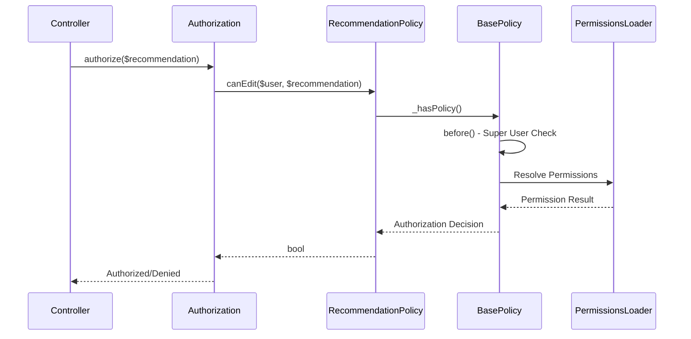
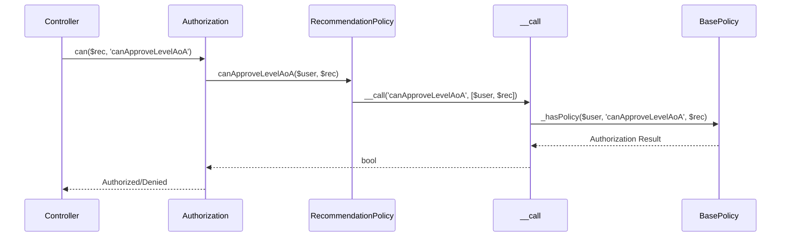

[← Back to Awards Plugin](5.2-awards-plugin.md)

# 5.2.13 Recommendation Policy Reference

**Last Updated:** December 4, 2025  
**Status:** Complete  
**Plugin:** Awards  
**Source:** `plugins/Awards/src/Policy/RecommendationPolicy.php`

## Overview

The `RecommendationPolicy` class provides comprehensive authorization control for Recommendation entities within the Awards plugin. It implements sophisticated state machine management, workflow authorization, and dynamic approval level validation through integration with the KMP RBAC system.

## Class Definition

```php
namespace Awards\Policy;

class RecommendationPolicy extends BasePolicy
```

## State Machine Authorization Architecture

The RecommendationPolicy implements complex workflow authorization:

- **State Transition Control**: Recommendation state changes authorized through workflow permissions
- **Approval Level Authorization**: Dynamic approval authority based on award levels
- **Workflow Management**: Recommendation lifecycle operations controlled through state-aware authorization
- **Administrative Oversight**: Comprehensive administrative operations support

### Dynamic Approval Authority

The policy implements dynamic approval authority through level-specific permissions:

| Feature | Description |
|---------|-------------|
| Dynamic Methods | `canApproveLevel*` methods generated based on award levels |
| Level Discovery | Award levels discovered from LevelsTable |
| Authority Validation | Approval authority validated against specific award levels |
| Magic Method Implementation | `__call()` handles dynamic method resolution |

## Authorization Methods

### Standard Methods (Inherited from BasePolicy)

| Method | Purpose |
|--------|---------|
| `canView()` | Recommendation viewing with organizational access |
| `canEdit()` | Recommendation editing authorization |
| `canDelete()` | Recommendation removal authorization |
| `canIndex()` | Recommendation listing with scoping |

### Custom Authorization Methods

#### canAdd()

Open authorization for recommendation submission.

```php
public function canAdd(KmpIdentityInterface $user, BaseEntity|Table $entity, ...$optionalArgs): bool
```

**Returns:** Always `true` - recommendation submission is open to all authenticated users.

**Purpose:** Enables community participation in the award recommendation process.

---

#### canViewSubmittedByMember()

Authorizes access to recommendations submitted by a specific member.

```php
public function canViewSubmittedByMember(KmpIdentityInterface $user, BaseEntity $entity, ...$args): bool
```

**Authorization Logic:**
1. Direct access if user is the recommendation requester (`requester_id` matches)
2. Fallback to permission-based authorization for administrative access

---

#### canViewSubmittedForMember()

Authorizes access to recommendations where a member is the subject.

```php
public function canViewSubmittedForMember(KmpIdentityInterface $user, BaseEntity $entity, ...$args): bool
```

**Purpose:** Supports administrative oversight and approval workflows for recommendations about specific members.

---

#### canViewEventRecommendations()

Authorizes access to event-specific recommendations.

```php
public function canViewEventRecommendations(KmpIdentityInterface $user, BaseEntity $entity, ...$args): bool
```

**Purpose:** Supports ceremony coordination and event-based recommendation processing.

---

#### canViewGatheringRecommendations()

Authorizes access to gathering-specific recommendations.

```php
public function canViewGatheringRecommendations(KmpIdentityInterface $user, BaseEntity $entity, ...$args): bool
```

**Purpose:** Supports gathering management and event coordination.

---

#### canExport()

Authorizes recommendation data export operations.

```php
public function canExport(KmpIdentityInterface $user, BaseEntity $entity, ...$args): bool
```

**Purpose:** Supports administrative reporting and data analysis.

---

#### canUseBoard()

Authorizes access to the kanban-style recommendation board.

```php
public function canUseBoard(KmpIdentityInterface $user, BaseEntity $entity, ...$args): bool
```

**Purpose:** Enables workflow visualization and state management through the board interface.

---

#### canViewHidden()

Authorizes access to hidden or archived recommendations.

```php
public function canViewHidden(KmpIdentityInterface $user, BaseEntity $entity, ...$optionalArgs): bool
```

**Purpose:** Supports administrative oversight and data management.

---

#### canViewPrivateNotes()

Authorizes access to private administrative notes on recommendations.

```php
public function canViewPrivateNotes(KmpIdentityInterface $user, BaseEntity $entity, ...$optionalArgs): bool
```

**Purpose:** Supports administrative communication and workflow coordination.

---

#### canAddNote()

Authorizes the addition of notes to recommendations.

```php
public function canAddNote(KmpIdentityInterface $user, BaseEntity $entity, ...$optionalArgs): bool
```

**Purpose:** Supports workflow documentation and administrative communication.

---

#### canUpdateStates()

Authorizes bulk state transition operations.

```php
public function canUpdateStates(KmpIdentityInterface $user, BaseEntity $entity, ...$optionalArgs): bool
```

**Purpose:** Supports efficient batch processing and workflow management.

## Dynamic Method System

### __call() Magic Method

Handles dynamic approval authority methods based on award level names.

```php
public function __call($name, $arguments)
```

**Method Pattern:** `canApproveLevel{LevelName}` (e.g., `canApproveLevelAoA`, `canApproveLevelGoA`)

**Example:**
```php
// Dynamic level approval checking
$recommendation = $this->Recommendations->get($id, ['contain' => ['Awards.Levels']]);
$levelName = $recommendation->award->level->name; // e.g., "AoA"

if ($this->Authorization->can($recommendation, 'canApproveLevel' . $levelName)) {
    $this->processApproval($recommendation);
}
```

### getDynamicMethods()

Returns names of dynamically generated methods based on award levels.

```php
public static function getDynamicMethods(): array
```

**Returns:** Array of method names like `['canApproveLevelAoA', 'canApproveLevelGoA', ...]`

**Purpose:**
- Policy introspection for administrative interfaces
- Permission configuration and role assignment
- Automated authorization testing

## Authorization Flow



### Dynamic Approval Flow



## Usage Examples

### Controller Integration

```php
// RecommendationsController with workflow authorization
public function view($id) {
    $recommendation = $this->Recommendations->get($id);
    $this->Authorization->authorize($recommendation);
    $this->set(compact('recommendation'));
}

public function updateStates() {
    $recommendations = $this->request->getData('recommendations');
    foreach ($recommendations as $recData) {
        $recommendation = $this->Recommendations->get($recData['id']);
        $this->Authorization->authorize($recommendation, 'updateStates');
        // State update processing...
    }
}
```

### Member Self-Service Access

```php
// Member accessing their own recommendations
$recommendations = $this->Recommendations->find()
    ->where(['requester_id' => $currentUser->getIdentifier()]);

foreach ($recommendations as $recommendation) {
    if ($this->Authorization->can($recommendation, 'viewSubmittedByMember')) {
        $accessibleRecommendations[] = $recommendation;
    }
}
```

### Dynamic Approval Authorization

```php
// Process approval based on award level
public function processApproval($recommendationId, $newState) {
    $recommendation = $this->Recommendations->get($recommendationId, [
        'contain' => ['Awards.Levels']
    ]);
    
    $levelName = $recommendation->award->level->name;
    $approvalMethod = 'canApproveLevel' . $levelName;
    
    if (!$this->Authorization->can($recommendation, $approvalMethod)) {
        throw new ForbiddenException('Not authorized to approve this level');
    }
    
    // Process approval...
}
```

### Administrative Board Access

```php
// Administrative recommendation board
public function adminBoardAccess() {
    $sampleRecommendation = $this->Recommendations->newEmptyEntity();
    
    if (!$this->Authorization->can($sampleRecommendation, 'useBoard')) {
        throw new ForbiddenException('Board access not authorized');
    }
    
    return $this->render('board');
}
```

### Policy Introspection

```php
// Discover available approval methods
$availableMethods = RecommendationPolicy::getDynamicMethods();
// Returns: ['canApproveLevelAoA', 'canApproveLevelGoA', 'canApproveLevelPeerage', ...]

// Configure permissions for all approval levels
foreach ($availableMethods as $method) {
    $this->createPermissionIfNotExists($method);
}
```

## Integration Points

### Recommendations Controller Integration

- **Workflow Operations**: Comprehensive recommendation lifecycle authorization
- **Board Interface**: Kanban board authorization with workflow visualization
- **Export Operations**: Data export with appropriate access control
- **Administrative Interface**: Administrative management with oversight

### Awards System Integration

- **Level Authorization**: Dynamic approval based on award levels
- **Event Integration**: Event-based recommendation authorization
- **State Machine**: State transition authorization with workflow integrity
- **Audit System**: Authorization integrated with audit trail

### RBAC System Integration

- **Permission Framework**: Integration through BasePolicy inheritance
- **Warrant System**: Warrant-based permission validation
- **Dynamic Authorization**: Level-based approval through dynamic methods
- **Administrative Authority**: Administrative role support

### Member Management Integration

- **Member Context**: Member-specific access control
- **Identity Integration**: Member identity validation
- **Privacy Protection**: Member authorization respecting privacy
- **Administrative Oversight**: Member management integration

## Security Considerations

### Access Control Security

- **Authentication Required**: All operations require authenticated identity
- **Permission Validation**: Comprehensive RBAC permission checking
- **Workflow Security**: State transition authorization
- **Administrative Protection**: Administrative permission requirements

### Data Protection

- **Member Privacy**: Member-specific authorization and privacy protection
- **Organizational Security**: Branch-based data scoping
- **Administrative Control**: Comprehensive oversight and validation
- **Information Protection**: Workflow-aware authorization

### Dynamic Security

- **Level-Based Security**: Dynamic approval validated against award levels
- **Method Security**: Magic method authorization with validation
- **Permission Integrity**: Dynamic authorization maintains integrity
- **Scalability**: Designed to scale with award level growth

## Related Documentation

- [Awards Plugin Overview](5.2-awards-plugin.md)
- [RecommendationsTable API Reference](5.2.4-awards-recommendations-table.md)
- [Award Policy Reference](5.2.5-awards-award-policy.md)
- [RBAC Security Architecture](4.4-rbac-security-architecture.md)
