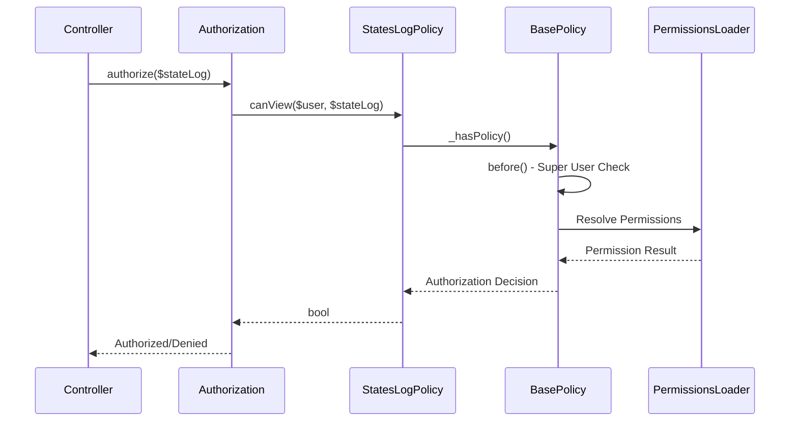

[← Back to Awards Plugin](5.2-awards-plugin.md)

# 5.2.14 RecommendationsStatesLog Policy Reference

**Last Updated:** December 4, 2025  
**Status:** Complete  
**Plugin:** Awards  
**Source:** `plugins/Awards/src/Policy/RecommendationsStatesLogPolicy.php`

## Overview

The `RecommendationsStatesLogPolicy` class provides authorization control for recommendation state log entities within the Awards plugin. It manages audit trail access, transparency control, and administrative oversight through integration with the KMP RBAC system.

## Class Definition

```php
namespace Awards\Policy;

class RecommendationsStatesLogPolicy extends BasePolicy
```

All authorization methods are inherited from `BasePolicy` and delegate to the centralized `_hasPolicy()` method for consistent RBAC integration.

## RBAC Integration Architecture

### Permission-Based Authorization

- **Delegation Pattern**: All authorization decisions delegated to `BasePolicy._hasPolicy()`
- **Audit Trail Support**: Access to state transition history controlled through permissions
- **Administrative Oversight**: Super user privileges for comprehensive audit management
- **Accountability Tracking**: Supports investigation and compliance through controlled access

### BasePolicy Inheritance

The policy inherits standard authorization methods:

| Method | Purpose |
|--------|---------|
| `canView()` | Audit log viewing with permission validation |
| `canIndex()` | Audit log listing with organizational scoping |

## Audit Operations Governance

Authorization is enforced for audit operations:

| Operation | Authorization Requirements |
|-----------|---------------------------|
| Viewing | Permission-based access to individual state transition records |
| Querying | Access control for audit trail data and accountability information |
| Administrative Audit | Elevated access for comprehensive audit oversight |
| Transparency Control | Balanced access respecting accountability and privacy |

## Audit Trail Security

The policy ensures appropriate audit trail access:

- **Read-Only Access**: Audit logs are typically view-only for accountability
- **Administrative Visibility**: Comprehensive access for authorized administrators
- **Accountability Tracking**: Supports investigation and compliance
- **Privacy Protection**: Balances transparency with privacy considerations

## Authorization Flow



## Usage Examples

### Controller Integration

```php
// Audit trail viewing
public function view($id) {
    $stateLog = $this->RecommendationsStatesLogs->get($id);
    $this->Authorization->authorize($stateLog, 'view');
    $this->set(compact('stateLog'));
}
```

### Audit Authorization

```php
// Checking audit access
if ($this->Authorization->can($user, 'view', $auditLog)) {
    // Display state transition history...
}
```

### Administrative Audit Operations

```php
// Comprehensive audit trail access
public function index() {
    $this->Authorization->authorize($this->RecommendationsStatesLogs, 'index');
    $logs = $this->paginate($this->RecommendationsStatesLogs);
    $this->set(compact('logs'));
}
```

## Integration Points

### Recommendations System Integration

- **State Machine Tracking**: Audit logs for recommendation state transitions
- **Accountability**: Records of who made changes and when
- **Workflow History**: Complete state transition history

### RBAC System Integration

- **Permission Framework**: Integration through BasePolicy inheritance
- **Warrant System**: Warrant-based permission validation
- **Administrative Authority**: Administrative role support for audit access

## Security Considerations

### Access Control Security

- **Authentication Required**: All operations require authenticated identity
- **Permission Validation**: RBAC permission checking for audit access
- **Read-Only Nature**: Audit logs cannot be modified through policy

### Data Protection

- **Accountability Balance**: Access supports accountability while protecting privacy
- **Administrative Control**: Elevated access for compliance and investigation
- **Audit Integrity**: Authorization protects audit trail integrity

## Related Documentation

- [Awards Plugin Overview](5.2-awards-plugin.md)
- [RecommendationsStatesLogsTable API Reference](5.2.3-awards-recommendations-states-logs-table.md)
- [Recommendation Policy Reference](5.2.13-awards-recommendation-policy.md)
- [RBAC Security Architecture](4.4-rbac-security-architecture.md)
