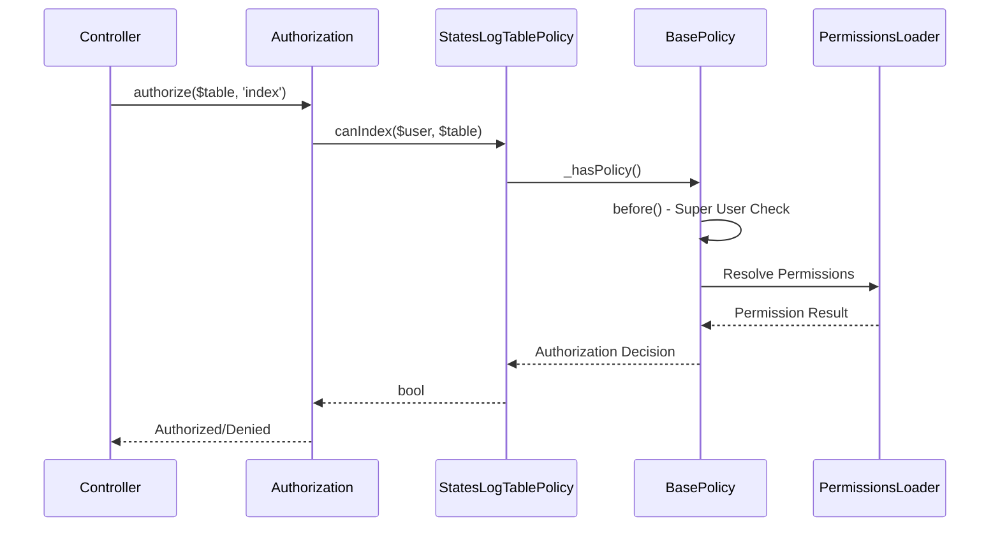

[← Back to Awards Plugin](5.2-awards-plugin.md)

# 5.2.15 RecommendationsStatesLogTable Policy Reference

**Last Updated:** December 4, 2025  
**Status:** Complete  
**Plugin:** Awards  
**Source:** `plugins/Awards/src/Policy/RecommendationsStatesLogTablePolicy.php`

## Overview

The `RecommendationsStatesLogTablePolicy` class provides table-level authorization for recommendation audit trail management within the Awards plugin. It manages audit data access, transparency control, and administrative oversight through integration with the KMP RBAC system.

## Class Definition

```php
namespace Awards\Policy;

class RecommendationsStatesLogTablePolicy extends BasePolicy
```

All authorization methods are inherited from `BasePolicy` and delegate to the centralized `_hasPolicy()` method for consistent RBAC integration.

## RBAC Integration Architecture

### Permission-Based Authorization

- **Delegation Pattern**: All authorization decisions delegated to `BasePolicy._hasPolicy()`
- **Audit Scoping Support**: Access to state transition history controlled through permissions
- **Administrative Oversight**: Super user privileges for comprehensive audit management
- **Query Scoping**: Branch-scoped queries for organizational access control

### BasePolicy Inheritance

The policy inherits standard table authorization methods:

| Method | Purpose |
|--------|---------|
| `canIndex()` | Audit log listing with organizational scoping |
| `scopeIndex()` | Query scoping for branch-based access control |

## Table Operations Governance

Authorization is enforced for table-level operations:

| Operation | Authorization Requirements |
|-----------|---------------------------|
| Query Authorization | Permission validation for audit trail listing |
| Audit Management | Access control for accountability queries and compliance reporting |
| Compliance Filtering | Branch-based access based on organizational requirements |
| Administrative Access | Elevated access for comprehensive audit management |

## Query Scoping

The policy implements query filtering through BasePolicy:

- **Branch-Scoped Queries**: Organizational access control through branch filtering
- **Accountability Filtering**: Audit trail management with accountability support
- **Administrative Scoping**: Comprehensive audit oversight for authorized administrators
- **Compliance Support**: Investigation and compliance through controlled access

## Authorization Flow



## Usage Examples

### Controller Integration

```php
// Audit trail listing
public function index() {
    $this->Authorization->authorize($this->RecommendationsStatesLogs, 'index');
    $auditLogs = $this->paginate($this->RecommendationsStatesLogs);
    $this->set(compact('auditLogs'));
}
```

### Audit Management Services

```php
// Audit query with scoping
$auditQuery = $this->RecommendationsStatesLogs->find()
    ->contain(['Recommendations', 'Users'])
    ->order(['created' => 'DESC']);
$authorizedQuery = $this->Authorization->applyScope($user, 'index', $auditQuery);
```

### Administrative Operations

```php
// Comprehensive audit access
if ($this->Authorization->can($user, 'index', $this->RecommendationsStatesLogs)) {
    // Access comprehensive audit trail with compliance reporting...
}
```

## Integration Points

### Recommendations System Integration

- **State Machine Tracking**: Table-level access to state transition history
- **Accountability Queries**: Audit data for compliance and investigation
- **Workflow History**: Comprehensive state transition records

### RBAC System Integration

- **Permission Framework**: Integration through BasePolicy inheritance
- **Warrant System**: Warrant-based permission validation
- **Administrative Authority**: Administrative role support for audit management

## Security Considerations

### Access Control Security

- **Authentication Required**: All operations require authenticated identity
- **Permission Validation**: RBAC permission checking for audit access
- **Query Filtering**: Automatic branch-based query scoping

### Data Protection

- **Organizational Scoping**: Audit data access limited to authorized contexts
- **Compliance Support**: Access supports regulatory compliance and investigation
- **Audit Integrity**: Table-level authorization protects audit trail integrity

## Related Documentation

- [Awards Plugin Overview](5.2-awards-plugin.md)
- [RecommendationsStatesLogsTable API Reference](5.2.3-awards-recommendations-states-logs-table.md)
- [RecommendationsStatesLog Policy Reference](5.2.14-awards-recommendations-states-log-policy.md)
- [RBAC Security Architecture](4.4-rbac-security-architecture.md)
