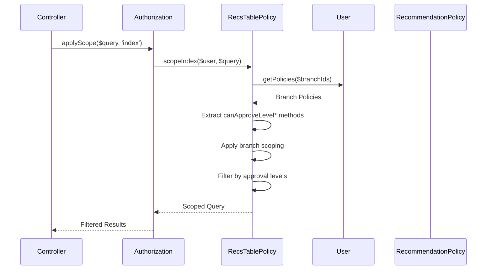

[← Back to Awards Plugin](5.2-awards-plugin.md)

# 5.2.16 RecommendationsTable Policy Reference

**Last Updated:** December 4, 2025  
**Status:** Complete  
**Plugin:** Awards  
**Source:** `plugins/Awards/src/Policy/RecommendationsTablePolicy.php`

## Overview

The `RecommendationsTablePolicy` class provides table-level authorization for recommendation workflow management within the Awards plugin. It implements sophisticated query scoping based on user approval authority and organizational scope.

## Class Definition

```php
namespace Awards\Policy;

class RecommendationsTablePolicy extends BasePolicy
```

## RBAC Integration Architecture

### Permission-Based Authorization

- **Delegation Pattern**: Authorization decisions delegated to `BasePolicy._hasPolicy()`
- **Approval Level Discovery**: Analyzes user permissions to identify approval authority
- **Dynamic Filtering**: Restricts recommendations to user's approval levels
- **Open Submission**: Public recommendation creation support

### BasePolicy Inheritance

The policy inherits standard table authorization methods and adds custom logic:

| Method | Purpose |
|--------|---------|
| `canIndex()` | Recommendation listing (inherited) |
| `scopeIndex()` | Custom query scoping with approval level filtering |
| `canAdd()` | Open recommendation submission |
| `canExport()` | CSV export authorization |

## Custom Authorization Methods

### scopeIndex()

Implements sophisticated recommendation filtering based on user approval authority.

```php
public function scopeIndex(KmpIdentityInterface $user, $query)
```

**Parameters:**
- `$user` - The user requesting data access
- `$query` - The base query to scope

**Returns:** Scoped query with authorization filtering

**Scoping Process:**
1. Discovers branch access through `_getBranchIdsForPolicy()`
2. Analyzes user policies to identify approval authority levels
3. Extracts approval levels from `canApproveLevel*` permission methods
4. Checks for global access sentinel (`branchIds[0] == -10000000` bypasses branch scoping)
5. Applies branch scoping through `addBranchScopeQuery()` for non-global users
6. Filters recommendations by award levels user can approve using `matching()`

**Example Query Transformation:**
```php
// Before scoping: All recommendations
$query = $this->Recommendations->find();

// After scoping: Branch-scoped + approval level filtered
$query = $table->addBranchScopeQuery($query, $branchIds);
$query = $query->matching('Awards.Levels', function ($q) use ($approvalLevels) {
    return $q->where(['Levels.name IN' => $approvalLevels]);
});
```

**Global Access Sentinel:**

When `_getBranchIdsForPolicy()` returns a branch ID of `-10000000` as the first element, it indicates the user has global access (e.g., super-user or kingdom-level permission). In this case, branch scoping is skipped entirely, and the user sees recommendations across all branches.

---

### canAdd()

Provides open access for recommendation submission.

```php
public function canAdd(KmpIdentityInterface $user, BaseEntity|Table $entity, ...$optionalArgs): bool
```

**Returns:** Always `true` - recommendation submission is open to all authenticated users.

**Purpose:** Enables public recommendation submission workflows while maintaining security through entity-level policies.

---

### canExport()

Authorizes recommendation export to CSV.

```php
public function canExport(KmpIdentityInterface $user, BaseEntity|Table $entity, ...$optionalArgs): bool
```

**Returns:** `true` if user has index permission

**Purpose:** Users who can list recommendations can also export them.

## Authorization Flow

### Query Scoping Flow



### Approval Level Discovery

The policy discovers approval levels by analyzing user policies:

```php
// User policies structure
$branchPolicies = [
    "Awards\Policy\RecommendationPolicy" => [
        "canApproveLevelAoA" => true,
        "canApproveLevelGoA" => true,
        // ... other methods
    ]
];

// Extracted approval levels
$approvalLevels = ['AoA', 'GoA'];
```

## Usage Examples

### Controller Integration

```php
// Recommendation listing with automatic scoping
public function index() {
    $this->Authorization->authorize($this->Recommendations, 'index');
    
    // Query is automatically scoped by scopeIndex()
    $query = $this->Recommendations->find()
        ->contain(['Awards', 'Members', 'Events']);
    $scopedQuery = $this->Authorization->applyScope($query, 'index');
    
    $recommendations = $this->paginate($scopedQuery);
    $this->set(compact('recommendations'));
}
```

### Workflow Management

```php
// Service-level query scoping
$query = $this->Recommendations->find()
    ->contain(['Awards.Levels', 'Events', 'Members'])
    ->where(['state' => 'submitted']);
    
$authorizedQuery = $this->Authorization->applyScope($user, 'index', $query);
// Only returns recommendations at levels user can approve
```

### Export Authorization

```php
// CSV export
public function exportCsv() {
    if ($this->Authorization->can($this->Recommendations, 'export')) {
        $query = $this->Authorization->applyScope(
            $this->Recommendations->find(),
            'index'
        );
        // Export scoped data...
    }
}
```

### Open Submission

```php
// Any authenticated user can submit
public function add() {
    $this->Authorization->authorize($this->Recommendations, 'add');
    // Always authorized - validation happens at entity level
    
    $recommendation = $this->Recommendations->newEntity($this->request->getData());
    $this->Recommendations->save($recommendation);
}
```

## Integration Points

### Recommendations Controller Integration

- **Index Action**: Automatic query scoping with approval level filtering
- **Add Action**: Open submission for community participation
- **Export Action**: CSV export with same scoping as index
- **Workflow Operations**: Scoped queries support workflow management

### RBAC System Integration

- **Permission Framework**: Integration through BasePolicy inheritance
- **Dynamic Permissions**: Approval level discovery from policy methods
- **Branch Scoping**: Organizational access through branch filtering

### Awards Plugin Integration

- **Level Integration**: Filters by award levels user can approve
- **State Machine**: Supports recommendation workflow management
- **Entity Policy**: Coordinates with RecommendationPolicy for entity-level authorization

## Security Considerations

### Access Control Security

- **Authentication Required**: All operations require authenticated identity
- **Approval Authority**: Users see only recommendations they can approve
- **Branch Scoping**: Organizational access through branch filtering
- **Open Submission**: Entity-level policies provide detailed authorization

### Data Protection

- **Query Filtering**: Automatic filtering to authorized recommendations
- **Level-Based Access**: Recommendations filtered by approval authority
- **Export Security**: Export follows same authorization as viewing

## Related Documentation

- [Awards Plugin Overview](5.2-awards-plugin.md)
- [RecommendationsTable API Reference](5.2.4-awards-recommendations-table.md)
- [Recommendation Policy Reference](5.2.13-awards-recommendation-policy.md)
- [RBAC Security Architecture](4.4-rbac-security-architecture.md)
