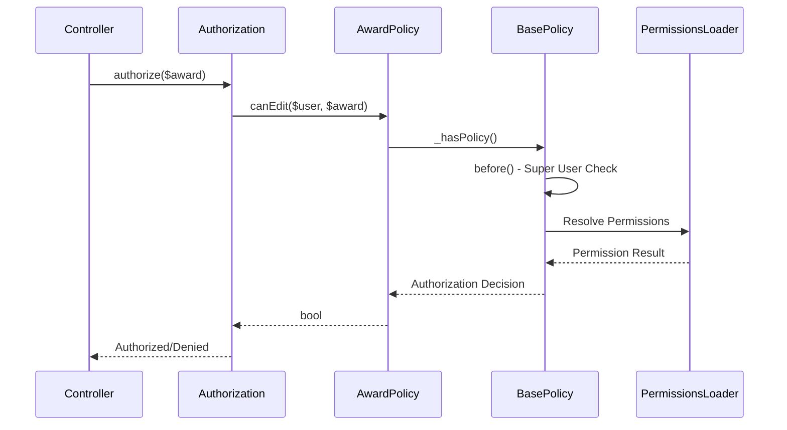

[← Back to Awards Plugin](5.2-awards-plugin.md)

# 5.2.5 Award Policy Reference

**Last Updated:** December 4, 2025  
**Status:** Complete  
**Plugin:** Awards  
**Source:** `plugins/Awards/src/Policy/AwardPolicy.php`

## Overview

The `AwardPolicy` class provides authorization control for Award entities within the Awards plugin. It implements RBAC integration, award-specific permission validation, and organizational access control through delegation to the base policy framework.

## Class Definition

```php
namespace Awards\Policy;

class AwardPolicy extends BasePolicy
```

All authorization methods are inherited from `BasePolicy` and delegate to the centralized `_hasPolicy()` method for consistent RBAC integration.

## RBAC Integration Architecture

### Permission-Based Authorization

- **Delegation Pattern**: All authorization decisions delegated to `BasePolicy._hasPolicy()`
- **Branch Scoping**: Award access controlled through branch-based data scoping
- **Administrative Oversight**: Super user privileges for administrative management
- **Warrant Integration**: Permission validation through warrant-based authority checking

### BasePolicy Inheritance

The policy inherits standard CRUD authorization methods:

| Method | Purpose |
|--------|---------|
| `canView()` | Award viewing with branch-scoped access validation |
| `canAdd()` | Award creation with administrative permission requirements |
| `canEdit()` | Award editing with entity-level authorization |
| `canDelete()` | Award removal with referential integrity validation |
| `canIndex()` | Award listing with organizational scoping |

## Authorization Flow



### Authorization Steps

1. **Super User Check**: Administrative override through `BasePolicy.before()`
2. **Permission Discovery**: Award operation permissions resolved through PermissionsLoader
3. **Branch Validation**: Organizational access validation through branch scoping
4. **Entity Authorization**: Award-specific authorization through entity-level access control

## Organizational Access Control

### Branch-Based Scoping

- **Branch Scoping**: Award entity access limited to authorized branch contexts via `getBranchId()`
- **Hierarchical Access**: Parent-child branch relationships supported
- **Administrative Override**: Global permissions support cross-branch management
- **Data Isolation**: Branch-based data isolation for organizational security

### Multi-Branch Support

- **Cross-Branch Awards**: Global awards accessible across organizational boundaries
- **Local Awards**: Branch-specific awards with restricted access
- **Administrative Management**: Cross-organizational award management
- **Reporting Integration**: Branch-scoped reporting with administrative visibility

## Usage Examples

### Controller Integration

```php
// Standard CRUD authorization in AwardsController
public function view($id) {
    $award = $this->Awards->get($id);
    $this->Authorization->authorize($award); // Uses canView()
    $this->set(compact('award'));
}

public function edit($id) {
    $award = $this->Awards->get($id);
    $this->Authorization->authorize($award); // Uses canEdit()
    // Edit processing...
}
```

### Service Layer Authorization

```php
// Award management service with policy validation
public function updateAward($awardId, $data) {
    $award = $this->Awards->get($awardId);
    if (!$this->Authorization->can($award, 'edit')) {
        throw new ForbiddenException('Not authorized to edit award');
    }
    return $this->Awards->patchEntity($award, $data);
}
```

### Administrative Operations

```php
// Administrative award management with policy checking
public function bulkUpdateAwards($awardIds, $updateData) {
    foreach ($awardIds as $awardId) {
        $award = $this->Awards->get($awardId);
        if ($this->Authorization->can($award, 'edit')) {
            $this->Awards->patchEntity($award, $updateData);
            $this->Awards->save($award);
        }
    }
}
```

### Branch-Scoped Operations

```php
// Branch-specific award discovery with policy integration
public function getBranchAwards($branchId) {
    $query = $this->Awards->find()
        ->where(['branch_id' => $branchId]);
    
    // Policy automatically validates branch access
    return $this->Authorization->applyScope($query);
}
```

## Integration Points

### Awards Controller Integration

- **CRUD Operations**: Standard create, read, update, delete authorization
- **Administrative Interface**: Permission-based feature visibility
- **Hierarchical Management**: Domain/level integration with authorization
- **Configuration Management**: Award configuration with administrative oversight

### RBAC System Integration

- **Permission Framework**: Integration with KMP RBAC through BasePolicy
- **Warrant System**: Warrant-based permission validation
- **Role Integration**: Role-based permissions and organizational hierarchy
- **Administrative Authority**: Super user and administrative role support

### Awards Plugin Integration

- **Domain Management**: Award domain authorization
- **Level Management**: Award level authorization with hierarchical access
- **Recommendation System**: Award-recommendation authorization
- **Event Integration**: Award event authorization with ceremony coordination

## Security Considerations

### Access Control Security

- **Authentication Required**: All operations require authenticated user identity
- **Permission Validation**: Comprehensive RBAC permission checking
- **Entity-Level Security**: Entity ownership validation and branch scoping
- **Administrative Protection**: Administrative permission requirements

### Data Protection

- **Branch Scoping**: Data access limited to authorized organizational contexts
- **Hierarchical Security**: Organizational hierarchy respected in access control
- **Audit Trail**: Authorization decisions logged for compliance monitoring
- **Data Integrity**: Authorization respects referential integrity constraints

## Related Documentation

- [Awards Plugin Overview](5.2-awards-plugin.md)
- [Authorization and Security Architecture](5.2-awards-plugin.md#authorization-and-security-architecture)
- [RBAC Security Architecture](4.4-rbac-security-architecture.md)
- [BasePolicy Reference](4.4-rbac-security-architecture.md)
