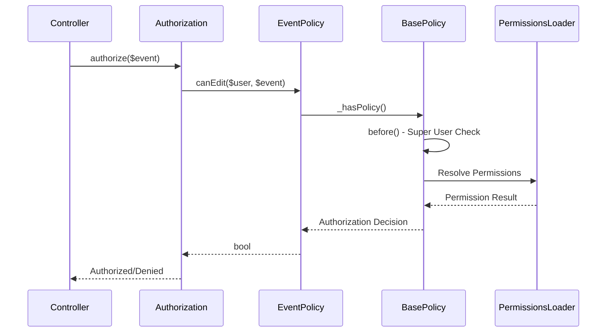

[← Back to Awards Plugin](5.2-awards-plugin.md)

# 5.2.9 Event Policy Reference

**Last Updated:** December 4, 2025  
**Status:** Complete  
**Plugin:** Awards  
**Source:** `plugins/Awards/src/Policy/EventPolicy.php`

## Overview

The `EventPolicy` class provides authorization control for Event entities within the Awards plugin. It manages access to award events including ceremony coordination, temporal event management, and administrative oversight through integration with the KMP RBAC system.

## Class Definition

```php
namespace Awards\Policy;

class EventPolicy extends BasePolicy
```

## RBAC Integration Architecture

### Permission-Based Authorization

- **Delegation Pattern**: All authorization decisions delegated to `BasePolicy._hasPolicy()`
- **Temporal Validation**: Event access controlled through temporal boundaries
- **Administrative Oversight**: Super user privileges for administrative event management
- **Ceremony Coordination**: Permission validation for event status transitions

### BasePolicy Inheritance

The policy inherits standard CRUD authorization methods:

| Method | Purpose |
|--------|---------|
| `canView()` | Event viewing with temporal and organizational access validation |
| `canAdd()` | Event creation with administrative permission requirements |
| `canEdit()` | Event editing with temporal adjustment authorization |
| `canDelete()` | Event removal with recommendation state cleanup validation |
| `canIndex()` | Event listing with organizational scoping |

## Custom Authorization Methods

### canAllEvents()

Authorizes access to comprehensive event listing across temporal boundaries and organizational scopes.

```php
public function canAllEvents(KmpIdentityInterface $user, $entity, ...$args): bool
```

**Parameters:**
- `$user` - The user requesting access (implements `KmpIdentityInterface`)
- `$entity` - The Events table or related entity being accessed
- `$args` - Additional arguments for authorization context

**Returns:** `true` if the user can access comprehensive event listing

**Purpose:**
- Provides administrative event oversight across temporal boundaries
- Supports ceremony coordination by enabling access to past, current, and future events
- Validates user authority for cross-organizational event visibility

## Authorization Flow



### Authorization Steps

1. **Super User Check**: Administrative override through `BasePolicy.before()`
2. **Permission Discovery**: Event operation permissions resolved through PermissionsLoader
3. **Temporal Validation**: Event operations respect temporal boundaries and deadlines
4. **Entity Authorization**: Event-specific authorization through entity-level access control

## Event Operations Governance

Authorization is enforced for all event operations:

| Operation | Authorization Requirements |
|-----------|---------------------------|
| Creation | Administrative permissions for creating events and setting temporal boundaries |
| Modification | Edit permissions with temporal adjustment authorization |
| Deletion | Delete permissions with recommendation state cleanup validation |
| Ceremony Management | Specialized permissions for event status transitions |

## Usage Examples

### Controller Integration

```php
// Standard CRUD authorization in EventsController
public function view($id) {
    $event = $this->Events->get($id);
    $this->Authorization->authorize($event); // Uses canView()
    $this->set(compact('event'));
}

public function edit($id) {
    $event = $this->Events->get($id);
    $this->Authorization->authorize($event); // Uses canEdit()
    // Event editing with temporal validation...
}
```

### Comprehensive Event Listing

```php
// Authorization for viewing all events
public function allEvents() {
    $this->Authorization->authorize($this->Events, 'allEvents');
    // Comprehensive event listing logic with temporal filtering...
}
```

### Administrative Operations

```php
// Administrative event management
public function delete($id) {
    $event = $this->Events->get($id);
    $this->Authorization->authorize($event, 'delete');
    // Event deletion with recommendation cleanup...
}
```

### Service Layer Authorization

```php
// Event management service with policy validation
public function updateEvent($eventId, $data) {
    $event = $this->Events->get($eventId);
    if (!$this->Authorization->can($event, 'edit')) {
        throw new ForbiddenException('Not authorized to edit event');
    }
    return $this->Events->patchEntity($event, $data);
}
```

## Integration Points

### Events Controller Integration

- **CRUD Operations**: Standard create, read, update, delete authorization
- **Temporal Management**: Event scheduling and deadline management
- **Ceremony Coordination**: Event status transitions and ceremony workflows
- **Administrative Interface**: Permission-based feature visibility

### RBAC System Integration

- **Permission Framework**: Integration with KMP RBAC through BasePolicy
- **Warrant System**: Warrant-based permission validation
- **Role Integration**: Role-based permissions and organizational hierarchy
- **Administrative Authority**: Super user and administrative role support

### Awards Plugin Integration

- **Recommendation System**: Event-recommendation authorization for ceremony processing
- **Temporal Windows**: Authorization respects event temporal boundaries
- **Branch Scoping**: Organizational access control through branch associations

## Security Considerations

### Access Control Security

- **Authentication Required**: All operations require authenticated user identity
- **Permission Validation**: Comprehensive RBAC permission checking
- **Temporal Constraints**: Event operations respect temporal boundaries
- **Administrative Protection**: Administrative permission requirements

### Data Protection

- **Organizational Scoping**: Event access limited to authorized organizational contexts
- **Temporal Security**: Time-based access constraints for event lifecycle
- **Audit Trail**: Authorization decisions logged for compliance monitoring
- **Data Integrity**: Authorization respects referential integrity with recommendations

## Related Documentation

- [Awards Plugin Overview](5.2-awards-plugin.md)
- [EventsTable API Reference](5.2.1-awards-events-table.md)
- [Award Policy Reference](5.2.5-awards-award-policy.md)
- [RBAC Security Architecture](4.4-rbac-security-architecture.md)
