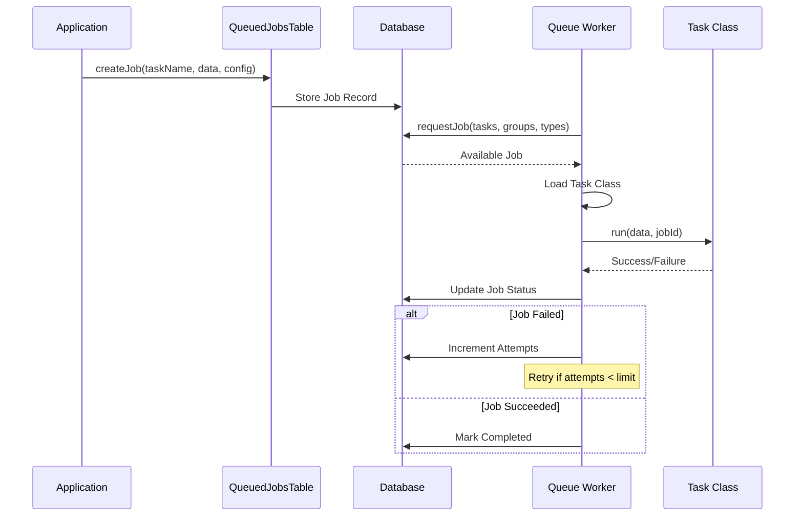

[← Back to Plugin Architecture](5-plugins.md)

# 5.3 Queue Plugin

**Last Updated:** July 18, 2025  
**Status:** Complete  
**Plugin:** Queue (External - dereuromark/cakephp-queue)  

The Queue plugin provides background job processing capabilities for the KMP system, enabling asynchronous task execution to improve user experience and system performance.

## Overview

The Queue plugin is based on the [dereuromark/cakephp-queue](https://github.com/dereuromark/cakephp-queue) plugin and provides a robust, database-backed job queue system for handling background tasks in KMP. It allows the application to defer time-consuming operations like email sending, report generation, and data processing to background workers.

### Key Features

- **Database-Backed Queue**: Persistent job storage with transaction support
- **Worker Process Management**: Multiple workers with process monitoring
- **Job Prioritization**: Priority-based job scheduling and execution
- **Retry Logic**: Automatic retry of failed jobs with configurable limits
- **Progress Tracking**: Real-time job progress monitoring
- **Administrative Interface**: Web-based queue management and monitoring
- **Rate Limiting**: Throttling and unique job constraints
- **Scheduled Jobs**: Delayed execution with `notbefore` timestamps

## Architecture

### Data Model

```mermaid
classDiagram
    class QueuedJob {
        +id: int
        +job_task: string
        +data: json
        +job_group: string
        +reference: string
        +created: datetime
        +notbefore: datetime
        +fetched: datetime
        +completed: datetime
        +status: string
        +progress: float
        +failure_message: text
        +workerkey: string
        +attempts: int
        +priority: int
    }
    
    class QueueProcess {
        +id: int
        +pid: string
        +workerkey: string
        +server: string
        +created: datetime
        +modified: datetime
        +terminate: bool
        +active_job: QueuedJob
    }
    
    QueuedJob ||--o{ QueueProcess : "workerkey"
```

### Job Lifecycle



## Configuration

### Queue Configuration (`config/app_queue.php`)

```php
return [
    'Queue' => [
        'sleeptime' => 10,              // Sleep time when no jobs (seconds)
        'gcprob' => 10,                 // Garbage collection probability
        'defaultworkertimeout' => 1800, // Worker timeout (seconds)
        'workermaxruntime' => 110,      // Max worker runtime (minutes)
        'workertimeout' => 12000,       // Worker process timeout (120 * 100)
        'exitwhennothingtodo' => false, // Exit worker when no jobs
        'cleanuptimeout' => 604800,     // Cleanup old jobs (seconds)
        'maxworkers' => 1,              // Maximum concurrent workers
        'ignoredTasks' => [             // Tasks to skip
            'Queue\Queue\Task\CostsExampleTask',
            'Queue\Queue\Task\EmailTask',
            'Queue\Queue\Task\ExceptionExampleTask',
            'Queue\Queue\Task\ExecuteTask',
            'Queue\Queue\Task\MonitorExampleTask',
            'Queue\Queue\Task\ProgressExampleTask',
            'Queue\Queue\Task\RetryExampleTask',
            'Queue\Queue\Task\SuperExampleTask',
            'Queue\Queue\Task\UniqueExampleTask',
        ],
    ],
];
```

### Plugin Integration

The Queue plugin integrates with KMP through several mechanisms:

```php
// QueuePlugin.php - KMP Integration
class QueuePlugin extends BasePlugin implements KMPPluginInterface
{
    public function bootstrap(PluginApplicationInterface $app): void
    {
        // Register navigation items
        NavigationRegistry::register(
            'Queue',
            [],
            function ($user, $params) {
                return QueueNavigationProvider::getNavigationItems($user, $params);
            }
        );

        // Configuration version management
        $currentConfigVersion = "25.01.29.a";
        $configVersion = StaticHelpers::getAppSetting("Queue.configVersion", "0.0.0", null, true);
        if ($configVersion != $currentConfigVersion) {
            StaticHelpers::getAppSetting("Plugin.Queue.Active", "yes", null, true);
        }
    }
}
```

## Job Creation and Management

### Creating Jobs

#### Basic Job Creation

```php
// Get the QueuedJobs table
$queuedJobsTable = $this->fetchTable('Queue.QueuedJobs');

// Create a simple job
$queuedJobsTable->createJob('Queue.Email', [
    'to' => 'user@example.org',
    'subject' => 'Welcome to KMP',
    'template' => 'welcome'
]);
```

#### Advanced Job Configuration

```php
use Queue\Config\JobConfig;

// Create job with configuration options
$config = new JobConfig();
$config->setPriority(5)           // Higher priority (1 = highest)
       ->setNotBefore('+1 hour')  // Delay execution
       ->setGroup('notifications') // Group related jobs
       ->setReference('user-123'); // Unique reference

$queuedJobsTable->createJob('Queue.Email', $emailData, $config);
```

#### Using Class Syntax

```php
use Queue\Queue\Task\EmailTask;

// Using class syntax for better IDE support
$queuedJobsTable->createJob(EmailTask::class, $emailData);

// Or get task name programmatically
$taskName = EmailTask::taskName();
$queuedJobsTable->createJob($taskName, $emailData);
```

### Job Configuration Options

| Option | Type | Description |
|--------|------|-------------|
| `priority` | int | Job priority (1 = highest, higher numbers = lower priority) |
| `notBefore` | DateTime/string | Delay execution until specified time |
| `group` | string | Group identifier for filtering |
| `reference` | string | Unique reference for duplicate prevention |
| `status` | string | Initial job status |

## Built-in Task Types

### Email Task

The Email task handles asynchronous email sending:

```php
// Basic email job
$emailData = [
    'settings' => [
        'to' => 'recipient@example.com',
        'from' => 'system@example.com',
        'subject' => 'Your Report is Ready',
        'template' => 'report_notification'
    ],
    'vars' => [
        'reportUrl' => $reportUrl,
        'memberName' => $member->sca_name
    ]
];

$queuedJobsTable->createJob('Queue.Email', $emailData);
```

### Mailer Task

For more complex email workflows using CakePHP Mailers:

```php
// Using KMPMailer through Mailer task
$mailerData = [
    'class' => 'KMP',  // KMPMailer class
    'action' => 'resetPassword',
    'vars' => [
        $member->email_address,
        $resetUrl
    ],
    'transport' => 'default'
];

$queuedJobsTable->createJob('Queue.Mailer', $mailerData);
```

### Execute Task

For running shell commands asynchronously:

```php
// Execute shell command
$executeData = [
    'command' => 'bin/cake reports generate',
    'params' => ['--member-id', $memberId],
    'escape' => true,    // Escape shell command
    'log' => true        // Log output
];

$queuedJobsTable->createJob('Queue.Execute', $executeData);
```

## Custom Task Development

### Creating Custom Tasks

Create custom tasks in `src/Queue/Task/`:

```php
namespace App\Queue\Task;

use Queue\Queue\Task;

class ReportGenerationTask extends Task 
{
    /**
     * @var int Timeout in seconds
     */
    public ?int $timeout = 300;
    
    /**
     * @var int Number of retries on failure
     */
    public int $retries = 2;
    
    /**
     * @var bool Prevent parallel execution
     */
    public bool $unique = true;

    /**
     * Execute the task
     *
     * @param array $data Job data from createJob()
     * @param int $jobId Queue job ID
     * @return void
     * @throws \Exception On task failure
     */
    public function run(array $data, int $jobId): void 
    {
        $memberId = $data['member_id'];
        $reportType = $data['report_type'];
        
        // Update progress
        $this->QueuedJobs->updateProgress($jobId, 0.1);
        
        // Load member data
        $membersTable = $this->fetchTable('Members');
        $member = $membersTable->get($memberId);
        
        $this->QueuedJobs->updateProgress($jobId, 0.3);
        
        // Generate report
        $reportService = new ReportService();
        $report = $reportService->generateMemberReport($member, $reportType);
        
        $this->QueuedJobs->updateProgress($jobId, 0.8);
        
        // Save report
        $report->save();
        
        $this->QueuedJobs->updateProgress($jobId, 1.0);
        
        $this->io->success("Report generated for member {$member->sca_name}");
    }
}
```

### Task Configuration Properties

```php
class CustomTask extends Task 
{
    // Execution timeout (seconds)
    public ?int $timeout = 120;
    
    // Number of retry attempts
    public int $retries = 1;
    
    // Rate limiting (minimum seconds between executions)
    public int $rate = 60;
    
    // Prevent parallel execution of this task type
    public bool $unique = false;
    
    // Resource cost (for limiting parallel execution)
    public int $costs = 50;
}
```

### Using Dependency Injection

```php
use Queue\Queue\ServicesTrait;

class ServiceAwareTask extends Task 
{
    use ServicesTrait;

    public function run(array $data, int $jobId): void 
    {
        $myService = $this->getService(MyService::class);
        $result = $myService->processData($data);
        
        // Use the service...
    }
}
```

## Worker Management

### Running Workers

```bash
# Start a worker process
bin/cake queue run

# Run worker with specific groups
bin/cake queue run -g notifications,reports

# Run worker with specific task types
bin/cake queue run -t Email,Mailer

# Exclude specific task types
bin/cake queue run -t "-ExampleTask"

# Verbose output
bin/cake queue run -v
```

### Worker Configuration

```php
// Worker-specific settings in app_queue.php
'Queue' => [
    'workermaxruntime' => 110,      // Max runtime before restart (minutes)
    'workertimeout' => 12000,       // Worker process timeout
    'maxworkers' => 3,              // Maximum concurrent workers
    'sleeptime' => 10,              // Sleep when no jobs (seconds)
    'exitwhennothingtodo' => false, // Exit when queue empty
]
```

## KMP Integration Patterns

### Email Notifications

KMP uses the Queue plugin extensively for email notifications:

```php
// In KMPMailer or controller actions
class MembersController extends AppController 
{
    public function register() 
    {
        if ($this->request->is('post')) {
            $member = $this->Members->newEntity($this->request->getData());
            
            if ($this->Members->save($member)) {
                // Queue welcome email instead of sending immediately
                $this->queueWelcomeEmail($member);
                
                $this->Flash->success('Registration complete!');
            }
        }
    }
    
    private function queueWelcomeEmail($member) 
    {
        $queuedJobsTable = $this->fetchTable('Queue.QueuedJobs');
        
        $emailData = [
            'class' => 'KMP',
            'action' => 'newRegistration',
            'vars' => [
                $member->email_address,
                $this->generatePasswordResetUrl($member),
                $member->sca_name
            ]
        ];
        
        $queuedJobsTable->createJob('Queue.Mailer', $emailData, [
            'priority' => 5,
            'reference' => 'welcome-' . $member->id,
            'group' => 'registration'
        ]);
    }
}
```

### Background Report Generation

```php
// In ReportsController
public function generateMemberReport($memberId) 
{
    $queuedJobsTable = $this->fetchTable('Queue.QueuedJobs');
    
    // Check if report generation is already queued
    if ($queuedJobsTable->isQueued('member-report-' . $memberId, 'ReportGeneration')) {
        $this->Flash->error('Report generation already in progress');
        return $this->redirect($this->referer());
    }
    
    $queuedJobsTable->createJob('ReportGeneration', [
        'member_id' => $memberId,
        'report_type' => 'complete'
    ], [
        'reference' => 'member-report-' . $memberId,
        'priority' => 3
    ]);
    
    $this->Flash->success('Report generation started');
}
```

### Warrant Processing

```php
// Background warrant validation
$queuedJobsTable->createJob('WarrantValidation', [
    'warrant_period_id' => $warrantPeriod->id,
    'batch_size' => 100
], [
    'priority' => 2,
    'group' => 'warrant-processing'
]);
```

## Administrative Interface

### Queue Dashboard

The Queue plugin provides a web interface accessible at `/queue`:

- **Dashboard**: Overview of pending, running, and completed jobs
- **Job Management**: View, edit, retry, and delete jobs
- **Worker Monitoring**: Active worker processes and status
- **Statistics**: Job completion rates and performance metrics

### Navigation Integration

The plugin integrates with KMP's navigation system:

```php
// QueueNavigationProvider
public static function getNavigationItems(Member $user, array $params = []): array
{
    if (StaticHelpers::pluginEnabled('Queue') == false) {
        return [];
    }

    return [
        [
            "type" => "link",
            "mergePath" => ["Config"],
            "label" => "Queue Engine",
            "order" => 40,
            "url" => [
                "plugin" => "Queue",
                "controller" => "Queue",
                "action" => "index",
            ],
            "icon" => "bi-stack",
            "activePaths" => ["queue/*"],
        ],
    ];
}
```

## Monitoring and Troubleshooting

### Job Status Tracking

```php
// Check job status
$job = $queuedJobsTable->get($jobId);

if ($job->completed) {
    // Job completed successfully
} elseif ($job->failure_message) {
    // Job failed
    $error = $job->failure_message;
} elseif ($job->fetched) {
    // Job is currently running
    $progress = $job->progress; // 0.0 to 1.0
}
```

### CLI Management Commands

```bash
# View job information
bin/cake queue job view 123

# Retry failed job
bin/cake queue job rerun 123

# Remove job
bin/cake queue job remove 123

# Clean up old completed jobs
bin/cake queue job clean

# Flush all jobs
bin/cake queue job flush
```

### Performance Optimization

1. **Worker Scaling**: Run multiple workers for high-volume processing
2. **Job Prioritization**: Use priority levels to handle critical jobs first
3. **Batch Processing**: Group related operations into single jobs
4. **Rate Limiting**: Prevent overwhelming external services
5. **Unique Jobs**: Avoid duplicate processing with unique constraints

### Common Issues

#### Memory Leaks
```php
// Clear entity manager periodically in long-running tasks
public function run(array $data, int $jobId): void 
{
    foreach ($data['items'] as $index => $item) {
        $this->processItem($item);
        
        // Clear memory every 100 items
        if ($index % 100 === 0) {
            $this->getTableLocator()->clear();
        }
    }
}
```

#### Failed Job Recovery
```php
// Implement idempotent operations
public function run(array $data, int $jobId): void 
{
    $processedItems = $data['processed_items'] ?? [];
    
    foreach ($data['items'] as $itemId => $item) {
        if (in_array($itemId, $processedItems)) {
            continue; // Skip already processed items
        }
        
        $this->processItem($item);
        $processedItems[] = $itemId;
        
        // Update job data with progress
        $this->QueuedJobs->patchEntity($job, [
            'data' => array_merge($data, ['processed_items' => $processedItems])
        ]);
        $this->QueuedJobs->save($job);
    }
}
```

## Production Deployment

### Process Management

Use process managers like Supervisor to ensure workers stay running:

```ini
[program:kmp-queue-worker]
command=/path/to/kmp/bin/cake queue run
directory=/path/to/kmp
autostart=true
autorestart=true
stderr_logfile=/var/log/kmp-queue.err.log
stdout_logfile=/var/log/kmp-queue.out.log
user=www-data
```

### Monitoring

Monitor queue health through:
- Job completion rates
- Worker process status
- Failed job counts
- Queue length and processing time

### Scaling Considerations

- **Horizontal Scaling**: Multiple workers across servers
- **Database Optimization**: Proper indexing on queue tables
- **Resource Management**: CPU and memory limits for workers
- **Error Handling**: Alerting for failed jobs and worker issues

## References

- [dereuromark/cakephp-queue Documentation](https://github.com/dereuromark/cakephp-queue/tree/master/docs)
- [Queue Plugin Tasks](https://github.com/dereuromark/cakephp-queue/tree/master/docs/sections/tasks)
- [CakePHP Queuing Best Practices](https://www.dereuromark.de/2021/07/15/cakephp-queuing-real-life-examples/)
- [Back to Plugin Architecture](5-plugins.md)
