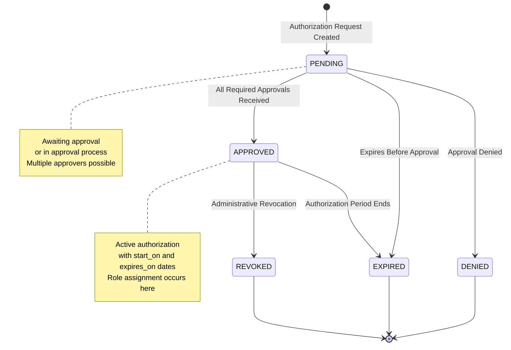
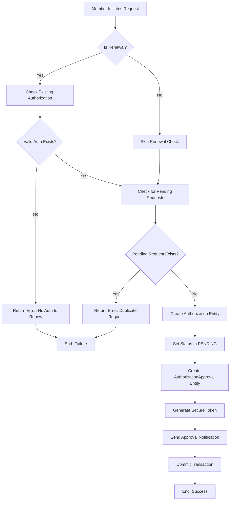
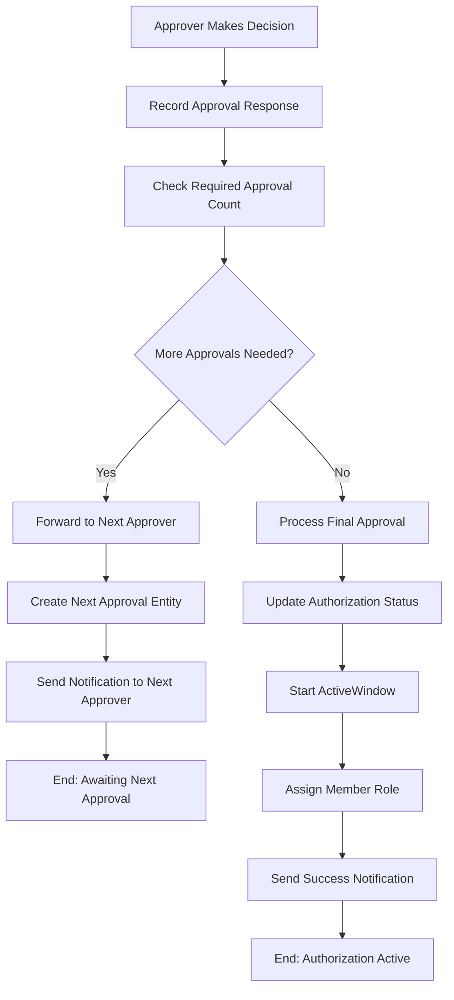

[← Back to Plugin Architecture](5-plugins.md)

# 5.6 Activities Plugin Workflows

**Last Updated:** July 17, 2025  
**Status:** Complete  
**Plugin:** Activities  

The Activities plugin implements a comprehensive authorization management system that enables members to request, maintain, and renew activity-based authorizations. This documentation provides factual workflow information based on the actual source code implementation.

## Table of Contents

- [Authorization Lifecycle Workflow](#authorization-lifecycle-workflow)
- [Activity Participation and Approval Processes](#activity-participation-and-approval-processes)
- [Authorization Request, Approval, Renewal, and Revocation Workflows](#authorization-request-approval-renewal-and-revocation-workflows)
- [Activity Management Documentation](#activity-management-documentation)
- [Integration Points and Architecture](#integration-points-and-architecture)

> **Note:** For detailed Authorization entity properties, database schema, relationships, and technical reference, see [Authorization Entity Reference](5.6.7-authorization-entity-reference.md).
> For Activity entity reference, see [Activity Entity Reference](5.6.4-activity-entity-reference.md).

## Authorization Lifecycle Workflow

### Authorization Status Constants and Flow

Based on the Authorization entity implementation, authorizations follow a six-status lifecycle:

```php
// From Authorization entity - actual status constants
const APPROVED_STATUS = "Approved";      // Authorization is active and valid
const PENDING_STATUS = "Pending";        // Authorization awaiting approval
const DENIED_STATUS = "Denied";          // Authorization request was rejected
const REVOKED_STATUS = "Revoked";        // Previously approved authorization was revoked
const EXPIRED_STATUS = "Expired";        // Authorization has passed its expiration date
const RETRACTED_STATUS = "Retracted";    // Member retracted pending request
```

### Authorization State Machine

The authorization lifecycle follows this state machine based on the DefaultAuthorizationManager implementation:



### Temporal Management with ActiveWindow

Authorizations extend `ActiveWindowBaseEntity` providing automatic temporal lifecycle management:

- **Automatic Status Transitions**: Daily status checks transition APPROVED to EXPIRED automatically
- **Temporal Validation**: Only authorizations within their valid date range are considered active
- **Role Assignment Integration**: ActiveWindowManager assigns roles when authorization becomes active
- **Expiration Management**: Automatic status updates without manual intervention

## Activity Participation and Approval Processes

### Activity Definition and Configuration

Activities represent authorization types that members can request (e.g., "Marshal", "Water Bearer", "Herald"). Based on the Activity entity implementation:

**Core Configuration Fields:**
- **Name and Description**: Clear identification of the authorization type
- **Age Restrictions**: `minimum_age` and `maximum_age` for eligibility
- **Approval Requirements**: `num_required_authorizors` and `num_required_renewers`
- **Activity Group**: Categorical organization through `activity_group_id`
- **Permission Linkage**: `permission_id` links to KMP's RBAC system for approval authority

**Approver Discovery Algorithm:**
```php
// From Activity entity's getApproversQuery() method
public function getApproversQuery($branchId = null): SelectQuery
{
    return $this->permissionsLoader->getMembersWithPermissionsQuery(
        $this->permission_id,
        $branchId
    );
}
```

### Activity Group Management

Activity Groups provide categorical organization implemented through the ActivityGroup entity:

- **Logical Organization**: Related activities grouped together (e.g., "Martial Activities", "Arts & Sciences")
- **Reporting Structure**: Grouped reporting and analytics through ActivityGroupsTable
- **Administrative Oversight**: Category-specific management interfaces
- **Simple Extension Point**: Basic structure allows future feature expansion

### Member Eligibility Validation

Based on the authorization request workflow in DefaultAuthorizationManager:

**Age Eligibility Check:**
- System validates member age against activity `minimum_age` and `maximum_age`
- Eligibility validation occurs before approver discovery
- Failed eligibility prevents authorization request creation

**Duplicate Request Prevention:**
```php
// From DefaultAuthorizationManager.request() method
$existingRequests = $table
    ->find()
    ->where([
        "member_id" => $requesterId,
        "activity_id" => $activityId,
        "status" => Authorization::PENDING_STATUS
    ])
    ->count();
if ($existingRequests > 0) {
    return new ServiceResult(false, "There is already a pending request for this activity");
}
```

## Authorization Request, Approval, Renewal, and Revocation Workflows

### Authorization Request Workflow

Based on the `DefaultAuthorizationManager.request()` implementation:

**Request Process Flow:**


**Renewal vs New Request Logic:**
```php
// From DefaultAuthorizationManager - renewal validation
if ($isRenewal) {
    $existingAuths = $table
        ->find()
        ->where([
            "member_id" => $requesterId,
            "activity_id" => $activityId,
            "status" => Authorization::APPROVED_STATUS,
            "expires_on >" => DateTime::now(),
        ])
        ->count();
    if ($existingAuths == 0) {
        return new ServiceResult(false, "There is no existing authorization to renew");
    }
}
```

### Multi-Level Approval Workflow

Based on the `DefaultAuthorizationManager.approve()` implementation:

**Approval Decision Process:**


**Required Approval Count Logic:**
```php
// From DefaultAuthorizationManager - approval count checking
$requiredApprovalCount = $this->getApprovalsRequiredCount(
    $authorization->is_renewal,
    $activity,
);
if (
    $this->getNeedsMoreRenewals(
        $requiredApprovalCount,
        $authorization->id,
        $approvalTable,
    )
) {
    // Forward to next approver
    if (!$this->processForwardToNextApprover(...)) {
        // Handle forwarding failure
    }
} else {
    // Final approval - activate authorization
    if (!$this->processApprovedAuthorization(...)) {
        // Handle activation failure
    }
}
```

### Authorization Denial Workflow

Based on the `DefaultAuthorizationManager.deny()` implementation:

**Denial Process:**
1. **Record Denial Decision**: Timestamp and reason recorded in AuthorizationApproval
2. **Update Authorization Status**: Status set to DENIED_STATUS
3. **Set Temporal Window**: Authorization set to expired (past dates) to prevent conflicts
4. **Audit Trail**: Approver ID and denial reason recorded
5. **Notification**: Requester notified of denial with reason

```php
// From DefaultAuthorizationManager.deny() method
$approval->responded_on = DateTime::now();
$approval->approved = false;
$approval->approver_id = $approverId;
$approval->approver_notes = $denyReason;
$approval->authorization->revoker_id = $approverId;
$approval->authorization->revoked_reason = $denyReason;
$approval->authorization->status = Authorization::DENIED_STATUS;
$approval->authorization->start_on = DateTime::now()->subSeconds(1);
$approval->authorization->expires_on = DateTime::now()->subSeconds(1);
```

### Authorization Revocation Workflow

Based on the `DefaultAuthorizationManager.revoke()` implementation:

**Revocation Process:**
1. **ActiveWindow Integration**: Uses `activeWindowManager->stop()` to immediately end authorization
2. **Role Removal**: Automatically removes granted roles through ActiveWindow
3. **Status Update**: Authorization status updated to REVOKED_STATUS
4. **Audit Trail**: Revoker ID and revocation reason recorded
5. **Notification**: Member notified of revocation with details

```php
// From DefaultAuthorizationManager.revoke() method
$awResult = $this->activeWindowManager->stop(
    "Activities.Authorizations",
    $authorizationId,
    $revokerId,
    $revokedReason
);
```

### Authorization Renewal Workflow

Renewals use the same request/approval flow but with special validation:

**Renewal Requirements:**
- Must have existing approved authorization that hasn't expired
- Uses `is_renewal` flag to differentiate from new requests
- May have different approval requirements (`num_required_renewers` vs `num_required_authorizors`)
- Follows same multi-level approval process as new requests

## Activity Management Documentation

### Activity Group Organization

Activity Groups provide categorical organization for related activities. For comprehensive technical documentation of the ActivityGroupsController implementation, including all CRUD operations, authorization framework, and integration patterns, see [Activity Groups Controller Reference](5.6.3-activity-groups-controller-reference.md).

**Group Management Features:**
- **Simple Structure**: Basic name and organizational grouping
- **Activity Association**: hasMany relationship with Activities
- **Administrative Interface**: Full CRUD operations for group management
- **Referential Integrity**: Soft deletion protection when activities are assigned

**Group Management Workflow:**
1. **Creation**: Administrative creation of new activity groups
2. **Activity Assignment**: Activities assigned to groups during creation/editing
3. **Reporting Integration**: Groups used for organizational reporting
4. **Navigation Support**: Groups support hierarchical navigation structure

### Activity Configuration Management

Based on the Activity entity and ActivitiesController implementation:

**Activity Configuration Workflow:**
1. **Basic Configuration**: Name, description, activity group assignment
2. **Age Restrictions**: Minimum and maximum age requirements
3. **Approval Requirements**: Number of required approvers for new requests and renewals
4. **Permission Linkage**: Association with KMP permission for approver discovery
5. **Administrative Validation**: Comprehensive validation of configuration integrity

**Administrative Features:**
- **Approver Discovery API**: `approversList()` endpoint for dynamic approver selection
- **Permission Integration**: Real-time validation of approver permissions
- **Configuration Validation**: Business rule enforcement for activity requirements

### Member Participation Tracking

Based on the Authorization entity relationships and MemberAuthorizationsTrait:

**Participation Tracking Features:**
- **Current Authorizations**: Active authorizations within valid date range
- **Pending Requests**: Authorization requests awaiting approval
- **Previous Authorizations**: Historical authorization records
- **Upcoming Authorizations**: Approved authorizations with future start dates

**Member Integration:**
```php
// From MemberAuthorizationsTrait - navigation badge support
public function pendingApprovalCount(): int
{
    if (!$this->_approver_activity_auth_count) {
        $table = TableRegistry::getTableLocator()->get('Activities.AuthorizationApprovals');
        $this->_approver_activity_auth_count = $table->memberAuthQueueCount($this->id);
    }
    return $this->_approver_activity_auth_count;
}
```

## Integration Points and Architecture

### RBAC Security Integration

**Permission-Based Approval Authority:**
- Activities linked to specific permissions through `permission_id`
- Approver discovery uses `PermissionsLoader.getMembersWithPermissionsQuery()`
- Warrant validation and temporal checking through RBAC integration
- Branch scoping respected in approval authority discovery

**Authorization Policy Framework:**
- Dual access control: member self-service + administrative oversight
- Entity-level authorization for individual authorization access
- Activity-specific permission requirements
- Complete audit trail integration

### ActiveWindow Temporal Management

**Lifecycle Integration:**
- Automatic status transitions (APPROVED → EXPIRED)
- Role assignment/removal on activation/revocation
- Temporal validation for authorization effectiveness
- Integration with broader KMP temporal management system

### Service Layer Architecture

**AuthorizationManagerInterface Implementation:**
- Transaction management for all authorization operations
- ServiceResult pattern for consistent error handling
- Email notification integration for workflow communication
- Comprehensive business rule enforcement

**Navigation and UI Integration:**
- Real-time approval queue counts in navigation badges
- View cell integration for member profile displays
- AJAX endpoints for dynamic approver discovery
- Mobile-optimized JSON endpoints for API access

### Email Notification System

**Automated Workflow Notifications:**
- Approval request notifications to designated approvers
- Status update notifications to requesters
- Secure token-based email approval access
- Batch notification processing for efficiency

### Reporting and Analytics Integration

**Authorization Analytics:**
- Activity participation statistics
- Approval workflow metrics and bottleneck identification
- Member authorization history and compliance tracking
- Cross-activity participation analysis

**Report Generation:**
- Integration with KMP Reports plugin
- Configurable report generation for organizational needs
- Export capabilities for external analysis
- Dashboard integration with real-time metrics

---

## References and Related Documentation

### Entity References
- [Authorization Entity Reference](5.6.7-authorization-entity-reference.md) - Comprehensive Authorization entity technical reference, database schema, relationships, and lifecycle management
- [Activity Entity Reference](5.6.4-activity-entity-reference.md) - Comprehensive Activity entity technical reference
- [ActivityGroup Entity Reference](5.6.6-activity-groups-entity-reference.md) - ActivityGroup entity properties, relationships, and integration patterns
- [Activity Security & Authorization Patterns](5.6.5-activity-security-patterns.md) - Security patterns, mass assignment, and approver discovery

### Controller Implementation
- [Activities Controller Reference](5.6.2-activities-controller-reference.md) - Comprehensive technical reference for the Activities controller including all action methods, API endpoints, and architectural patterns
- [Activity Groups Controller Reference](5.6.3-activity-groups-controller-reference.md) - ActivityGroupsController implementation and administrative operations

### REST API
- `GET /api/v1/activities/member-authorizations` — Look up a member's current approved authorizations by `membership_number`, `sca_name`, or `email`. Requires service principal authentication. See [API Reference Portal](api/index.md) and [Swagger UI](/api-docs/).

### Related Documentation
- [Back to Plugin Architecture](5-plugins.md)
- [RBAC Security Architecture](4.4-rbac-security-architecture.md)
- [Member Lifecycle](4.1-member-lifecycle.md)
- [Branch Hierarchy](4.2-branch-hierarchy.md)

```
