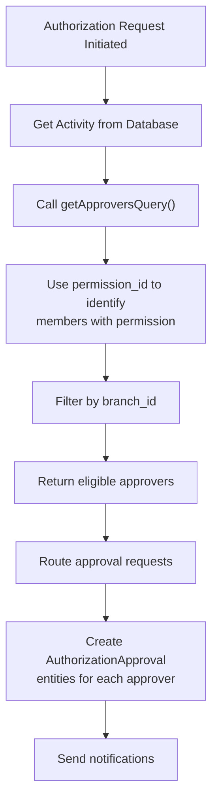

[← Back to Activities Plugin](5.6-activities-plugin.md)

# 5.6.5 Activity Authorization and Security Patterns

**Last Updated:** December 3, 2025  
**Status:** Complete  
**Scope:** Activities Plugin - Security & Authorization Patterns  

Technical reference for Activity entity security patterns, mass assignment protection, and authorization workflows.

## Table of Contents

- [Mass Assignment Security](#mass-assignment-security)
- [Approvers Discovery Pattern](#approvers-discovery-pattern)
- [Age-Based Eligibility](#age-based-eligibility)
- [Workflow Security](#workflow-security)
- [Best Practices](#best-practices)

## Mass Assignment Security

CakePHP entities protect against mass assignment vulnerabilities by defining which fields can be set through `newEntity()` or `patchEntity()` methods.

### Configuration Overview

The Activity entity's `$_accessible` array defines secure field access patterns:

```php
protected array $_accessible = [
    // Core Configuration - Safe for admin input
    "name" => true,
    "term_length" => true,
    "activity_group_id" => true,
    "minimum_age" => true,
    "maximum_age" => true,
    "num_required_authorizors" => true,
    "num_required_renewers" => true,
    
    // Administrative Integration
    "deleted" => true,
    "permission_id" => true,
    "grants_role_id" => true,
    
    // Relationships
    "activity_group" => true,
    "role" => true,
    "member_activities" => true,
    "pending_authorizations" => true,
];
```

### Protected vs. Accessible Fields

**Accessible Fields:**
These fields are designed for administrator configuration and can be safely mass-assigned from user input:

| Field | Purpose | Security Notes |
|-------|---------|-----------------|
| name | Activity identifier | Subject to form validation for uniqueness |
| term_length | Authorization duration | Positive integer validation required |
| activity_group_id | Categorization | Must reference existing ActivityGroup |
| minimum_age | Eligibility constraint | 0-127 range validation |
| maximum_age | Eligibility constraint | 0-127 range validation |
| num_required_authorizors | Approval count | 1+ positive integer |
| num_required_renewers | Renewal approvals | 1+ positive integer |
| deleted | Soft deletion | Managed by Trash behavior |
| permission_id | RBAC integration | Must reference valid Permission |
| grants_role_id | Auto-grant role | Must reference valid Role |

**Protected Fields:**
These fields are NOT accessible via mass assignment and can only be set through explicit property assignment:

| Field | Reason | Management |
|-------|--------|------------|
| id | Primary key | Database generated |
| created | Creation timestamp | Timestamp behavior |
| created_by | Creator tracking | Application code |
| modified | Update timestamp | Timestamp behavior |
| modified_by | Updater tracking | Application code |

### Safe Entity Creation Pattern

```php
// CORRECT: Using accessible fields with newEntity()
$activity = $activitiesTable->newEntity($this->request->getData());
// Only accessible fields from form are assigned

// AVOID: Directly assigning unvalidated data
// $activity->created = $userInput;  // NOT possible - protected field
// $activity->created_by = $hack;    // NOT possible - protected field

// CORRECT: Explicit assignment after validation for protected fields
$activity->created_by = $this->Authentication->getIdentity()->id;
$activity = $activitiesTable->save($activity);
```

### Relationship Mass Assignment

Relationships can be mass-assigned for convenience, but should be validated:

```php
// CORRECT: Mass-assign relationship via accessible field
$activity = $activitiesTable->newEntity([
    'name' => 'Marshal Training',
    'activity_group_id' => 1,
    'activity_group' => $activityGroup,  // Accessible - convenience assignment
    'term_length' => 365,
]);

// CORRECT: Separate validation for relationship assignment
if ($isAdminUser) {
    $activity->permission_id = $permissionId;
    $activity->grants_role_id = $roleId;
}
```

## Approvers Discovery Pattern

The approvers discovery mechanism is the core authorization integration point for authorization workflows.

### How Approver Discovery Works



### getApproversQuery() Method

The Activity entity provides the `getApproversQuery()` method to discover eligible approvers:

```php
/**
 * Get Approvers Query for Activity Authorization
 *
 * @param int $branch_id Branch scope for approver identification
 * @return \Cake\ORM\Query\SelectQuery Query object for eligible approvers
 * @throws \Exception When permission_id is not configured
 */
public function getApproversQuery(int $branch_id): \Cake\ORM\Query\SelectQuery
{
    if (!isset($this->permission_id)) {
        throw new \Exception("Permission ID not set");
    }
    
    return PermissionsLoader::getMembersWithPermissionsQuery(
        $this->permission_id,
        $branch_id
    );
}
```

### Permission Configuration Requirement

For approver discovery to work, activities **must** have a `permission_id` configured:

```php
// CORRECT: Activity with permission configuration
$activity = [
    'name' => 'Heavy Weapons Authorization',
    'permission_id' => 42,  // Links to RBAC permission
    'activity_group_id' => 1,
    'term_length' => 1095,
    'num_required_authorizors' => 2,
];

// INCORRECT: Activity without permission fails approver discovery
$activity = [
    'name' => 'Broken Activity',
    'permission_id' => null,  // Will throw exception when approvers queried
    'activity_group_id' => 1,
];

// RUNTIME ERROR EXAMPLE:
try {
    $approvers = $activity->getApproversQuery($branchId);  // Throws Exception
} catch (\Exception $e) {
    // Exception: "Permission ID not set"
}
```

### Approver Discovery in Authorization Workflow

The authorization manager uses approver discovery during request creation:

```php
// From DefaultAuthorizationManager::request()
$activity = $activitiesTable->get($activityId);

// Discover eligible approvers
$approvesQuery = $activity->getApproversQuery($member->branch_id);
$approverCount = $approvesQuery->count();

// Validate sufficient approvers available
if ($approverCount < $activity->num_required_authorizors) {
    return new ServiceResult(
        false,
        "Insufficient approvers available for authorization"
    );
}

// Route request to each required approver
$approvers = $approvesQuery->limit($activity->num_required_authorizors)->toArray();
foreach ($approvers as $approver) {
    // Create AuthorizationApproval entity for approver
    // Send notification email
}
```

### Performance Optimization

The approver discovery uses `PermissionsLoader` for optimized queries:

```php
// RECOMMENDED: Query count only when needed
$approverCount = $activity->getApproversQuery($branchId)->count();

// LESS EFFICIENT: Fetch all approvers to count
$approvers = $activity->getApproversQuery($branchId)->toArray();
$count = count($approvers);

// RECOMMENDED: Chain conditions before execution
$approvers = $activity->getApproversQuery($branchId)
    ->where(['Members.status !=' => 'inactive'])
    ->limit($activity->num_required_authorizors)
    ->toArray();

// CACHE BENEFIT: Repeated permission queries leverage PermissionsLoader cache
$approvers1 = $activity->getApproversQuery($branchId1)->toArray();
$approvers2 = $activity->getApproversQuery($branchId1)->toArray();  // Uses cache
```

### Error Handling

Proper error handling prevents authorization workflow failures:

```php
// Defensive approver discovery
public function findApproversForAuthorization(Activity $activity, int $branchId)
{
    try {
        // Validate permission configuration exists
        if (!$activity->permission_id) {
            throw new \Exception("Activity missing permission configuration");
        }
        
        // Get approvers
        $approvesQuery = $activity->getApproversQuery($branchId);
        
        // Validate sufficient approvers
        $count = $approvesQuery->count();
        if ($count < $activity->num_required_authorizors) {
            throw new \Exception(
                "Insufficient approvers: need {$activity->num_required_authorizors}, " .
                "found {$count}"
            );
        }
        
        return $approvesQuery->toArray();
        
    } catch (\Exception $e) {
        Log::error("Approver discovery failed: " . $e->getMessage());
        throw new AuthorizationFailedException(
            "Unable to route authorization request",
            0,
            $e
        );
    }
}
```

## Age-Based Eligibility

Activities define age-based member eligibility through `minimum_age` and `maximum_age` properties.

### Configuration

```php
// Youth activity: ages 13-17
$activity->minimum_age = 13;
$activity->maximum_age = 17;

// Adult activity: ages 18+
$activity->minimum_age = 18;
$activity->maximum_age = null;  // No upper limit

// Unrestricted activity: all ages
$activity->minimum_age = null;
$activity->maximum_age = null;
```

### Eligibility Validation

Age eligibility is validated before authorization request creation:

```php
// Age eligibility check in authorization workflow
$isEligible = true;

if ($activity->minimum_age !== null && $member->age < $activity->minimum_age) {
    $isEligible = false;
}

if ($activity->maximum_age !== null && $member->age > $activity->maximum_age) {
    $isEligible = false;
}

if (!$isEligible) {
    throw new \Exception(
        "Member age {$member->age} does not meet activity requirements " .
        "({$activity->minimum_age}-{$activity->maximum_age})"
    );
}
```

### Age Calculation

Member age is calculated from birth date:

```php
// Assuming member has date_of_birth field
$dob = $member->date_of_birth;
$today = FrozenDate::now();
$age = $today->diffInYears($dob);  // Elapsed years since birth

// Age validation
if ($age < 18) {
    // Youth authorization required
} else {
    // Adult authorization allowed
}
```

## Workflow Security

### Authorization Request Validation

Multiple security checks protect the authorization workflow:

```php
/**
 * Comprehensive validation before creating authorization request
 */
public function validateAuthorizationRequest(
    Activity $activity,
    Member $member,
    int $requesterId,
    bool $isRenewal = false
): ServiceResult
{
    // 1. Activity existence and configuration
    if (!$activity->id) {
        return new ServiceResult(false, "Activity not found");
    }
    
    // 2. Age eligibility
    if (!$this->validateAge($member, $activity)) {
        return new ServiceResult(false, "Member does not meet age requirements");
    }
    
    // 3. Approver availability
    try {
        $approvers = $activity->getApproversQuery($member->branch_id);
        if ($approvers->count() < $activity->num_required_authorizors) {
            return new ServiceResult(false, "Insufficient approvers available");
        }
    } catch (\Exception $e) {
        return new ServiceResult(false, "Activity not configured for authorization");
    }
    
    // 4. Existing authorization check
    if (!$isRenewal && $this->hasPendingRequest($member, $activity)) {
        return new ServiceResult(false, "Pending request already exists");
    }
    
    // 5. Renewal eligibility check
    if ($isRenewal && !$this->hasValidAuthorizationToRenew($member, $activity)) {
        return new ServiceResult(false, "No valid authorization to renew");
    }
    
    return new ServiceResult(true);
}
```

### Permission-Based Authorization

Admin actions are protected by RBAC permissions:

```php
// Admin authorization check before allowing activity modification
$canManage = $user->can('Can Manage Activities');

if (!$canManage) {
    throw new ForbiddenException("Not authorized to manage activities");
}

// Admin check before revocation
$canRevoke = $user->can('Can Revoke Authorizations');

if (!$canRevoke) {
    throw new ForbiddenException("Not authorized to revoke authorizations");
}
```

### Audit Trail Integration

All authorization operations are audited:

```php
// Created/modified tracking
$activity->created_by = $currentUser->id;      // Set on creation
$activity->modified_by = $currentUser->id;     // Updated on modifications
$activity->created = FrozenDateTime::now();    // Timestamp behavior
$activity->modified = FrozenDateTime::now();   // Timestamp behavior

// Authorization audit
$authorization->status = "Approved";
$authorization->revoker_id = $adminId;        // Track who approved/revoked
$authorization->revoked_reason = $reason;     // Audit reasoning
```

## Best Practices

### Activity Configuration

1. **Always Set Permission ID:**
   ```php
   // CORRECT
   $activity->permission_id = $permissionId;
   
   // AVOID - authorization workflow will fail
   $activity->permission_id = null;
   ```

2. **Validate Approver Availability:**
   ```php
   // Verify approvers exist before completing setup
   $approvesQuery = $activity->getApproversQuery($branchId);
   if ($approvesQuery->count() == 0) {
       Log::warning("No approvers available for activity: {$activity->name}");
   }
   ```

3. **Set Appropriate Approval Requirements:**
   ```php
   // Simple activity: single approver
   $activity->num_required_authorizors = 1;
   
   // Combat activity: dual approvers
   $activity->num_required_authorizors = 2;
   ```

### Authorization Request Handling

1. **Validate Before Creating:**
   ```php
   $validation = $this->validateAuthorizationRequest(
       $activity,
       $member,
       $requesterId
   );
   
   if (!$validation->isSuccess()) {
       return $validation;  // Return error instead of creating invalid request
   }
   ```

2. **Handle Approver Discovery Failures:**
   ```php
   try {
       $approvers = $activity->getApproversQuery($branchId)->toArray();
   } catch (\Exception $e) {
       Log::error("Approver discovery failed: {$e->getMessage()}");
       throw new AuthorizationFailedException("Unable to process authorization");
   }
   ```

3. **Cache Query Results When Appropriate:**
   ```php
   // Reuse results if querying same activity multiple times
   $approvers = $activity->getApproversQuery($branchId)->toArray();
   foreach ($approvers as $approver) {
       // Use cached approvers list
   }
   ```

### Age Eligibility

1. **Validate Age Before Processing:**
   ```php
   if (!$this->validateAge($member, $activity)) {
       return new ServiceResult(false, "Age requirement not met");
   }
   ```

2. **Handle Missing Birth Dates:**
   ```php
   if ($member->date_of_birth === null) {
       // Cannot validate age - require member to complete profile
       return new ServiceResult(false, "Member must provide date of birth");
   }
   ```

---

## Table-Level Security Policies

The Activities plugin uses CakePHP's Authorization plugin for table-level access control. Table policies provide centralized authorization logic for bulk operations and grid data filtering.

### Policy Architecture

Table policies follow a consistent pattern:

```
ActivitiesTablePolicy
├── scopeIndex()       # Filter records for index views
├── scopeGridData()    # Filter records for DataTables grids (delegates to scopeIndex)
├── canAdd()           # Permission to create new records
├── canEdit()          # Permission to modify records
└── canDelete()        # Permission to remove records
```

### Grid Data Scoping Pattern

Table policies implement `scopeGridData()` to integrate with the KMP DataTables grid system:

```php
class ActivitiesTablePolicy
{
    /**
     * Scope grid data using the standard index scope.
     * All DataTables grids use this method for authorization filtering.
     */
    public function scopeGridData(
        IdentityInterface $user,
        Query $query
    ): Query {
        return $this->scopeIndex($user, $query);
    }
}
```

This pattern ensures consistent authorization between traditional index views and AJAX-loaded grid data.

### Available Table Policies

| Policy Class | Table | Purpose |
|-------------|-------|---------|
| `ActivitiesTablePolicy` | Activities | Activity record access control |
| `ActivityGroupsTablePolicy` | ActivityGroups | Activity group management |
| `AuthorizationsTablePolicy` | Authorizations | Authorization request filtering |
| `AuthorizationApprovalsTablePolicy` | AuthorizationApprovals | Approval workflow access |
| `PermissionsActivityGroupsTablePolicy` | PermissionsActivityGroups | Permission-to-activity mappings |
| `PermissionsActivityTablePolicy` | PermissionsActivity | Activity-specific permissions |

### Implementation Notes

1. **Delegation Pattern**: `scopeGridData()` should delegate to `scopeIndex()` for DRY principles
2. **Query Building**: Scope methods receive a Query object and must return a modified Query
3. **Identity Access**: The `$user` parameter provides the authenticated user's identity
4. **Consistent Filtering**: Both index views and grids apply identical authorization filters

### Approval Queue Scoping Pattern

The `AuthorizationApprovalsTablePolicy` implements a two-tier access model for approval queues:

```php
class AuthorizationApprovalsTablePolicy extends BasePolicy
{
    /**
     * Personal queue access - requires any approval authority.
     */
    public function canMyQueue(KmpIdentityInterface $user, $entity): bool
    {
        return ActivitiesTable::canAuhtorizeAnyActivity($user);
    }
    
    /**
     * Administrative access - permission-based.
     */
    public function canAllQueues(KmpIdentityInterface $user, $entity): bool
    {
        return $this->_hasPolicy($user, __FUNCTION__, $entity);
    }
    
    /**
     * Index scope - admin sees all, approvers see own.
     */
    public function scopeIndex(KmpIdentityInterface $user, $query)
    {
        if ($this->canAllQueues($user, $table->newEmptyEntity())) {
            return $query;  // Admin: unfiltered
        }
        return $query->where(['approver_id' => $user->getIdentifier()]);
    }
}
```

**Queue Access Tiers:**

| Scope Method | Access Level | Filter Applied |
|-------------|--------------|----------------|
| `scopeMyQueue()` | Personal | `approver_id = user.id` |
| `scopeIndex()` (admin) | Administrative | None (full access) |
| `scopeIndex()` (approver) | Personal | `approver_id = user.id` |
| `scopeView()` | Same as index | Consistent with queue access |
| `scopeMobileApprove()` | Personal or Admin | Based on `canAllQueues()` |

---

## References

- [Activity Entity Reference](5.6.4-activity-entity-reference.md) - Entity properties and methods
- [Activities Plugin Workflows](5.6-activities-plugin.md) - Authorization lifecycle
- [RBAC Security Architecture](4.4-rbac-security-architecture.md) - Permission system
- [CakePHP Entity Documentation](https://book.cakephp.org/5/en/orm/entities.html#accessible-fields) - CakePHP accessible fields
- [CakePHP Authorization Plugin](https://book.cakephp.org/authorization/3/en/index.html) - Authorization system

