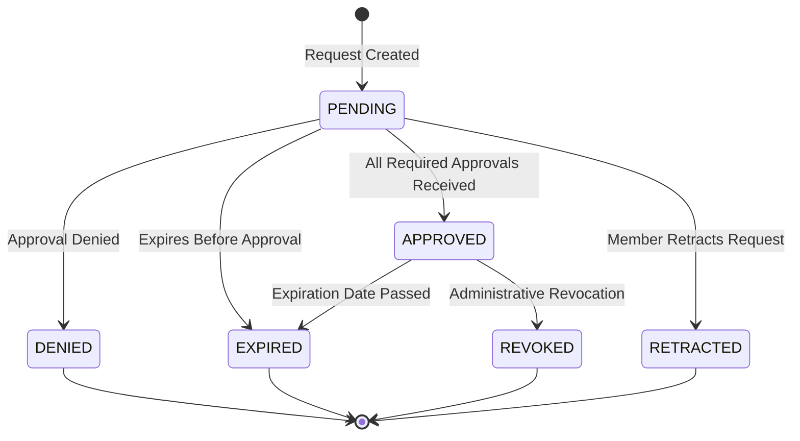

[← Back to Activities Plugin](5.6-activities-plugin.md)

# 5.6.7 Authorization Entity Reference

**Last Updated:** December 3, 2025  
**Status:** Complete  
**Scope:** Activities Plugin - Authorization Entity  

Comprehensive technical reference for the Authorization entity, covering data model, lifecycle management, relationships, and integration patterns with the temporal authorization system.

## Table of Contents

- [Authorization Entity Overview](#authorization-entity-overview)
- [Database Schema](#database-schema)
- [Entity Properties](#entity-properties)
- [Authorization Status Constants](#authorization-status-constants)
- [Relationships](#relationships)
- [Mass Assignment Security](#mass-assignment-security)
- [Authorization Lifecycle](#authorization-lifecycle)
- [Temporal Management](#temporal-management)
- [Usage Examples](#usage-examples)

## Authorization Entity Overview

The Authorization entity represents a member's request to participate in a specific activity within KMP. Authorizations implement temporal validation through `ActiveWindowBaseEntity`, providing time-bounded access control with automatic lifecycle management.

**Core Responsibilities:**
- Track member requests for activity participation
- Manage approval workflow through multi-level authorization process
- Maintain temporal validity windows with automatic expiration
- Support automatic role assignment upon approval
- Provide audit trail of authorization lifecycle

**Location:** `plugins/Activities/src/Model/Entity/Authorization.php`  
**Extends:** `App\Model\Entity\ActiveWindowBaseEntity`  
**Table Class:** `Activities\Model\Table\AuthorizationsTable`

## Database Schema

### Table: activities_authorizations

The Authorization entity maps to the `activities_authorizations` database table with the following structure:

| Column | Type | Null | Default | Notes |
|--------|------|------|---------|-------|
| `id` | INT(11) | NO | Auto | Primary key, auto-incrementing |
| `member_id` | INT(11) | NO | | Foreign key to member requesting authorization |
| `activity_id` | INT(11) | NO | | Foreign key to activity being authorized for |
| `granted_member_role_id` | INT(11) | YES | NULL | Foreign key to role granted upon approval |
| `expires_on` | DATETIME | YES | NULL | Authorization expiration date/time |
| `start_on` | DATETIME | YES | NULL | Authorization start date/time |
| `created` | TIMESTAMP | NO | CURRENT | Creation timestamp |
| `approval_count` | INT(11) | NO | 0 | Number of approvals received |
| `status` | VARCHAR(20) | NO | 'pending' | Current authorization status |
| `revoked_reason` | VARCHAR(255) | YES | '' | Reason for revocation if revoked |
| `revoker_id` | INT(11) | YES | NULL | Foreign key to member who revoked authorization |
| `is_renewal` | TINYINT(1) | NO | 0 | Flag indicating if this is a renewal request |

**Indexes:**
- PRIMARY: `id`
- INDEX: `activity_id`
- INDEX: `member_id`
- INDEX: `start_on`
- INDEX: `expires_on`
- INDEX: `granted_member_role_id`

**Foreign Keys:**
- `member_id` → `members.id` (ON DELETE CASCADE)
- `activity_id` → `activities_activities.id` (ON DELETE CASCADE)
- `granted_member_role_id` → `member_roles.id` (ON DELETE CASCADE)

**Notes:**
- Inherits audit fields from `BaseEntity`: `created_by`, `modified_by` (if inherited)
- Inherits ActiveWindow fields from `ActiveWindowBaseEntity` 
- Supports temporal queries through ActiveWindow behavior

## Entity Properties

### Core Identification Properties

#### id
- **Type:** `int`
- **Required:** Yes (auto-generated)
- **Description:** Unique authorization identifier
- **Use Case:** Primary key for database operations

#### member_id
- **Type:** `int`
- **Required:** Yes
- **Constraint:** Must reference existing member
- **Description:** Member requesting or receiving the authorization
- **Relationship:** `belongsTo Members`
- **Example:** `1234`

#### activity_id
- **Type:** `int`
- **Required:** Yes
- **Constraint:** Must reference existing activity
- **Description:** Activity for which authorization is requested
- **Relationship:** `belongsTo Activities`
- **Example:** `42`

### Temporal Properties

#### start_on
- **Type:** `\Cake\I18n\DateTime|null`
- **Required:** No (defaults to creation date if not specified)
- **Description:** When the authorization becomes valid/active
- **Validation:** Should be before or equal to `expires_on`
- **Usage:** Marks beginning of valid authorization window
- **Examples:**
  - Immediate effect: today's date
  - Delayed start: future date for scheduled activations
  - NULL: uses created date as start

#### expires_on
- **Type:** `\Cake\I18n\DateTime|null`
- **Required:** Typically yes (depends on workflow)
- **Description:** When the authorization expires and becomes invalid
- **Validation:** Should be after or equal to `start_on`
- **Usage:** Marks end of valid authorization window
- **Examples:**
  - 1 year: `start_on->addYear()`
  - 2 years: `start_on->addYears(2)`
  - 3 years: `start_on->addYears(3)`
- **Important:** Used for automatic EXPIRED status transition

### Approval Workflow Properties

#### status
- **Type:** `string`
- **Required:** Yes
- **Valid Values:** See [Authorization Status Constants](#authorization-status-constants)
- **Default:** `'pending'` (when created)
- **Description:** Current lifecycle state of the authorization
- **Automatic Transitions:**
  - Daily status checks transition EXPIRED when past expires_on
  - Manual transitions handled by AuthorizationManager service
- **Usage:** Determines authorization validity and workflow state

#### approval_count
- **Type:** `int`
- **Required:** Yes
- **Default:** `0`
- **Description:** Number of approvals received so far
- **Usage:** Tracks workflow progress toward required approvals
- **Comparison:** Compare against `Activity.num_required_authorizors` or `num_required_renewers`
- **Example:**
  ```php
  $isApprovalComplete = $authorization->approval_count >= $activity->num_required_authorizors;
  ```

### Role Assignment Properties

#### granted_member_role_id
- **Type:** `int|null`
- **Required:** Typically yes (if activity grants role)
- **Relationship:** `belongsTo MemberRoles`
- **Description:** Role granted to member when authorization becomes active
- **Null Handling:** NULL if no role granted or authorization not yet approved
- **Auto-Assignment:** ActiveWindowManager assigns role when authorization becomes APPROVED
- **Removal:** Role removed if authorization REVOKED or EXPIRED
- **Examples:**
  - Fighter role for combat activity
  - Marshal role for marshal activity
  - NULL for activities without automatic role assignment

### Revocation Properties

#### revoker_id
- **Type:** `int|null`
- **Required:** No
- **Relationship:** `belongsTo Members` (alias: `revoked_by`)
- **Description:** Member who revoked this authorization
- **Null Handling:** NULL if not revoked
- **Populated:** Only when status changes to REVOKED_STATUS
- **Usage:** Track who revoked authorization for audit purposes

#### revoked_reason
- **Type:** `string`
- **Required:** No
- **Max Length:** 255 characters
- **Default:** Empty string `''`
- **Description:** Reason provided for revocation
- **Examples:**
  - "Member removed from organization"
  - "Authorization no longer appropriate"
  - "Requested by member"
- **Populated:** Only when status changes to REVOKED_STATUS

### Renewal Properties

#### is_renewal
- **Type:** `bool` (stored as TINYINT(1))
- **Required:** Yes
- **Default:** `0` (false)
- **Description:** Indicates if this is a renewal of previous authorization
- **Workflow:** Used to distinguish new requests from renewals
- **Impact:** May use different approval requirements (`num_required_renewers`)
- **Example:**
  ```php
  $authorizationsTable->newEntity([
      'member_id' => $member->id,
      'activity_id' => $activity->id,
      'is_renewal' => true,  // Mark as renewal
      'start_on' => $existing->expires_on->addDay(),
      'expires_on' => $existing->expires_on->addYears(2)
  ]);
  ```

### Audit Properties

#### created
- **Type:** `\Cake\I18n\DateTime` (actually TIMESTAMP)
- **Required:** Yes
- **Set By:** Automatic on insert
- **Description:** When authorization was created
- **Note:** Stored as TIMESTAMP with automatic current_timestamp()

## Authorization Status Constants

The authorization lifecycle is managed through distinct status values defined as class constants:

```php
// From Authorization entity definition
const APPROVED_STATUS = "Approved";      // Authorization is active and valid
const PENDING_STATUS = "Pending";        // Authorization awaiting approval
const DENIED_STATUS = "Denied";          // Authorization request was rejected
const REVOKED_STATUS = "Revoked";        // Previously approved authorization was revoked
const EXPIRED_STATUS = "Expired";        // Authorization has passed expiration date
const RETRACTED_STATUS = "Retracted";    // Member retracted pending request
```

### Status Lifecycle Overview



### Status Descriptions

#### PENDING ("Pending")
- **Meaning:** Authorization awaiting approval or currently in approval workflow
- **Automatic Transitions:**
  - To APPROVED when all required approvals received
  - To DENIED when approval denied
  - To EXPIRED if expires_on date passed before approval
  - To RETRACTED if member retracts request
- **Role Assignment:** No role assigned while pending
- **Validity:** Not valid for authorization checks
- **Duration:** Variable, depends on approval workflow speed

#### APPROVED ("Approved")
- **Meaning:** Authorization approved and active within temporal window
- **Automatic Transitions:**
  - To EXPIRED if expires_on date passed
  - To REVOKED if administratively revoked
- **Role Assignment:** Role assigned automatically when activated
- **Validity:** Valid authorization when within start_on to expires_on window
- **Duration:** From approval to expires_on date
- **Temporal Requirements:** Must be between start_on and expires_on

#### DENIED ("Denied")
- **Meaning:** Authorization request was rejected during approval
- **Transitions:** Terminal state (no further transitions)
- **Role Assignment:** No role assigned
- **Validity:** Not valid for authorization checks
- **Permanent:** Member must create new request to retry

#### REVOKED ("Revoked")
- **Meaning:** Previously approved authorization was manually revoked
- **Transitions:** Terminal state (no further transitions)
- **Role Removal:** Any granted role removed
- **Validity:** Not valid for authorization checks
- **Reason Tracking:** `revoked_reason` field explains why revoked
- **Revoker Tracking:** `revoker_id` field tracks who revoked
- **Use Cases:**
  - Member left organization
  - Authorization no longer appropriate
  - Safety concern requires revocation

#### EXPIRED ("Expired")
- **Meaning:** Authorization has passed its expiration date
- **Transitions:** Terminal state (no further transitions)
- **Role Removal:** Any granted role removed
- **Validity:** Not valid for authorization checks (temporal window closed)
- **Automatic:** Transitioned automatically by checkStatus() daily
- **Renewal Path:** Member can request renewal authorization
- **Tracking:** Preserved for authorization history

#### RETRACTED ("Retracted")
- **Meaning:** Member retracted pending authorization request
- **Transitions:** Terminal state (no further transitions)
- **Role Assignment:** No role assigned
- **Validity:** Not valid for authorization checks
- **Use Cases:**
  - Member changed mind about participation
  - Member requested revocation of pending request
  - Workflow cancellation by member

### Status Transition Rules

**Automatic Transitions (by ActiveWindow/checkStatus):**
- PENDING → EXPIRED: If `expires_on` < NOW
- APPROVED → EXPIRED: If `expires_on` < NOW

**Manual Transitions (by AuthorizationManager):**
- PENDING → APPROVED: When all required approvals received
- PENDING → DENIED: When approval denied
- PENDING → RETRACTED: When member retracts
- APPROVED → REVOKED: Administrative revocation
- Any → Any: By explicit manager call (rare)

## Relationships

### Parent Relationships (belongsTo)

#### member
- **Related Entity:** `App\Model\Entity\Member`
- **Foreign Key:** `member_id`
- **Join Type:** INNER JOIN (required)
- **Description:** Member requesting/receiving authorization
- **Access:** `$authorization->member->sca_name`
- **Usage:** Authorization ownership and approval workflow targeting
- **Cascade Delete:** If member deleted, authorization deleted

#### activity
- **Related Entity:** `Activities\Model\Entity\Activity`
- **Foreign Key:** `activity_id`
- **Join Type:** INNER JOIN (required)
- **Description:** Activity being authorized for
- **Access:** `$authorization->activity->name`
- **Usage:** Authorization type identification and approval requirement lookup
- **Cascade Delete:** If activity deleted, authorization deleted
- **Critical:** Provides `num_required_authorizors` and `num_required_renewers`

#### member_role
- **Related Entity:** `App\Model\Entity\MemberRole`
- **Foreign Key:** `granted_member_role_id`
- **Join Type:** INNER JOIN (required for approved auths)
- **Description:** Role granted upon authorization approval
- **Access:** `$authorization->member_role->role->name`
- **Usage:** Member role assignment and permission granting
- **Assignment:** Automatic when authorization becomes APPROVED
- **Removal:** Automatic when authorization REVOKED or EXPIRED
- **Note:** NULL until authorization approved

#### revoked_by
- **Related Entity:** `App\Model\Entity\Member`
- **Foreign Key:** `revoker_id`
- **Join Type:** LEFT JOIN (optional)
- **Alias:** `revoked_by` (not standard property name)
- **Description:** Member who revoked this authorization
- **Access:** `$authorization->revoked_by->sca_name`
- **Usage:** Revocation audit trail
- **Population:** Only when status = REVOKED_STATUS

### Child Relationships (hasMany)

#### authorization_approvals
- **Related Entity:** `Activities\Model\Entity\AuthorizationApproval`
- **Foreign Key:** `authorization_id`
- **Description:** All approval records for this authorization workflow
- **Use Case:** Track complete approval workflow history
- **Query:** `$authorization->authorization_approvals` (includes all approval responses)
- **Access Pattern:**
  ```php
  foreach ($authorization->authorization_approvals as $approval) {
      echo $approval->member->sca_name . ": " . 
           ($approval->approved ? "Approved" : "Denied");
  }
  ```

### ActiveWindow Relationships

Through `ActiveWindowBaseEntity` inheritance, Authorization provides temporal query support:

- **current**: Active authorizations within valid temporal window
- **upcoming**: Approved authorizations with future start dates
- **previous**: Historical authorizations (EXPIRED, REVOKED, DENIED)
- **past**: All non-current authorizations

**Example:**
```php
// Find all currently valid authorizations
$currentAuths = $authorizationsTable->find('current')->toArray();

// Find upcoming authorizations starting soon
$upcomingAuths = $authorizationsTable->find('upcoming')->toArray();

// Get authorization history
$history = $authorizationsTable->find('previous')
    ->where(['member_id' => $memberId])
    ->toArray();
```

## Mass Assignment Security

The Authorization entity uses CakePHP's accessible field system to prevent mass assignment vulnerabilities while allowing legitimate field updates.

### Accessible Fields

The following fields can be safely mass assigned through `newEntity()` or `patchEntity()`:

**Core Fields:**
- `member_id` - Member requesting authorization
- `activity_id` - Activity being authorized for
- `expires_on` - Authorization expiration date
- `start_on` - Authorization start date (optional)

**Relationship Management:**
- `member` - Member entity for relationship loading
- `activity` - Activity entity for relationship loading
- `authorization_approvals` - Approval records for relationship loading

### Protected Fields

The following fields are NOT accessible via mass assignment:

**System Fields:**
- `id` - Primary key protection
- `created` - Timestamp protection (set by database)
- `approval_count` - Computed during workflow
- `status` - Should not be mass-assigned (use manager service)

**Audit Fields:**
- `granted_member_role_id` - Should be set by workflow (ActiveWindow)
- `revoker_id` - Should be set by revocation workflow
- `revoked_reason` - Should be set by revocation workflow
- `is_renewal` - Should be set explicitly with careful consideration

## Authorization Lifecycle

### Creation Phase (PENDING)

**Trigger:** Member requests authorization for activity

```php
$authorization = $authorizationsTable->newEntity([
    'member_id' => $member->id,
    'activity_id' => $activity->id,
    'start_on' => FrozenDate::now(),
    'expires_on' => FrozenDate::now()->addYears(2),
    'status' => Authorization::PENDING_STATUS,
    'is_renewal' => false
]);
$authorizationsTable->save($authorization);
```

**State:**
- Status: PENDING
- Role: Not assigned
- Validity: Not valid for participation

### Approval Phase (PENDING → APPROVED or DENIED)

**Trigger:** Approval workflow processes required approvers

**Path A: Approval Granted**
```php
// When all required approvals received
$authorization->status = Authorization::APPROVED_STATUS;
$authorizationsTable->save($authorization);
// ActiveWindow automatically assigns role
```

**Path B: Approval Denied**
```php
// When approval denied
$authorization->status = Authorization::DENIED_STATUS;
$authorizationsTable->save($authorization);
// Terminal state - no further action
```

**State (Approved):**
- Status: APPROVED
- Role: Automatically assigned by ActiveWindow
- Validity: Valid between start_on and expires_on

### Active Phase (APPROVED)

**Duration:** From approval to expiration date

**Automatic Expiration:**
- Daily `checkStatus()` call checks for expired authorizations
- When `expires_on` < NOW, status changes to EXPIRED
- Role automatically removed by ActiveWindow

**Manual Revocation:**
```php
$authorization->status = Authorization::REVOKED_STATUS;
$authorization->revoked_reason = "Member left organization";
$authorization->revoker_id = $revokingMemberId;
$authorizationsTable->save($authorization);
// Role automatically removed by ActiveWindow
```

### Termination Phase (EXPIRED, REVOKED, DENIED, RETRACTED)

**Terminal States:**
- Authorization cannot transition to another state
- Historical record preserved for audit trail
- Role remains assigned (for expired) or removed (for revoked)

**Renewal Options:**
- Member can create new authorization request after EXPIRED
- New request is separate authorization with new approval workflow

## Temporal Management

### ActiveWindow Integration

Authorization extends `ActiveWindowBaseEntity` for automatic temporal lifecycle management:

**Automatic Behaviors:**
- Daily status checks transition APPROVED → EXPIRED
- Role assignment when authorization becomes APPROVED
- Role removal when authorization expires or revokes
- Temporal query support (current, upcoming, previous)

**Key Methods:**
```php
// Check if authorization is currently active
$isActive = $authorization->isCurrent();  // Between start_on and expires_on

// Get time until expiration
$daysRemaining = $authorization->expires_on->diffInDays(
    new FrozenDate()
);

// Check if upcoming
$isUpcoming = $authorization->isUpcoming();  // start_on in future

// Check if in past
$isExpired = !$authorization->isCurrent() && 
             $authorization->expires_on < new FrozenDate();
```

### Temporal Queries

```php
// Find currently valid authorizations for member
$currentAuths = $authorizationsTable->find('current')
    ->where(['member_id' => $memberId])
    ->contain(['Activities'])
    ->toArray();

// Find expiring authorizations in next 30 days
$expiringAuths = $authorizationsTable->find()
    ->where([
        'status' => Authorization::APPROVED_STATUS,
        'expires_on >=' => FrozenDate::now(),
        'expires_on <=' => FrozenDate::now()->addDays(30)
    ])
    ->contain(['Members', 'Activities'])
    ->all();

// Get authorization history
$history = $authorizationsTable->find()
    ->where(['member_id' => $memberId, 'activity_id' => $activityId])
    ->orderBy(['created' => 'DESC'])
    ->all();
```

## Usage Examples

### Creating Authorization Requests

```php
// Simple authorization request
$authorization = $authorizationsTable->newEntity([
    'member_id' => $member->id,
    'activity_id' => $activity->id,
    'start_on' => FrozenDate::now(),
    'expires_on' => FrozenDate::now()->addYears(2),
    'status' => Authorization::PENDING_STATUS
]);
$authorizationsTable->save($authorization);

// Renewal authorization
$authorization = $authorizationsTable->newEntity([
    'member_id' => $member->id,
    'activity_id' => $activity->id,
    'start_on' => $existing->expires_on->addDay(),
    'expires_on' => $existing->expires_on->addYears(2),
    'status' => Authorization::PENDING_STATUS,
    'is_renewal' => true
]);
$authorizationsTable->save($authorization);
```

### Checking Current Authorizations

```php
// Check if member has current authorization for activity
$currentAuth = $authorizationsTable->find('current')
    ->where([
        'member_id' => $member->id,
        'activity_id' => $activity->id,
        'status' => Authorization::APPROVED_STATUS
    ])
    ->first();

if ($currentAuth) {
    $daysRemaining = $currentAuth->expires_on->diffInDays(FrozenDate::now());
    echo "Authorization valid for {$daysRemaining} more days";
} else {
    echo "Member not authorized for this activity";
}
```

### Handling Expiration

```php
// Manual status check
$authorizationsTable->checkStatus();

// Get expired authorizations
$expiredAuths = $authorizationsTable->find()
    ->where(['status' => Authorization::EXPIRED_STATUS])
    ->contain(['Members', 'Activities'])
    ->all();

// Process expiration notifications
foreach ($expiredAuths as $auth) {
    if ($auth->expires_on->diffInDays(FrozenDate::now()) === 0) {
        // Send expiration notification
        $this->queueMail('Activities', 'authorizationExpired', 
            $auth->member->email_address, 
            ['activity' => $auth->activity->name]
        );
    }
}
```

### Authorization Revocation

```php
// Revoke authorization
$authorization = $authorizationsTable->get($id);
$authorization->status = Authorization::REVOKED_STATUS;
$authorization->revoked_reason = "Member removed from organization";
$authorization->revoker_id = $currentUserId;
$authorizationsTable->save($authorization);
// Role automatically removed by ActiveWindow
```

### Approval Workflow Integration

```php
// Get authorization with complete approval workflow
$authorization = $authorizationsTable->get($id, [
    'contain' => [
        'Members',
        'Activities',
        'AuthorizationApprovals' => [
            'Members',
            'sort' => ['created' => 'ASC']
        ]
    ]
]);

// Track approval progress
$totalRequired = $authorization->activity->num_required_authorizors;
$approvals = $authorization->authorization_approvals;
$pending = $approvals->where(function ($approval) {
    return $approval->responded_on === null;
});

$progress = [
    'total_required' => $totalRequired,
    'responses_received' => count($approvals) - count($pending),
    'pending_count' => count($pending),
    'complete' => $authorization->approval_count >= $totalRequired
];
```

### Authorization Statistics

```php
// Get authorization statistics for activity
$stats = $authorizationsTable->find()
    ->select([
        'activity_id',
        'status',
        'count' => $authorizationsTable->find()->func()->count('*')
    ])
    ->where(['activity_id' => $activityId])
    ->groupBy(['status'])
    ->toArray();

$summary = [
    'pending' => collect($stats)->where('status', Authorization::PENDING_STATUS)->first()['count'] ?? 0,
    'approved' => collect($stats)->where('status', Authorization::APPROVED_STATUS)->first()['count'] ?? 0,
    'denied' => collect($stats)->where('status', Authorization::DENIED_STATUS)->first()['count'] ?? 0,
    'expired' => collect($stats)->where('status', Authorization::EXPIRED_STATUS)->first()['count'] ?? 0,
    'revoked' => collect($stats)->where('status', Authorization::REVOKED_STATUS)->first()['count'] ?? 0
];
```

---

## References and Related Documentation

### Related Entities
- [Activity Entity](5.6.4-activity-entity-reference.md) - Authorization types and requirements
- [ActivityGroup Entity](5.6.6-activity-groups-entity-reference.md) - Activity categorization
- [AuthorizationApproval Entity](5.6.8-authorization-approval-entity-reference.md) - Approval workflow tracking

### Related Documentation
- [Activities Plugin Workflows](5.6-activities-plugin.md) - Authorization lifecycle workflows
- [Activities Plugin Architecture](5.6.1-activities-plugin-architecture.md) - Plugin structure
- [Activity Authorization Security Patterns](5.6.5-activity-security-patterns.md) - Security implementation
- [RBAC Security Architecture](4.4-rbac-security-architecture.md) - Permission system integration

### Source Files
- Entity: `plugins/Activities/src/Model/Entity/Authorization.php`
- Table: `plugins/Activities/src/Model/Table/AuthorizationsTable.php`
- Behaviors: Uses `ActiveWindow` behavior from core
- Base: `App\Model\Entity\ActiveWindowBaseEntity`

### Related Services
- `Activities\Services\AuthorizationManagerInterface` - Business logic for authorization lifecycle
- `App\Services\ActiveWindowManager\ActiveWindowManagerInterface` - Temporal management
- `App\Services\PermissionsLoader` - Permission-based approver discovery
