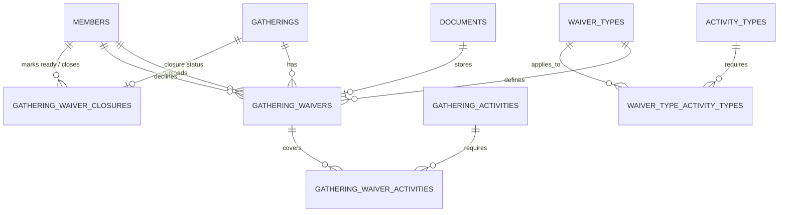

[← Back to Table of Contents](index.md) | [← Back to Plugins](5-plugins.md)

# 5.7 Waivers Plugin

**Last Updated:** October 30, 2025  
**Status:** Production  
**Plugin Location:** `app/plugins/Waivers/`  

## Overview

The Waivers plugin provides comprehensive waiver management for gatherings, enabling authorized users to upload, track, validate, and manage legal waivers associated with kingdom events. The system includes template management, automated retention tracking, multi-activity waiver support, and a decline/rejection workflow for invalid waivers.

## Table of Contents

- [Architecture Overview](#architecture-overview)
- [Core Features](#core-features)
  - [Waiver Exemptions](#6-waiver-exemptions)
  - [Collection Closure Workflow](#7-collection-closure-workflow)
  - [PDF Download & Preview](#8-pdf-download--preview)
- [Waiver Lifecycle](#waiver-lifecycle)
- [Database Schema](#database-schema)
- [Upload Wizard System](#upload-wizard-system)
- [Waiver Templates](#waiver-templates)
- [Dashboard & Reporting](#dashboard--reporting)
- [Decline/Rejection Workflow](#declinerejection-workflow)
- [Authorization & Security](#authorization--security)
- [Integration Points](#integration-points)
- [Development Guide](#development-guide)

## Architecture Overview

### Plugin Structure

```
plugins/Waivers/
├── assets/
│   ├── css/
│   │   └── waivers.css                    # Plugin-specific styles
│   └── js/
│       └── controllers/
│           ├── waiver-upload-wizard-controller.js
│           └── activity-waiver-manager-controller.js
├── config/
│   ├── Migrations/                        # Database migrations
│   └── routes.php                         # Plugin routes
├── src/
│   ├── Controller/
│   │   ├── GatheringWaiversController.php # Waiver CRUD operations
│   │   ├── WaiverTypesController.php      # Waiver template management
│   │   └── WaiverDashboardController.php  # Dashboard & reporting
│   ├── Model/
│   │   ├── Entity/
│   │   │   ├── GatheringWaiver.php        # Waiver entity with lifecycle
│   │   │   └── WaiverType.php             # Template entity
│   │   └── Table/
│   │       ├── GatheringWaiversTable.php  # Waiver table with validation
│   │       └── WaiverTypesTable.php       # Template table
│   ├── Policy/
│   │   ├── GatheringWaiverPolicy.php      # Waiver authorization
│   │   └── WaiverTypePolicy.php           # Template authorization
│   └── WaiversPlugin.php                  # Main plugin class
├── templates/
│   ├── GatheringWaivers/                  # Waiver CRUD views
│   ├── WaiverTypes/                       # Template CRUD views
│   └── WaiverDashboard/                   # Dashboard views
└── tests/
    └── TestCase/                          # Plugin tests
```

### Key Components

1. **Gathering Waivers**: Uploaded waiver documents associated with specific gatherings
2. **Waiver Types**: Templates defining required waiver types for different activity types
3. **Upload Wizard**: Multi-step interface for bulk waiver uploads
4. **Dashboard**: Reporting and monitoring interface for waiver compliance
5. **Activity Association**: Link waivers to specific activities within gatherings

## Core Features

### 1. Waiver Management

- **Upload waivers** for gatherings with automatic document storage
- **Multi-activity support**: One waiver covering multiple activities
- **Automated retention tracking**: Configurable retention periods per waiver type
- **Status tracking**: Active, expired, deleted, declined states
- **Template-based validation**: Ensure correct waiver types for activities

### 2. Waiver Templates (Waiver Types)

- **Template library**: Define standard waiver templates
- **Activity-specific requirements**: Map waiver types to activity types
- **Retention policies**: Configurable retention periods (days/months/years)
- **File requirements**: Specify allowed file types and size limits
- **Custom instructions**: Provide upload guidance for each template

### 3. Upload Wizard

- **Bulk upload interface**: Upload multiple waivers at once
- **Activity selection**: Choose which gathering activities require waivers
- **Template matching**: Automatic template suggestion based on activities
- **Drag-and-drop**: Modern file upload interface
- **Progress tracking**: Visual feedback during upload process

### 4. Dashboard & Reporting

- **Compliance overview**: At-a-glance waiver status across gatherings
- **Missing waivers**: Identify gatherings with incomplete waiver sets
- **Expiration tracking**: Monitor upcoming waiver expirations
- **Branch-level reporting**: Filter by branch for regional compliance

### 5. Decline/Rejection Workflow

- **30-day window**: Decline invalid waivers within 30 days of upload
- **Reason tracking**: Required explanation for all declines
- **Audit trail**: Track who declined waivers and when
- **Status badges**: Visual indicators for declined waivers

### 6. Waiver Exemptions

- **Attestation-based**: Staff can attest that a waiver is not needed for a gathering activity
- **Configurable reasons**: Exemption reasons defined per waiver type (`exemption_reasons` JSON field)
- **Audit trail**: Records who attested, when, and why
- **No document required**: Exemptions set `document_id` to null, `is_exemption` to true
- **Duplicate prevention**: Only one exemption per gathering/waiver type combination
- See [Waiver Exemption System](4.6.4-waiver-exemption-system.md) for full details

### 7. Collection Closure Workflow

Two-stage workflow for closing waiver collection on a gathering:

1. **Ready to Close** — Event staff marks waiver collection as complete via `markReadyToClose()`
2. **Closed** — Waiver secretary reviews and confirms via `close()`

- **Reopening**: Both stages are reversible (`unmarkReadyToClose()`, `reopen()`)
- **Permission**: Requires `canCloseWaivers` policy (waiver secretary role)
- **Tracking**: Separate timestamps and member references for each stage
- **Dashboard integration**: Gatherings show closure status in the compliance dashboard

### 8. PDF Download & Preview

- **Download**: Authenticated download of waiver PDFs via `download()` action
- **Preview**: JPEG preview generation via `preview()` action
- **Authorization**: Both require `canDownload` / `canPreview` policy methods
- **Document service**: Uses core `DocumentService` for secure file retrieval outside webroot

## Waiver Lifecycle

### States

```
┌──────────┐
│ Uploaded │ ──────────────────────────────┐
└─────┬────┘                                │
      │                                     │
      │ (normal flow)                       │ (decline within 30 days)
      ▼                                     ▼
┌──────────┐                          ┌──────────┐
│  Active  │                          │ Declined │
└─────┬────┘                          └──────────┘
      │                                     
      │ (retention_date passes)            
      ▼                                     
┌──────────┐
│ Expired  │
└─────┬────┘
      │
      │ (manual deletion)
      ▼
┌──────────┐
│ Deleted  │
└──────────┘
```

**Exemption records** follow a simplified path: they are created directly as `active` with no document, and expire normally when the retention date passes.

**Gathering-level closure** is tracked separately from individual waiver status:

```
┌──────────┐    markReadyToClose()    ┌────────────────┐     close()     ┌────────┐
│   Open   │ ──────────────────────── │ Ready to Close │ ──────────────  │ Closed │
└──────────┘  unmarkReadyToClose() ←  └────────────────┘    reopen() ←  └────────┘
```

### Entity Properties

**GatheringWaiver Entity:**

```php
// Core Properties
int $id
int $gathering_id              // Associated gathering
int $waiver_type_id           // Template/type of waiver
int $document_id              // Uploaded document reference (null for exemptions)
string $status                // active, expired, deleted, declined
Date $retention_date          // When waiver expires
int $created_by              // Uploader

// Exemption Properties
bool $is_exemption           // True if this is an attestation, not an uploaded doc
string $exemption_reason     // Selected reason from waiver type's exemption_reasons

// Decline Properties (added in Oct 2025)
DateTime $declined_at         // When declined
int $declined_by             // Who declined
string $decline_reason       // Why declined

// Virtual Fields
bool $is_expired             // Retention date has passed
bool $is_active              // Active and not expired
bool $is_declined            // Has been declined
bool $can_be_declined        // Eligible for decline (within 30 days)
string $status_display       // Human-readable status
string $status_badge_class   // Bootstrap class for badges
```

**GatheringWaiverClosure Entity:**

```php
int $id
int $gathering_id             // One closure record per gathering (unique)
DateTime $ready_to_close_at   // When staff marked ready (null = not ready)
int $ready_to_close_by        // Staff member who marked ready
DateTime $closed_at           // When secretary closed (null = not closed)
int $closed_by               // Secretary who closed

// Virtual Fields
bool isClosed()              // closed_at is set
bool isReadyToClose()        // ready_to_close_at is set
```

### Business Rules

1. **Upload Requirements**
   - Must be associated with a gathering
   - Must match a defined waiver type
   - File must meet type/size requirements
   - Uploader must have permission for the gathering's branch

2. **Retention Rules**
   - Retention date calculated from waiver type settings on upload
   - Waivers automatically expire when retention date passes
   - Expired waivers remain in system for audit purposes
   - Can be manually deleted if needed

3. **Decline Rules**
   - Can only decline within 30 days of upload
   - Cannot decline already expired or deleted waivers
   - Decline reason is mandatory
   - Decline action is permanent and logged
   - Requires specific permission (usually same as edit)

4. **Activity Association**
   - Single waiver can cover multiple activities
   - Activities must be part of the same gathering
   - Association stored in `gathering_waiver_activities` junction table

## Database Schema

### Tables

#### `waivers_gathering_waivers`

Primary table storing uploaded waivers and exemptions:

```sql
CREATE TABLE waivers_gathering_waivers (
    id INT AUTO_INCREMENT PRIMARY KEY,
    gathering_id INT NOT NULL,
    waiver_type_id INT NOT NULL,
    document_id INT NULL,                  -- NULL for exemptions
    status VARCHAR(50) DEFAULT 'active',
    retention_date DATE NULL,
    is_exemption BOOLEAN DEFAULT 0,        -- True for attestation records
    exemption_reason VARCHAR(255) NULL,    -- Selected from waiver type's list
    declined_at DATETIME NULL,
    declined_by INT NULL,
    decline_reason TEXT NULL,
    created_by INT NOT NULL,
    created DATETIME NOT NULL,
    modified DATETIME NOT NULL,
    
    FOREIGN KEY (gathering_id) REFERENCES gatherings(id),
    FOREIGN KEY (waiver_type_id) REFERENCES waivers_waiver_types(id),
    FOREIGN KEY (document_id) REFERENCES documents(id),
    FOREIGN KEY (created_by) REFERENCES members(id),
    FOREIGN KEY (declined_by) REFERENCES members(id),
    
    INDEX idx_gathering_id (gathering_id),
    INDEX idx_waiver_type_id (waiver_type_id),
    INDEX idx_status (status),
    INDEX idx_retention_date (retention_date),
    INDEX idx_declined_at (declined_at)
);
```

#### `waivers_waiver_types`

Templates defining waiver types:

```sql
CREATE TABLE waivers_waiver_types (
    id INT AUTO_INCREMENT PRIMARY KEY,
    name VARCHAR(255) NOT NULL,
    description TEXT,
    retention_period INT NOT NULL,          -- Number of units
    retention_unit VARCHAR(20) NOT NULL,    -- 'days', 'months', 'years'
    file_types TEXT,                        -- JSON array of allowed types
    max_file_size INT,                      -- In KB
    instructions TEXT,                      -- Upload guidance
    exemption_reasons TEXT,                 -- JSON array of valid exemption reasons
    is_active BOOLEAN DEFAULT 1,
    created DATETIME NOT NULL,
    modified DATETIME NOT NULL,
    
    INDEX idx_is_active (is_active)
);
```

#### `waivers_gathering_waiver_activities`

Junction table linking waivers to activities:

```sql
CREATE TABLE waivers_gathering_waiver_activities (
    id INT AUTO_INCREMENT PRIMARY KEY,
    gathering_waiver_id INT NOT NULL,
    gathering_activity_id INT NOT NULL,
    
    FOREIGN KEY (gathering_waiver_id) REFERENCES waivers_gathering_waivers(id),
    FOREIGN KEY (gathering_activity_id) REFERENCES gathering_activities(id),
    
    UNIQUE KEY unique_waiver_activity (gathering_waiver_id, gathering_activity_id)
);
```

#### `waivers_waiver_type_activity_types`

Maps waiver types to activity types that require them:

```sql
CREATE TABLE waivers_waiver_type_activity_types (
    id INT AUTO_INCREMENT PRIMARY KEY,
    waiver_type_id INT NOT NULL,
    activity_type_id INT NOT NULL,
    
    FOREIGN KEY (waiver_type_id) REFERENCES waivers_waiver_types(id),
    FOREIGN KEY (activity_type_id) REFERENCES activity_types(id),
    
    UNIQUE KEY unique_waiver_activity_type (waiver_type_id, activity_type_id)
);
```

#### `waivers_gathering_waiver_closures`

Tracks the two-stage closure workflow for gathering waiver collection:

```sql
CREATE TABLE waivers_gathering_waiver_closures (
    id INT AUTO_INCREMENT PRIMARY KEY,
    gathering_id INT NOT NULL,
    ready_to_close_at DATETIME NULL,       -- When staff marked ready
    ready_to_close_by INT NULL,            -- Staff member who marked ready
    closed_at DATETIME NULL,               -- When secretary confirmed closure
    closed_by INT NULL,                    -- Secretary who closed
    created DATETIME NOT NULL,
    modified DATETIME NOT NULL,
    
    FOREIGN KEY (gathering_id) REFERENCES gatherings(id),
    FOREIGN KEY (ready_to_close_by) REFERENCES members(id),
    FOREIGN KEY (closed_by) REFERENCES members(id),
    
    UNIQUE KEY unique_gathering (gathering_id)
);
```

### Relationships



## Upload Wizard System

The upload wizard provides a streamlined multi-step interface for bulk waiver uploads.

### Wizard Flow

1. **Select Gathering**: Choose the gathering for waivers
2. **Select Activities**: Choose which activities require waivers
3. **Upload Files**: Drag-and-drop or browse for waiver documents
4. **Review & Submit**: Confirm uploads and complete

### Controller: `waiver-upload-wizard-controller.js`

Stimulus controller managing the wizard interface:

```javascript
import { Controller } from "@hotwired/stimulus"

class WaiverUploadWizardController extends Controller {
    static targets = [
        "gatheringSelect",
        "activityList", 
        "fileInput",
        "preview",
        "submitButton"
    ]
    
    static values = {
        gatheringId: Number,
        selectedActivities: Array,
        uploadedFiles: Array
    }
    
    // Step navigation
    nextStep(event) { /* ... */ }
    previousStep(event) { /* ... */ }
    
    // File handling
    handleFileSelect(event) { /* ... */ }
    removeFile(event) { /* ... */ }
    
    // Validation
    validateStep() { /* ... */ }
    canProceed() { /* ... */ }
}
```

### Key Features

- **Progressive disclosure**: Show only relevant fields per step
- **Validation**: Ensure required fields before proceeding
- **File preview**: Show selected files with remove option
- **Activity filtering**: Show only activities for selected gathering
- **Bulk operations**: Upload multiple waivers in one session

## Waiver Templates

### Template Management

Waiver types define reusable templates for common waiver scenarios:

**Common Templates:**
- Youth Waiver (for participants under 18)
- Combat Waiver (for armored combat activities)
- Archery Waiver (for archery activities)
- General Liability Waiver (for all gathering attendees)

### Template Configuration

**WaiverType Entity:**

```php
string $name                  // Template name
string $description          // Purpose and usage
int $retention_period        // How long to keep
string $retention_unit       // 'days', 'months', 'years'
array $file_types           // ['pdf', 'jpg', 'png']
int $max_file_size          // Maximum file size in KB
string $instructions        // Upload guidance
bool $is_active            // Template is available
```

### Activity Type Associations

Templates can be mapped to activity types for automatic suggestions:

```php
// When uploading for "Armored Combat" activity
// System suggests "Combat Waiver" template
$waiver->waiver_type->activity_types;  // Returns associated activity types
```

## Dashboard & Reporting

### Dashboard Controller

**Location:** `src/Controller/WaiverDashboardController.php`

Provides compliance overview and reporting functionality:

```php
public function index()
{
    // Overview metrics
    $total_waivers = $this->GatheringWaivers->find()->count();
    $active_waivers = $this->GatheringWaivers->find()
        ->where(['status' => 'active'])
        ->count();
    $expiring_soon = $this->GatheringWaivers->find()
        ->where([
            'retention_date <=' => new FrozenDate('+30 days'),
            'status' => 'active'
        ])
        ->count();
    
    // Recent activity
    $recent_uploads = $this->GatheringWaivers->find()
        ->order(['created' => 'DESC'])
        ->limit(10)
        ->contain(['Gatherings', 'WaiverTypes', 'CreatedByMembers']);
    
    $this->set(compact(
        'total_waivers',
        'active_waivers', 
        'expiring_soon',
        'recent_uploads'
    ));
}
```

### Reporting Features

- **Compliance summary**: Total waivers, active, expired, declined
- **Expiration alerts**: Waivers expiring within configurable period
- **Missing waivers**: Gatherings with activities but no waivers
- **Upload trends**: Waiver upload activity over time
- **Branch breakdown**: Compliance metrics per branch

## Decline/Rejection Workflow

### Overview

The decline feature allows authorized users to reject invalid waivers within a 30-day window, providing an audit trail and preventing use of improper documentation.

### Implementation

**Migration:** `20251026000000_AddDeclineFieldsToGatheringWaivers.php`

Added three fields to support decline workflow:
- `declined_at`: Timestamp of decline action
- `declined_by`: Member who declined the waiver
- `decline_reason`: Required explanation

### Controller Action

**Method:** `GatheringWaiversController::decline()`

```php
public function decline(int $id = null)
{
    $this->request->allowMethod(['post', 'put', 'patch']);
    
    $waiver = $this->GatheringWaivers->get($id, [
        'contain' => ['Gatherings', 'WaiverTypes', 'Documents']
    ]);
    
    // Authorization check
    $this->Authorization->authorize($waiver, 'decline');
    
    // Business rule validation
    if (!$waiver->can_be_declined) {
        $this->Flash->error(__('This waiver cannot be declined.'));
        return $this->redirect(['action' => 'view', $id]);
    }
    
    // Require decline reason
    $decline_reason = $this->request->getData('decline_reason');
    if (empty($decline_reason)) {
        $this->Flash->error(__('Decline reason is required.'));
        return $this->redirect(['action' => 'view', $id]);
    }
    
    // Perform decline
    $waiver->declined_at = new FrozenTime();
    $waiver->declined_by = $this->Authentication->getIdentity()->id;
    $waiver->decline_reason = $decline_reason;
    $waiver->status = 'declined';
    
    if ($this->GatheringWaivers->save($waiver)) {
        $this->Flash->success(__('Waiver has been declined.'));
        
        // Log the action
        Log::write('info', sprintf(
            'Waiver %d declined by member %d. Reason: %s',
            $waiver->id,
            $waiver->declined_by,
            $decline_reason
        ));
    } else {
        $this->Flash->error(__('Failed to decline waiver.'));
    }
    
    return $this->redirect(['action' => 'view', $id]);
}
```

### Entity Logic

**Virtual Field:** `can_be_declined`

```php
protected function _getCanBeDeclined(): bool
{
    // Cannot decline if already declined
    if ($this->is_declined) {
        return false;
    }
    
    // Cannot decline expired or deleted waivers
    if ($this->status === 'expired' || $this->status === 'deleted') {
        return false;
    }
    
    // Must be within 30 days of upload
    $upload_date = $this->created;
    $cutoff_date = $upload_date->modify('+30 days');
    $now = new FrozenTime();
    
    return $now <= $cutoff_date;
}
```

### Authorization Policy

**Method:** `GatheringWaiverPolicy::canDecline()`

```php
public function canDecline(IdentityInterface $user, GatheringWaiver $waiver): bool
{
    // Check if user has edit permission for the gathering's branch
    // (typically same users who can upload can also decline)
    return $this->_hasPolicy(
        $user,
        $waiver->gathering->branch_id,
        'GatheringWaivers',
        'edit'
    );
}
```

### UI Implementation

The decline button appears on the waiver view page only when:
1. User has decline permission
2. Waiver passes `can_be_declined` check

**View Template:**

```php
<?php if ($user->checkCan('decline', $waiver) && $waiver->can_be_declined): ?>
    <button type="button" 
            class="btn btn-danger" 
            data-bs-toggle="modal" 
            data-bs-target="#declineWaiverModal">
        <i class="bi bi-x-circle"></i> Decline Waiver
    </button>
<?php endif; ?>
```

**Decline Modal:**

```php
<!-- Modal for decline confirmation -->
<div class="modal fade" id="declineWaiverModal">
    <div class="modal-dialog">
        <div class="modal-content">
            <div class="modal-header bg-danger text-white">
                <h5 class="modal-title">Decline Waiver</h5>
                <button type="button" class="btn-close" data-bs-dismiss="modal"></button>
            </div>
            <?= $this->Form->create(null, [
                'url' => ['action' => 'decline', $waiver->id]
            ]) ?>
            <div class="modal-body">
                <div class="alert alert-warning">
                    <i class="bi bi-exclamation-triangle"></i>
                    This action cannot be undone. The waiver will be permanently marked as declined.
                </div>
                
                <p><strong>Waiver:</strong> <?= h($waiver->waiver_type->name) ?></p>
                <p><strong>Gathering:</strong> <?= h($waiver->gathering->name) ?></p>
                
                <div class="mb-3">
                    <?= $this->Form->control('decline_reason', [
                        'type' => 'textarea',
                        'label' => 'Reason for Declining',
                        'required' => true,
                        'rows' => 4,
                        'help' => 'Explain why this waiver is being declined (e.g., illegible, wrong type, incomplete)'
                    ]) ?>
                </div>
                
                <small class="text-muted">
                    <i class="bi bi-info-circle"></i>
                    Waivers can only be declined within 30 days of upload.
                </small>
            </div>
            <div class="modal-footer">
                <button type="button" class="btn btn-secondary" data-bs-dismiss="modal">Cancel</button>
                <?= $this->Form->button('Decline Waiver', [
                    'class' => 'btn btn-danger'
                ]) ?>
            </div>
            <?= $this->Form->end() ?>
        </div>
    </div>
</div>
```

## Authorization & Security

### Policy-Based Access Control

**GatheringWaiverPolicy:**

```php
class GatheringWaiverPolicy extends BasePolicy
{
    public function canAdd(IdentityInterface $user, GatheringWaiver $resource): bool
    {
        // Must have add permission for gathering's branch
        return $this->_hasPolicy(
            $user,
            $resource->gathering->branch_id,
            'GatheringWaivers',
            'add'
        );
    }
    
    public function canEdit(IdentityInterface $user, GatheringWaiver $resource): bool
    {
        // Must have edit permission for gathering's branch
        return $this->_hasPolicy(
            $user,
            $resource->gathering->branch_id,
            'GatheringWaivers',
            'edit'
        );
    }
    
    public function canDelete(IdentityInterface $user, GatheringWaiver $resource): bool
    {
        // Must have delete permission for gathering's branch
        return $this->_hasPolicy(
            $user,
            $resource->gathering->branch_id,
            'GatheringWaivers',
            'delete'
        );
    }
    
    public function canDecline(IdentityInterface $user, GatheringWaiver $resource): bool
    {
        // Same as edit permission
        return $this->canEdit($user, $resource);
    }

    public function canDownload(IdentityInterface $user, GatheringWaiver $resource): bool
    {
        // Download authorization for waiver PDFs
    }

    public function canPreview(IdentityInterface $user, GatheringWaiver $resource): bool
    {
        // Preview authorization for waiver thumbnails
    }

    public function canCloseWaivers(IdentityInterface $user, GatheringWaiver $resource): bool
    {
        // Waiver secretary role — close/reopen collection
    }

    public function canChangeWaiverType(IdentityInterface $user, GatheringWaiver $resource): bool
    {
        // Change waiver type/activities after upload
    }
}
```

### Document Security

Waivers are stored using the core Documents system which provides:
- Secure file storage outside webroot
- Access control validation
- Virus scanning (if configured)
- File type validation
- Size limit enforcement

### Audit Trail

All waiver operations are logged:
- Upload: Who, when, which gathering, which waiver type
- View: Access to waiver documents
- Decline: Who declined, when, reason
- Delete: Who deleted, when

## Integration Points

### 1. Gatherings System

Waivers integrate with the core Gatherings module:

```php
// In Gathering view, show waivers tab
<?php if ($this->KMP->hasPlugin('Waivers')): ?>
    <div class="tab-pane" id="waivers-tab">
        <?= $this->cell('Waivers.GatheringWaiverList', [
            'gathering' => $gathering
        ]) ?>
    </div>
<?php endif; ?>
```

**Gathering Cancellation Impact:**

When a gathering is cancelled (`cancelled_at` is set):
- New waiver uploads and exemptions are blocked (403 error)
- Existing waivers remain viewable for audit purposes
- When the gathering is restored (`cancelled_at` cleared), uploads resume automatically

### 2. Activities Plugin

Waiver types map to activity types:

```php
// Get required waiver types for an activity
$activity = $this->Activities->get($id, [
    'contain' => ['ActivityTypes.WaiverTypes']
]);

foreach ($activity->activity_type->waiver_types as $waiverType) {
    echo "Required: " . $waiverType->name;
}
```

### 3. Documents System

All uploaded waivers use the core Documents table:

```php
// Document entity provides
$document->file_path          // Physical file location
$document->file_name          // Original filename
$document->file_size          // File size in bytes
$document->mime_type          // MIME type
$document->uploaded_by        // Member who uploaded
```

### 4. Navigation System

Plugin registers navigation items:

```php
// src/WaiversPlugin.php
$navigationRegistry->register([
    'label' => 'Waivers',
    'icon' => 'file-earmark-text',
    'route' => ['plugin' => 'Waivers', 'controller' => 'GatheringWaivers'],
    'section' => 'gatherings',
    'order' => 50
]);
```

## Development Guide

### Creating a New Waiver Type

```php
// In WaiverTypesController or seed
$waiver_type = $this->WaiverTypes->newEntity([
    'name' => 'Youth Participation Waiver',
    'description' => 'Required for all participants under 18',
    'retention_period' => 1,
    'retention_unit' => 'years',
    'file_types' => json_encode(['pdf', 'jpg', 'png']),
    'max_file_size' => 5120,  // 5MB in KB
    'instructions' => 'Upload a signed waiver for each minor participant',
    'is_active' => true
]);

$this->WaiverTypes->save($waiver_type);

// Associate with activity types
$this->WaiverTypes->ActivityTypes->link(
    $waiver_type,
    [$youth_combat_activity_type, $youth_arts_activity_type]
);
```

### Uploading a Waiver Programmatically

```php
// Upload document first
$document = $this->Documents->uploadFile(
    $uploadedFile,
    $currentUserId,
    'waivers'  // Storage category
);

// Create waiver record
$waiver = $this->GatheringWaivers->newEntity([
    'gathering_id' => $gatheringId,
    'waiver_type_id' => $waiverTypeId,
    'document_id' => $document->id,
    'status' => 'active',
    'retention_date' => (new FrozenDate())
        ->modify('+1 year'),  // Based on waiver type
    'created_by' => $currentUserId
]);

$this->GatheringWaivers->save($waiver);

// Link to activities
$this->GatheringWaivers->GatheringWaiverActivities->link(
    $waiver,
    $gatheringActivities  // Array of GatheringActivity entities
);
```

### Querying Waivers

```php
// Find active waivers for a gathering
$waivers = $this->GatheringWaivers->find()
    ->where([
        'gathering_id' => $gatheringId,
        'status' => 'active'
    ])
    ->contain(['WaiverTypes', 'Documents', 'GatheringWaiverActivities'])
    ->all();

// Find waivers expiring soon
$expiring = $this->GatheringWaivers->find()
    ->where([
        'status' => 'active',
        'retention_date <=' => (new FrozenDate())->modify('+30 days')
    ])
    ->contain(['Gatherings', 'WaiverTypes'])
    ->all();

// Find waivers for a specific activity
$activityWaivers = $this->GatheringWaivers->find()
    ->matching('GatheringWaiverActivities', function ($q) use ($activityId) {
        return $q->where(['GatheringWaiverActivities.gathering_activity_id' => $activityId]);
    })
    ->contain(['WaiverTypes', 'Documents'])
    ->all();
```

### Custom Validation Rules

```php
// In GatheringWaiversTable::buildRules()
$rules->add(function ($entity, $options) {
    // Ensure retention date is in the future
    if ($entity->retention_date && $entity->retention_date->isPast()) {
        return false;
    }
    return true;
}, 'validRetentionDate', [
    'errorField' => 'retention_date',
    'message' => 'Retention date must be in the future'
]);

$rules->add(function ($entity, $options) {
    // Ensure gathering exists and is not in the past
    $gathering = $this->Gatherings->get($entity->gathering_id);
    if ($gathering->end_date && $gathering->end_date->isPast()) {
        return false;
    }
    return true;
}, 'validGathering', [
    'errorField' => 'gathering_id',
    'message' => 'Cannot add waivers to past gatherings'
]);
```

### Testing

```php
// tests/TestCase/Controller/GatheringWaiversControllerTest.php
public function testDeclineWaiver(): void
{
    // Create a recent waiver
    $waiver = $this->GatheringWaivers->newEntity([
        'gathering_id' => 1,
        'waiver_type_id' => 1,
        'document_id' => 1,
        'created_by' => 1,
        'created' => new FrozenTime('-5 days')  // Within 30-day window
    ]);
    $this->GatheringWaivers->save($waiver);
    
    // Attempt to decline
    $this->post("/waivers/gathering-waivers/decline/{$waiver->id}", [
        'decline_reason' => 'Illegible signature'
    ]);
    
    // Verify decline
    $this->assertResponseSuccess();
    $declined = $this->GatheringWaivers->get($waiver->id);
    $this->assertEquals('declined', $declined->status);
    $this->assertNotNull($declined->declined_at);
    $this->assertNotNull($declined->declined_by);
    $this->assertEquals('Illegible signature', $declined->decline_reason);
}

public function testCannotDeclineOldWaiver(): void
{
    // Create an old waiver (> 30 days)
    $waiver = $this->GatheringWaivers->newEntity([
        'gathering_id' => 1,
        'waiver_type_id' => 1,
        'document_id' => 1,
        'created_by' => 1,
        'created' => new FrozenTime('-31 days')
    ]);
    $this->GatheringWaivers->save($waiver);
    
    // Verify cannot decline
    $this->assertFalse($waiver->can_be_declined);
    
    // Attempt to decline should fail
    $this->post("/waivers/gathering-waivers/decline/{$waiver->id}", [
        'decline_reason' => 'Too old'
    ]);
    
    $this->assertFlashMessage('This waiver cannot be declined');
}
```

## Best Practices

### 1. Waiver Management

- **Upload early**: Upload waivers as soon as they're received
- **Verify quality**: Ensure waivers are legible before uploading
- **Associate correctly**: Link waivers to all applicable activities
- **Monitor expiration**: Check dashboard regularly for expiring waivers
- **Decline promptly**: Review uploads within the 30-day window

### 2. Template Configuration

- **Clear naming**: Use descriptive names for waiver types
- **Appropriate retention**: Set retention periods per legal requirements
- **File restrictions**: Limit file types and sizes appropriately
- **Good instructions**: Provide clear guidance for uploaders

### 3. Security

- **Branch permissions**: Always respect branch-level access control
- **Audit logging**: Log all significant waiver operations
- **Secure storage**: Use the Documents system for file storage
- **Access control**: Validate permissions before viewing/downloading

### 4. Performance

- **Eager loading**: Always contain associations when querying
- **Pagination**: Use pagination for large waiver lists
- **Caching**: Cache waiver type lookups
- **Indexing**: Ensure database indexes on foreign keys and status fields

## Future Enhancements

Potential improvements for the Waivers plugin:

1. **Email Notifications**
   - Notify when waivers are expiring
   - Alert when new waivers are uploaded
   - Remind about missing waivers before gatherings

2. **Bulk Operations**
   - Bulk upload with CSV mapping
   - Bulk decline with common reasons
   - Bulk renewal for expired waivers

3. **Digital Signatures**
   - Allow digital signing of waivers
   - Integrate with e-signature services
   - Automated form filling

4. **Analytics**
   - Compliance trends over time
   - Waiver type usage statistics
   - Upload patterns and timing

> 💡 **Implemented since initial release:** Mobile upload support (`mobileUpload`, `mobileSelectGathering`), exemption/attestation system, collection closure workflow, PDF download/preview.

## Troubleshooting

### Common Issues

**Problem:** Waiver upload fails with file size error

**Solution:** 
- Check waiver type max_file_size setting
- Verify PHP upload_max_filesize and post_max_size
- Compress large PDF files before upload

**Problem:** Cannot decline recent waiver

**Solution:**
- Verify you have edit permission for the gathering's branch
- Ensure waiver is within 30-day window
- Check waiver status (cannot decline expired/deleted)

**Problem:** Waiver not appearing in gathering view

**Solution:**
- Verify waiver status is 'active'
- Check retention_date hasn't passed
- Ensure gathering association is correct
- Clear cache if needed

## Related Documentation

- [Waiver Exemption System](4.6.4-waiver-exemption-system.md) — Detailed exemption/attestation workflow
- [Gatherings Module](4-core-modules.md#gatherings)
- [Activities Plugin](5.6-activities-plugin.md)
- [Authorization System](4.4-rbac-security-architecture.md)
- [Plugin Development](11-extending-kmp.md)

---

**Navigation:** [← Back to Plugins](5-plugins.md) | [Table of Contents](index.md)
