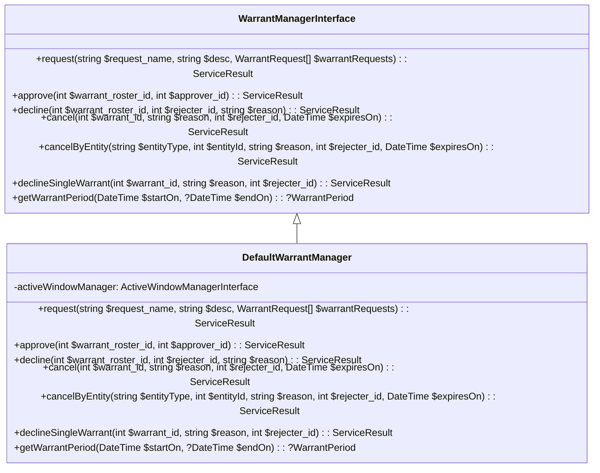
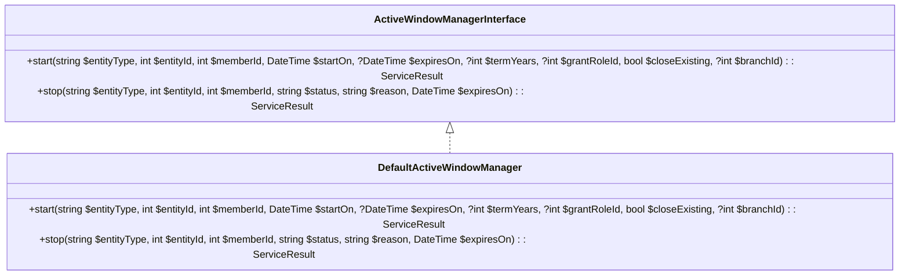
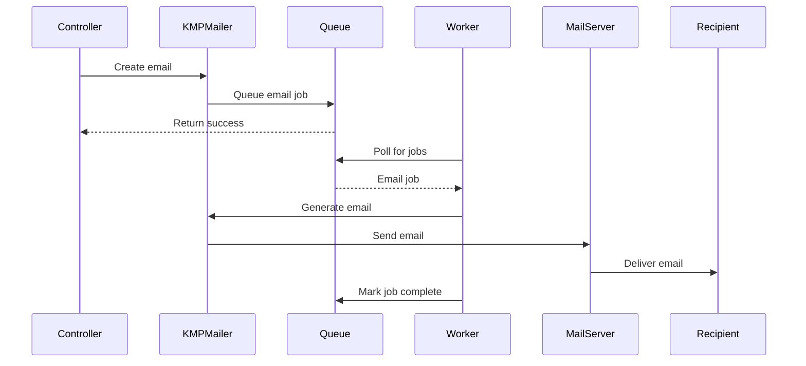

[← Back to Table of Contents](index.md)

# 6. Services

The services layer in KMP provides a bridge between controllers and models, encapsulating business logic and ensuring that application behavior remains consistent. This section documents the key services that power the Kingdom Management Portal.

## 6.1 WarrantManager

The WarrantManager service handles all aspects of warrant creation, validation, and lifecycle management.

### Purpose

This service centralizes warrant-related business logic to ensure consistent handling of warrants across the application, regardless of which controller or plugin is working with them.

### Core Functionality



### Key Methods

#### Requesting Warrants

```php
// Example of creating warrant requests through the service
$requests = [
    new WarrantRequest(
        'Branch Herald',
        'Branches',
        $branchId,
        $requesterId,
        $memberId,
        new DateTime('2025-01-01'),
        new DateTime('2025-12-31')
    ),
    new WarrantRequest(
        'Deputy Seneschal',
        'Branches',
        $branchId,
        $requesterId,
        $anotherMemberId
    )
];

$result = $warrantManager->request(
    'Q1 2025 Officer Appointments',
    'Quarterly officer appointments for the branch',
    $requests
);

if ($result->success) {
    $rosterId = $result->data;
    echo "Warrant roster {$rosterId} created successfully";
} else {
    echo "Error: " . $result->getMessage();
}
```

#### Approving Warrant Rosters

```php
// Example of approving a warrant roster
$result = $warrantManager->approve($rosterId, $approverId);

if ($result->success) {
    echo "Warrant roster approved successfully";
} else {
    echo "Error: " . $result->getMessage();
}
```

#### Declining Warrant Rosters

```php
// Example of declining an entire warrant roster
$result = $warrantManager->decline(
    $rosterId, 
    $rejecterId, 
    'Insufficient documentation provided'
);

if ($result->success) {
    echo "Warrant roster declined";
} else {
    echo "Error: " . $result->getMessage();
}
```

### Events

The WarrantManager delegates lifecycle management to the ActiveWindowManager for warrant start/stop operations but does not dispatch custom events itself. The warrant lifecycle is driven by direct method calls (`request`, `approve`, `decline`, `cancel`) that return `ServiceResult` objects, rather than through the event system.

## 6.2 ActiveWindowManager

The ActiveWindowManager service provides functionality for handling entities with effective date ranges, ensuring that only records valid within a specific time window are considered "active."

### Purpose

Many entities in KMP (warrants, authorizations, etc.) have start and end dates that determine when they're active. This service provides a consistent way to query and manage these date-bounded entities.

### Core Functionality



### Key Methods

#### Starting Active Windows

```php
// Start a member role with automatic closure of existing roles
$result = $activeWindowManager->start(
    'MemberRoles',
    $roleId,
    $approverId,
    new DateTime('2025-01-01'),
    new DateTime('2025-12-31'),
    null,
    $seneschalRoleId,  // Grant role ID
    true,              // Close existing
    $branchId
);

if ($result->success) {
    echo "Active window started successfully";
} else {
    echo "Error: " . $result->getMessage();
}
```

#### Stopping Active Windows

```php
// Stop a member role due to resignation
$result = $activeWindowManager->stop(
    'MemberRoles',
    $roleId,
    $managerId,
    'deactivated',
    'Officer resigned position',
    DateTime::now()
);

if ($result->success) {
    echo "Active window stopped successfully";
} else {
    echo "Error: " . $result->getMessage();
}
```

## 6.3 StaticHelpers

The StaticHelpers class provides utility methods that are used throughout the KMP application, with a focus on application settings management.

### Purpose

This service provides a static interface for common utility functions, particularly for accessing and managing application settings stored in the database.

### Core Functionality

```php
class StaticHelpers
{
    /**
     * Get an application setting
     * 
     * @param string $key Setting key
     * @param string|null $fallback Default value if setting not found
     * @param mixed $type Value type (string, int, bool, yaml, json)
     * @param mixed $required Create setting if it doesn't exist
     * @return mixed The setting value
     */
    public static function getAppSetting(string $key, ?string $fallback = null, $type = null, $required = false): mixed;
    
    /**
     * Set an application setting
     * 
     * @param string $key Setting key
     * @param mixed $value Setting value
     * @param mixed $type Value type (string, int, bool, yaml, json)
     * @param mixed $required Create setting if it doesn't exist
     * @return bool Success
     */
    public static function setAppSetting(string $key, $value, $type = null, $required = false): bool;
    
    /**
     * Get all settings that start with a prefix
     * 
     * @param string $prefix Setting key prefix
     * @return array Settings with the given prefix
     */
    public static function getAppSettingsStartWith(string $prefix): array;
    
    // Other utility methods...
}
```

### Usage Examples

#### Managing Application Settings

```php
// Get a setting with a default value
$siteTitle = StaticHelpers::getAppSetting('KMP.ShortSiteTitle', 'KMP');

// Create or update a setting
StaticHelpers::setAppSetting(
    'Email.SystemEmailFromAddress', 
    'no-reply@example.com',
    'string',
    true
);

// Get all email-related settings
$emailSettings = StaticHelpers::getAppSettingsStartWith('Email.');
```

#### YAML Settings

```php
// Store structured data as YAML
$branchTypes = ['Kingdom', 'Principality', 'Barony', 'Shire'];
StaticHelpers::setAppSetting(
    'Branches.Types',
    $branchTypes,
    'yaml',
    true
);

// Retrieve and use YAML data
$types = StaticHelpers::getAppSetting('Branches.Types');
foreach ($types as $type) {
    echo "Branch type: $type
";
}
```

## 6.4 Email

The Email service manages all outgoing email communications from the KMP application, providing consistent templates and delivery handling.

### Purpose

This service centralizes email generation and sending, ensuring that all communications have a consistent look and feel and providing reliable delivery with logging and failure handling.

### Core Components

#### KMPMailer

The `KMPMailer` class extends CakePHP's `Mailer` class to provide KMP-specific email functionality:

```php
class KMPMailer extends Mailer
{
    protected AppSettingsTable $appSettings;
    
    public function __construct()
    {
        parent::__construct();
        $this->appSettings = $this->getTableLocator()->get('AppSettings');
    }
    
    public function resetPassword($to, $url): void
    {
        $sendFrom = StaticHelpers::getAppSetting('Email.SystemEmailFromAddress');
        $this->setTo($to)
            ->setFrom($sendFrom)
            ->setSubject('Reset password')
            ->setViewVars([
                'email' => $to,
                'passwordResetUrl' => $url,
                'siteAdminSignature' => StaticHelpers::getAppSetting('Email.SiteAdminSignature'),
            ]);
    }
    
    public function mobileCard($to, $url): void
    {
        // Configuration for mobile card emails
    }
    
    public function newRegistration($to, $url, $sca_name): void
    {
        // Configuration for new member registration emails
    }
    
    public function notifyOfWarrant(
        string $to,
        string $memberScaName,
        string $warrantName,
        string $warrantStart,
        string $warrantExpires,
    ): void {
        // Configuration for warrant notification emails
    }
    
    // Other email types...
}
```

#### Email Templates

Email templates are stored in `templates/email/` and use the same view system as web pages, allowing for consistent styling and layout.

### Email Flow



### Usage Examples

#### Sending Password Reset Emails

```php
// In a controller action
$mailer = new KMPMailer();
$mailer->resetPassword(
    $user->email_address,
    Router::url([
        'controller' => 'Members',
        'action' => 'resetPassword',
        $token
    ], true)
);
$mailer->deliver();
```

#### Queuing Emails for Background Processing

```php
// In a controller action
$emailJob = [
    'to' => $user->email_address,
    'template' => 'newMember',
    'vars' => [
        'member' => $member->toArray()
    ]
];

// Add to queue for background processing
$this->getTableLocator()
    ->get('Queue.QueuedJobs')
    ->createJob(
        'Email',
        $emailJob,
        ['priority' => 5]
    );
```

### Email Configuration

Email settings are managed through the `app_settings` table:

- `Email.SystemEmailFromAddress`: Default sender address
- `Email.SiteAdminSignature`: Signature used in administrative emails
- `Email.EnableQueue`: Whether to queue emails for background processing
- `Email.HeaderImage`: Image to use in email headers

## 6.5 Additional Services

The KMP application includes several other specialized services:

### ServiceResult

The `ServiceResult` class provides a standardized response pattern for all service layer operations:

```php
class ServiceResult
{
    public bool $success;
    public string $reason;
    public mixed $data;
    
    public function __construct(bool $success, string $reason = '', $data = null)
    {
        $this->success = $success;
        $this->reason = $reason;
        $this->data = $data;
    }
}
```

**Usage Example:**
```php
$result = $service->performOperation();
if ($result->success) {
    $data = $result->data;
    // Handle success
} else {
    $this->Flash->error($result->reason);
}
```

### NavigationService

Handles dynamic navigation menu generation and user-based menu item visibility:

```php
class NavigationService
{
    public function getNavigationItems(Member $user, array $params = []): array;
    public function processBadgeValue($badgeConfig): int;
    public function shouldDisplayNavItem(array $navItem, Member $user): bool;
}
```

### CsvExportService

Provides streaming CSV export functionality for data tables and reports. Uses output buffering to efficiently handle large datasets without loading them entirely into memory.

**Location:** `app/src/Services/CsvExportService.php`

**Core Method:**
```php
/**
 * Stream CSV data directly to the response output
 *
 * @param array $data Array of data rows to export
 * @param array $columns Column definitions for CSV headers
 * @param resource $output Output stream (typically php://output)
 * @return void
 */
public function outputCsv(array $data, array $columns, $output): void;
```

**Usage Example:**
```php
use App\Services\CsvExportService;

public function export(CsvExportService $csvExportService)
{
    $data = $this->MyTable->find()->all()->toArray();
    $columns = ['id', 'name', 'email', 'created'];
    
    $response = $this->response
        ->withType('csv')
        ->withHeader('Content-Disposition', 'attachment; filename="export.csv"');
    
    $stream = fopen('php://output', 'w');
    $csvExportService->outputCsv($data, $columns, $stream);
    
    return $response;
}
```

For integration with the DataverseGrid system, see [9.1 DataverseGrid System](9.1-dataverse-grid-system.md).

### AuthorizationService

Integrates with the CakePHP Authorization plugin to provide KMP-specific authorization logic.

### ViewCellRegistry

Manages dynamic view cell registration and rendering for modular UI components.

### ImpersonationService

**Location:** `app/src/Services/ImpersonationService.php`  
**DI Registration:** Registered in `Application::services()`

Manages admin impersonation sessions, storing original administrator identity in the session and enabling safe reversion while preventing cache leakage between identities.

**Key Methods:**
- `start(Session, int $targetId)` — Initiates impersonation, saving original admin details
- `stop(Session)` — Ends impersonation, restores original identity and clears caches
- `getState(Session)` — Retrieves current impersonation metadata
- `isActive(Session)` — Checks if an impersonation session is currently active

### ICalendarService

**Location:** `app/src/Services/ICalendarService.php`  
**DI Registration:** Registered in `Application::services()`

Generates RFC 5545 iCalendar (.ics) files for gatherings, supporting both single-event downloads and multi-event subscription feeds with timezone support.

**Key Methods:**
- `generateICalendar(Gathering)` — Creates a `.ics` file for a single gathering
- `generateFeed(array $gatherings)` — Creates a multi-event calendar feed
- `getFilename(Gathering)` — Generates a safe calendar filename

### RetentionPolicyService

**Location:** `app/src/Services/RetentionPolicyService.php`

Calculates document retention dates based on JSON retention policy definitions. Supports anchor types (`gathering_end_date`, `upload_date`, `permanent`) and configurable duration fields.

**Key Methods:**
- `calculateRetentionDate(array $policy, ?Date $anchorDate)` — Computes retention date from policy
- `validatePolicy(array $policy)` — Validates JSON policy structure
- `isExpired(array $policy, ?Date $anchorDate)` — Checks if a retention date has passed
- `getHumanReadableDescription(array $policy)` — Returns user-friendly policy description

### DocumentService

**Location:** `app/src/Services/DocumentService.php`

Centralized document management for uploads, storage, and retrieval. Uses a Flysystem abstraction layer supporting both local filesystem and Azure Blob Storage adapters.

**Key Methods:**
- `createDocument(UploadedFile, string $entityType, ?int $entityId)` — Handles file upload and storage
- `getDocumentDownloadResponse(Document)` — Streams document to client
- `getDocumentPreviewResponse(Document)` — Returns preview image
- `deleteDocument(Document)` — Removes document and preview from storage
- `updateDocumentEntityId(Document, int $entityId)` — Links document to entity

### MailerDiscoveryService

**Location:** `app/src/Services/MailerDiscoveryService.php`

Discovers all Mailer classes in the application and plugins using PHP reflection. Analyzes public methods, extracts parameters and view variables for the email template management system.

**Key Methods:**
- `discoverAllMailers()` — Finds all Mailer classes (core and plugins)
- `getMailerInfo(string $class)` — Returns analyzed info for a specific mailer class
- `getMailerMethodInfo(string $class, string $method)` — Extracts method details (params, view vars, subject)

### EmailTemplateRendererService

**Location:** `app/src/Services/EmailTemplateRendererService.php`

Renders email templates with variable substitution, converting Markdown HTML templates to email-friendly HTML. Supports `{{variable}}` and `${variable}` placeholder syntax.

**Key Methods:**
- `renderTemplate(EmailTemplate, array $variables)` — Replaces variable placeholders with values
- `renderSubject(EmailTemplate, array $variables)` — Renders subject line from template
- `renderHtml(EmailTemplate, array $variables)` — Converts Markdown template to HTML
- `renderText(EmailTemplate, array $variables)` — Renders plain text version
- `preview(EmailTemplate)` — Shows preview with sample data

### GridViewService

**Location:** `app/src/Services/GridViewService.php`

Manages saved grid views with a resolution priority chain: explicit view → user default → system default. Provides CRUD operations with ownership validation.

**Key Methods:**
- `getEffectiveView(string $gridId, ?int $memberId, ?int $viewId)` — Resolves view by priority chain
- `getViewsForGrid(string $gridId, int $memberId)` — Lists all available views for a grid
- `createView(array $data)` / `updateView(int $id, array $data)` / `deleteView(int $id)` — CRUD operations
- `setUserDefault(string $gridId, int $memberId, int $viewId)` — Sets user's preferred view
- `createSystemDefault(array $data)` — Creates admin-only system default views

### PdfProcessingService

**Location:** `app/src/Services/PdfProcessingService.php`

Handles PDF file operations including validation, page counting, merging, and thumbnail generation using pure PHP libraries (no external binaries required).

**Key Methods:**
- `validatePdf(string $filePath)` — Validates file structure and magic bytes
- `getPageCount(string $filePath)` — Returns page count
- `mergePdfs(array $filePaths)` — Combines multiple PDFs into one
- `generateThumbnail(string $filePath)` — Creates placeholder thumbnail image

### ImageToPdfConversionService

**Location:** `app/src/Services/ImageToPdfConversionService.php`

Converts image files (JPEG, PNG, GIF, BMP, WEBP) to PDF documents, maintaining aspect ratio and fitting to standard page sizes. Supports both single and multi-image conversion.

**Key Methods:**
- `convertImageToPdf(string $imagePath)` — Converts a single image to PDF
- `convertMultipleImagesToPdf(array $imagePaths)` — Creates multi-page PDF from images
- `convertMixedToPdf(array $filePaths)` — Handles mixed image/PDF input files
- `isSupportedImage(string $path)` — Checks if file format is supported

### OpenApiMergeService

**Location:** `app/src/Services/OpenApiMergeService.php`

Deep-merges the base OpenAPI specification with plugin-provided YAML fragments (paths, tags, schemas) into a single unified spec for Swagger UI documentation.

**Key Methods:**
- `getMergedSpec()` — Returns the complete merged OpenAPI specification array

### ApiDataRegistry

**Location:** `app/src/Services/ApiDataRegistry.php`

Static registry allowing plugins to register callbacks that inject additional data into API detail response endpoints. Enables plugins to augment core API responses without modifying core controllers.

**Key Methods:**
- `register(string $controller, string $action, callable $callback, string $name)` — Register a data provider callback
- `collect(string $controller, string $action, Entity $entity)` — Gathers data from all matching providers
- `getRegisteredSources(string $controller, string $action)` — Lists registered provider names

---

## Related Documentation

- **[6.2 Authorization Helpers](6.2-authorization-helpers.md)** - getBranchIdsForAction() and permission helper methods
- **[6.3 Email Template Management](6.3-email-template-management.md)** - Database-driven email template system
- **[4.4 RBAC Security Architecture](4.4-rbac-security-architecture.md)** - Complete authorization system documentation

[← Back to Table of Contents](index.md)
