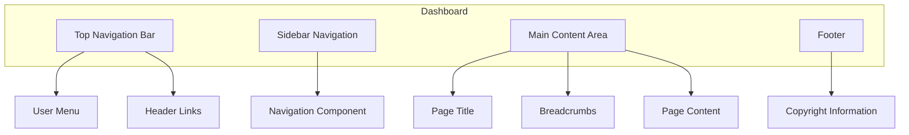
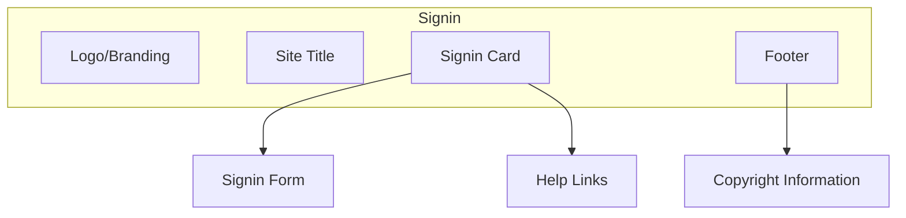
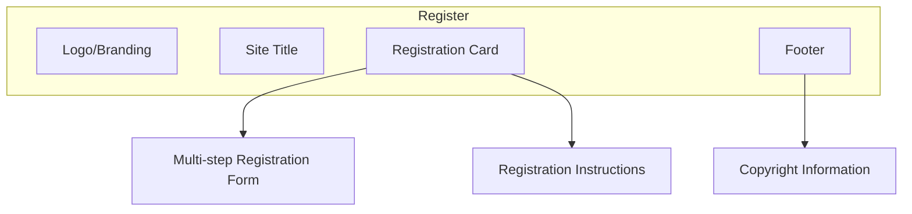
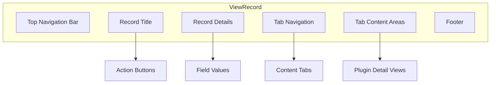

# 6. UI Components

This section documents the user interface components and patterns used throughout the Kingdom Management Portal application. Understanding these components is essential for maintaining a consistent look and feel across the application.

## 6.1 Layouts

KMP uses several layout templates to provide consistent structure for different parts of the application. These layouts are based on Twitter Bootstrap 5 and provide responsive design across desktop and mobile devices.

### Dashboard Layout

The primary layout for authenticated users is the dashboard layout, which includes the following elements:



Key features of the dashboard layout:
- Dark-themed top navigation bar with branding
- Collapsible sidebar navigation
- Session timeout monitoring and extension
- Responsive design that adapts to screen size

#### Usage Example

```php
// In a controller action or template file
$this->viewBuilder()->setLayout('TwitterBootstrap/dashboard');
```

### Signin Layout

A specialized layout for authentication screens:



#### Usage Example

```php
// In a controller action or template file
$this->viewBuilder()->setLayout('TwitterBootstrap/signin');
```

### Register Layout

Similar to the signin layout but optimized for registration forms:



### View Record Layout

A specialized layout for viewing entity records:



This layout uses content blocks to organize the record display:
- `recordTitle`: The title of the record being viewed
- `recordActions`: Action buttons for the record
- `recordDetails`: The main details display
- `tabButtons`: Tab navigation buttons
- `tabContent`: Content for each tab

## 6.2 View Helpers

KMP extends CakePHP's helper system with custom helpers that provide reusable UI functionality.

### KMP Helper

The `KmpHelper` is the primary helper for KMP-specific UI elements and functionality.

#### Block Management

```php
// Start a content block
echo $this->KMP->startBlock("blockName");
// Output content
echo "Content for the block";
// End the block
$this->KMP->endBlock();
```

#### Application Settings

```php
// Get an application setting with a default fallback
$siteTitle = $this->KMP->getAppSetting("KMP.ShortSiteTitle", "KMP");

// Get all settings with a specific prefix
$headerLinks = $this->KMP->getAppSettingsStartWith("KMP.HeaderLink.");
```

#### UI Elements

```php
// Create an autocomplete input
echo $this->KMP->autocomplete("fieldName", $options, [
    'label' => 'Select an option',
    'placeholder' => 'Start typing...'
]);

// Create a CSV export link
echo $this->KMP->csvButton("Export to CSV", [
    'controller' => 'Reports',
    'action' => 'export'
]);
```

### Bootstrap Helpers

KMP includes several helpers from the Bootstrap plugin:

#### Modal Helper

For creating modal dialogs:

```php
echo $this->Modal->create([
    'id' => 'confirmModal',
    'title' => 'Confirm Action',
    'class' => 'modal-dialog-centered',
]);

echo $this->Modal->body('Are you sure you want to perform this action?');

echo $this->Modal->footer([
    $this->Form->button('Cancel', ['data-bs-dismiss' => 'modal']),
    $this->Form->button('Confirm', ['class' => 'btn-danger'])
]);

echo $this->Modal->end();
```

#### Navbar Helper

For building navigation bars:

```php
echo $this->Navbar->create();
echo $this->Navbar->beginBrand();
echo $this->Html->link($this->Html->image('logo.png'), '/', ['class' => 'navbar-brand', 'escape' => false]);
echo $this->Navbar->endBrand();
echo $this->Navbar->end();
```

### Icon Helpers

KMP provides helpers for rendering icons:

```php
// Render a Bootstrap icon
echo $this->Icon->render('person-fill');

// Render an icon with additional attributes
echo $this->Icon->render('calendar', ['class' => 'text-primary me-2']);

// Render an icon snippet (icon with text)
echo $this->IconSnippet->render('info-circle', 'Information');
```

## 6.3 Frontend Libraries

KMP uses several JavaScript libraries and patterns to provide rich client-side functionality.

### Stimulus Controllers

KMP uses Stimulus.js for JavaScript behavior. Key controllers include:

#### Session Extender

Monitors session activity and prompts for session extension:

```html
<body data-controller="session-extender"
      data-session-extender-url-value="/keepalive">
    <!-- Page content -->
</body>
```

#### Autocomplete

Provides typeahead search functionality:

```html
<div data-controller="autocomplete">
    <input type="text" 
           data-autocomplete-target="input" 
           data-action="autocomplete#search">
    <div data-autocomplete-target="results"></div>
</div>
```

#### Detail Tabs

Manages tab navigation in record view pages:

```html
<div data-controller="detail-tabs">
    <ul class="nav nav-tabs">
        <li class="nav-item">
            <a class="nav-link active" data-bs-toggle="tab" href="#tab1">Tab 1</a>
        </li>
        <li class="nav-item">
            <a class="nav-link" data-bs-toggle="tab" href="#tab2">Tab 2</a>
        </li>
    </ul>
    <div class="tab-content">
        <div id="tab1" class="tab-pane active">Tab 1 content</div>
        <div id="tab2" class="tab-pane">Tab 2 content</div>
    </div>
</div>
```

### UI Patterns

Common UI patterns used throughout the application:

#### Data Tables

Tables with sorting, pagination, and filtering:

```html
<div data-controller="data-table">
    <div class="mb-3">
        <input type="text" 
               data-data-table-target="filter" 
               data-action="input->data-table#filter"
               placeholder="Filter results...">
    </div>
    <table class="table table-striped">
        <thead>
            <tr>
                <th data-action="click->data-table#sort" data-sort-key="name">Name</th>
                <th data-action="click->data-table#sort" data-sort-key="date">Date</th>
                <th>Actions</th>
            </tr>
        </thead>
        <tbody data-data-table-target="body">
            <!-- Table rows go here -->
        </tbody>
    </table>
    <div data-data-table-target="pagination"></div>
</div>
```

#### Form Handling

Progressive enhancement for form submissions:

```html
<form data-controller="form-handler" 
      data-action="submit->form-handler#submit">
    <!-- Form fields -->
    <button type="submit" data-form-handler-target="submitButton">Submit</button>
    <div data-form-handler-target="spinner" class="d-none">
        <div class="spinner-border spinner-border-sm"></div>
        Processing...
    </div>
</form>
```

#### Toast Notifications

Non-intrusive notifications for user feedback:

```html
<div data-controller="toasts">
    <div class="toast-container position-fixed top-0 end-0 p-3">
        <div class="toast" data-toasts-target="template">
            <div class="toast-header">
                <strong class="me-auto" data-toasts-target="title">Title</strong>
                <button type="button" class="btn-close" data-bs-dismiss="toast"></button>
            </div>
            <div class="toast-body" data-toasts-target="message">
                Message
            </div>
        </div>
    </div>
</div>
```

### Asset Management

KMP uses Laravel Mix (via the AssetMix plugin) for asset compilation and versioning:

```php
// In a template file
echo $this->AssetMix->css('app');
echo $this->AssetMix->js('app');

// For versioned assets with cache busting
echo $this->AssetMix->css('app', ['version' => true]);
```

The asset compilation process is defined in `webpack.mix.js` in the application root.
