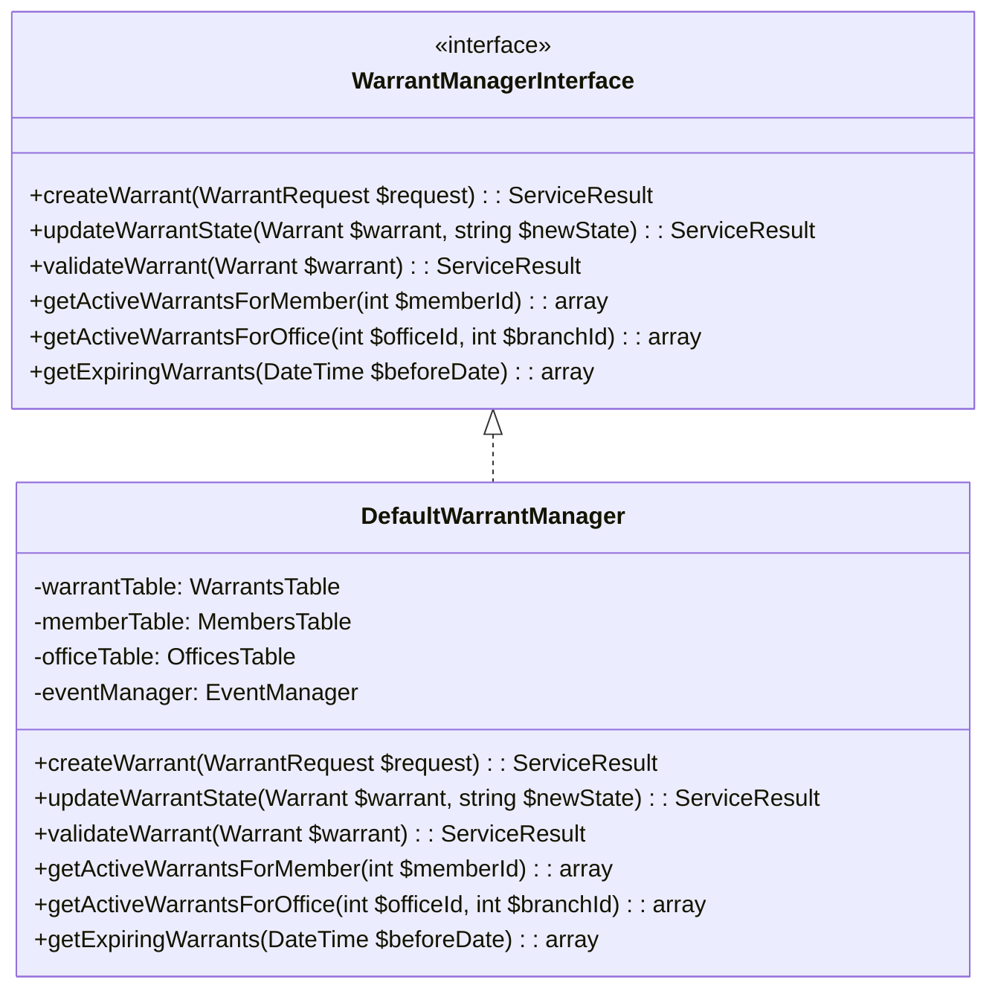
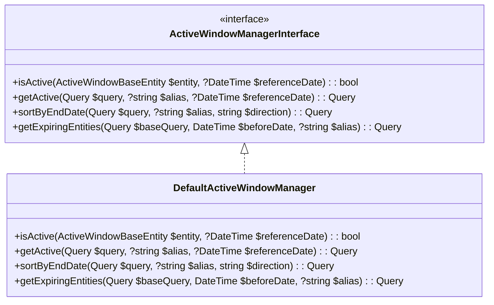
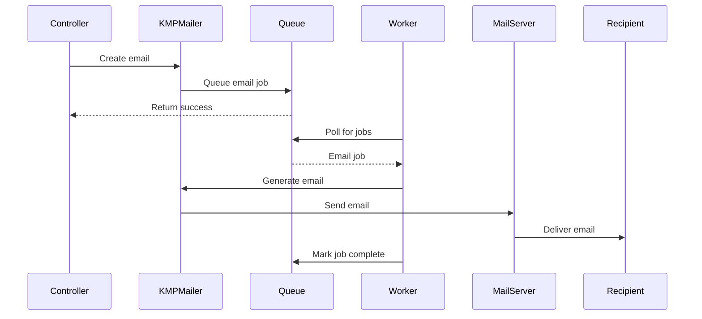

# 7. Services

The services layer in KMP provides a bridge between controllers and models, encapsulating business logic and ensuring that application behavior remains consistent. This section documents the key services that power the Kingdom Management Portal.

## 7.1 WarrantManager

The WarrantManager service handles all aspects of warrant creation, validation, and lifecycle management.

### Purpose

This service centralizes warrant-related business logic to ensure consistent handling of warrants across the application, regardless of which controller or plugin is working with them.

### Core Functionality



### Key Methods

#### Creating Warrants

```php
// Example of creating a warrant through the service
$request = new WarrantRequest();
$request->memberId = 123;
$request->officeId = 456;
$request->branchId = 789;
$request->startDate = new DateTime('2025-05-01');
$request->endDate = new DateTime('2026-04-30');
$request->state = Warrant::STATE_PENDING;

$result = $warrantManager->createWarrant($request);

if ($result->success) {
    $warrant = $result->getData('warrant');
    echo "Warrant {$warrant->id} created successfully";
} else {
    echo "Error: " . $result->getMessage();
}
```

#### Updating Warrant States

```php
// Example of updating a warrant's state
$result = $warrantManager->updateWarrantState($warrant, Warrant::STATE_ACTIVE);

if ($result->success) {
    echo "Warrant activated successfully";
} else {
    echo "Error: " . $result->getMessage();
}
```

### Events

The WarrantManager dispatches events at key points in a warrant's lifecycle:

- `Warrant.beforeCreate`: Before a new warrant is created
- `Warrant.afterCreate`: After a warrant is successfully created
- `Warrant.beforeStateChange`: Before a warrant's state changes
- `Warrant.afterStateChange`: After a warrant's state has changed
- `Warrant.beforeValidate`: Before warrant validation
- `Warrant.afterValidate`: After warrant validation

## 7.2 ActiveWindowManager

The ActiveWindowManager service provides functionality for handling entities with effective date ranges, ensuring that only records valid within a specific time window are considered "active."

### Purpose

Many entities in KMP (warrants, authorizations, etc.) have start and end dates that determine when they're active. This service provides a consistent way to query and manage these date-bounded entities.

### Core Functionality



### Key Methods

#### Checking if an Entity is Active

```php
// Check if a warrant is currently active
$isActive = $activeWindowManager->isActive($warrant);

// Check if a warrant was active on a specific date
$wasActive = $activeWindowManager->isActive(
    $warrant, 
    new DateTime('2025-01-15')
);
```

#### Querying Active Entities

```php
// Get all currently active warrants
$activeWarrants = $activeWindowManager->getActive(
    $warrantsTable->find()
)->all();

// Get warrants that will expire in the next 30 days
$expiringWarrants = $activeWindowManager->getExpiringEntities(
    $warrantsTable->find(),
    (new DateTime())->modify('+30 days')
)->all();
```

## 7.3 StaticHelpers

The StaticHelpers class provides utility methods that are used throughout the KMP application, with a focus on application settings management.

### Purpose

This service provides a static interface for common utility functions, particularly for accessing and managing application settings stored in the database.

### Core Functionality

```php
class StaticHelpers
{
    /**
     * Get an application setting
     * 
     * @param string $key Setting key
     * @param mixed $fallback Default value if setting not found
     * @param string|null $type Value type (string, int, bool, yaml, json)
     * @param bool $create Create setting if it doesn't exist
     * @return mixed The setting value
     */
    public static function getAppSetting(string $key, $fallback = null, ?string $type = null, bool $create = false);
    
    /**
     * Set an application setting
     * 
     * @param string $key Setting key
     * @param mixed $value Setting value
     * @param string|null $type Value type (string, int, bool, yaml, json)
     * @param bool $create Create setting if it doesn't exist
     * @return bool Success
     */
    public static function setAppSetting(string $key, $value, ?string $type = null, bool $create = false): bool;
    
    /**
     * Get all settings that start with a prefix
     * 
     * @param string $prefix Setting key prefix
     * @return array Settings with the given prefix
     */
    public static function getAppSettingsStartWith(string $prefix): array;
    
    // Other utility methods...
}
```

### Usage Examples

#### Managing Application Settings

```php
// Get a setting with a default value
$siteTitle = StaticHelpers::getAppSetting('KMP.ShortSiteTitle', 'KMP');

// Create or update a setting
StaticHelpers::setAppSetting(
    'Email.SystemEmailFromAddress', 
    'no-reply@example.com',
    'string',
    true
);

// Get all email-related settings
$emailSettings = StaticHelpers::getAppSettingsStartWith('Email.');
```

#### YAML Settings

```php
// Store structured data as YAML
$branchTypes = ['Kingdom', 'Principality', 'Barony', 'Shire'];
StaticHelpers::setAppSetting(
    'Branches.Types',
    $branchTypes,
    'yaml',
    true
);

// Retrieve and use YAML data
$types = StaticHelpers::getAppSetting('Branches.Types');
foreach ($types as $type) {
    echo "Branch type: $type\n";
}
```

## 7.4 Email

The Email service manages all outgoing email communications from the KMP application, providing consistent templates and delivery handling.

### Purpose

This service centralizes email generation and sending, ensuring that all communications have a consistent look and feel and providing reliable delivery with logging and failure handling.

### Core Components

#### KMPMailer

The `KMPMailer` class extends CakePHP's `Mailer` class to provide KMP-specific email functionality:

```php
class KMPMailer extends Mailer
{
    protected AppSettingsTable $appSettings;
    
    public function __construct()
    {
        parent::__construct();
        $this->appSettings = $this->getTableLocator()->get('AppSettings');
    }
    
    public function resetPassword($to, $url)
    {
        $sendFrom = StaticHelpers::getAppSetting('Email.SystemEmailFromAddress');
        $this->setTo($to)
            ->setFrom($sendFrom)
            ->setSubject('Reset password')
            ->setViewVars([
                'email' => $to,
                'passwordResetUrl' => $url,
                'siteAdminSignature' => StaticHelpers::getAppSetting('Email.SiteAdminSignature'),
            ]);
    }
    
    public function mobileCard($to, $url)
    {
        // Configuration for mobile card emails
    }
    
    public function newMember($to, $member)
    {
        // Configuration for new member notification emails
    }
    
    // Other email types...
}
```

#### Email Templates

Email templates are stored in `templates/email/` and use the same view system as web pages, allowing for consistent styling and layout.

### Email Flow



### Usage Examples

#### Sending Password Reset Emails

```php
// In a controller action
$mailer = new KMPMailer();
$mailer->resetPassword(
    $user->email_address,
    Router::url([
        'controller' => 'Members',
        'action' => 'resetPassword',
        $token
    ], true)
);
$mailer->deliver();
```

#### Queuing Emails for Background Processing

```php
// In a controller action
$emailJob = [
    'to' => $user->email_address,
    'template' => 'newMember',
    'vars' => [
        'member' => $member->toArray()
    ]
];

// Add to queue for background processing
$this->getTableLocator()
    ->get('Queue.QueuedJobs')
    ->createJob(
        'Email',
        $emailJob,
        ['priority' => 5]
    );
```

### Email Configuration

Email settings are managed through the `app_settings` table:

- `Email.SystemEmailFromAddress`: Default sender address
- `Email.SiteAdminSignature`: Signature used in administrative emails
- `Email.EnableQueue`: Whether to queue emails for background processing
- `Email.HeaderImage`: Image to use in email headers