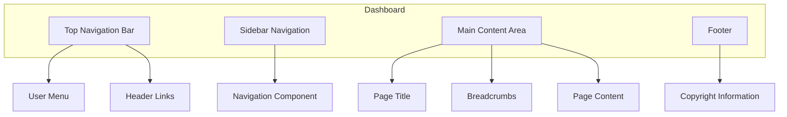
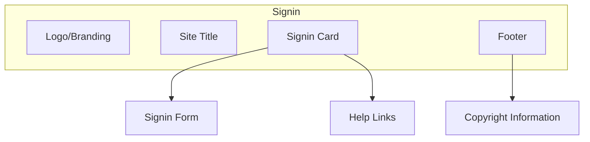
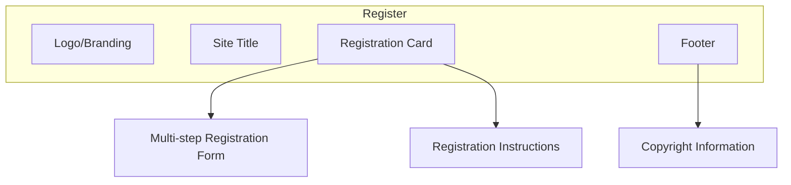
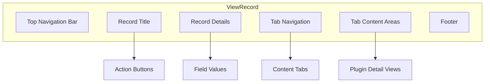

[← Back to Table of Contents](index.md)

# 9. UI Components

This section documents the user interface components and patterns used throughout the Kingdom Management Portal application. Understanding these components is essential for maintaining a consistent look and feel across the application.

## 9.1 Layouts

KMP uses several layout templates to provide consistent structure for different parts of the application. These layouts are based on Twitter Bootstrap 5 and provide responsive design across desktop and mobile devices.

### Dashboard Layout

The primary layout for authenticated users is the dashboard layout, which includes the following elements:



Key features of the dashboard layout:
- Dark-themed top navigation bar with branding
- Collapsible sidebar navigation
- Session timeout monitoring and extension
- Responsive design that adapts to screen size

#### Usage Example

```php
// In a controller action or template file
$this->viewBuilder()->setLayout('TwitterBootstrap/dashboard');
```

### Signin Layout

A specialized layout for authentication screens:



#### Usage Example

```php
// In a controller action or template file
$this->viewBuilder()->setLayout('TwitterBootstrap/signin');
```

### Register Layout

Similar to the signin layout but optimized for registration forms:



### View Record Layout

A specialized layout for viewing entity records:



This layout uses content blocks to organize the record display:
- `recordTitle`: The title of the record being viewed
- `recordActions`: Action buttons for the record
- `recordDetails`: The main details display
- `tabButtons`: Tab navigation buttons
- `tabContent`: Content for each tab

## 9.2 View Helpers

KMP extends CakePHP's helper system with custom helpers that provide reusable UI functionality.

### KMP Helper

The `KmpHelper` is the primary helper for KMP-specific UI elements and functionality.

#### Block Management

```php
// Start a content block
echo $this->KMP->startBlock("blockName");
// Output content
echo "Content for the block";
// End the block
$this->KMP->endBlock();
```

#### Application Settings

```php
// Get an application setting with a default fallback
$siteTitle = $this->KMP->getAppSetting("KMP.ShortSiteTitle", "KMP");

// Get all settings with a specific prefix
$headerLinks = $this->KMP->getAppSettingsStartWith("KMP.HeaderLink.");
```

#### UI Elements

```php
// Create an autocomplete input
echo $this->KMP->autocomplete("fieldName", $options, [
    'label' => 'Select an option',
    'placeholder' => 'Start typing...'
]);

// Create a CSV export link
echo $this->KMP->csvButton("Export to CSV", [
    'controller' => 'Reports',
    'action' => 'export'
]);
```

### Bootstrap Helpers

KMP includes several helpers from the Bootstrap plugin:

#### Modal Helper

For creating modal dialogs:

```php
echo $this->Modal->create([
    'id' => 'confirmModal',
    'title' => 'Confirm Action',
    'class' => 'modal-dialog-centered',
]);

echo $this->Modal->body('Are you sure you want to perform this action?');

echo $this->Modal->footer([
    $this->Form->button('Cancel', ['data-bs-dismiss' => 'modal']),
    $this->Form->button('Confirm', ['class' => 'btn-danger'])
]);

echo $this->Modal->end();
```

#### Navbar Helper

For building navigation bars:

```php
echo $this->Navbar->create();
echo $this->Navbar->beginBrand();
echo $this->Html->link($this->Html->image('logo.png'), '/', ['class' => 'navbar-brand', 'escape' => false]);
echo $this->Navbar->endBrand();
echo $this->Navbar->end();
```

### Icon Helpers

KMP provides helpers for rendering icons:

```php
// Render a Bootstrap icon
echo $this->Icon->render('person-fill');

// Render an icon with additional attributes
echo $this->Icon->render('calendar', ['class' => 'text-primary me-2']);

// Render an icon snippet (icon with text)
echo $this->IconSnippet->render('info-circle', 'Information');
```

## 9.3 Frontend Libraries

KMP uses several JavaScript libraries and patterns to provide rich client-side functionality.

### Stimulus Controllers

KMP uses Stimulus.js for JavaScript behavior. Key controllers include:

#### Session Extender

Monitors session activity and prompts for session extension:

```html
<body data-controller="session-extender"
      data-session-extender-url-value="/keepalive">
    <!-- Page content -->
</body>
```

#### Autocomplete (`ac`)

Provides typeahead search functionality. The controller file is `auto-complete-controller.js` but is registered as `"ac"`:

```html
<div data-controller="ac">
    <input type="text" 
           data-ac-target="input" 
           data-action="ac#search">
    <div data-ac-target="results"></div>
</div>
```

#### Detail Tabs

Manages tab navigation in record view pages:

```html
<div data-controller="detail-tabs">
    <ul class="nav nav-tabs">
        <li class="nav-item">
            <a class="nav-link active" data-bs-toggle="tab" href="#tab1">Tab 1</a>
        </li>
        <li class="nav-item">
            <a class="nav-link" data-bs-toggle="tab" href="#tab2">Tab 2</a>
        </li>
    </ul>
    <div class="tab-content">
        <div id="tab1" class="tab-pane active">Tab 1 content</div>
        <div id="tab2" class="tab-pane">Tab 2 content</div>
    </div>
</div>
```

### UI Patterns

Common UI patterns used throughout the application:

#### Data Tables

KMP features a comprehensive data grid system called **DV Grid** (Dataverse Grid) that provides advanced data table functionality including:
- Server-side pagination, sorting, and filtering
- Saved and system views for quick access to commonly used filters
- CSV export functionality
- Column picker for showing/hiding columns
- Role-based access control
- Lazy loading for performance optimization

For a quick overview, see [9.1 Dataverse Grid System](9.1-dataverse-grid-system.md).

For comprehensive implementation details including column configuration, grid options, custom views, filtering, and the complete API reference, see [9.3 Dataverse Grid Complete Guide](9.3-dataverse-grid-complete-guide.md).

**Basic DV Grid Example:**

```php
// In your controller - use the DataverseGridTrait
use App\Controller\DataverseGridTrait;

class MembersController extends AppController
{
    use DataverseGridTrait;
    
    public function index()
    {
        $this->processDataverseGrid([
            'gridColumns' => \App\KMP\GridColumns\MembersGridColumns::class,
            'modelClass' => $this->Members,
        ]);
    }
}
```

```html
<!-- In your template -->
<?= $this->element("dv_grid", [
    "title" => "Members",
    "options" => ['canFilter' => true, 'canExportCsv' => true]
]) ?>
```

### Asset Management

KMP uses Laravel Mix (via the AssetMix plugin) for asset compilation and versioning:

```php
// In a template file
echo $this->AssetMix->css('app');
echo $this->AssetMix->js('app');

// For versioned assets with cache busting
echo $this->AssetMix->css('app', ['version' => true]);
```

The asset compilation process is defined in `webpack.mix.js` in the application root.

## 9.6 Mobile Card Menu System

### Overview

The Mobile Card Menu System extends the PWA mobile card with a plugin-based Floating Action Button (FAB) menu. This allows plugins to register mobile-optimized features and actions accessible directly from a member's mobile card.

### Architecture

**Components:**
1. **ViewCellRegistry** - Registers mobile menu items via `PLUGIN_TYPE_MOBILE_MENU` constant
2. **member-mobile-card-menu-controller.js** - Stimulus controller managing the FAB menu
3. **view_mobile_card.php** - Template with menu container and styling
4. **Plugin ViewCellProviders** - Register menu items in plugin view cell providers

**Flow:**
```
Plugin ViewCellProvider
    ↓
ViewCellRegistry (PLUGIN_TYPE_MOBILE_MENU)
    ↓
MembersController (viewMobileCard action)
    ↓
view_mobile_card.php template
    ↓
member-mobile-card-menu-controller (Stimulus)
    ↓
Rendered FAB Menu
```

### Plugin Integration

**Registering a Mobile Menu Item:**

```php
// In your plugin's ViewCellProvider
public static function getViewCells(array $urlParams, $user = null): array
{
    if (!StaticHelpers::pluginEnabled('YourPlugin')) {
        return [];
    }

    $cells = [];

    $cells[] = [
        'type' => ViewCellRegistry::PLUGIN_TYPE_MOBILE_MENU,
        'label' => 'Submit Waiver',              // Button text
        'icon' => 'bi-file-earmark-text',        // Bootstrap icon class
        'url' => '/waivers/mobile-submit',       // Target URL
        'order' => 10,                           // Display order (lower = higher)
        'color' => 'primary',                    // Bootstrap button color
        'badge' => null,                         // Optional: notification count
        'validRoutes' => [
            ['controller' => 'Members', 'action' => 'viewMobileCard', 'plugin' => null],
        ]
    ];

    return $cells;
}
```

**Menu Item Properties:**

| Property | Type | Required | Description |
|----------|------|----------|-------------|
| `type` | string | ✅ | Must be `ViewCellRegistry::PLUGIN_TYPE_MOBILE_MENU` |
| `label` | string | ✅ | Display text for the menu item |
| `icon` | string | ✅ | Bootstrap icon class (e.g., `bi-file-earmark-text`) |
| `url` | string | ✅ | Destination URL when menu item is clicked |
| `order` | int | ✅ | Sort order (lower numbers appear first) |
| `color` | string | ✅ | Bootstrap button color variant |
| `badge` | int\|null | ❌ | Optional notification badge count |
| `validRoutes` | array | ✅ | Routes where this menu item should appear |

**Available Bootstrap Colors:**
- `primary` (Blue), `secondary` (Gray), `success` (Green), `danger` (Red)
- `warning` (Yellow/Orange), `info` (Light blue), `light` (White), `dark` (Black)

**Common Bootstrap Icons:**
- `bi-file-earmark-text` - Document/waiver submission
- `bi-file-earmark-check` - Authorization/approval
- `bi-check-circle` - Approve/confirm
- `bi-plus-circle` - Add/create
- `bi-calendar-event` - Events/calendar

Full icon list: https://icons.getbootstrap.com/

### Examples

**Simple Action Button:**
```php
$cells[] = [
    'type' => ViewCellRegistry::PLUGIN_TYPE_MOBILE_MENU,
    'label' => 'My Profile',
    'icon' => 'bi-person-circle',
    'url' => '/members/mobile-profile',
    'order' => 5,
    'color' => 'secondary',
    'badge' => null,
    'validRoutes' => [
        ['controller' => 'Members', 'action' => 'viewMobileCard', 'plugin' => null],
    ]
];
```

**Action with Notification Badge:**
```php
$cells[] = [
    'type' => ViewCellRegistry::PLUGIN_TYPE_MOBILE_MENU,
    'label' => 'Approve Authorizations',
    'icon' => 'bi-check-circle',
    'url' => '/activities/mobile-approve-authorizations',
    'order' => 20,
    'color' => 'warning',
    'badge' => 5, // Shows "5" badge on button
    'validRoutes' => [
        ['controller' => 'Members', 'action' => 'viewMobileCard', 'plugin' => null],
    ]
];
```

### UI/UX Features

**Floating Action Button (FAB):**
- Fixed position at bottom-right of screen
- 56x56px circular button
- Rotates 90° when menu is open
- Smooth hover and click animations
- Accessible with ARIA labels

**Menu Panel:**
- Slides up from bottom with animation
- Full-width buttons with icons and labels
- Notification badges on right side
- Auto-closes when item clicked
- Can be closed by clicking FAB again
- Responsive on all mobile devices

**Styling:**
- Large touch targets (min 44x44px)
- Clear visual hierarchy
- Smooth animations (300ms)
- High contrast for readability
- Shadow effects for depth
- Respects Bootstrap theme colors

### Menu Display Order Guidelines

**Suggested order ranges by category:**
- **1-10**: Primary profile actions (view profile, edit profile)
- **10-20**: Authorization/approval actions
- **20-30**: Waiver/document actions
- **30-40**: Event/calendar actions
- **40-50**: Administrative actions
- **50+**: Settings and help

### Creating Mobile-Optimized Target Pages

**Guidelines for target pages:**
1. Use mobile-first layout (consider `mobile` layout or `ajax` for minimal layout)
2. Large touch targets (at least 44x44px for all interactive elements)
3. Simple forms with minimal input fields
4. Use native HTML5 input types (date, email, tel, etc.)
5. Show clear validation messages
6. Use large submit buttons

**Controller Example:**
```php
// In your controller action
$this->viewBuilder()->setLayout('mobile'); // Or 'ajax' for minimal layout
```

### Troubleshooting

**Menu Not Appearing:**
1. Check plugin is enabled: `StaticHelpers::pluginEnabled('YourPlugin')`
2. Verify route matches: `['controller' => 'Members', 'action' => 'viewMobileCard', 'plugin' => null]`
3. Check ViewCellProvider is registered in plugin bootstrap
4. Verify menu items JSON is valid in browser console

**Menu Items Not Rendering:**
1. Check JavaScript console for parsing errors
2. Verify all required properties are present
3. Ensure `order` is a number, not string
4. Check icon class is valid Bootstrap icon

**Testing Checklist:**
- [ ] FAB button appears on mobile card
- [ ] FAB rotates when clicked
- [ ] Menu slides in smoothly
- [ ] All menu items display correctly
- [ ] Icons render properly
- [ ] Badges show when present
- [ ] Links navigate correctly
- [ ] Menu closes after item click
- [ ] Responsive on various screen sizes
