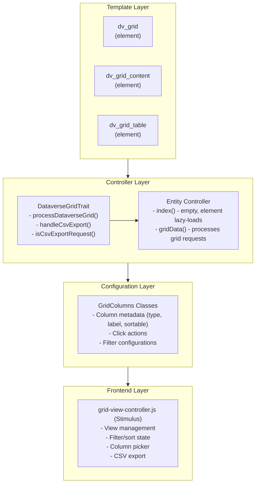

[← Back to UI Components](9-ui-components.md) | [← Back to Table of Contents](index.md)

# 9.1 Dataverse Grid System

The Dataverse Grid is KMP's modern data table system, inspired by Microsoft Power Apps Dataverse. It provides consistent, feature-rich data listings across all entity index pages with lazy-loading, filtering, sorting, column visibility, saved views, and CSV export.

## Overview

### Key Features

- **Lazy Loading**: Data loads via Turbo Frames for fast initial page render
- **Column Picker**: Users can show/hide columns and customize visibility
- **Saved Views**: Users can save filter/sort/column configurations as reusable views
- **Advanced Filtering**: Dropdown filters, search, and filter combinations
- **Sortable Columns**: Click-to-sort with ascending/descending/clear cycle
- **CSV Export**: Export current view data respecting filters, columns, and sort
- **Pagination**: Server-side pagination with configurable page sizes
- **URL State**: Bookmarkable URLs that preserve grid state

### Architecture Components



## Quick Start

### Adding Dataverse Grid to an Entity

#### 1. Create GridColumns Class

```php
<?php
declare(strict_types=1);

namespace App\KMP\GridColumns;

class EntityNameGridColumns extends BaseGridColumns
{
    public static function getColumns(): array
    {
        return [
            'id' => [
                'key' => 'id',
                'label' => 'ID',
                'type' => 'integer',
                'sortable' => true,
                'filterable' => false,
                'searchable' => false,
                'defaultVisible' => false,
            ],
            'name' => [
                'key' => 'name',
                'queryField' => 'EntityName.name',  // For SQL queries
                'renderField' => 'name',             // For entity property access
                'label' => 'Name',
                'type' => 'string',
                'sortable' => true,
                'filterable' => true,
                'searchable' => true,
                'defaultVisible' => true,
                'clickAction' => 'navigate:/entity-name/view/:id',
            ],
            'status' => [
                'key' => 'status',
                'label' => 'Status',
                'type' => 'string',
                'sortable' => true,
                'filterable' => true,
                'filterType' => 'dropdown',
                'filterOptions' => [
                    ['value' => 'active', 'label' => 'Active'],
                    ['value' => 'inactive', 'label' => 'Inactive'],
                ],
                'defaultVisible' => true,
            ],
            'created' => [
                'key' => 'created',
                'label' => 'Created',
                'type' => 'datetime',
                'sortable' => true,
                'filterable' => false,
                'defaultVisible' => false,
            ],
        ];
    }
}
```

#### 2. Add Trait and Method to Controller

```php
<?php
declare(strict_types=1);

namespace App\Controller;

use App\Controller\DataverseGridTrait;
use App\KMP\GridColumns\EntityNameGridColumns;
use App\Services\CsvExportService;

class EntityNameController extends AppController
{
    use DataverseGridTrait;

    public function initialize(): void
    {
        parent::initialize();
        $this->Authorization->authorizeModel('index', 'add', 'gridData');
    }

    public function index()
    {
        // Empty - dv_grid element lazy-loads via gridData
    }

    public function gridData(CsvExportService $csvExportService)
    {
        $result = $this->processDataverseGrid([
            'gridKey' => 'EntityName.index.main',
            'gridColumnsClass' => EntityNameGridColumns::class,
            'baseQuery' => $this->EntityName->find(),
            'tableName' => 'EntityName',
            'defaultSort' => ['EntityName.name' => 'asc'],
            'defaultPageSize' => 25,
            'showAllTab' => false,
            'canAddViews' => true,
            'canFilter' => true,
            'canExportCsv' => true,
        ]);

        // Handle CSV export
        if (!empty($result['isCsvExport'])) {
            return $this->handleCsvExport($result, $csvExportService, 'entity-name');
        }

        // Handle Turbo Frame responses
        $turboFrame = $this->request->getHeaderLine('Turbo-Frame');
        if ($turboFrame === 'entity-name-grid-table') {
            $this->set('data', $result['data']);
            $this->set('tableFrameId', 'entity-name-grid-table');
            $this->viewBuilder()->disableAutoLayout();
            $this->viewBuilder()->setTemplate('../element/dv_grid_table');
        } else {
            $this->set([
                'entityNames' => $result['data'],
                'gridState' => $result['gridState'],
            ]);
            $this->set('data', $result['data']);
            $this->set('frameId', 'entity-name-grid');
            $this->viewBuilder()->disableAutoLayout();
            $this->viewBuilder()->setTemplate('../element/dv_grid_content');
        }
    }
}
```

#### 3. Create Index Template

```php
<?php
// templates/EntityName/index.php
?>
<div class="entityNames index content">
    <h3><?= __('Entity Names') ?></h3>
    
    <?= $this->element('dv_grid', [
        'gridKey' => 'EntityName.index.main',
        'frameId' => 'entity-name-grid',
        'dataUrl' => $this->Url->build(['action' => 'gridData']),
    ]) ?>
</div>
```

## GridColumns Configuration

### Column Properties

| Property | Type | Description |
|----------|------|-------------|
| `key` | string | Unique column identifier |
| `queryField` | string | SQL field for queries (e.g., `Table.field`) |
| `renderField` | string | Entity property for rendering |
| `label` | string | Display label for column header |
| `type` | string | Data type: `string`, `integer`, `date`, `datetime`, `boolean` |
| `sortable` | boolean | Whether column can be sorted |
| `filterable` | boolean | Whether column can be filtered |
| `searchable` | boolean | Whether column is included in text search |
| `defaultVisible` | boolean | Whether column shows by default |
| `clickAction` | string | Action when clicking cell value |
| `filterType` | string | Filter UI type: `text`, `dropdown`, `date-range`, `is-populated` |
| `filterOptions` | array | Options for dropdown filters |
| `filterOptionsSource` | string\|array | Source for dynamic dropdown options (table/app-setting) |
| `cellRenderer` | string | Custom cell renderer element name |

### Click Actions

Click actions define what happens when a user clicks on a cell value:

```php
// Navigate to view page with entity ID
'clickAction' => 'navigate:/entity-name/view/:id',

// Navigate with different ID field
'clickAction' => 'navigate:/members/view/:member_id',

// Open modal (requires modal ID)
'clickAction' => 'modal:#edit-modal',

// Toggle sub-row expansion
'clickAction' => 'toggleSubRow',
```

### Filter Types

#### Dropdown Filter

```php
'filterType' => 'dropdown',
'filterOptions' => [
    ['value' => 'active', 'label' => 'Active'],
    ['value' => 'inactive', 'label' => 'Inactive'],
    ['value' => 'pending', 'label' => 'Pending'],
],
```

#### Is-Populated Filter

Use `filterType: is-populated` for fields where you want to filter based on whether the underlying value is present (non-NULL and not empty string).

```php
'has_membership_card' => [
    'key' => 'has_membership_card',
    'label' => 'Card',
    'type' => 'boolean',
    'filterable' => true,
    'filterType' => 'is-populated',
    // Optional: if the filter should check a different field than the column key
    'filterQueryField' => 'membership_card_path',
    'filterOptions' => [
        ['value' => 'yes', 'label' => 'Has Card'],
        ['value' => 'no', 'label' => 'No Card'],
    ],
],
```

Notes:
- Uses the `filterQueryField` (or `queryField`, or column key) to apply `IS NULL/IS NOT NULL` plus empty-string checks.
- This is treated like a dropdown-style filter in the UI.

#### Date Range Filter

```php
'filterType' => 'date-range',
'filterable' => true,
```

#### Text Search

```php
'searchable' => true,  // Include in global search
```

## Feature Flags

Control which features are available per grid:

```php
$result = $this->processDataverseGrid([
    // ... other options
    'showAllTab' => false,      // Show "All" tab in view selector
    'canAddViews' => true,      // Allow users to save custom views
    'canFilter' => true,        // Enable filtering UI
    'canExportCsv' => true,     // Enable CSV export button
]);
```

## Saved Views System

### View Resolution Priority

1. **Explicit view ID** - If `viewId` query parameter provided
2. **User's default view** - If user has set a default for this grid
3. **System default view** - If admin has created a system default
4. **Application fallback** - GridColumns defaults

### View Config Structure

```json
{
  "filters": [
    {"field": "status", "operator": "eq", "value": "active"}
  ],
  "sort": [
    {"field": "name", "direction": "asc"}
  ],
  "columns": [
    {"key": "name", "visible": true},
    {"key": "status", "visible": true},
    {"key": "created", "visible": false}
  ],
  "pageSize": 25
}
```

### Grid Key Convention

Format: `{Controller}.{action}.{slug}`

Examples:
- `Members.index.main`
- `Warrants.index.active`
- `Awards.index.overview`

## Stimulus Controller

### grid-view-controller.js

The frontend controller manages:
- View switching and saving
- Filter state and UI
- Sort state
- Column visibility
- CSV export triggering
- URL state management

### Key Actions

```javascript
// Switch to a different saved view
switchView(event)

// Save current state as new view
saveView(event)

// Update existing view with current state
updateView()

// Delete a saved view
deleteView()

// Set view as user's default
setDefault()

// Remove a specific filter
removeFilter(event)

// Clear all filters
clearAllFilters()

// Apply sort to column
applySort(event)

// Toggle column visibility
toggleColumn(event)

// Export current view as CSV
exportCsv()
```

### HTML Integration

```html
<div data-controller="grid-view"
     data-grid-view-grid-state-value='<?= json_encode($gridState) ?>'>
  
  <!-- View tabs -->
  <div data-grid-view-target="viewTabs">
    <button data-action="click->grid-view#switchView"
            data-view-id="123">My View</button>
  </div>
  
  <!-- Filter UI -->
  <input type="text" 
         data-grid-view-target="searchInput"
         data-action="input->grid-view#search">
  
  <!-- Column headers -->
  <th data-action="click->grid-view#applySort"
      data-column-key="name">Name</th>
      
  <!-- Export button -->
  <button data-action="click->grid-view#exportCsv">Export CSV</button>
</div>
```

## CSV Export

### Implementation

CSV export respects the current view configuration:
- Only exports visible columns
- Applies current filters and search
- Uses current sort order
- Includes column labels as headers

### Controller Pattern

```php
public function gridData(CsvExportService $csvExportService)
{
    $result = $this->processDataverseGrid([...]);

    // One-line CSV export handling
    if (!empty($result['isCsvExport'])) {
        return $this->handleCsvExport($result, $csvExportService, 'entity-name');
    }

    // ... rest of method
}
```

### Authorization

CSV export requires `canExport` permission in the table policy:

```php
// In EntityNameTablePolicy.php
public function canExport(KmpIdentityInterface $user, Table $entity): bool
{
    return $this->_hasPolicy($user, __FUNCTION__, $entity);
}
```

## Template Elements

### dv_grid Element

The outer wrapper that creates the lazy-loading Turbo Frame:

```php
<?= $this->element('dv_grid', [
    'gridKey' => 'EntityName.index.main',
    'frameId' => 'entity-name-grid',
    'dataUrl' => $this->Url->build(['action' => 'gridData']),
]) ?>
```

### dv_grid_content Element

Renders the full grid content including toolbar and table.

### dv_grid_table Element

Renders just the table for Turbo Frame updates (pagination, sorting).

## Existing Implementations

### Core Grids (Completed)

| Entity | GridColumns | Status |
|--------|-------------|--------|
| Members | `MembersGridColumns` | ✅ Complete |
| MemberRoles | `MemberRolesGridColumns` | ✅ Complete |
| Warrants | `WarrantsGridColumns` | ✅ Complete |
| WarrantRosters | `WarrantRostersGridColumns` | ✅ Complete |
| WarrantPeriods | `WarrantPeriodsGridColumns` | ✅ Complete |
| Branches | `BranchesGridColumns` | ✅ Complete |
| Roles | `RolesGridColumns` | ✅ Complete |
| Permissions | `PermissionsGridColumns` | ✅ Complete |
| AppSettings | `AppSettingsGridColumns` | ✅ Complete |
| EmailTemplates | `EmailTemplatesGridColumns` | ✅ Complete |
| Gatherings | `GatheringsGridColumns` | ✅ Complete |
| GatheringTypes | `GatheringTypesGridColumns` | ✅ Complete |
| GatheringActivities | `GatheringActivitiesGridColumns` | ✅ Complete |
| GatheringAttendances | `GatheringAttendancesGridColumns` | ✅ Complete |
| Departments | `DepartmentsGridColumns` | ✅ Complete |
| Levels | `LevelsGridColumns` | ✅ Complete |

### Plugin Grids

| Entity | Plugin | GridColumns | Status |
|--------|--------|-------------|--------|
| Awards | Awards | `AwardsGridColumns` | ✅ Complete |
| Recommendations | Awards | `RecommendationsGridColumns` | ✅ Complete |
| Officers | Officers | `OfficersGridColumns` | ✅ Complete |
| WaiverTypes | Waivers | `WaiverTypesGridColumns` | ✅ Complete |

## Field Naming Convention

### queryField vs renderField

The grid system uses semantic separation between database queries and entity rendering:

- **queryField**: Used for SQL WHERE, ORDER BY clauses (e.g., `Members.sca_name`)
- **renderField**: Used to access entity properties (e.g., `sca_name`)

```php
'sca_name' => [
    'key' => 'sca_name',
    'queryField' => 'Members.sca_name',   // For SQL
    'renderField' => 'sca_name',           // For $entity->sca_name
    'label' => 'SCA Name',
    // ...
],
```

For relation fields:
```php
'branch_name' => [
    'key' => 'branch_name',
    'queryField' => 'Branches.name',       // Join field for SQL
    'renderField' => 'branch.name',        // $entity->branch->name
    'relationField' => 'branch.name',      // Alias for clarity
    // ...
],
```

## Best Practices

### Performance

1. **Contain Relations**: Only include relations needed for visible columns
2. **Index Database Fields**: Ensure sortable/filterable columns are indexed
3. **Page Size Limits**: Keep default page size reasonable (25-50)
4. **Lazy Load Sub-rows**: Use sub-row templates for related data

### User Experience

1. **Sensible Defaults**: Set appropriate `defaultVisible` columns
2. **Meaningful Labels**: Use clear, user-friendly column labels
3. **Helpful Filters**: Provide dropdown options for enum-like fields
4. **Search Coverage**: Include key identifying fields in `searchable`

### Security

1. **Authorization**: Always add `gridData` to authorization in `initialize()`
2. **CSV Export Auth**: Implement `canExport` in table policies
3. **Filter Validation**: The trait validates filter operators and values

## Troubleshooting

### Grid Not Loading

1. Check `gridData` action is authorized in `initialize()`
2. Verify route exists (CakePHP fallback routes usually handle this)
3. Check browser console for JavaScript errors
4. Verify GridColumns class exists and is properly namespaced

### Filters Not Working

1. Ensure column has `filterable => true`
2. Check `queryField` is correctly formatted
3. For dropdowns, verify `filterOptions` array structure

### Sort Not Working

1. Ensure column has `sortable => true`
2. Verify `queryField` points to valid SQL field
3. Check column header has correct `data-action` attribute

### CSV Export Issues

1. Verify `canExportCsv => true` in `processDataverseGrid()`
2. Check `canExport` policy method exists
3. Ensure `CsvExportService` is injected as method parameter

## See Also

For comprehensive documentation including feature flags, state architecture, toolbar configuration, and migration guides, see [9.3 Dataverse Grid Complete Guide](9.3-dataverse-grid-complete-guide.md).

---

[← Back to UI Components](9-ui-components.md) | [← Back to Table of Contents](index.md)
