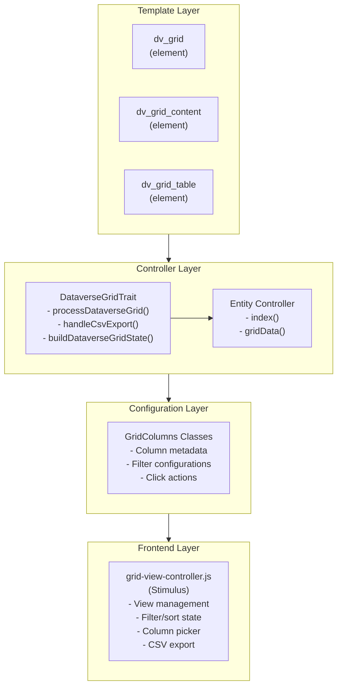
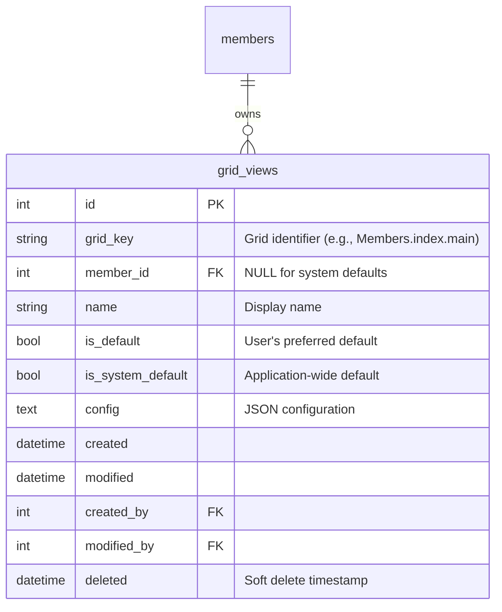
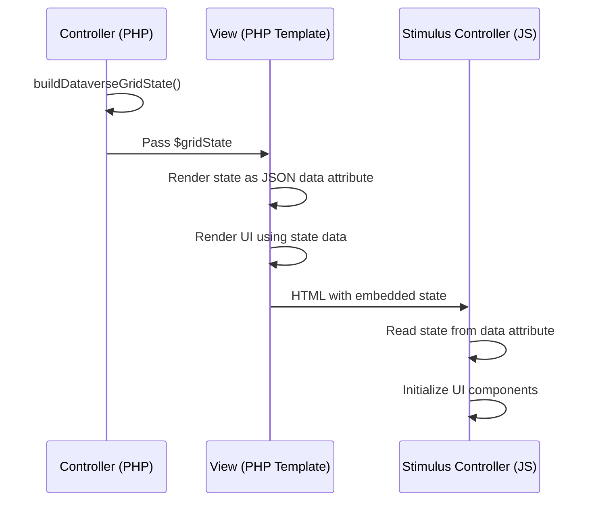
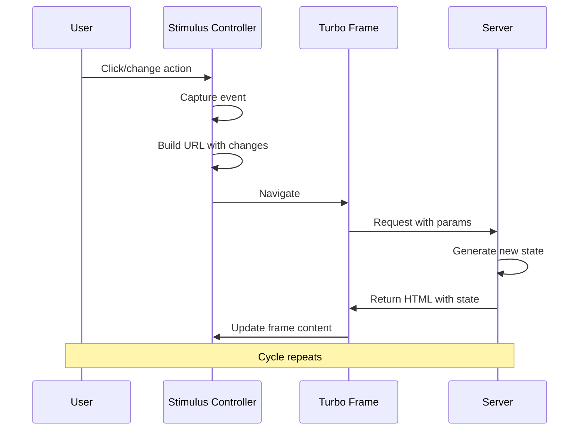

[← Back to UI Components](9-ui-components.md) | [← Back to Table of Contents](index.md)

# 9.3 Dataverse Grid Complete Guide

The Dataverse Grid (DV Grid) is KMP's modern, feature-rich data table system inspired by Microsoft Power Apps Dataverse. It provides a consistent, highly customizable interface for displaying and managing tabular data across the application.

This comprehensive guide covers all aspects of implementing, configuring, and customizing the DV Grid system.

## Table of Contents

1. [Overview](#overview)
2. [Architecture](#architecture)
3. [Quick Start Guide](#quick-start-guide)
4. [Column Configuration](#column-configuration)
5. [Field Naming Convention](#field-naming-convention)
6. [Grid Configuration Options](#grid-configuration-options)
7. [Feature Flags Reference](#feature-flags-reference)
8. [Filtering System](#filtering-system)
9. [Expression System](#expression-system-for-complex-filtering)
10. [Sorting](#sorting)
11. [Custom Views](#custom-views)
12. [System Views](#system-views)
13. [CSV Export](#csv-export)
14. [Column Picker](#column-picker)
15. [Row Actions](#row-actions)
16. [State Architecture](#state-architecture)
17. [Stimulus Controller Reference](#stimulus-controller-reference)
18. [Toolbar Configuration](#toolbar-configuration)
19. [Template Elements](#template-elements)
20. [Migration Guide](#migration-guide)
21. [Advanced Topics](#advanced-topics)
22. [Troubleshooting](#troubleshooting)

---

## Overview

### Key Features

| Feature | Description |
|---------|-------------|
| **Lazy Loading** | Data loads via Turbo Frames for fast initial page render |
| **Column Picker** | Users can show/hide columns and customize visibility |
| **Saved Views** | Users can save filter/sort/column configurations as reusable views |
| **System Views** | Admins can define predefined views with locked filters |
| **Advanced Filtering** | Dropdown filters, date-range filters, and text search |
| **Sortable Columns** | Click-to-sort with ascending/descending/clear cycle |
| **CSV Export** | Export current view data respecting filters, columns, and sort |
| **Pagination** | Server-side pagination with configurable page sizes |
| **URL State** | Bookmarkable URLs that preserve grid state |
| **Locked Filters** | Context-specific filters that cannot be removed by users |

### When to Use DV Grid

Use the Dataverse Grid when you need:
- A data table with filtering, sorting, and pagination
- User-customizable column visibility
- Saved view configurations
- CSV export capabilities
- Consistent UI across different entity types

### Existing Implementations

The following entities already use the DV Grid system:

**Core Entities:**
- Members, MemberRoles, Warrants, WarrantRosters, WarrantPeriods
- Branches, Roles, Permissions, AppSettings, EmailTemplates
- Gatherings, GatheringTypes, GatheringActivities, GatheringAttendances
- Departments, Levels

**Plugin Entities:**
- Awards (Awards Plugin)
- Recommendations (Awards Plugin)
- Officers (Officers Plugin)
- WaiverTypes (Waivers Plugin)

---

## Architecture

### System Components



### Data Flow

1. **Initial Load**: User navigates to entity index page
2. **Template Render**: `dv_grid` element creates lazy-loading Turbo Frame
3. **Frame Load**: Turbo Frame fetches `gridData` endpoint
4. **Grid Processing**: `DataverseGridTrait::processDataverseGrid()` processes request
5. **State Generation**: Grid state generated including columns, filters, sort, views
6. **Content Render**: `dv_grid_content` renders toolbar + inner frame
7. **Table Render**: `dv_grid_table` renders actual data table
8. **JS Initialization**: Stimulus `grid-view` controller reads state and enables interactivity

---

## Quick Start Guide

### Step 1: Create GridColumns Class

Create a class that defines your grid's column metadata:

```php
<?php
declare(strict_types=1);

namespace App\KMP\GridColumns;

class MyEntityGridColumns extends BaseGridColumns
{
    public static function getColumns(): array
    {
        return [
            'id' => [
                'key' => 'id',
                'label' => 'ID',
                'type' => 'number',
                'sortable' => true,
                'filterable' => false,
                'defaultVisible' => false,
                'width' => '80px',
                'alignment' => 'right',
            ],
            'name' => [
                'key' => 'name',
                'label' => 'Name',
                'type' => 'string',
                'sortable' => true,
                'filterable' => true,
                'searchable' => true,
                'defaultVisible' => true,
                'required' => true,
                'width' => '200px',
                'alignment' => 'left',
                'clickAction' => 'navigate:/my-entity/view/:id',
            ],
            'status' => [
                'key' => 'status',
                'label' => 'Status',
                'type' => 'string',
                'sortable' => true,
                'filterable' => true,
                'filterType' => 'dropdown',
                'filterOptions' => [
                    ['value' => 'active', 'label' => 'Active'],
                    ['value' => 'inactive', 'label' => 'Inactive'],
                ],
                'defaultVisible' => true,
                'width' => '120px',
                'alignment' => 'center',
            ],
            'created' => [
                'key' => 'created',
                'label' => 'Created',
                'type' => 'datetime',
                'sortable' => true,
                'filterable' => true,
                'filterType' => 'date-range',
                'defaultVisible' => true,
                'width' => '150px',
                'alignment' => 'left',
            ],
        ];
    }
}
```

### Step 2: Add Controller Methods

Add the trait and implement the required methods:

```php
<?php
declare(strict_types=1);

namespace App\Controller;

use App\Controller\DataverseGridTrait;
use App\KMP\GridColumns\MyEntityGridColumns;
use App\Services\CsvExportService;

class MyEntityController extends AppController
{
    use DataverseGridTrait;

    public function initialize(): void
    {
        parent::initialize();
        // Authorize gridData action
        $this->Authorization->authorizeModel('index', 'add', 'gridData');
    }

    /**
     * Index action - renders the grid container
     */
    public function index(): void
    {
        // Empty - dv_grid element lazy-loads via gridData
    }

    /**
     * Grid data endpoint - handles grid requests
     */
    public function gridData(CsvExportService $csvExportService)
    {
        $result = $this->processDataverseGrid([
            'gridKey' => 'MyEntity.index.main',
            'gridColumnsClass' => MyEntityGridColumns::class,
            'baseQuery' => $this->MyEntity->find()->contain(['RelatedTable']),
            'tableName' => 'MyEntity',
            'defaultSort' => ['MyEntity.name' => 'asc'],
            'defaultPageSize' => 25,
            
            // Optional feature flags
            'showAllTab' => false,
            'canAddViews' => true,
            'canFilter' => true,
            'canExportCsv' => true,
        ]);

        // Handle CSV export
        if (!empty($result['isCsvExport'])) {
            return $this->handleCsvExport($result, $csvExportService, 'my-entity');
        }

        // Set view variables
        $this->set([
            'data' => $result['data'],
            'gridState' => $result['gridState'],
        ]);

        // Determine template based on Turbo-Frame header
        $turboFrame = $this->request->getHeaderLine('Turbo-Frame');
        if ($turboFrame === 'my-entity-grid-table') {
            $this->set('tableFrameId', 'my-entity-grid-table');
            $this->viewBuilder()->disableAutoLayout();
            $this->viewBuilder()->setTemplate('../element/dv_grid_table');
        } else {
            $this->set('frameId', 'my-entity-grid');
            $this->viewBuilder()->disableAutoLayout();
            $this->viewBuilder()->setTemplate('../element/dv_grid_content');
        }
    }
}
```

### Step 3: Create Index Template

```php
<?php
// templates/MyEntity/index.php
?>
<div class="my-entity index content">
    <h3><?= __('My Entities') ?></h3>
    
    <?= $this->element('dv_grid', [
        'gridKey' => 'MyEntity.index.main',
        'frameId' => 'my-entity-grid',
        'dataUrl' => $this->Url->build(['action' => 'gridData']),
    ]) ?>
</div>
```

---

## Column Configuration

### Complete Column Properties Reference

| Property | Type | Required | Description |
|----------|------|----------|-------------|
| `key` | string | ✅ | Unique column identifier (matches entity field) |
| `label` | string | ✅ | Display label for column header |
| `type` | string | ✅ | Data type (see Column Types below) |
| `sortable` | bool | - | Whether column can be sorted (default: `true`) |
| `filterable` | bool | - | Whether column can be filtered (default: `false`) |
| `searchable` | bool | - | Whether column is included in text search (default: `false`) |
| `defaultVisible` | bool | - | Whether column shows by default (default: `false`) |
| `required` | bool | - | Whether column cannot be hidden (default: `false`) |
| `width` | string | - | CSS width (e.g., `'150px'`, `'auto'`) |
| `alignment` | string | - | Text alignment: `'left'`, `'center'`, `'right'` |
| `queryField` | string | - | SQL field for queries (e.g., `'Table.field'`) |
| `renderField` | string | - | Entity property path (e.g., `'relation.field'`) |
| `clickAction` | string | - | Action when clicking cell value |
| `filterType` | string | - | Filter UI type: `'text'`, `'dropdown'`, `'date-range'`, `'is-populated'` |
| `filterOptions` | array | - | Options for dropdown filters |
| `filterOptionsSource` | string\|array | - | Source for dynamic dropdown options (table/app-setting) |
| `cellRenderer` | callable | - | Custom cell renderer function |
| `exportable` | bool | - | Whether included in CSV export (default: `true`) |
| `exportOnly` | bool | - | Only visible in exports, not in grid (default: `false`) |
| `exportValue` | callable | - | Custom export value formatter |
| `description` | string | - | Tooltip/help text for the column |
| `nullMeansActive` | bool | - | For date filters: treat NULL as "never expires" |

### Column Types

#### Data Display Types

| Type | Description | Rendering |
|------|-------------|-----------|
| `string` | Plain text | Escaped HTML output |
| `number` | Numeric value | Right-aligned, numeric formatting |
| `integer` | Integer value | Same as number |
| `boolean` | True/false | Green check / Red X icons |
| `badge` | Status badge | Colored badge based on value (see below) |
| `date` | Date only | Timezone-aware date formatting via `TimezoneHelper` |
| `datetime` | Date and time | Timezone-aware datetime formatting |
| `relation` | Related entity | Uses `renderField` for display |
| `html` | Raw HTML | Unescaped output (use carefully for pre-formatted content) |
| `email` | Email address | Displayed as-is (use `cellRenderer` for mailto links) |

#### Action Types

| Type | Description | Use Case |
|------|-------------|----------|
| `link` | Navigation link | Navigate to detail/edit pages |
| `modal` | Modal trigger | Open edit/detail modals |
| `postLink` | Form-based action | Delete, status changes, approvals |
| `actions` | Row action column | Container for multiple row actions |

#### Badge Type Configuration

The `badge` type renders values as Bootstrap badges:

```php
'warrant_state' => [
    'key' => 'warrant_state',
    'label' => 'Warrant',
    'type' => 'badge',
    'filterable' => true,
    'filterType' => 'dropdown',
    'defaultVisible' => true,
    'filterOptions' => [
        ['value' => 'Active', 'label' => 'Active'],
        ['value' => 'Pending', 'label' => 'Pending'],
        ['value' => 'Missing', 'label' => 'Missing'],
    ],
],

'is_active' => [
    'key' => 'is_active',
    'label' => 'Status',
    'type' => 'badge',
    'sortable' => true,
    'defaultVisible' => true,
    // Boolean badge: true = 'Active' (green), false = 'Inactive' (gray)
],
```

#### Row Actions Configuration

Define row actions in a separate method in your GridColumns class:

```php
public static function getRowActions(): array
{
    return [
        'edit' => [
            'key' => 'edit',
            'type' => 'modal',
            'label' => '',
            'icon' => 'bi-pencil-fill',
            'class' => 'btn-sm btn btn-primary',
            'modalTarget' => '#editModal',
            'permission' => 'edit',
            'condition' => ['is_editable' => true],
        ],
        'delete' => [
            'key' => 'delete',
            'type' => 'postLink',
            'label' => 'Delete',
            'icon' => 'bi-trash',
            'class' => 'btn-sm btn btn-danger',
            'permission' => 'delete',
            'url' => [
                'controller' => 'MyEntity',
                'action' => 'delete',
                'idField' => 'id',
            ],
            'confirmMessage' => 'Delete {{name}}?',
        ],
    ];
}
```

### Relation Columns

For columns that display related entity data:

```php
'branch_id' => [
    'key' => 'branch_id',
    'label' => 'Branch',
    'type' => 'relation',
    'sortable' => true,
    'filterable' => true,
    'filterType' => 'dropdown',
    // Dynamic dropdown options loaded server-side via DataverseGridTrait::loadFilterOptions()
    // String form uses fetchTable() with defaults valueField=id, labelField=name
    'filterOptionsSource' => 'Branches',
    'defaultVisible' => true,
    'width' => '150px',
    'alignment' => 'left',
    
    // Entity property access (lowercase)
    'renderField' => 'branch.name',
    
    // SQL query field (capitalized table alias)
    'queryField' => 'Branches.name',
],
```

**Important:** Remember to include the related table in your `baseQuery`:
```php
'baseQuery' => $this->MyEntity->find()->contain(['Branches']),
```

### Click Actions

Define what happens when a user clicks on a cell value:

```php
// Navigate to entity view
'clickAction' => 'navigate:/members/view/:id',

// Navigate using different field
'clickAction' => 'navigate:/members/view/:member_id',

// Open modal
'clickAction' => 'modal:#edit-modal',

// Toggle sub-row expansion
'clickAction' => 'toggleSubRow:details',
```

### Custom Cell Renderer

For complex cell rendering:

```php
'status' => [
    'key' => 'status',
    'label' => 'Status',
    'type' => 'string',
    'cellRenderer' => function($value, $row, $view) {
        $class = $value === 'active' ? 'success' : 'secondary';
        return sprintf(
            '<span class="badge bg-%s">%s</span>',
            $class,
            h($value)
        );
    },
],
```

### Export-Only Columns

Columns that appear only in CSV exports:

```php
'member_pronouns' => [
    'key' => 'member_pronouns',
    'label' => 'Pronouns',
    'type' => 'string',
    'defaultVisible' => false,
    'exportOnly' => true,  // Not in grid, only in export
    'renderField' => 'member.pronouns',
],
```

### Custom Export Value

Format values specifically for export:

```php
'name' => [
    'key' => 'name',
    'label' => 'Name',
    'type' => 'string',
    'exportValue' => function($entity, $columnKey, $columnMeta) {
        return $entity->first_name . ' ' . $entity->last_name;
    },
],
```

---

## Field Naming Convention

### Overview

The grid system uses semantic separation between `queryField` and `renderField` to prevent confusion between SQL query operations and entity property access.

### The Problem (Historical Context)

Previously, the grid system used two fields with ambiguous names:
- `sortField` - Used for SQL queries but name implied only sorting
- `relationField` - Used for entity property access but had unclear purpose

This led to bugs where lowercase entity names (like `branch.name`) were used in SQL SELECT statements, which caused errors because SQL requires capitalized table aliases (like `Branches.name`).

### The Solution: Semantic Field Names

#### `queryField`

**Purpose:** Used for SQL operations (SELECT, WHERE, ORDER BY)  
**Format:** Capitalized table aliases following CakePHP conventions  
**Example:** `'Branches.name'`, `'Members.sca_name'`, `'Parents.sca_name'`

**Used by:**
- CSV export SELECT clauses
- Sorting ORDER BY clauses  
- Search WHERE conditions (after transformation)

#### `renderField`

**Purpose:** Used to access entity properties for display in UI  
**Format:** Lowercase association names following CakePHP entity conventions  
**Example:** `'branch.name'`, `'member.sca_name'`, `'parent.sca_name'`

**Used by:**
- Template rendering in `dv_grid_table`
- Accessing entity relationships via dot notation
- Display value extraction from result entities

### Column Metadata Structure

#### For Relation Type Columns

```php
'branch_id' => [
    'key' => 'branch_id',
    'label' => 'Branch',
    'type' => 'relation',
    'sortable' => true,
    'defaultVisible' => true,
    
    // For SQL queries - must use capitalized table alias
    'queryField' => 'Branches.name',
    
    // For entity property access - uses lowercase association name
    'renderField' => 'branch.name',
],
```

#### For Regular Columns

Regular columns (non-relation types) don't need these fields:

```php
'sca_name' => [
    'key' => 'sca_name',
    'label' => 'SCA Name',
    'type' => 'string',
    'sortable' => true,
    'defaultVisible' => true,
    // No queryField or renderField needed - uses 'key' directly
],
```

### CakePHP Naming Conventions

Understanding CakePHP's conventions is essential for using these fields correctly:

| Context | Format | Examples |
|---------|--------|----------|
| **Table Names** | Plural, Capitalized | `Members`, `Branches`, `Parents` |
| **Association Names** | Singular, Lowercase | `member`, `branch`, `parent` |
| **SQL Context (queryField)** | `Table.field` | `Branches.name`, `Members.sca_name` |
| **Entity Context (renderField)** | `association.field` | `branch.name`, `member.sca_name` |

### Example: Members Grid - Branch Column

```php
'branch_id' => [
    'key' => 'branch_id',
    'label' => 'Branch',
    'type' => 'relation',
    'renderField' => 'branch.name',      // Entity: $member->branch->name
    'queryField' => 'Branches.name',     // SQL: Branches.name
],
```

**Controller must load association:**
```php
'baseQuery' => $this->Members->find()->contain(['Branches']),
```

### Troubleshooting Field Naming

| Error | Problem | Solution |
|-------|---------|----------|
| `Unknown column 'branch.name' in SELECT` | Using `renderField` in SQL context | Use `queryField` for SQL operations |
| `Trying to access property 'name' on null` | Association not loaded | Add `->contain()` to base query |
| Value shows ID instead of name | Missing or incorrect `renderField` | Verify `renderField` uses lowercase association name |

---

## Feature Flags Reference

All feature flags for configuring Dataverse grid behavior. Features are **optional** and can be enabled/disabled independently.

### Quick Reference

```php
$result = $this->processDataverseGrid([
    // Required configuration
    'gridKey' => 'Members.index.main',
    'gridColumnsClass' => \App\KMP\GridColumns\MembersGridColumns::class,
    'baseQuery' => $this->Members->find(),
    'tableName' => 'Members',
    'defaultSort' => ['Members.sca_name' => 'asc'],
    'defaultPageSize' => 25,
    
    // Optional feature flags (all default to true unless specified)
    'showViewTabs' => true,           // Show view tabs at top of grid
    'showAllTab' => true,             // Show "All" tab (ignored if systemViews)
    'canAddViews' => true,            // Show "+" button to create custom views
    'canFilter' => true,              // Enable filter dropdown button
    'showFilterPills' => true,        // Show active filter badges/pills
    'canExportCsv' => true,           // Show CSV export button
    'enableColumnPicker' => true,     // Enable column picker modal
    'lockedFilters' => [],            // Array of filter keys that cannot be removed
    
    // System views mode (optional)
    'systemViews' => null,            // Array of predefined views
    'defaultSystemView' => null,      // Default system view ID
    'queryCallback' => null,          // Callback to modify query per view
]);
```

### Feature Flags Detailed

#### `showViewTabs` (bool, default: `true`)

Controls whether the view tabs row is displayed at the top of the grid.

- **When `true`:** View tabs rendered with dropdown for switching views
- **When `false`:** Entire view tabs row is hidden, grid uses default view

#### `showAllTab` (bool, default: `true` for saved views, `false` for system views)

Controls whether the "All" tab is shown in the view tabs.

- **When `true`:** "All" tab appears as first tab, shows all records
- **When `false`:** No "All" tab, always shows a specific view

#### `canAddViews` (bool, default: `true`)

Controls whether users can create custom views.

- **When `true`:** "+" button shown in view tabs
- **When `false`:** No custom view creation allowed

#### `canFilter` (bool, default: `true`)

Controls whether users can add, modify, or remove filters via the UI.

**Important:** System view filters are **always applied** regardless of this setting. The `canFilter` flag only affects user-submitted filters.

- **When `true`:** Filter dropdown, search box, filter pills all shown
- **When `false`:** All filter UI hidden, URL filter parameters ignored

#### `showFilterPills` (bool, default: `true`)

Controls display of active filter badges/pills.

- **When `true`:** Active filters shown as removable badges
- **When `false`:** No filter badges, filters still active but not visible

#### `canExportCsv` (bool, default: `true`)

Controls whether CSV export button is shown.

- **When `true`:** "Export CSV" button shown in toolbar
- **When `false`:** No export button

#### `enableColumnPicker` (bool, default: `true`)

Controls whether column picker modal is available.

- **When `true`:** Column picker icon shown in table header
- **When `false`:** Fixed columns, no picker available

#### `lockedFilters` (array, default: `[]`)

Filter column keys that cannot be removed by users.

**Use Cases:**
- **Embedded grids**: Context filter (e.g., `member_id`) should be locked
- **Scoped views**: Grid should always show subset of data

**Behavior:**
- Filter pills show lock icon instead of remove button
- Filter checkboxes in dropdown are disabled
- "Clear all filters" preserves locked filters

```php
// Embedded grid on member profile
'lockedFilters' => ['member_id'],

// Multiple locked filters
'lockedFilters' => ['branch_id', 'status'],
```

### Common Configurations

#### Minimal Grid (Display Only)
```php
$result = $this->processDataverseGrid([
    'gridKey' => 'SimpleData.list',
    // ...
    'showViewTabs' => false,
    'canFilter' => false,
    'canExportCsv' => false,
    'enableColumnPicker' => false,
]);
```

#### Locked-Down Grid (Predefined Views Only)
```php
$result = $this->processDataverseGrid([
    'gridKey' => 'Warrants.index',
    'systemViews' => $this->getSystemViews(),
    'defaultSystemView' => 'sys-current',
    'showAllTab' => false,
    'canAddViews' => false,
    'canExportCsv' => true,
    // ...
]);
```

#### Embedded Grid (Context-Locked Filters)
```php
$result = $this->processDataverseGrid([
    'gridKey' => 'Awards.Recommendations.member',
    'baseQuery' => $this->Recommendations->find()
        ->where(['member_id' => $memberId]),
    'lockedFilters' => ['member_id'],
    'showViewTabs' => false,
    'canAddViews' => false,
    // ...
]);
```

### UI Impact Matrix

| Feature Flag | View Tabs | Filter Button | Filter Pills | Export Button | Column Picker |
|-------------|-----------|---------------|--------------|---------------|---------------|
| `showViewTabs` | ✅ | - | - | - | - |
| `showAllTab` | Adds "All" | - | - | - | - |
| `canAddViews` | Adds "+" | - | - | - | - |
| `canFilter` | - | ✅ | ✅ | - | - |
| `showFilterPills` | - | - | ✅ | - | - |
| `canExportCsv` | - | - | - | ✅ | - |
| `enableColumnPicker` | - | - | - | - | ✅ |
| `lockedFilters` | - | Disables | Shows 🔒 | - | - |

---

## Grid Configuration Options

### Complete processDataverseGrid Options

```php
$result = $this->processDataverseGrid([
    // === Required Configuration ===
    'gridKey' => 'Members.index.main',           // Unique grid identifier
    'gridColumnsClass' => MembersGridColumns::class,  // GridColumns class
    'baseQuery' => $this->Members->find(),       // Base query
    'tableName' => 'Members',                    // Primary table name
    'defaultSort' => ['Members.name' => 'asc'],  // Default sort
    
    // === Optional Configuration ===
    'defaultPageSize' => 25,                     // Records per page (default: 25)
    
    // === View Features ===
    'showViewTabs' => true,                      // Show view tabs row
    'showAllTab' => true,                        // Show "All" tab
    'canAddViews' => true,                       // Allow creating custom views
    
    // === Filter Features ===
    'canFilter' => true,                         // Enable filtering UI
    'showFilterPills' => true,                   // Show active filter badges
    'lockedFilters' => [],                       // Filters that can't be removed
    
    // === Export Features ===
    'canExportCsv' => true,                      // Show CSV export button
    
    // === Column Features ===
    'enableColumnPicker' => true,                // Enable column picker
    
    // === System Views (optional) ===
    'systemViews' => null,                       // Predefined views array
    'defaultSystemView' => null,                 // Default system view ID
    'queryCallback' => null,                     // Query modifier callback
]);
```

### Feature Flags Summary

| Flag | Default | Description |
|------|---------|-------------|
| `showViewTabs` | `true` | Display view tabs at top of grid |
| `showAllTab` | `true` (saved) / `false` (system) | Show "All" tab option |
| `canAddViews` | `true` | Allow users to create custom views |
| `canFilter` | `true` | Enable filter UI and parameters |
| `showFilterPills` | `true` | Display active filter badges |
| `canExportCsv` | `true` | Show CSV export button |
| `enableColumnPicker` | `true` | Enable column visibility modal |

### Locked Filters

Prevent users from removing certain filters:

```php
// Embedded grid for specific member
$result = $this->processDataverseGrid([
    'gridKey' => 'Awards.Recommendations.member',
    'baseQuery' => $this->Recommendations->find()
        ->where(['member_id' => $memberId]),
    'lockedFilters' => ['member_id'],  // Can't be removed
    // ...
]);
```

Locked filters display with a lock icon instead of a remove button.

---

## Filtering System

### Filter Types

#### Dropdown Filter

```php
'status' => [
    'key' => 'status',
    'filterable' => true,
    'filterType' => 'dropdown',
    'filterOptions' => [
        ['value' => 'active', 'label' => 'Active'],
        ['value' => 'inactive', 'label' => 'Inactive'],
        ['value' => 'pending', 'label' => 'Pending'],
    ],
],
```

#### Is-Populated Filter

Use `filterType: is-populated` for fields where the filter should be based on whether a value is present.

- “Yes” means: not `NULL` and not empty string
- “No” means: `NULL` or empty string

```php
'has_membership_card' => [
    'key' => 'has_membership_card',
    'label' => 'Card',
    'type' => 'boolean',
    'sortable' => false,
    'filterable' => true,
    'filterType' => 'is-populated',
    // Optional: which underlying field to test for NULL/empty
    'filterQueryField' => 'membership_card_path',
    'filterOptions' => [
        ['value' => 'yes', 'label' => 'Has Card'],
        ['value' => 'no', 'label' => 'No Card'],
    ],
],
```

#### Dynamic Dropdown Filter

```php
'branch_id' => [
    'key' => 'branch_id',
    'filterable' => true,
    'filterType' => 'dropdown',
    // Loads from the table using fetchTable('Branches')
    'filterOptionsSource' => 'Branches',
],
```

`filterOptionsSource` supports several formats:

```php
// 1) String table alias (defaults valueField=id, labelField=name)
'filterOptionsSource' => 'Branches',

// 2) Table config with conditions / custom fields
'filterOptionsSource' => [
    'table' => 'Waivers.WaiverTypes',
    'valueField' => 'id',
    'labelField' => 'name',
    'conditions' => ['is_active' => true],
    'order' => ['name' => 'ASC'],
],

// 3) App setting (YAML array) where value and label are the array item
'filterOptionsSource' => [
    'appSetting' => 'Branches.Types',
],
```

#### Date Range Filter

```php
'created' => [
    'key' => 'created',
    'type' => 'date',
    'filterable' => true,
    'filterType' => 'date-range',
],
```

This creates "From" and "To" date inputs.

#### Text Search

```php
'name' => [
    'key' => 'name',
    'searchable' => true,  // Included in global search
],
```

### Multi-Value Filters

Users can select multiple values for dropdown filters. These are combined with OR logic:

```
?filter[status][]=active&filter[status][]=pending
```

### Filter URL Parameters

- `filter[column]=value` - Single filter value
- `filter[column][]=value1&filter[column][]=value2` - Multiple values
- `column_start=2024-01-01&column_end=2024-12-31` - Date range
- `search=term` - Global search
- `dirty[filters]=1` - Mark filters as user-modified (overrides view defaults)

### nullMeansActive for Date Filters

For expiration fields where NULL means "never expires":

```php
'expires_on' => [
    'key' => 'expires_on',
    'type' => 'date',
    'filterable' => true,
    'filterType' => 'date-range',
    'nullMeansActive' => true,  // NULL included when filtering by start date
],
```

### Expression System for Complex Filtering

The Dataverse Grid supports complex filtering through a powerful expression tree format that can handle nested OR/AND logic. This eliminates the need for hardcoded query callbacks in most scenarios.

#### Expression Format

An expression is a nested tree structure that can contain:
- **Simple conditions**: Field comparisons using operators
- **OR groups**: Multiple conditions where ANY can match
- **AND groups**: Multiple conditions where ALL must match
- **Nested groups**: OR/AND groups can be nested to any depth

```json
{
  "expression": {
    "type": "OR",
    "conditions": [
      {"field": "fieldName", "operator": "eq", "value": "value"},
      {"field": "otherField", "operator": "in", "value": ["a", "b"]}
    ]
  }
}
```

#### Supported Expression Operators

| Operator | Description | Value Type | Example |
|----------|-------------|------------|---------|
| `eq` | Equals | scalar | `{"field": "status", "operator": "eq", "value": "Current"}` |
| `neq` | Not equals | scalar | `{"field": "status", "operator": "neq", "value": "Expired"}` |
| `gt` | Greater than | scalar | `{"field": "age", "operator": "gt", "value": 18}` |
| `gte` | Greater than or equal | scalar | `{"field": "expires_on", "operator": "gte", "value": "2025-11-22"}` |
| `lt` | Less than | scalar | `{"field": "expires_on", "operator": "lt", "value": "2025-11-22"}` |
| `lte` | Less than or equal | scalar | `{"field": "created", "operator": "lte", "value": "2025-01-01"}` |
| `in` | Value in array | array | `{"field": "status", "operator": "in", "value": ["Active", "Current"]}` |
| `notIn` | Value not in array | array | `{"field": "status", "operator": "notIn", "value": ["Deleted"]}` |
| `contains` | String contains | string | `{"field": "name", "operator": "contains", "value": "John"}` |
| `startsWith` | String starts with | string | `{"field": "name", "operator": "startsWith", "value": "Sir"}` |
| `endsWith` | String ends with | string | `{"field": "name", "operator": "endsWith", "value": "Jr"}` |
| `isNull` | Field is NULL | none | `{"field": "deleted_at", "operator": "isNull"}` |
| `isNotNull` | Field is not NULL | none | `{"field": "email", "operator": "isNotNull"}` |
| `dateRange` | Date between range | [start, end] | `{"field": "created", "operator": "dateRange", "value": ["2025-01-01", "2025-12-31"]}` |

#### Expression Examples

**Simple OR Condition** - Show warrants that are either expired OR have a deactivated/expired status:

```php
'config' => [
    'expression' => [
        'type' => 'OR',
        'conditions' => [
            ['field' => 'expires_on', 'operator' => 'lt', 'value' => '2025-11-22'],
            ['field' => 'status', 'operator' => 'in', 'value' => ['Deactivated', 'Expired']],
        ],
    ],
],
```

**Nested AND within OR** - Show warrants that are either expired OR (current status AND starting in the future):

```php
'config' => [
    'expression' => [
        'type' => 'OR',
        'conditions' => [
            ['field' => 'expires_on', 'operator' => 'lt', 'value' => '2025-11-22'],
            [
                'type' => 'AND',
                'conditions' => [
                    ['field' => 'status', 'operator' => 'eq', 'value' => 'Current'],
                    ['field' => 'start_on', 'operator' => 'gte', 'value' => '2025-11-23'],
                ],
            ],
        ],
    ],
],
```

**Complex Multi-Level Nesting**:

```php
'config' => [
    'expression' => [
        'type' => 'AND',
        'conditions' => [
            ['field' => 'membership_expires_on', 'operator' => 'gte', 'value' => '2025-11-22'],
            [
                'type' => 'OR',
                'conditions' => [
                    ['field' => 'branch_id', 'operator' => 'in', 'value' => [1, 2, 3]],
                    [
                        'type' => 'AND',
                        'conditions' => [
                            ['field' => 'parent_id', 'operator' => 'isNotNull'],
                            ['field' => 'status', 'operator' => 'eq', 'value' => 'Active'],
                        ],
                    ],
                ],
            ],
        ],
    ],
],
```

#### Using Expressions in System Views

```php
protected function getWarrantSystemViews(): array
{
    $today = FrozenDate::today();
    $todayString = $today->format('Y-m-d');
    
    return [
        'sys-warrants-previous' => [
            'id' => 'sys-warrants-previous',
            'name' => __('Previous'),
            'description' => __('Expired or deactivated warrants'),
            'canManage' => false,
            'config' => [
                // Expression tree handles OR logic declaratively
                'expression' => [
                    'type' => 'OR',
                    'conditions' => [
                        ['field' => 'expires_on', 'operator' => 'lt', 'value' => $todayString],
                        ['field' => 'status', 'operator' => 'in', 'value' => [
                            Warrant::DEACTIVATED_STATUS,
                            Warrant::EXPIRED_STATUS,
                        ]],
                    ],
                ],
                // Keep filter UI seeds for display pills
                'filters' => [
                    ['field' => 'status', 'operator' => 'in', 'value' => [
                        Warrant::DEACTIVATED_STATUS,
                        Warrant::EXPIRED_STATUS,
                    ]],
                ],
                'skipFilterColumns' => ['status', 'expires_on'],
            ],
        ],
    ];
}
```

**Key Points**:
- `expression` contains the declarative OR/AND logic
- `filters` array populates the UI filter pills
- `skipFilterColumns` prevents filter UI from applying to query (since expression handles it)

#### Expression Best Practices

1. **Prefer Expressions**: Use expression trees for all OR/AND logic instead of query callbacks
2. **Keep UI Seeds**: Maintain `filters` array for UI pill display, use `skipFilterColumns`
3. **Date Handling**: Use ISO format strings (YYYY-MM-DD) for date comparisons
4. **Testing**: Expression trees are not validated at runtime - test thoroughly

---

## Sorting

### Single Column Sort

Click column header to cycle through: none → ascending → descending → none

### Sort URL Parameters

```
?sort=name&direction=asc
?sort=created&direction=desc
```

### Default Sort

```php
'defaultSort' => ['Members.sca_name' => 'asc'],

// Multiple columns
'defaultSort' => [
    'Members.status' => 'asc',
    'Members.name' => 'asc',
],
```

### Sort from View Configuration

When a view is active, sort is restored from the view's saved configuration unless user explicitly changes it (marking it as dirty).

---

## Custom Views

### Overview

Users can save their current grid configuration (filters, sort, columns) as a named view for later reuse.

### View Configuration Structure

```json
{
  "filters": [
    {"field": "status", "operator": "in", "value": ["active"]},
    {"field": "_search", "operator": "contains", "value": "john"}
  ],
  "sort": [
    {"field": "name", "direction": "asc"}
  ],
  "columns": [
    {"key": "name", "visible": true, "order": 0},
    {"key": "status", "visible": true, "order": 1},
    {"key": "created", "visible": false, "order": 2}
  ],
  "pageSize": 25
}
```

### View Actions

| Action | Description |
|--------|-------------|
| **Save As New** | Create new view from current configuration |
| **Update View** | Save current state to selected view |
| **Set Default** | Make view your personal default |
| **Remove Default** | Clear your default view preference |
| **Delete View** | Remove a custom view (yours only) |

### Grid Key Convention

Format: `{Controller}.{action}.{slug}`

Examples:
- `Members.index.main`
- `Warrants.index.active`
- `Awards.Recommendations.member`

### Data Model: grid_views Table

Custom views are persisted in the `grid_views` table:



| Column | Type | Description |
|--------|------|-------------|
| `id` | int | Primary key |
| `grid_key` | varchar(100) | Grid identifier matching controller/action |
| `member_id` | int | Owner (NULL for system defaults) |
| `name` | varchar(100) | Display name shown in tabs |
| `is_default` | bool | User's preferred default for this grid |
| `is_system_default` | bool | Application-wide default (member_id must be NULL) |
| `config` | text | JSON configuration (see View Configuration Structure) |
| `created`/`modified` | datetime | Timestamps |
| `created_by`/`modified_by` | int | Audit trail |
| `deleted` | datetime | Soft delete (Trash behavior) |

**Business Rules:**
- Only one `is_system_default` per `grid_key`
- Only one `is_default` per (`member_id`, `grid_key`)
- System defaults must have `member_id = NULL`

---

## System Views

### Overview

System views are predefined views with locked configurations. Unlike custom views, they're defined in code and available to all users.

### Defining System Views

In your GridColumns class:

```php
public static function getSystemViews(): array
{
    return [
        'sys-all' => [
            'id' => 'sys-all',
            'name' => __('All'),
            'description' => __('All records'),
            'canManage' => false,
            'config' => [
                'filters' => [],
                'columns' => ['name', 'status', 'created'],
            ],
        ],
        'sys-active' => [
            'id' => 'sys-active',
            'name' => __('Active'),
            'description' => __('Active records only'),
            'canManage' => false,
            'config' => [
                'filters' => [
                    ['field' => 'status', 'operator' => 'eq', 'value' => 'active'],
                ],
                'columns' => ['name', 'created'],
                'skipFilterColumns' => ['status'],  // Don't show filter UI
            ],
        ],
    ];
}
```

### Using System Views in Controller

```php
$systemViews = MyEntityGridColumns::getSystemViews();

$result = $this->processDataverseGrid([
    'gridKey' => 'MyEntity.index.main',
    'systemViews' => $systemViews,
    'defaultSystemView' => 'sys-active',
    'queryCallback' => function($query, $systemView) {
        // Apply system view filtering
        if ($systemView && isset($systemView['config']['filters'])) {
            // Filtering is handled by the trait
        }
        return $query;
    },
    // ...
]);
```

### System View vs Custom View Coexistence

When using system views:
- System view tabs appear first
- Users can still create custom views (if `canAddViews` is true)
- Custom views appear after system views
- Users can set any view (system or custom) as their default

---

## CSV Export

### Enabling Export

```php
$result = $this->processDataverseGrid([
    'canExportCsv' => true,
    // ...
]);

// Handle export in controller
if (!empty($result['isCsvExport'])) {
    return $this->handleCsvExport($result, $csvExportService, 'my-entity');
}
```

### Export Features

- Exports visible columns only
- Respects current filters and search
- Uses current sort order
- Includes column labels as headers
- Exports `exportOnly` columns that aren't visible in grid
- Excludes columns with `exportable => false`

### Export Modes

#### Query Mode (Default)

Uses SQL SELECT to build export data. Best for simple fields.

```php
return $this->handleCsvExport($result, $csvExportService, 'my-entity');
```

#### Data Mode

Uses pre-processed entities. Best for computed/virtual fields.

```php
// Pass data explicitly for computed fields
return $this->handleCsvExport(
    $result, 
    $csvExportService, 
    'my-entity',
    null,  // tableName (auto-detect)
    $processedData  // Pre-processed data iterable
);
```

### Authorization

Implement `canExport()` in your table policy:

```php
public function canExport(KmpIdentityInterface $user, Table $entity): bool
{
    return $this->_hasPolicy($user, __FUNCTION__, $entity);
}
```

---

## Column Picker

### Overview

The column picker allows users to show/hide columns and potentially reorder them.

### Features

- Checkbox list of all available columns
- Required columns are always visible (disabled checkbox)
- Visual distinction for hidden columns
- Changes applied via "Apply" button
- Configuration saved to current view (if applicable)

### Required Columns

Mark columns that cannot be hidden:

```php
'id' => [
    'key' => 'id',
    'required' => true,  // Cannot be hidden
    // ...
],
```

### Enabling/Disabling Column Picker

```php
$result = $this->processDataverseGrid([
    'enableColumnPicker' => true,  // Show picker button
    // or
    'enableColumnPicker' => false, // Fixed columns
    // ...
]);
```

---

## Row Actions

### Defining Row Actions

In your GridColumns class:

```php
public static function getRowActions(): array
{
    return [
        'view' => [
            'key' => 'view',
            'type' => 'link',
            'label' => '',
            'icon' => 'bi-eye-fill',
            'class' => 'btn-sm btn btn-secondary',
            'permission' => 'view',
            'url' => [
                'controller' => 'MyEntity',
                'action' => 'view',
                'idField' => 'id',
            ],
        ],
        'edit' => [
            'key' => 'edit',
            'type' => 'modal',
            'label' => 'Edit',
            'icon' => 'bi-pencil-fill',
            'class' => 'btn-sm btn btn-primary',
            'modalTarget' => '#editModal',
            'permission' => 'edit',
            'dataAttributes' => [
                'action' => 'click->my-controller#openEdit',
            ],
        ],
    ];
}
```

### Action Types

| Type | Description |
|------|-------------|
| `link` | Standard link navigation |
| `modal` | Opens a modal dialog |
| `action` | Custom Stimulus action |

### Using Row Actions

Pass to the template element:

```php
// In controller
$this->set('rowActions', MyEntityGridColumns::getRowActions());

// In dv_grid_table template
<?= $this->element('dataverse_table', [
    'data' => $data,
    'columns' => $gridState['columns']['all'],
    'visibleColumns' => $gridState['columns']['visible'],
    'rowActions' => $rowActions,
    // ...
]) ?>
```

---

## Stimulus Controller Reference

### Overview

The `grid-view` Stimulus controller manages all frontend interactivity.

### Targets

| Target | Description |
|--------|-------------|
| `searchInput` | Text search input field |
| `gridTable` | Main data table element |

### Key Actions

| Action | Description |
|--------|-------------|
| `switchView` | Switch to a different saved view |
| `saveView` | Save current state as new view |
| `updateView` | Update existing view with current state |
| `deleteView` | Delete a saved view |
| `setDefault` | Set view as user's default |
| `clearDefault` | Remove user's default view |
| `showAll` | Clear view selection, show all records |
| `toggleFilter` | Toggle a filter value |
| `removeFilter` | Remove a specific filter |
| `clearAllFilters` | Clear all filters (preserves locked) |
| `performSearch` | Execute text search |
| `clearSearch` | Clear search term |
| `applySort` | Sort by clicked column |
| `toggleColumn` | Toggle column visibility |
| `applyColumnChanges` | Apply column picker changes |
| `exportCsv` | Trigger CSV export |

### HTML Data Attributes

```html
<div data-controller="grid-view">
  <!-- View switching -->
  <button data-action="click->grid-view#switchView"
          data-view-id="123">My View</button>
  
  <!-- Filter toggle -->
  <input type="checkbox"
         data-action="change->grid-view#toggleFilter"
         data-filter-column="status"
         value="active">
  
  <!-- Search -->
  <input type="text"
         data-grid-view-target="searchInput"
         data-action="keyup->grid-view#handleSearchKeyup">
  
  <!-- Sort -->
  <th data-action="click->grid-view#applySort"
      data-column-key="name">Name</th>
  
  <!-- Export -->
  <button data-action="click->grid-view#exportCsv">Export</button>
</div>
```

### Grid State Object

The controller reads state from a JSON script tag:

```javascript
// Accessed as this.state
{
  view: {
    currentId: 123,
    currentName: 'My View',
    preferredId: 123,
    available: [...]
  },
  search: 'term',
  filters: {
    active: { status: ['active'] },
    available: { status: { label: 'Status', options: [...] } }
  },
  sort: { field: 'name', direction: 'asc' },
  columns: {
    visible: ['name', 'status'],
    all: { name: {...}, status: {...} }
  },
  config: {
    gridKey: 'Members.index.main',
    canFilter: true,
    canExportCsv: true,
    lockedFilters: []
  }
}
```

---

## State Architecture

### Core Principle

**Server is Source of Truth**: All state is calculated on the server and sent to the client. The client's job is to:
1. Display the state
2. Capture user actions
3. Send requested changes back to the server

### State Data Structure

All grid state is embedded as a data attribute on the grid container:

```html
<turbo-frame id="members-grid">
    <div class="frame-state"
         data-grid-state-value='{ /* complete state JSON */ }'>
        <!-- Grid content -->
    </div>
</turbo-frame>
```

### Complete State Schema

```typescript
interface GridState {
  // View Management
  view: {
    currentId: number | null;
    currentName: string;
    preferredId: number | null;
    isDefault: boolean;
    isUserDefault: boolean;
    available: Array<{
      id: number;
      name: string;
      isDefault: boolean;
      isUserDefault: boolean;
      canManage: boolean;
    }>;
  };
  
  // Search State
  search: string;
  
  // Filter State
  filters: {
    active: {
      [columnKey: string]: string[];  // Active filter values
    };
    available: {
      [columnKey: string]: {
        label: string;
        options: Array<{
          value: string;
          label: string;
        }>;
      };
    };
    grouping: {
      orGroups: string[][];  // Fields joined by OR
    };
  };
  
  // Sort State
  sort: {
    field: string;
    direction: 'asc' | 'desc';
  } | null;
  
  // Column State
  columns: {
    visible: string[];  // Array of visible column keys
    all: {
      [columnKey: string]: {
        label: string;
        sortable: boolean;
        width?: string;
        alignment?: string;
      };
    };
  };
  
  // Grid Configuration
  config: {
    gridKey: string;
    primaryKey: string;
    pageSize: number;
    showAllTab: boolean;
    canAddViews: boolean;
    canFilter: boolean;
    hasSearch: boolean;
    hasDropdownFilters: boolean;
    hasDateRangeFilters: boolean;
    canExportCsv: boolean;
    showFilterPills: boolean;
    showViewTabs: boolean;
    enableColumnPicker: boolean;
    lockedFilters: string[];
  };
}
```

### Data Flow

#### Page Load / Turbo Frame Update



#### User Interaction



### Benefits

1. **Single Source of Truth** - State lives in one place (server-generated JSON)
2. **Simplified Client Code** - No state management in JS, just URL building
3. **Server Control** - All business logic on server, authorization checked once
4. **Easier Testing** - Test controller state generation, templates render correctly
5. **Easier Debugging** - State visible in one data attribute

---

## Toolbar Configuration

### Overview

The Dataverse grid toolbar supports configurable features that can be customized per grid instance through controller configuration.

### Configuration Methods

#### 1. Controller Configuration (Recommended)

Configure features in your controller's `gridData()` method:

```php
public function gridData(CsvExportService $csvExportService)
{
    $result = $this->processDataverseGrid([
        'gridKey' => 'Members.index.main',
        'gridColumnsClass' => MembersGridColumns::class,
        // ...
        
        // Feature flags
        'showViewTabs' => true,
        'canAddViews' => true,
        'canFilter' => true,
        'showFilterPills' => true,
        'canExportCsv' => true,
        'enableColumnPicker' => true,
    ]);
    
    // ...
}
```

#### 2. Element Attributes

Override defaults by passing attributes to the `dv_grid` element:

```php
<?= $this->element('dv_grid', [
    'gridKey' => 'Members.index.main',
    'frameId' => 'members-grid',
    'dataUrl' => $this->Url->build(['action' => 'gridData']),
    'showToolbar' => false,  // Override to hide toolbar completely
]) ?>
```

### Configuration Examples

#### Full-Featured Grid (Default)
```php
$result = $this->processDataverseGrid([
    'gridKey' => 'Members.index.main',
    // All features enabled by default
]);
```

#### Read-Only Grid
```php
$result = $this->processDataverseGrid([
    'gridKey' => 'Members.dashboard.widget',
    'canFilter' => false,
    'canExportCsv' => false,
    'canAddViews' => false,
    'showViewTabs' => false,
]);
```

#### Search-Only Grid
```php
$result = $this->processDataverseGrid([
    'gridKey' => 'Members.public.directory',
    'showViewTabs' => false,
    'canFilter' => true,  // Search is part of filtering
    'canExportCsv' => false,
]);
```

#### Embedded Report Grid
```php
$result = $this->processDataverseGrid([
    'gridKey' => 'Warrants.report.current',
    'showViewTabs' => false,
    'canAddViews' => false,
    'canFilter' => true,
    'canExportCsv' => true,
]);
```

### Best Practices

1. **Lock Down Public Grids**: Disable filtering and export for public-facing grids
2. **Embedded Widgets**: Hide view tabs and view management
3. **Report Pages**: Keep export but hide view management
4. **Data Pickers**: Show minimal UI - just search
5. **Admin Grids**: Enable everything (default behavior)

---

## Migration Guide

### Overview

This guide explains how to add Dataverse Grid to an existing entity or migrate from legacy table implementations.

### Step-by-Step Migration

#### Phase 1: Create GridColumns Class

1. Create new file in `app/src/KMP/GridColumns/`:

```php
<?php
declare(strict_types=1);

namespace App\KMP\GridColumns;

class MyEntityGridColumns extends BaseGridColumns
{
    public static function getColumns(): array
    {
        return [
            // Define all columns...
        ];
    }
}
```

2. Map existing table columns to grid column definitions
3. Add `queryField` and `renderField` for relation columns
4. Set `defaultVisible` based on current table display

#### Phase 2: Add Controller Support

1. Add `DataverseGridTrait` to controller:

```php
use App\Controller\DataverseGridTrait;

class MyEntityController extends AppController
{
    use DataverseGridTrait;
```

2. Update `initialize()` to authorize `gridData`:

```php
public function initialize(): void
{
    parent::initialize();
    $this->Authorization->authorizeModel('index', 'add', 'gridData');
}
```

3. Add `gridData()` method (see Quick Start Guide)

#### Phase 3: Create Index Template

1. Replace existing table HTML with `dv_grid` element:

```php
<?= $this->element('dv_grid', [
    'gridKey' => 'MyEntity.index.main',
    'frameId' => 'my-entity-grid',
    'dataUrl' => $this->Url->build(['action' => 'gridData']),
]) ?>
```

2. Remove legacy table rendering code
3. Update any JavaScript that interacted with the old table

#### Phase 4: Add Export Authorization

1. Add `canExport()` to table policy:

```php
public function canExport(KmpIdentityInterface $user, Table $entity): bool
{
    return $this->_hasPolicy($user, __FUNCTION__, $entity);
}
```

### Testing Checklist

After migration, verify:

- [ ] Grid loads correctly
- [ ] All columns display proper values
- [ ] Sorting works on sortable columns
- [ ] Filters apply correctly
- [ ] Search returns expected results
- [ ] Pagination works
- [ ] CSV export includes correct data
- [ ] Views can be saved/loaded
- [ ] Authorization is enforced

### Rollback Procedure

If issues are found:

1. Keep original template as backup (e.g., `index_legacy.php`)
2. Original route can be temporarily restored
3. GridColumns and controller method can coexist with legacy

---

## Template Elements

### dv_grid

The outer wrapper that creates the lazy-loading Turbo Frame:

```php
<?= $this->element('dv_grid', [
    'gridKey' => 'MyEntity.index.main',
    'frameId' => 'my-entity-grid',
    'dataUrl' => $this->Url->build(['action' => 'gridData']),
]) ?>
```

### dv_grid_content

Renders toolbar + inner table frame. Rendered by `gridData` action.

### dv_grid_table

Renders the actual data table. Updates independently via Turbo Frame.

### grid_view_toolbar

Renders view tabs, filter dropdown, export button.

### dataverse_table

Renders table headers, rows, and pagination.

---

## Advanced Topics

### Expression Trees

For complex filter logic, system views can use expression trees:

```php
'config' => [
    'expression' => [
        'type' => 'OR',
        'conditions' => [
            ['field' => 'status', 'operator' => 'eq', 'value' => 'active'],
            ['field' => 'expires_on', 'operator' => 'gte', 'value' => 'today'],
        ],
    ],
    'skipFilterColumns' => ['status', 'expires_on'],
],
```

### Embedded Grids

For grids embedded within entity views (e.g., member's recommendations):

```php
$result = $this->processDataverseGrid([
    'gridKey' => "Members.recommendations.{$memberId}",
    'baseQuery' => $this->fetchTable('Recommendations')
        ->find()
        ->where(['member_id' => $memberId]),
    'lockedFilters' => ['member_id'],
    'showViewTabs' => false,
    'canAddViews' => false,
    // ...
]);
```

### Custom Filter Options Loading

Override `loadFilterOptions()` in your controller only for truly custom sources.

```php
protected function loadFilterOptions(string|array $source): array
{
    if ($source === 'my_custom_source') {
        $results = $this->fetchTable('MyTable')
            ->find('list', keyField: 'id', valueField: 'name')
            ->toArray();

        return array_map(
            fn($id, $name) => ['value' => (string)$id, 'label' => (string)$name],
            array_keys($results),
            $results
        );
    }

    return parent::loadFilterOptions($source);
}
```

### Sub-Row Expansion

The grid view system supports expandable sub-rows that display additional details for a record when clicked. This pattern provides an efficient way to show detailed information without requiring navigation to a separate page.

#### Sub-Row Components

1. **Column Configuration** - Define `clickAction: 'toggleSubRow:<type>'` in column metadata
2. **JavaScript Handler** - Stimulus controller manages expand/collapse behavior
3. **Controller Endpoint** - Server action returns HTML fragments
4. **Sub-Row Template** - View template renders the detailed content
5. **Route Configuration** - Explicit route for sub-row endpoint

#### Column Metadata Configuration

In your GridColumns class:

```php
'warrantable' => [
    'key' => 'warrantable',
    'label' => 'Warrantable',
    'type' => 'boolean',
    'sortable' => true,
    'filterable' => true,
    'clickAction' => 'toggleSubRow:warrantreasons',  // Format: toggleSubRow:<type>
    'defaultVisible' => true,
],
```

**Format**: `toggleSubRow:<type>` where `<type>` is a unique identifier for this sub-row type.

#### Controller Action

Add a `subRow()` action to your controller:

```php
public function subRow(?string $id = null, ?string $type = null)
{
    // Disable layout for AJAX response
    $this->viewBuilder()->disableAutoLayout();
    
    // Validate parameters
    if (!$id || !$type) {
        throw new NotFoundException(__('Invalid request'));
    }
    
    // Load the entity
    $member = $this->Members->get($id, contain: []);
    
    // Route to appropriate template based on type
    switch ($type) {
        case 'warrantreasons':
            $this->set('reasons', $member->non_warrantable_reasons);
            $this->render('/element/sub_rows/warrant_reasons');
            break;
            
        case 'awards':
            $awards = $this->Members->Awards
                ->find()
                ->where(['member_id' => $id])
                ->all();
            $this->set('awards', $awards);
            $this->render('/element/sub_rows/awards');
            break;
            
        default:
            throw new NotFoundException(__('Unknown sub-row type: {0}', $type));
    }
}
```

**Key Points**:
- Use `disableAutoLayout()` to return HTML fragments only
- Validate both `$id` and `$type` parameters
- Use a switch statement to handle different sub-row types
- Set view variables and render the appropriate template

#### Sub-Row Template

Create template at `templates/element/sub_rows/{type}.php`:

```php
<?php
/**
 * Warrant Reasons Sub-Row Template
 * 
 * Displays reasons why a member is not warrantable.
 * 
 * @var array $reasons Array of non-warrantable reason strings
 */
?>
<div class="warrant-reasons p-3">
    <?php if (empty($reasons)): ?>
        <div class="text-success">
            <i class="bi bi-check-circle-fill me-2"></i>
            <strong>Member is warrantable</strong> - All requirements met
        </div>
    <?php else: ?>
        <div class="text-warning">
            <i class="bi bi-exclamation-triangle-fill me-2"></i>
            <strong>Cannot receive warrant due to:</strong>
        </div>
        <ul class="mb-0 mt-2">
            <?php foreach ($reasons as $reason): ?>
                <li><?= h($reason) ?></li>
            <?php endforeach; ?>
        </ul>
    <?php endif; ?>
</div>
```

**Template Best Practices**:
- Include clear docblock with variable descriptions
- Handle empty/null data gracefully
- Use Bootstrap classes for consistent styling
- Always use `h()` helper to escape output
- Keep templates focused and simple

#### Route Configuration

Add explicit route in `config/routes.php`:

```php
/**
 * Grid View Sub-Row Route
 * 
 * AJAX endpoint for loading expandable sub-row content in grid views.
 * Returns HTML fragments for additional row details on demand.
 */
$builder->connect('/members/sub-row/:id/:type', [
    'controller' => 'Members',
    'action' => 'subRow'
])
->setPass(['id', 'type'])
->setPatterns(['id' => '[0-9]+', 'type' => '[a-z]+']);
```

#### Sub-Row CSS (Built-in)

The grid view system includes pre-built CSS for sub-rows in `assets/css/app.css`:

```css
/* Sub-row expansion styles for grid view */
.sub-row {
    background-color: #f8f9fa;
    border-top: 1px solid #dee2e6;
}

.sub-row-content {
    padding: 0 !important;
    background-color: #f8f9fa;
}

tr.row-expanded {
    border-bottom: 2px solid #0d6efd;
}

.toggle-icon {
    transition: transform 0.2s ease;
    color: #6c757d;
}
```

#### User Interaction Flow

1. **User clicks** on a cell with `toggleSubRow` clickAction
2. **Chevron icon** indicates expandability (bi-chevron-right)
3. **JavaScript handler** intercepts the click via Stimulus action
4. **AJAX request** sent to `/{controller}/sub-row/{id}/{type}`
5. **Server** loads entity and renders template
6. **HTML fragment** returned to client
7. **JavaScript** inserts new `<tr>` element below main row
8. **Animation** rotates chevron to down position (bi-chevron-down)
9. **Row highlighted** with blue bottom border (`row-expanded` class)
10. **Clicking again** removes sub-row and resets visual state

#### Example Use Cases

| Column | Type | Data | Use Case |
|--------|------|------|----------|
| `warrantable` | `warrantreasons` | Array of strings | Warrant eligibility requirements |
| `award_count` | `awards` | Related awards | Award history with dates/levels |
| `authorization_count` | `authorizations` | Active authorizations | Authorizations with expiration dates |
| `note_count` | `notes` | Recent notes | Paginated note list |
| `has_roles` | `roles` | Role assignments | Timeline of role changes |

#### Sub-Row Best Practices

**Performance**:
- Sub-rows are lazy-loaded only when expanded
- Once loaded, sub-row HTML is cached in DOM
- Load only necessary data in controller
- Ensure foreign keys are indexed

**Security**:
- Sub-row actions should require authentication
- Verify user can view the entity via authorization
- Validate both `id` and `type` parameters
- Always use `h()` helper in templates

**User Experience**:
- Use chevron icons to show expandability
- CSS transitions for smooth icon rotation
- Consider adding spinner for slow requests
- Display friendly messages on failure
- Handle null/empty data gracefully

#### Migration from Navigate Pattern

If you have existing detail views that should become sub-rows:

```php
// Old: Navigate to separate page
'clickAction' => 'navigate:/members/view/:id/warrants'

// New: Expand sub-row inline
'clickAction' => 'toggleSubRow:warrants'
```

**Benefits of Sub-Row Pattern**:
- No page navigation required
- Faster user experience
- Context preserved (filters, sorting, position)
- Multiple sub-rows can be open simultaneously
- Reduces database queries (lazy loading)

---

## Troubleshooting

### Grid Not Loading

1. ✅ Check `gridData` action is authorized in `initialize()`
2. ✅ Verify route exists for `gridData` action
3. ✅ Check browser console for JavaScript errors
4. ✅ Verify GridColumns class exists and is properly namespaced

### Filters Not Working

1. ✅ Ensure column has `filterable => true`
2. ✅ Check `queryField` is correctly formatted
3. ✅ For dropdowns, verify `filterOptions` array structure
4. ✅ Ensure `canFilter` is not set to `false`

### Sort Not Working

1. ✅ Ensure column has `sortable => true`
2. ✅ Verify `queryField` points to valid SQL field
3. ✅ Check column header has correct `data-action` attribute

### CSV Export Issues

1. ✅ Verify `canExportCsv => true` in configuration
2. ✅ Check `canExport` policy method exists
3. ✅ Ensure `CsvExportService` is injected as method parameter
4. ✅ Check for columns with `exportable => false`

### Relation Column Shows ID

1. ✅ Verify `renderField` uses lowercase association name
2. ✅ Check association is loaded in `baseQuery` with `contain()`
3. ✅ Verify `queryField` uses capitalized table alias

### View Not Saving

1. ✅ Check CSRF token is present in request
2. ✅ Verify `/grid-views/add` route is accessible
3. ✅ Check browser console for API errors
4. ✅ Ensure user is authenticated

### Sub-Row Not Expanding

1. ✅ Check console for JavaScript errors
2. ✅ Verify route is configured correctly in `config/routes.php`
3. ✅ Test endpoint directly in browser: `/{controller}/sub-row/{id}/{type}`
4. ✅ Check authorization on controller action
5. ✅ Verify `disableAutoLayout()` is called in controller

### Sub-Row Wrong Data

1. ✅ Verify entity loading in controller action
2. ✅ Check variable names between controller and template
3. ✅ Debug with `debug()` helper in template

### Sub-Row Styling Issues

1. ✅ Inspect element to verify class names applied
2. ✅ Check colspan matches visible column count
3. ✅ Verify CSS is compiled and loaded

---

## See Also

- [9.1 Dataverse Grid System](9.1-dataverse-grid-system.md) - Quick reference

---

[← Back to UI Components](9-ui-components.md) | [← Back to Table of Contents](index.md)
