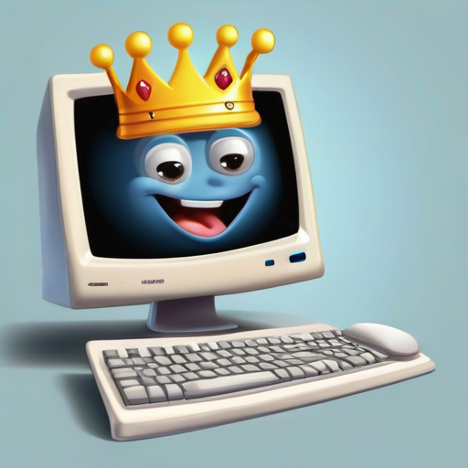

[← Back to Book Home](index.md)

# Meet the Kingdom Helper

Hi there, young knight! I'm the Kingdom Helper, but my friends call me KMP!

## What I Do

I help the grown-up knights and princesses keep track of everyone in our magical kingdom. I'm like a big magical book that remembers:

* All the friends in our kingdom
* All the special places where our friends live
* Who's in charge of important jobs
* Who got special rewards for being brave or kind

## How I Help

Every day, I help the royal helpers (that's what we call our kingdom officers) do their important jobs:

* I remember everyone's names and where they live
* I keep track of all the fun activities
* I help give out special awards to brave knights and clever princesses
* I send magical messages to let everyone know what's happening

I do all this by living inside a special magical box called a "server." It's like my castle!

## My Magic Powers

I have special magic powers that help me:

* Keep secrets safe with special spells
* Talk to other magical helpers
* Make pictures and maps of our kingdom
* Send magical letters to all our friends

Next time you see a grown-up using the Kingdom Helper, you'll know they're talking to me! I'm always happy to help keep our kingdom running smoothly.

[Next: Making Friends →](2-making-friends.md)