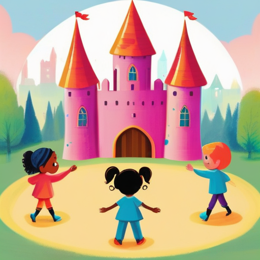

[← Back to Book Home](index.md)

# Making Friends

Hello again, brave knight! In our magical kingdom, we love making new friends!

## Our Friend Book

I keep a special friend book that has everyone's name in it. When a new friend joins our kingdom:

* They tell us their name
* They tell us where they live in the kingdom
* They get a special badge with their picture on it
* We write their name in our magical friend book

## Special Names

Every friend in our kingdom has a special name they use when they play dress-up games. Some friends might be:

* Sir Fluffy the Brave
* Lady Sparkle of the Sunflower Castle
* Duke Giggles the Wise

These fun names help us pretend we're living in olden times!

## Friend Cards

Each friend has a special friend card that shows:

* Their real name
* Their pretend name
* The place where they live in the kingdom
* The fun activities they like to do
* Special awards they've earned

When a grown-up wants to find a friend, they ask me, and I look through all the friend cards to find the right one!

## Making New Friends

If you want to join our kingdom, a grown-up can help you:

1. Fill out a special form with your name
2. Choose a fun pretend name
3. Pick the place in the kingdom where you'll live
4. Get your very own friend card!

All our friends are kind and follow the kingdom rules to keep everyone safe and happy.

[← Previous: Meet the Kingdom Helper](1-meet-the-helper.md) | [Next: Kingdom Places →](3-kingdom-places.md)